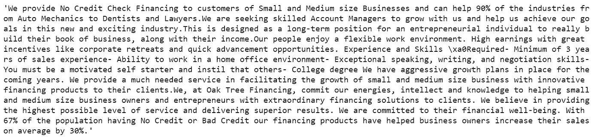

# 预测虚假招聘信息—第二部分(预测分析)

> 原文：<https://towardsdatascience.com/predicting-fake-job-postings-part-2-predictive-analysis-3119ba570c35?source=collection_archive---------30----------------------->


预测哪些招聘信息是假的。

在这个由两部分组成的系列文章的第一部分中，我做了一个详细的探索性分析，分析了虚假的招聘信息与真实的招聘信息有什么不同。下面是第 1 部分的链接，我强烈建议您在继续之前先阅读该部分！

[](/predicting-fake-job-postings-part-1-data-cleaning-exploratory-analysis-1bccc0f58110) [## 预测虚假职位发布—第 1 部分(数据清理和探索性分析)

### COVID19 及其带来的经济低迷导致了许多虚假的招聘信息。这里有一个详细的…

towardsdatascience.com](/predicting-fake-job-postings-part-1-data-cleaning-exploratory-analysis-1bccc0f58110) 

# 前一部分的一些重要见解—

1.  虚假的招聘信息大多针对全职职位，这些职位的最低要求是学士学位和中高级工作经验。
2.  这些职位主要面向在技术部门寻找工作的个人。
3.  45%的帖子甚至没有问一个问题就把工作给了候选人(这是虚假帖子的一个重要标志)。
4.  没有经过筛选的职位大多是初级职位。
5.  这些虚假帖子主要来自美国，其次是英国、加拿大和印度。
6.  创建词云后发现，招聘启事有类似的行为内容，但正版的更具体到角色。

基于这些见解，我们现在知道，有可能发现哪些招聘信息是假的，哪些不是。但在这个前所未有的时代，每天都有数百人被解雇，求职者感到绝望。骗子们正利用这种绝望情绪发布越来越多的虚假招聘广告。因此，我们需要在 LinkedIn、Glassdoor 等求职网站上使用更多这样的算法和工具，以便过滤掉这些虚假的帖子，让求职者只看到真实的帖子。

在接下来的部分，我将对上次使用的数据使用机器学习技术，并从真实的招聘信息中预测虚假的招聘信息。

# 数据

因此，到目前为止，我们在分析中使用的数据是由爱琴海大学信息与通信系统安全实验室([http://emscad.samos.aegean.gr/](http://emscad.samos.aegean.gr/))编制的。该数据集包含 800 个 fak 职位描述。

我已经在本系列的第 1 部分中定义了作为数据集一部分的变量。我会提到完整列表中的变量。我将在下一节中使用进行分析。

# 数据清理

我在我的系统上导入了 Jupyter 笔记本上的数据，并在 Python 3 上工作。由于我希望这一部分更多的是关于洞察力而不是代码，所以我没有在这里附上任何代码要点，但是任何对查看数据清理代码感兴趣的人，都可以随意查看我的 GitHub 库—【https://github.com/sharad18/Fake_Job_Posting 

最初的数据集包含 18，000 个帖子。清理后，新数据有大约 11，000 个帖子。

我将用于预测分析的变量子集是—

1.  标题:职位发布的标题。
2.  描述:职位描述+公司简介+要求
3.  远程办公:远程办公职位的 Tru。
4.  Has_company_logo:如果公司徽标存在，则为 True。
5.  Has_questions:如果存在筛选问题，则为 True。
6.  就业 _ 类型:全职、兼职、合同等。
7.  要求 _ 经验:高管、入门级、实习生等。
8.  要求 _ 学历:博士、硕士、学士等。
9.  行业:汽车、IT、医疗保健、房地产等。
10.  职能:咨询、工程、研究、销售等。
11.  欺诈性的(目标变量):如果是假的，则为 1，否则为 0。
12.  城市:招聘启事中提到的城市。
13.  Country_name:职位发布中提到的国家的名称。

让我们开始处理这些干净的数据吧！

# 导入库和读取数据

我暂时导入了以下库，它们是任何人在 Python 中执行分析所需的基本库，

```
import pandas as pd
import seaborn as sns
import matplotlib.pyplot as plt
%matplotlib inline
import numpy as np
pd.set_option('display.max_columns', None)
```

让我们看看数据，

```
df = pd.read_csv('Clean_data.csv')
df.head()
```


正在使用的数据的预览。

现在，我们试着详细研究“描述”一栏。在我导入的已清理数据文件中，“描述”列是“描述”+“要求”和“公司简介”的组合“描述”中的数据看起来像什么的一个例子—



“描述”列中的单个条目。

接下来，我们将试着看看 20 个最常用的单词，它们既出现在虚假招聘中，也出现在好的招聘广告中。

```
import spacy
nlp = spacy.load('en_core_web_lg')
import base64
import string
import re
from collections import Counter
from nltk.corpus import stopwords
stopwords = stopwords.words('english')punctuations = string.punctuationdef cleanup_text(docs, logging = False):
    texts = []
    for doc in docs:
        doc = nlp(doc, disable = ['parser', 'ner'])
        tokens = [tok.lemma_.lower().strip() for tok in doc if tok.lemma_ != '-PRON-']
        tokens = [tok for tok in tokens if tok not in stopwords and tok not in punctuations]
        tokens = ' '.join(tokens)
        texts.append(tokens)return pd.Series(texts)
```

对于虚假的招聘信息，

```
Fraud_1 = [text for text in df1[df1['fraudulent'] == 1]['description']]
Fraud_1_clean = cleanup_text(Fraud_1)
Fraud_1_clean = ' '.join(Fraud_1_clean).split()
Fraud_1_counts = Counter(Fraud_1_clean)
Fraud_1_common_words = [word[0] for word in Fraud_1_counts.most_common(20)]
Fraud_1_common_counts = [word[1] for word in Fraud_1_counts.most_common(20)]fig = plt.figure(figsize = (20, 10))
pal = sns.color_palette("cubehelix", 20)
sns.barplot(x = Fraud_1_common_words, y = Fraud_1_common_counts, palette=pal)
plt.title('Most Common Words used in Fake job postings')
plt.ylabel("Frequency of words")
plt.xlabel("Words")
plt.show()
```


虚假招聘中的前 20 个词。

对于真实的招聘信息，

```
Fraud_0 = [text for text in df1[df1['fraudulent'] == 0]['description']]
Fraud_0_clean = cleanup_text(Fraud_0)
Fraud_0_clean = ' '.join(Fraud_0_clean).split()
Fraud_0_counts = Counter(Fraud_0_clean)
Fraud_0_common_words = [word[0] for word in Fraud_0_counts.most_common(20)]
Fraud_0_common_counts = [word[1] for word in Fraud_0_counts.most_common(20)]fig = plt.figure(figsize = (20, 10))
pal = sns.color_palette("cubehelix", 20)
sns.barplot(x = Fraud_0_common_words, y = Fraud_0_common_counts, palette=pal)
plt.title('Most Common Words used in Genuine job postings')
plt.ylabel("Frequency of words")
plt.xlabel("Words")
plt.show()
```


真实招聘启事中的前 20 个单词。

在上面的两个图中，最常用的词几乎是一样的，很难区分两者。因此，变量“描述”本身不能帮助我们预测，因此完整的变量集是有意义的。更值得一提的是，当一个人在互联网上看到招聘信息时，我在“数据清理”部分提到的这些附加功能并没有直接提供。这些变量仅在职位发布被举报为欺诈后获得。在这种情况下，当务之急是，如果发现这种虚假招聘，他们必须通知有关当局以及他们网络中的其他求职者。

# 将数据分为训练和测试

在分割数据之前，我们需要对数据做一些最后的修改，之后我们将分割数据。必须将*‘description’*列清理成令牌。这是在*空间*和 *nltk* 库的帮助下完成的。在下面这段代码中，' *description'* '列已经被转换成标记，这些标记已经被用来使用 sklearn 的 CountVectorizer 创建一个热列。此外，类似于*‘就业类型’，‘必需教育’，‘必需经验’，‘行业’，*和’*功能’*的分类列已经被转换成一个热点向量。

```
STOPLIST = set(stopwords.words('english') + list(ENGLISH_STOP_WORDS))
SYMBOLS = " ".join(string.punctuation).split(" ")def tokenizetext(sample):
    text = sample.strip().replace("\n", " ").replace("\r", " ")
    text = text.lower()
    tokens = parser(text)
    lemmas = []
    for tok in tokens:
        lemmas.append(tok.lemma_.lower().strip() if tok.lemma_ != "-PRON-" else tok.lower_)
    tokens = lemmas
    tokens = [tok for tok in tokens if tok not in STOPLIST]
    tokens = [tok for tok in tokens if tok not in SYMBOLS]
    return tokensvectorizer = CountVectorizer(tokenizer = tokenizetext, ngram_range = (1,3), min_df = 0.06)
vectorizer_features = vectorizer.fit_transform(df1['description'])vectorized_df = pd.DataFrame(vectorizer_features.todense(), columns = vectorizer.get_feature_names())
df_final = pd.concat([df1, vectorized_df], axis = 1)df_final.drop('description', axis = 1, inplace = True)
df_final.dropna(inplace=True)columns_to_1_hot = ['employment_type', 'required_experience', 'required_education', 'industry', 'function']for column in columns_to_1_hot:
    encoded = pd.get_dummies(df_final[column])
    df_final = pd.concat([df_final, encoded], axis = 1)columns_to_1_hot += ['title', 'city', 'country_name']
df_final.drop(columns_to_1_hot, axis = 1, inplace = True)
```

接下来，我们把数据分成训练和测试两部分—

```
target = df_vectorized['fraudulent']
features = df_vectorized.drop('fraudulent', axis = 1)X_train, X_test, y_train, y_test = train_test_split(features, target, test_size = 0.1, stratify = target, random_state=42)print (X_train.shape)
print (y_train.shape)
print (X_test.shape)
print (y_test.shape)
```

我们得到以下输出—

```
(10144, 857)
(10144,)
(1128, 857)
(1128,)
```

我们现在万事俱备了。先说机器学习吧！

# 机器学习算法

我们将在后续章节中使用的库—

```
from sklearn.model_selection import GridSearchCVfrom sklearn.linear_model import LogisticRegression
from sklearn.neighbors import KNearestNeighbors
from sklearn.svm import SVC
from sklearn.ensemble import RandomForestClassifier
from sklearn.neural_network import MLPClassifierfrom sklearn.metrics import accuracy_score, confusion_matrix, classification_report, roc_auc_score
```

## 1.逻辑回归

```
log_reg = LogisticRegression()
c_values = [0.00001, 0.0001, 0.001, 0.01, 0.1, 1, 10, 100, 1000, 10000]
penalty_options = ['l1', 'l2']param_grid = dict(C = c_values, penalty = penalty_options)grid_tfidf = GridSearchCV(log_reg, param_grid = param_grid, cv = 10, scoring = 'roc_auc', n_jobs = -1, verbose=1)grid.fit(X_train, y_train)log_reg_pred = grid.predict(X_test)print (roc_auc_score(y_test, log_reg_pred))
print (classification_report(y_test, log_reg_pred))
```

我们得到以下结果—样本 roc_auc 得分= 0.7795，对于分类报告，我们得到—


逻辑回归的样本外结果。

用最基本的模型进行预测，逻辑回归，给我们一个 0.7795 的 ROC-AUC 分数，考虑到数据的不平衡，这是一个很好的分数。在随后的章节中，我们将看到更复杂的模型。

## 2.k-最近邻(KNN)

```
knn = KNeighborsClassifier()
k_range = list(np.arange(2, 23, 2))
param_grid_knn = dict(n_neighbors = k_range)
print (param_grid_knn)grid_knn = GridSearchCV(knn, param_grid_knn, cv = 10, scoring = 'roc_auc', n_jobs = -1, verbose = 1)grid_knn.fit(X_train, y_train)knn_pred = grid_knn.predict(X_test)print (roc_auc_score(y_test, knn_pred))
print (classification_report(y_test, knn_pred))
```

KNN 的样本外 ROC-AUC 得分为 0.5995。对于分类报告，我们得到—


KNN 的样本结果。

从左图中，我们可以看到，与逻辑回归相比，KNN 的表现非常差。

## 3.支持向量机(SVM)

```
svc = SVC()
kernel = ['linear', 'rbf']
param_grid_knn = dict(kernel = kernel)
print (param_grid_knn)grid_svc = GridSearchCV(svc, param_grid_knn, cv = 10, scoring = 'roc_auc', n_jobs = -1, verbose = 2)grid_svc.fit(X_train, y_train)svc_pred = grid_svc.predict(X_test)print (roc_auc_score(y_test, svc_pred))
print (classification_report(y_test, svc_pred))
```

这里报告的样本外得分为 0.8195 ~ 0.82。分类报告如下—


SVC 以 0.82 的分数获得了迄今为止最好的成绩，这明显优于后两种方法。

## 4.随机森林

```
rf = RandomForestClassifier()
n_estimators_range = [1, 2, 4, 8, 16, 32, 64, 100, 200]
param_grid_rf = dict(n_estimators = n_estimators_range)
grid_rf = GridSearchCV(rf, param_grid_rf, cv = 10, scoring = 'roc_auc', n_jobs = -1, verbose = 1)grid_rf.fit(X_train, y_train)
print (grid_rf.best_score_)
print (grid_rf.best_params_)rf_pred = grid_rf.predict(X_test)
print (roc_auc_score(y_test, rf_pred))
print (classification_report(y_test, rf_pred))
```

对于随机森林模型，报告的 ROC-AUC 得分为 0.74。分类报告如下—


的分类报告

说实话，我预计随机森林的表现会比 SVC 好，但到目前为止，SVC 的结果最好。

## 5.Sklearn 的神经网络 MLP 分类器(solver = 'sgd ')

```
mlp = MLPClassifier(solver = 'sgd', activation = 'relu', hidden_layer_sizes = (100, 50, 30), max_iter = 1000)
mlp.fit(X_train, y_train)mlp_pred = mlp.predict(X_test)print (roc_auc_score(y_test, mlp_pred))
print (classification_report(y_test, mlp_pred))
```

在这种情况下，ROC-AUC 得分为 0.7786。分类报告—


MLP 分类器的分类报告(solver = 'sgd ')

带有“sgd”解算器的 MLP 分类器的性能略好于随机森林模型，但仍比 SVC 报告的要差。

## 6.Sklearn 的神经网络 MLP 分类器(solver = 'adam ')

```
mlp = MLPClassifier(solver = 'adam', activation = 'relu', hidden_layer_sizes = (100, 50, 30), max_iter = 1000)
mlp.fit(X_train, y_train)mlp_pred = mlp.predict(X_test)print (roc_auc_score(y_test, mlp_pred))
print (classification_report(y_test, mlp_pred))
```

该模型的样本外 ROC-AUC 值为 0.8595 ~ 0.86。分类报告如下—


MLP 分类器的分类报告(求解器= 'adam ')

这是迄今为止报道的最高分，基于这个模型，我们将能够在 86%的情况下正确预测招聘信息是否是假的。

# 模型比较


所有模型之间的比较。

从上图中，我们可以看到 Sklearn 基于神经网络的 MLP 分类器与' *adam'* optimizer 表现最好，其次是同一模型与'*【SGD '*解算器和支持向量机分类器。因此，基于 MLP 分类器的样本外性能指标 ROC-AUC 得分，我们可以有把握地说，我们可以在 86%的时间里预测一个职位发布是否是假的。

这种预测分析对于 LinkedIn 和 Glassdoor 这样的求职网站非常有用，可以帮助他们过滤这种虚假的招聘信息。

# 结论

目前，我们生活在一个我们谁都没有预料到的时代。冠状病毒不仅给各国带来了突发卫生事件，还加速了即将到来的经济衰退。每天都有许多员工被解雇，对工作的需求远远超过了市场上的职位数量。

通过这一系列文章，我试图提出一个正在就业市场蔓延的问题。动荡和混乱是骗子的完美支持者，目前，网络诈骗攻击正在上升。在上一部分，我详细分析了如何区分虚假和真实的招聘信息，以及欺诈性招聘信息的特征。在这一部分中，我提供了一个详细的分析，说明我们如何应用机器学习来预测这种虚假帖子的出现。

正如我在这两部分中提到的，作为互联网用户和求职者，我们有责任让当局和我们的网络知道我们是否遇到了这种虚假的招聘信息，而不是任何模型或分析。

谢谢你看了这两部分。我希望每个人都有美好的一天&请保持社交距离，这样我们可以更快更有效地度过这样的时光！

# 作者注:

参与这个项目对我来说是一次很好的学习经历。希望你们都觉得它很有帮助，很有启发性。

这篇文章的全部代码都在我的 GitHub 存储库中，在 https://github.com/sharad18/Fake_Job_Posting 的[进行分析。我很想在评论区听到你的反馈。](https://github.com/sharad18/Fake_Job_Posting)

你也可以在 LinkedIn 上联系我—[https://www.linkedin.com/in/sharad-jain/](https://www.linkedin.com/in/sharad-jain/)