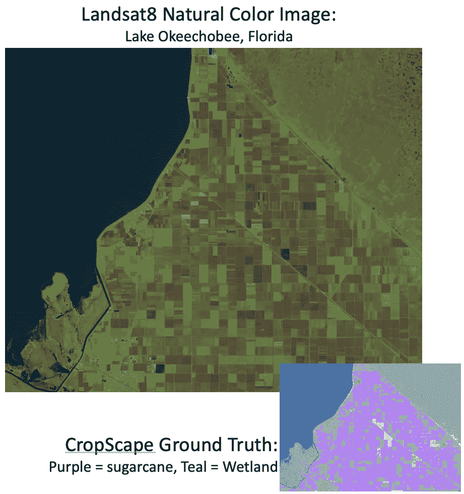
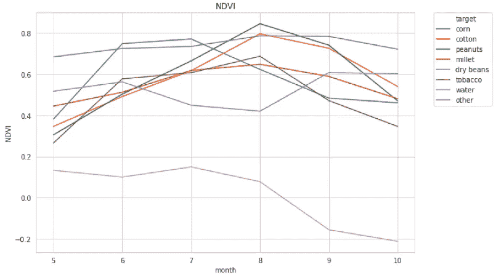
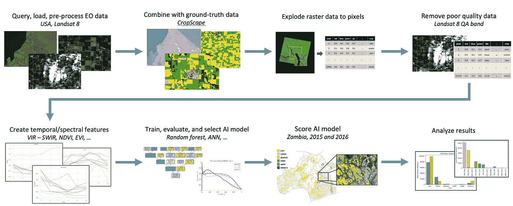
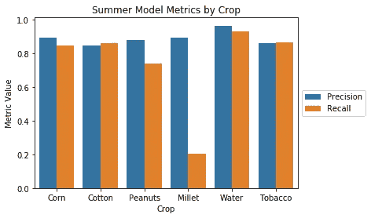
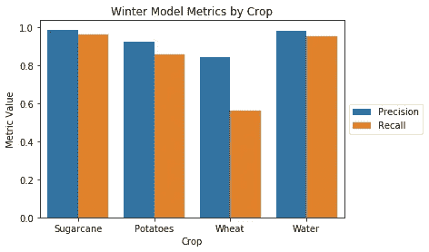
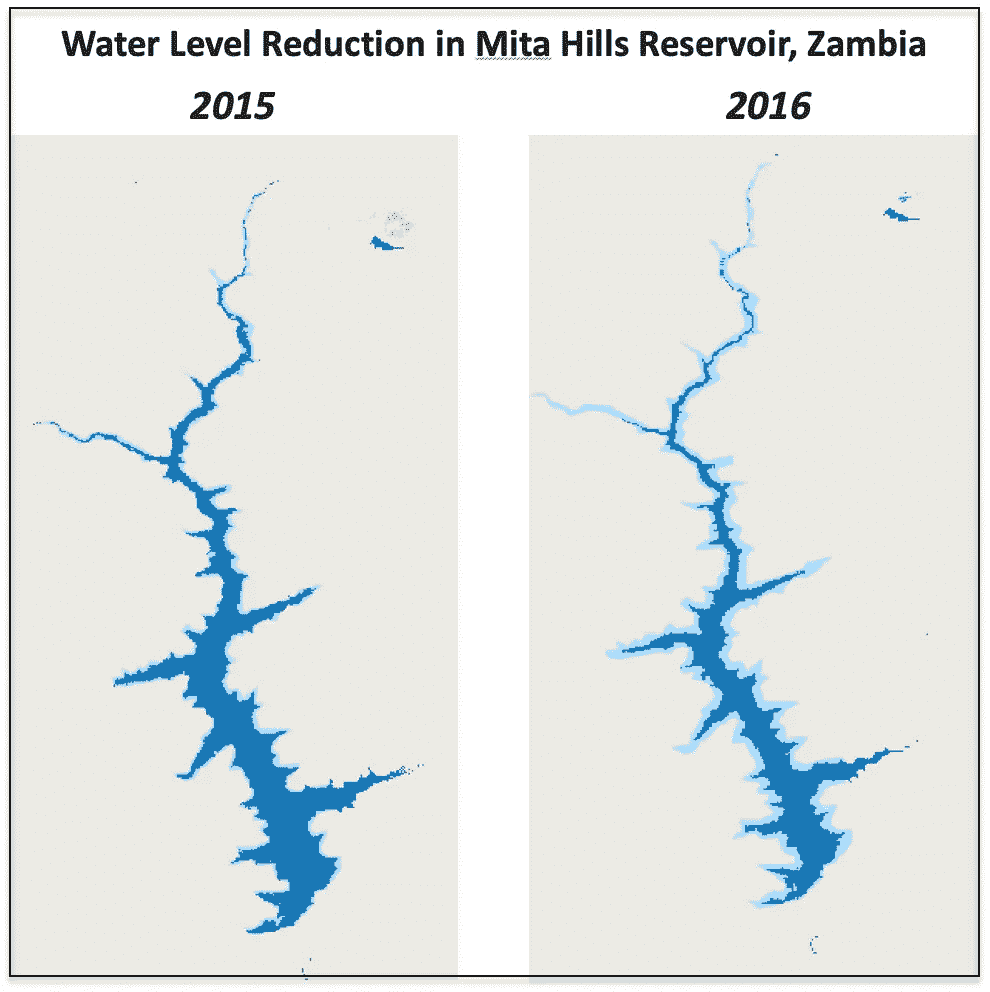
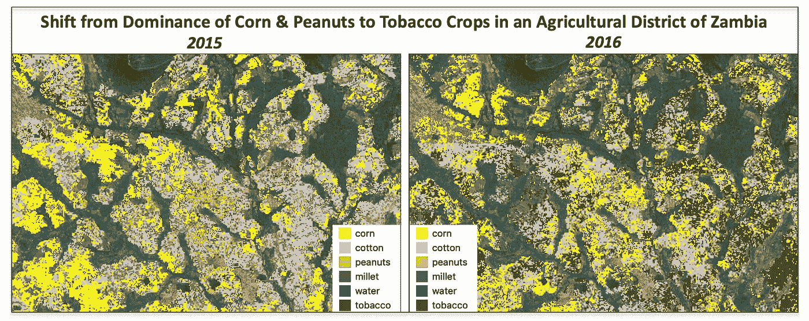

# 利用卫星图像预测赞比亚的粮食不安全状况

> 原文：<https://towardsdatascience.com/predicting-food-insecurity-in-zambia-using-satellite-imagery-272ffecbbce5?source=collection_archive---------18----------------------->

## 通过可视化我们的模型预测，我们能够识别作物和水可及性的高风险区域。

气候变化预计将通过更高的温度、更大的降雨量波动以及可能对作物和淡水供应产生毁灭性影响的极端天气，在 21 世纪增加营养不良的发生率。在[义神星](http://www.astraea.earth)，我们专注于将机器学习应用于卫星图像，并开发了一个名为 EarthAI 的地理空间机器学习平台，以处理遥感图像的数量和复杂性。在我们的作物分类项目中，我们训练了一个模型，使用遥感图像对作物和水进行分类，并使用这些预测来研究赞比亚食物和淡水可获得性的变化，赞比亚在 2018 年全球饥饿指数中排名第五，属于“令人担忧”的类别。⁵ 60%的赞比亚人口生活在贫困中，40%的儿童因营养不良而发育不良。⁴通过这项研究，我们能够发现自然资源可获得性的变化，并跟踪作物可用性和轮作情况，从而了解该地区的粮食不安全状况。

> “作为一家福利公司，将个人和组织与他们改善周围世界所需的信息联系起来对我们来说非常重要。几乎有无限多的方法可以做到这一点，但在无法获得信息或技术的项目中工作真的很有意义。让地球关注赞比亚的食品短缺对我们公司来说是一个鼓舞人心的挑战。”
> 
> ~首席执行官布兰登·理查森

# **数据**

由于它的全球覆盖范围和长期的免费和公开可用数据的存档，我们决定在这个项目中使用 Landsat 8 图像。这颗卫星大约每 16 天重访地球上的同一个地点，并在可见光、近红外和短波红外光谱中产生空间分辨率为 30 米的图像。

对于世界上的大部分地区，很难找到地面实况地理参考作物数据集，但幸运的是，自 2008 年以来，美国农业部(USDA)每年都会为美国大陆制作一个地面实况地理参考作物数据集。这个名为 CropScape 的数据集以 30 米的分辨率标注了 92 种不同的作物和 25 种土地覆盖类型。我们使用 CropScape 数据集在美国训练我们的模型，然后将这个模型推广到赞比亚。

图一。来源: [Landsat 8 影像](https://landsat.gsfc.nasa.gov/landsat-8/)和[作物景观农田数据层](https://nassgeodata.gmu.edu/CropScape/)。

# **感兴趣区域**

赞比亚享有长期的和平与稳定，但受到气候变化的严重影响。⁴我们特意选择了一个政治稳定的国家来控制混淆变量，如战争或经济制裁，以便粮食不安全问题是由气候变化引起的极端天气造成的，随着时间的推移，气候变化会慢慢影响作物，而不是由动荡的政治环境或其他超出遥感数据分析能力的无形变量造成的。

在赞比亚，农业支撑着 population,⁶85%的人口的生计，但赞比亚是一个内陆国家，大多数农民依靠降雨来灌溉作物，因此特别容易受到气候变化引起的天气波动的影响。⁴由于这些因素以及赞比亚种植的作物与美国的作物非常匹配，赞比亚是模型外推的一个简单选择。

利用赞比亚作物生产的一些基本统计数据([非洲数据](https://dataafrica.io/profile/zambia)、[粮农组织国家报告](http://www.fao.org/3/i1500e/Zambia.pdf)和[赞比亚数据门户](http://zambia.opendataforafrica.org/ZMAGSTB2016/agriculture-statistical-bulletin-of-zambia-2012))，我们根据 2015 年和 2016 年种植的公顷数和每种作物的产量确定了赞比亚最常见的作物。总之，我们在模型中包括了九种作物类型:玉米、小麦、小米、马铃薯、杂豆、花生、甘蔗、烟草和棉花。

# **光谱特征工程**

用于训练我们的分类模型的特征是来自 Landsat 8 的原始波段(红色、绿色、蓝色、近红外、两个短波红外和一个沿海波段)和一组派生的水、植被和土壤指数。由于不同作物的植被指数在不同时间达到峰值，因此包含一个时间序列的特征值以区分不同作物非常重要。

归一化差异植被指数(NDVI)是用于测量植物健康的近红外和红色波段的比率。⁷较高的 NDVI 值表明植物更健康。⁷图 2 向您展示了 NDVI 时间序列如何区分作物。玉米的 NDVI 在 6 月和 7 月初达到高峰；棉花、花生、小米和烟草在 8 月达到高峰；干豆在九月达到高峰。

图 2:按作物和月份划分的平均 NDVI 时间序列图。

# **建模**

义神星 EarthAI 平台建立在 Apache Spark 和亚马逊网络服务(AWS)基础设施之上。因为我们需要为这个建模工作处理的图像量几乎是 1tb，所以我们使用 EarthAI 以及时和分布式的方式来执行建模。我们的流程概述如下。

1.  读入 Landsat 8 影像和 ground truth CropScape 数据，并通过重新投影和重新采样 ground truth 数据以匹配遥感数据，在空间上连接这两个栅格数据集。
2.  从原始的 Landsat 8 波段导出水、植被和土壤指数。
3.  将栅格数据分解为像素，因此数据集中的每一行都是一个像素，每一列都是不同的波段。
4.  使用 Landsat 8 质量评估(QA)波段过滤掉不良数据，如被云覆盖的像素。
5.  通过按月平均每个光谱特征来创建时间序列特征。
6.  将数据分成训练集和测试集。
7.  训练和评估分类模型。
8.  在 2015 年和 2016 年对赞比亚的模型进行评分。
9.  对模型的预测执行分类后更改检测。

图 3:使用 EarthAI 平台建模工作流。

因为我们选择的九种作物的作物日历并不同步，所以我们决定为夏季和冬季作物建立两个独立的模型。在美国，甘蔗、小麦和马铃薯是冬季作物，在夏末秋初种植，第二年夏天收获；而玉米、棉花、花生、小米、干豆和烟草是夏季作物，在早春种植，秋季收获。在赞比亚的⁸，由于半球不同，作物日历是相反的。⁹

对于夏季和冬季生长季节，我们表现最好的模型是[梯度促进树木(GBT)模型](https://xgboost.readthedocs.io/en/latest/tutorials/model.html)。GBT 夏季模型的总体准确度为 0.876，F1 值为 0.792。类别度量如图 4 所示。与其他类相比，小米的召回率很低，因为我们的训练集不平衡，而且我们的此类示例太少。

GBT 冬季模型的总体准确度为 0.956，F1 值为 0.895。较少的班级和贫瘠的冬季景观使得这些班级比夏季班级更容易建模。类别度量如图 5 所示。

图 4:测试集的夏季模型度量。

图 5:测试集的冬季模型度量。

# **调查结果**

我们对赞比亚两年的夏季和冬季模型进行了评分，并对赞比亚境内的区域进行了分类后变化检测。我们能够检测自然资源可用性的变化，如图 6 所示，2015 年至 2016 年间，塔米山淡水水库水位显著下降。

图 6:2015 年和 2016 年叠加在赞比亚姆库西区米塔丘陵大坝上的模型预测。

我们还能够跟踪作物的可用性和轮作时间，如图 7 所示的例子，显示了粮食作物向经济作物的转移。在需要的时候，经济作物会产生更多的收入，因为它们是为了销售而不是消费而种植的。

图 7:2015 年和 2016 年赞比亚农业区的模型预测。

## 通过可视化我们的模型预测，我们能够识别粮食不安全和水可及性的高风险区域。及时分享这些信息可以加快预防饥饿和营养不良的干预努力。

# **挑战**

当试图将一组特定数据上训练的模型外推至一组新数据时，概化将是一个挑战。我们的模型是根据美国的影像进行训练的，因为我们在赞比亚找不到地面实况地理参考作物数据。美国幅员辽阔，并非所有州都表现出与赞比亚相似的特征，因此我们分析并选择了在气候、天气、土壤、生物群落、生态区域和作物可用性方面与赞比亚最相似的美国各州，以创建最具代表性的训练集。

这个项目的另一个挑战是需要处理的大量遥感数据以及我们完成特征工程的速度。幸运的是，义神星 EarthAI 的使用缓解了这些问题以及处理地理空间数据源的所有隐藏的复杂性。

> “将地球观测(EO)数据纳入数据科学的主要挑战之一是处理不同的地图投影和坐标系统。另一个挑战是数据的巨大规模。我们从头开始设计义神星 EarthAI 来处理这两个挑战，对数据科学家几乎没有影响。EarthAI 的“栅格连接”功能就是一个例子，通过该功能，来自全球各地的大型数据集可以在空间和时间上与平台管理的复杂性相连接。”
> 
> ~研发副总裁 Simeon Fitch

我们在这个项目中使用的遥感数据的大小约为 1tb，在 EarthAI 中聚合和过滤数据后，数据减少到 11GB。尺寸显著减小的部分原因是我们使用光学数据，并且必须应对云。如果一朵云在整个生长季节的任何时候覆盖了一个特定的像素，那么这个像素就会从我们的数据中删除，这对于我们的数据中已经很少见的作物(如豆类和小米)来说是不可取的。因此，我们开始研究减少缺失数据的不同方法，最有前途的方法之一是将合成孔径雷达(SAR)数据源整合到我们的模型中。

合成孔径雷达是一种雷达，它通过向地球发射微波脉冲来工作。当脉冲与物体接触时会被反射或散射，然后返回到卫星，在卫星上，传感器根据返回的回波生成图像。与需要阳光照射物体的被动光学传感器不同，SAR 可以在白天和晚上进行感知，从而产生更多的图像。SAR 的另一个优势是微波脉冲能够穿透云层，因此 SAR 即使在阴天也能产生图像。我们已经有了一些有希望的初步结果，将 SAR 和光学图像结合起来对作物进行分类，如图 8 所示。

图 8:有和没有 SAR 数据的模型预测的比较。

通过利用员工的数据科学专业知识和义神星 EarthAI 平台的可扩展处理能力，我们开发了一个模型，能够跟踪一个面临粮食不安全风险的国家的水和作物可用性。随着气候变化继续改变天气模式，受影响的国家将不得不适应不同的生长季节和水模式，因此，一个允许人们可视化作物和水分布随时间变化的模型将有助于各国适应并确定粮食不安全的高风险地区。

如有疑问或意见，请访问我们的网站:[www . astrea . earth](http://www.astraea.earth/)。

**由** [撰写**考特尼**](https://www.linkedin.com/in/courtney-layman-a0703427/) **，资深数据科学家**

非常感谢义神星大学参与这个项目的其他数据科学家:
[金伯利·斯科特](https://www.linkedin.com/in/kimberlysscott/)博士，联合创始人&数据科学副总裁
[杰森·布朗](https://www.linkedin.com/in/vpipkt/)，高级数据科学家
[埃里克·库伯特森](https://www.linkedin.com/in/eric-culbertson-5270b9a1/)，数据科学家

# **参考文献**

1.  【http://agris.fao.org/agris-search/search.do? recordID=GB2013200329
2.  [https://en.wikipedia.org/wiki/Landsat_8](https://en.wikipedia.org/wiki/Landsat_8)
3.  [https://www . NASS . USDA . gov/Research _ and _ Science/wh 田/sarsfaqs 2 . PHP # section 1 _ 1.0](https://www.nass.usda.gov/Research_and_Science/Cropland/sarsfaqs2.php#Section1_1.0)
4.  [https://www . concern USA . org/story/worlds-ten-hungriest-countries/](https://www.concernusa.org/story/worlds-ten-hungriest-countries/)
5.  [https://www . concern USA . org/WP-content/uploads/2018/10/GHI-2018 . pdf](https://www.concernusa.org/wp-content/uploads/2018/10/GHI-2018.pdf)
6.  【http://www.yieldgap.org/zambia 
7.  [https://medium . com/regen-network/remote-sensing-indexes-389153 e3d 947](https://medium.com/regen-network/remote-sensing-indices-389153e3d947)
8.  [https://downloads . USDA . library . Cornell . edu/USDA-esmis/files/VM 40 xr 56k/dv 13 zw 65 p/w 9505297d/planning-10-29-2010 . pdf](https://downloads.usda.library.cornell.edu/usda-esmis/files/vm40xr56k/dv13zw65p/w9505297d/planting-10-29-2010.pdf)
9.  [http://www.fao.org/giews/countrybrief/country.jsp?code=ZMB](http://www.fao.org/giews/countrybrief/country.jsp?code=ZMB)