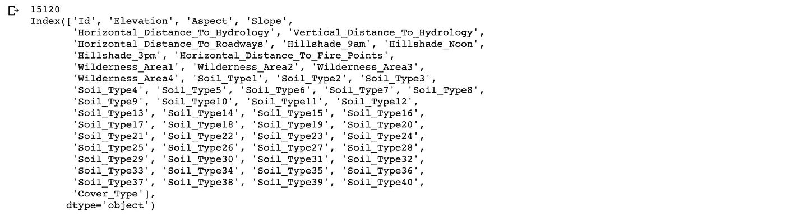
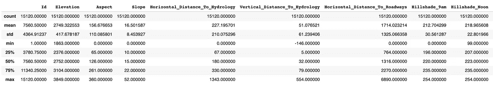
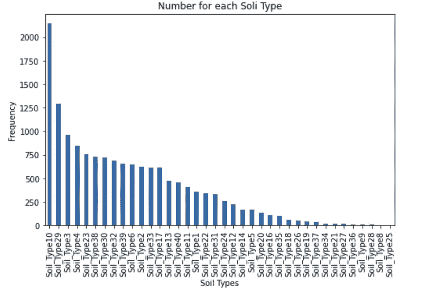
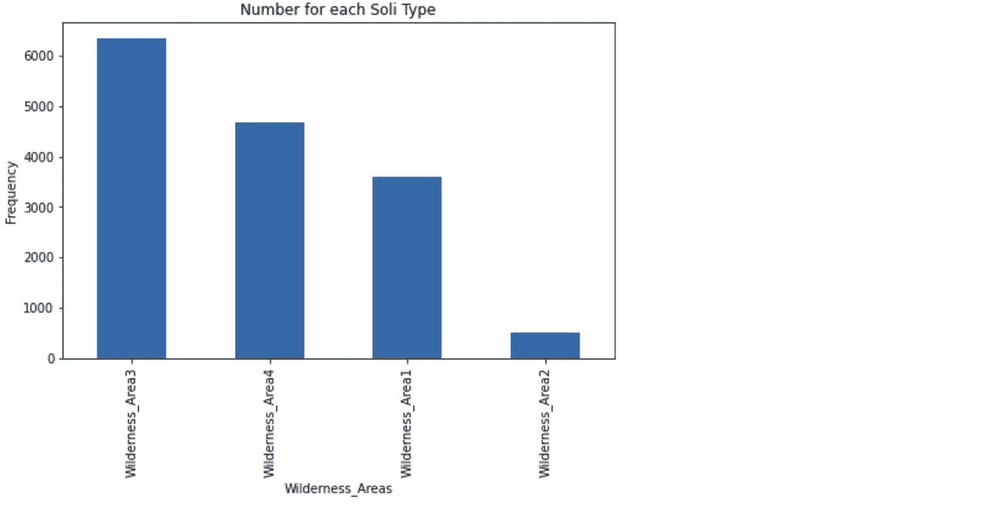
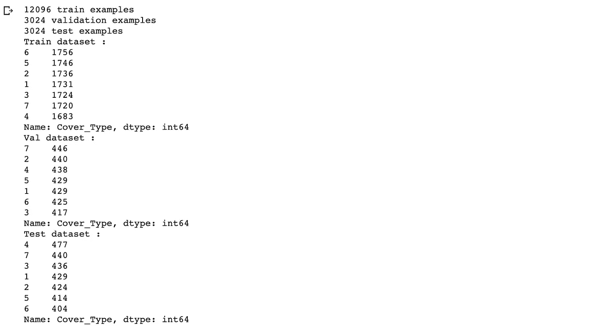
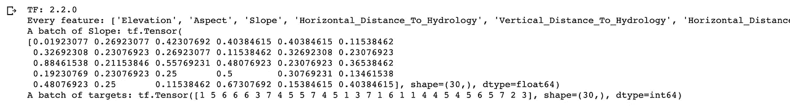
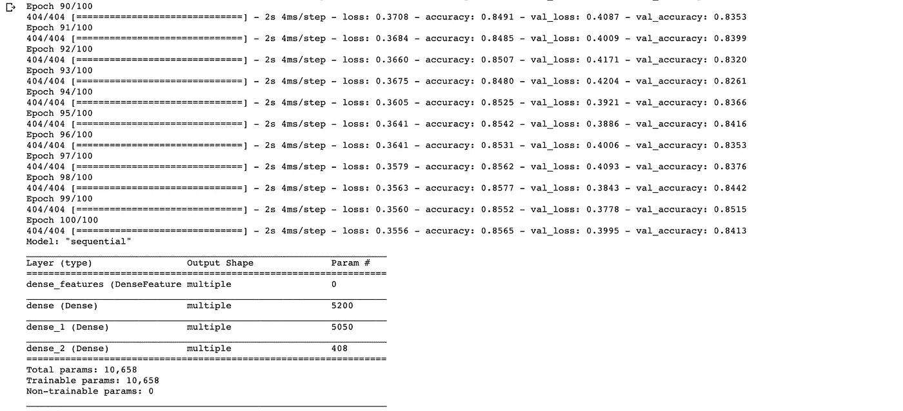
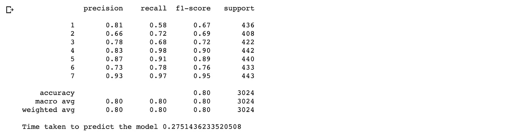
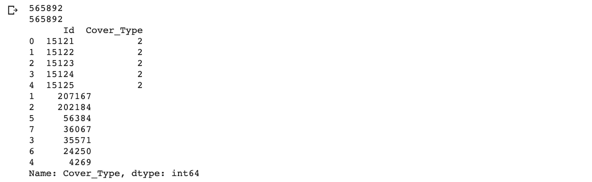
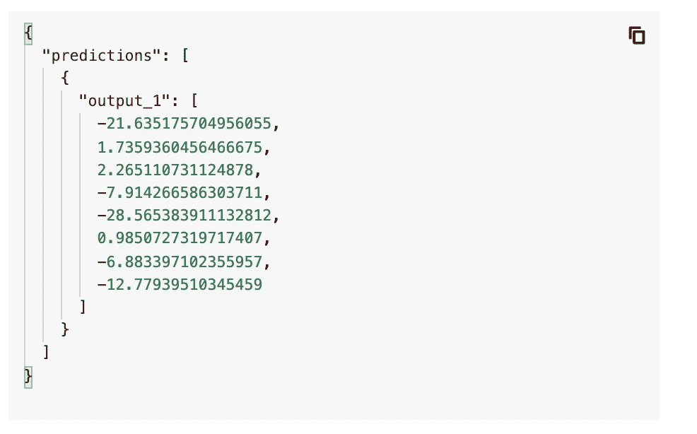

# 用张量流预测 GCP 森林覆盖类型及模型部署

> 原文：<https://towardsdatascience.com/predicting-forest-cover-type-with-tensorflow-and-model-deployment-in-gcp-fbce9c047dcc?source=collection_archive---------43----------------------->

## 通过 Kaggle 竞赛开始使用 Tensorflow 并了解如何在 GCP 部署模型


[迪皮卡·巴德](https://medium.com/u/cb4f6856d71b?source=post_page-----fbce9c047dcc--------------------------------)利用张量流进行森林覆盖类型分类

在这篇文章中，我将分享:

1.  我如何开始使用 Tensorflow
2.  用深度学习解决一个卡格竞赛
3.  在 GCP 部署模型
4.  在 GCP 为曼梯·里建一条管道

本项目使用的数据来自[森林覆盖类型的 Kaggle 竞赛。](https://www.kaggle.com/c/forest-cover-type-prediction/data)虽然这不是 Kaggle 上的一个活跃的竞争，但这正好符合我的数字/分类数据标准，可以很容易地进行预测，因此我们可以专注于在 Tensorflow 中建立模型，并为 GCP 建立一个小管道。数据的详细信息在其数据描述页面上提供。数据由美国地质调查局和 USFS(林务局)提供。本问题将预测七种森林覆盖类型:

> 1 —云杉/冷杉
> 2 —黑松
> 3 —黄松
> 4 —杨木/柳树
> 5 —白杨
> 6 —花旗松
> 7 —克鲁姆霍尔茨

我将通过以下步骤来解决这个问题:

1.  正在加载数据集
2.  预处理数据集
3.  Tensorflow 入门
4.  创建张量流数据集
5.  用 Keras 建模
6.  训练模型
7.  测试模型
8.  向 Kaggle 提交结果
9.  在 GCP 部署模型

# 1.正在加载数据集

从上述 Kaggle 竞赛中下载数据，并将其存储在您的 google drive 或本地的适当文件夹中。将文件夹路径设置为`FOLDER_NAME`变量。在我的例子中，我将数据存储在 google drive 中，并使用 Google Colab 读取输入文件。如果你想在 Kaggle 笔记本上写代码，你可以按照我在 Kaggle[和本文一起发表的代码来写。这些变化仅发生在 Kaggle 笔记本电脑加载和存储数据的情况下。](https://www.kaggle.com/dipikabaad0107/forest-cover-classification)

让我们从安装驱动器开始使用 Google Colab:

这将给出一个链接，以获取代码，你需要输入到输入框出现。一旦完成，我们就可以在 dataframe 中加载数据了。

**输出:**



部分输出

训练数据集有 15120 行。从描述表中可以看出，土壤类型 7 和 15 具有恒定的 0 值，因此应将其移除。除了分类列(`Soil_Types`和`Wilderness_Areas`)之外，一些具有数值的列应该被规范化以获得更好的结果。在下一步中，我们将执行所有的预处理步骤，以便为预测准备好数据。

# 2.预处理数据集

所有土壤类型的类别数据列将从一个热编码表合并为一列，类似的荒野区域列也将被转换。

**输出:**



土壤类型 8 和 25 每种类型只有一行，因此它们被转换成另一列，标有 NA 下标。这是可选的，您也可以删除这些列。

对于数字列，`MinMaxScaler`是将被应用来获得标准化列的转换器。在此之前，我们需要将数据分为训练、测试和验证，以便对这些数据进行标准化。

## 将数据分为训练、val 和测试

数据将分为训练、验证和测试。培训占 60%，测试占 20%，验证占 20%。

**输出:**



一旦数据被分割，归一化可以应用如下:

# 3.Tensorflow 入门

Tensorflow 是谷歌基于 Theano (Python 库)的开源深度学习库，用于研究和生产。你需要知道的一些核心组件是张量和图形。张量是一个 n 维向量或矩阵，用于存储数据和执行功能。Graph 是描述节点之间所有操作和连接的地方，可以在多个 CPU 或 GPU 上运行。

在这篇文章中，我将解释我如何使用 Tensorflow 创建我的第一个模型，而不是 tensorflow 的基础知识。如果你有兴趣学习，可以从[这里](https://www.tensorflow.org/overview)过基础教程。我必须承认浏览 Tensorflow 文档不像 PyTorch 那么容易。使用 PyTorch，我能够在一周内构建我的第一个模型，但使用 Tensorflow 文档，很难理解加载数据本身的正确方式，此外，函数格式之间存在冲突，并且它与其他版本的向后兼容性也存在问题。因此，接下来的教程将会导致其他不容易解决的错误。

在你的机器或谷歌 Colab 中安装 tensorflow。我用过 Google Colab 搭配 GPU 运行时。这个问题用的是 Tensorflow 2。

```
!pip install tensorflow
```

# **4。创建张量流数据集**

在所有的处理之后，我们将把数据放入 [tensorflow 数据集](https://www.tensorflow.org/api_docs/python/tf/data/Dataset)。这将有助于[构建模型的输入管道](https://www.tensorflow.org/tutorials/structured_data/feature_columns)。对于数据集，必须定义 batch_size，这是可以成批而不是一次访问数据的大小。你也可以随意调整行。

输出:



输出的一部分(水平方向的列名无法放入一个屏幕截图中)

# 5.用 Keras 建模

将使用具有前馈神经架构的 tensorflow Keras 构建模型。使用 tensorflow Keras `layers.DenseFeatures`构建要素图层。分类列和数字列被分别处理，以创建代码中所示的输入层。模型在`build_model` 函数中定义，具有 100 和 50 两个隐藏层，后面是包含输出神经元数量为 8 的输出层。它是 8，因为类型是从 1 到 8 的整数值，而不是 0 到 7。在混淆矩阵中，我们忽略了类 0。使用优化器`adam`和激活功能`relu`。建筑模型和管线的代码如下:

# 6.训练模型

对于训练，我们为模型的拟合函数提供训练和验证数据集。验证损失使得在训练期间更容易发现模型的过度拟合。模型被训练 100 个纪元。

**输出:**



部分输出

在输出中，很明显，网络是基于随着验证精度增加的训练精度来学习的。如果在某个点上，验证准确性在增加，而训练准确性在增加，那么这就是模型过度拟合的点。这样你就能知道在那个时候停止纪元。如果它是随机的，那么这个模型没有学到任何东西。有了设计好的架构，我在训练集和验证集上的准确率分别达到了 85%和 84%。

在模型摘要中，您可以看到每一层的参数数量。在第一个隐藏层中，51 个输入特征连接到 100 个隐藏节点，对于完全连接的网络具有 5100 个权重，对于每个节点具有 100 个偏差参数，总计 5200 个参数。在下一层中，100 个节点连接到 50 个节点，具有 5000 个连接，第二隐藏层中的每个节点具有 50 个偏置参数，构成 5050 个参数。类似地，计算下一批参数。这就是你阅读模型摘要的方式。它显示最后学习了多少个参数。最后模型被保存到一个目录中。

# 7.测试模型

为了测试模型如何处理测试数据，我们将对 sklearn 的报告进行分类。分类报告将显示每种森林覆盖类型的精确度、召回率和 f1 分数以及平均精确度等。

**输出:**



该模型的平均准确率达到了 80%左右。对于前馈神经网络的简单结构，这是足够好的结果。现在，我们可以使用模型获得 kaggle 测试数据集的结果，并将其提交给 kaggle。

# 8.向 Kaggle 提交结果

我们需要预测 kaggle 上给出的测试数据的封面类型。该数据与第一步中下载的数据位于同一文件夹中。预期的输出是包含`Id`和`Cover_Type`列的 csv 文件。对训练数据进行的类似转换必须对测试数据进行。以下代码显示了如何获取测试数据的结果:

**输出:**



一旦你准备好了文件，你可以把它上传到 Kaggle 竞赛页面的我的提交部分。一旦提交，你可以在一段时间后看到分数。提交后，我在测试数据上得到了~62%的准确率。你可以用不同的实验做尽可能多的提交，努力提高这个分数。就这些，你可以开始参加不同的比赛，用不同种类的数据集做实验。我从有数字/分类数据的简单预测问题开始。我的目标是通过一个真实世界的例子来学习张量流，所以我从 Kaggle 竞争数据集开始，该数据集并不活跃，但有简单的问题需要处理。

# 9.在 GCP 部署模型


谷歌人工智能平台

前一节中保存的模型可用于部署在 google cloud 中，以便您拥有的任何应用程序都可以访问它。我认为你对谷歌云有基本的了解，并且在这方面有所建树。正如我不会解释的那样，如何开始学习 GCP(你可以在 coursera / GCP Qwiklabs 上学习很多入门课程)。

**先决条件:**

你可以创建一个免费的谷歌云账户，如果你还没有的话，它有 300 美元的免费信用。在接下来的步骤中，我们需要这一点。同时在你的电脑上安装 GCP 软件开发工具包。如果没有项目，在 Google Cloud 中创建一个项目。确保在 IAM 中下载一个服务帐户密钥，并存储在环境变量中。(关于通过命令控制台与 GCP 交互的基本设置，请参考谷歌云文档)

```
export GOOGLE_APPLICATION_CREDENTIALS=<PATH TO KEY JSON FILE>
```

运行以下命令，使用 Google Cloud 帐户进行身份验证，并根据输出中的给定说明设置项目。

```
gcloud auth login
```

第一步，将前面章节中的文件夹`forest_model_layer_100_50_epoch_100`上传到谷歌云存储中。我创建了一个 bucket `forest-cover-model`并在那个位置上传了文件夹。

一旦完成，您就可以部署模型了。

```
gcloud components install beta
```

这在部署模型之前是必需的。

```
gcloud beta ai-platform versions create v7 \--model ForestPredictor \--origin gs://forest-cover-model/forest_model_layer_100_50_epoch_100/ \--runtime-version=2.1 \--python-version=3.7
```

v7 版本是在我做了一些实验后有效的版本。可以以 v1 作为版本名。这样，您可以保留模型的不同版本。合适的运行时版本可以在[这里](https://cloud.google.com/ai-platform/training/docs/runtime-version-list)找到。Origin 参数是存储模型的 google 存储路径的路径。

> 最初我计划用预处理类等定制预测例程。但不幸的是，在创建了所有这些之后，在部署的时候，我才知道它只适用于`tensorflow>=1.13,<2`。它正在发展，所以它可能会在未来支持，检查[这里](https://cloud.google.com/ai-platform/prediction/docs/custom-prediction-routines)的更新。(自定义管道的代码存在于我的库中，我已经分享给感兴趣的人)

要测试部署的模型，可以浏览到 AI Platform > Models，在模型名称下点击想要测试的版本号。有测试和使用选项，你可以给自定义输入。输入格式如下，使用下面的例子进行测试。

```
{
   "instances":[
      {
         "Elevation":0.4107053527,
         "Aspect":0.9833333333,
         "Slope":0.2121212121,
         "Horizontal_Distance_To_Hydrology":0.0,
         "Vertical_Distance_To_Hydrology":0.2235142119,
         "Horizontal_Distance_To_Roadways":0.3771251932,
         "Hillshade_9am":0.7716535433,
         "Hillshade_Noon":0.842519685,
         "Hillshade_3pm":0.6141732283,
         "Horizontal_Distance_To_Fire_Points":0.9263906315,
         "Wilderness_Areas":"Wilderness_Area1",
         "Soil_Types":"Soil_Type33"
      }
   ]
}
```

您可以看到如下输出:



输出给出了输入的每种覆盖类型的概率。

一旦这些都工作正常，您就可以使用该模型对任何输入数据进行预测。我已经在 [Github 资源库](https://github.com/dipikabaad/Forest_Cover_Type_Classification)中分享了代码。文件`forest_classification.py`包含调用模型和输入管道的代码。

我将输入数据分成小块，因为它不能一次返回所有行的结果。这些是你需要在应用程序中管理的东西。如果您有兴趣探索如何为部署在 GCP 的模型创建管道，您可以参考该文档。

Tadaa！您已经准备好在实际解决方案中使用该模型，并为各种实验维护版本控制，并在此基础上跟踪性能。在现实世界中，除了只是建立一个模型，这些技能是非常重要的。有趣的是，如果您愿意的话，您可以尝试看看这些管道在其他云环境中是如何构建的。如果您希望尝试如何使用各种参数或其他优化函数来优化模型，那么您可以参考[我以前的文章](/reflecting-and-comparing-different-sentiment-classification-models-for-restaurant-reviews-d109105b2cb7)，在那里我提出了在深度神经网络中构建模型的改进/其他机会。尽管这是针对 PyTorch 的，但是无论您使用哪种框架，更改架构和参数的基础都是相同的。你必须找到在其他库中定义和做同样事情的方法。希望这能帮助你开始学习 GCP 和 Kaggle 以及 Tensorflow 框架！

一如既往—愉快的实验和学习:)