# 用机器学习工作流预测森林覆盖类型

> 原文：<https://towardsdatascience.com/predicting-forest-cover-types-with-the-machine-learning-workflow-1f6f049bf4df?source=collection_archive---------9----------------------->

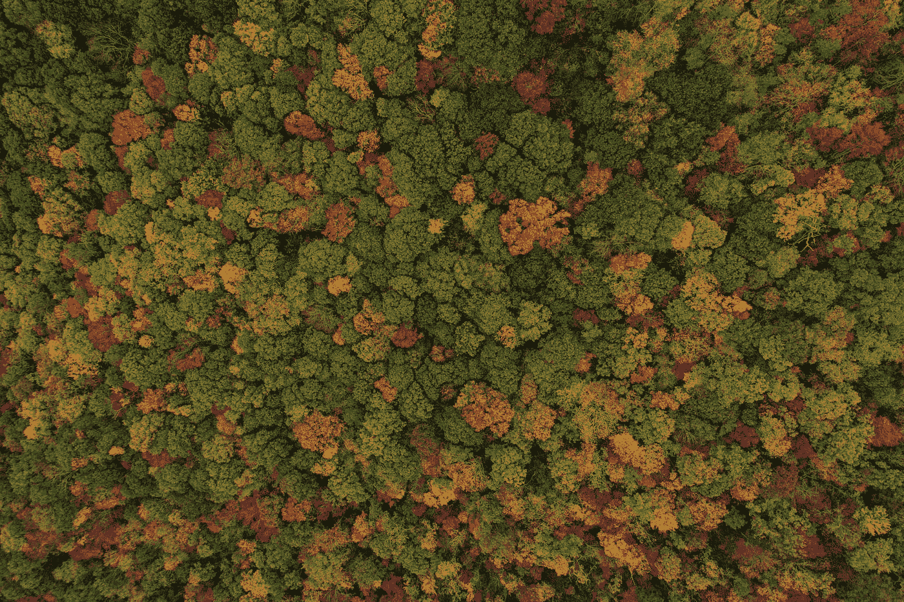

[内森·安德森](https://unsplash.com/@nathananderson?utm_source=medium&utm_medium=referral)在 [Unsplash](https://unsplash.com?utm_source=medium&utm_medium=referral) 上拍照

## [机器学习](https://towardsdatascience.com/machine-learning/home)

## 又名神奇的树:在哪里找到，如何检测它们🌲

在本文中，我将解释如何使用端到端的工作流来处理多类分类监督机器学习(ML)问题(或项目)。

*   **监督:**特征(生成预测的变量)和目标(待确定的变量)在数据集中可用。
*   **多类分类:**有七个离散的类别来区分目标。

该项目基于机器学习社区中一个著名的数据集，称为[森林覆盖类型](https://archive.ics.uci.edu/ml/datasets/covertype)，可在 [UCI 机器学习知识库](https://archive.ics.uci.edu/ml/index.php)中下载。

来自原始数据集的[分层样本](https://en.wikipedia.org/wiki/Stratified_sampling)用于应用工作流和独立测试集以生成最终预测，被用作 Kaggle 中初学者友好型[竞赛的一部分。](https://www.kaggle.com/c/learn-together)

**项目(和竞赛)的目标:**以最佳[精度](https://miro.medium.com/max/1064/1*5XuZ_86Rfce3qyLt7XMlhw.png)预测北科罗拉多州[罗斯福国家森林](https://en.wikipedia.org/wiki/Roosevelt_National_Forest)四个不同荒野地区的七种不同覆盖类型。

四个荒野地区是:

*   1:拉瓦
*   2:纽塔
*   3:科曼奇峰
*   4: Cache la Poudre


Cache la Poudre 荒野地区([来源](https://www.uncovercolorado.com/national-lands/cache-la-poudre-wilderness/))

在`Cover_Type`栏中从 1 到 7 的七个类别，待分类:

*   1:云杉/冷杉
*   2:黑松
*   3:美国黄松
*   4:杨木/柳木
*   5:阿斯彭
*   6:道格拉斯冷杉
*   7:克鲁姆霍尔茨

目标(封面类型)的名字让我想起了神奇的野兽，所以我称它们为神奇的树，以增加项目的想象力🙃。

**端到端机器学习工作流程步骤:**为了对封面类型进行分类并回答发起的问题，在哪里找到奇异的树以及如何检测它们，将遵循以下步骤:

1.  理解、清理和格式化数据
2.  探索性数据分析
3.  特征工程和选择
4.  比较几种机器学习模型
5.  对最佳模型执行超参数调整
6.  解释模型结果
7.  用测试数据评估最佳模型(回答初始问题)
8.  总结和结论

我将在本文中提供该项目的亮点，项目背后的全面分析和完整代码可在 [Kaggle 笔记本](https://www.kaggle.com/cereniyim/fantastic-trees-where-to-find-how-to-detect-them)和 [GitHub](https://github.com/cereniyim/Tree-Classification-ML-Model) 中获得。

对于数据角力和可视化 [numpy](https://numpy.org/) ， [pandas](https://pandas.pydata.org/) ， [matplotlib](https://matplotlib.org/) ，[seaborn](https://seaborn.pydata.org/)；为了建立机器学习模型 [xgboost](https://xgboost.readthedocs.io/en/latest/) ，l[right GBM](https://lightgbm.readthedocs.io/en/latest/)和[scikit-learn](https://scikit-learn.org/stable/)；为了执行预处理步骤，将使用 [scikit-learn](https://scikit-learn.org/stable/modules/preprocessing.html) 。

## 1.理解、清理和格式化数据

让我们加载训练数据并创建`trees`数据框:

```
trees = pd.read_csv("/kaggle/input/learn-together/train.csv")
```

我总是发现查看第一行和最后一行很有用:

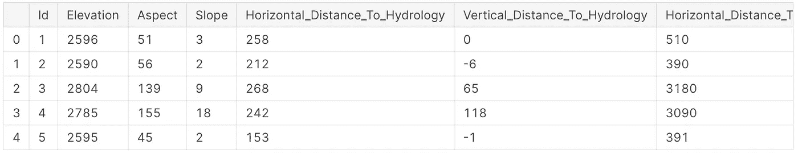

数据集的第一列和第一行

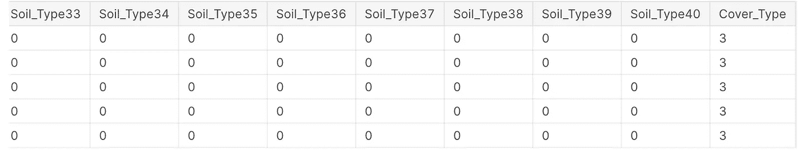

数据集的最后一列和最后一行

第一个观察结果是，`Vertical_Distance_To_Hydrology`列中有一些负值。我将在*检查异常&异常值*部分对此进行更详细的检查。

为了理解`trees`数据框架，让我们看看数据类型和描述性统计。使用 pandas `info`方法，我们可以列出非空值和数据类型:

```
**Data columns (total 56 columns):
Id                                    15120 non-null int64
Elevation                             15120 non-null int64
Aspect                                15120 non-null int64
Slope                                 15120 non-null int64
Horizontal_Distance_To_Hydrology      15120 non-null int64
Vertical_Distance_To_Hydrology        15120 non-null int64
Horizontal_Distance_To_Roadways       15120 non-null int64
Hillshade_9am                         15120 non-null int64
Hillshade_Noon                        15120 non-null int64
Hillshade_3pm                         15120 non-null int64
Horizontal_Distance_To_Fire_Points    15120 non-null int64
Wilderness_Area1                      15120 non-null int64
Wilderness_Area2                      15120 non-null int64
Wilderness_Area3                      15120 non-null int64
Wilderness_Area4                      15120 non-null int64
Soil_Type1                            15120 non-null int64
Soil_Type2                            15120 non-null int64
Soil_Type3                            15120 non-null int64
Soil_Type4                            15120 non-null int64
Soil_Type5                            15120 non-null int64
Soil_Type6                            15120 non-null int64
Soil_Type7                            15120 non-null int64
Soil_Type8                            15120 non-null int64
Soil_Type9                            15120 non-null int64
Soil_Type10                           15120 non-null int64
Soil_Type11                           15120 non-null int64
Soil_Type12                           15120 non-null int64
Soil_Type13                           15120 non-null int64
Soil_Type14                           15120 non-null int64
Soil_Type15                           15120 non-null int64
Soil_Type16                           15120 non-null int64
Soil_Type17                           15120 non-null int64
Soil_Type18                           15120 non-null int64
Soil_Type19                           15120 non-null int64
Soil_Type20                           15120 non-null int64
Soil_Type21                           15120 non-null int64
Soil_Type22                           15120 non-null int64
Soil_Type23                           15120 non-null int64
Soil_Type24                           15120 non-null int64
Soil_Type25                           15120 non-null int64
Soil_Type26                           15120 non-null int64
Soil_Type27                           15120 non-null int64
Soil_Type28                           15120 non-null int64
Soil_Type29                           15120 non-null int64
Soil_Type30                           15120 non-null int64
Soil_Type31                           15120 non-null int64
Soil_Type32                           15120 non-null int64
Soil_Type33                           15120 non-null int64
Soil_Type34                           15120 non-null int64
Soil_Type35                           15120 non-null int64
Soil_Type36                           15120 non-null int64
Soil_Type37                           15120 non-null int64
Soil_Type38                           15120 non-null int64
Soil_Type39                           15120 non-null int64
Soil_Type40                           15120 non-null int64
Cover_Type                            15120 non-null int64
dtypes: int64(56)
memory usage: 6.5 MB**
```

用`describe`方法，我们可以观察到描述性统计:

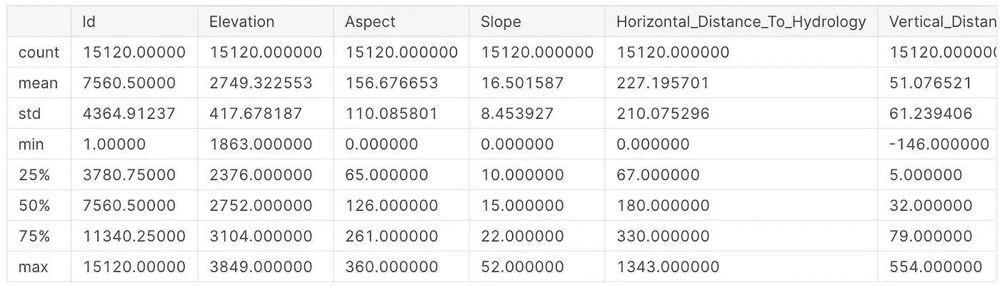

第一列的描述性统计

`info`法提供了一些有价值的信息:

*   数据是格式化的和干净的:没有任何空值，所有要素都是数字。
*   有[一个热编码](https://www.geeksforgeeks.org/ml-one-hot-encoding-of-datasets-in-python/)栏(在[原始笔记本](https://www.kaggle.com/cereniyim/fantastic-trees-where-to-find-how-to-detect-them#2.2.-Can-one-Fantastic-Tree-belong-to-multiple-soil-types-and-wilderness-areas-?)中验证):土壤类型和荒野面积。

**检查异常&异常值:**

观察到的第一个异常是`Vertical_Distance_To_Hydrology`列中的负值。定义是:

> 到最近地表水特征的垂直距离

通过一些研究和使用逻辑，负值表明最近的地表水低于该数据点或低于海平面。两种情况都有道理，所以我要保留负值。

为了帮助未来的 ML 模型掌握数据中的模式，我将搜索异常值并使用极端异常值方法来确定它们。

如果数据点位于第一个四分位数[以下或第三个四分位数](https://en.wikipedia.org/wiki/Quartile)以上的四分位数间距的 3 倍以上，则数据点将被删除。

```
*# loop through all columns to see if there are any outliers*
for column in trees.columns:
    if outlier_function(trees, column)[2] > 0:
        print("There are {} outliers in {}".format(outlier_function(trees, column)[2], column))
```

知道了荒野面积和土壤类型列是一次性编码的，我们就可以专注于其余部分:

```
**There are 53 outliers in Horizontal_Distance_To_Hydrology
There are 49 outliers in Vertical_Distance_To_Hydrology
There are 3 outliers in Horizontal_Distance_To_Roadways
There are 7 outliers in Hillshade_9am
There are 20 outliers in Hillshade_Noon
There are 132 outliers in Horizontal_Distance_To_Fire_Points**
```

山体阴影列是特定时间阴影的 RGB 颜色表示，因此范围已经固定在 0 到 255 之间。

考虑到`Horizontal_Distance_To_Firepoints`具有最大数量的异常值和最宽的数据范围【0，6993】，我将只删除该列中的异常值。

```
trees = trees[(trees['Horizontal_Distance_To_Fire_Points'] > outlier_function(trees, 'Horizontal_Distance_To_Fire_Points')[0]) &
              (trees['Horizontal_Distance_To_Fire_Points'] < outlier_function(trees, 'Horizontal_Distance_To_Fire_Points')[1])]
```

## 2.探索性数据分析

EDA 是该工作流中的第一步，在该步骤中，针对特征选择启动决策过程。通过观察目标的分布、特征与目标的关系以及特征之间的联系，可以获得一些有价值的见解。

我的偏好是从查看目标开始，然后检查特征及其与目标的关系。

**目标分布:**

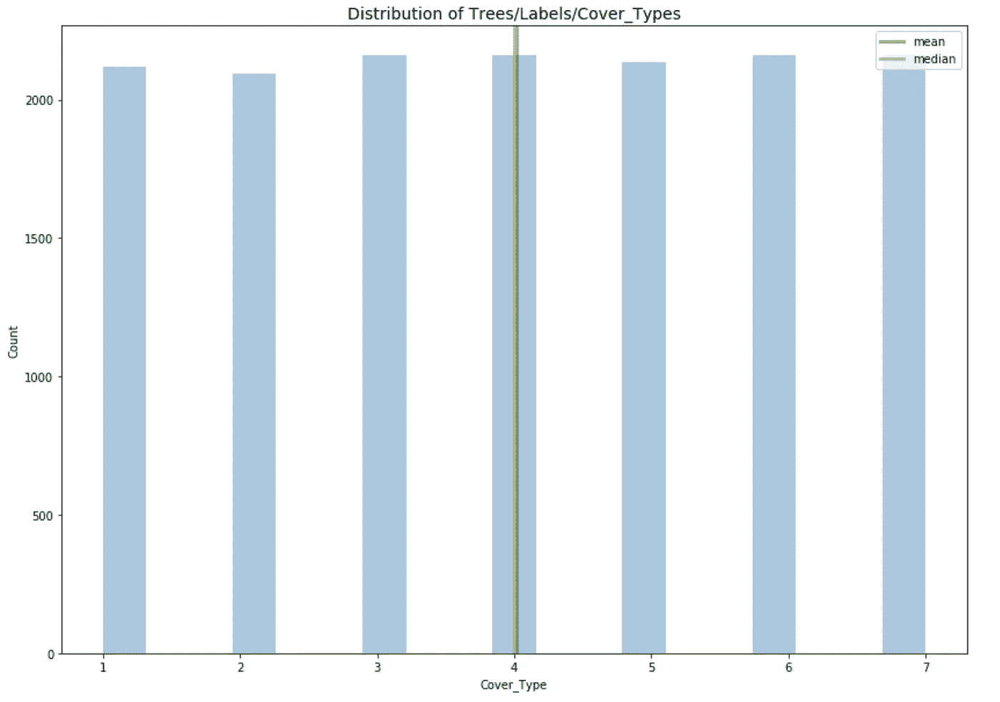

奇异的树/标签/覆盖类型的分布

数据集具有平衡的标签，导致每个类别的封面类型数量几乎相等。当我们应用 ML 算法时，这将是一个优势，因为模型将有很好的机会学习所有类的模式，而不需要进一步的平衡策略。

**荒野地区——覆盖类型:**

为了了解这种关系，荒野区域列将被反向热编码。

```
trees['Wilderness_Area_Type'] = (trees.iloc[:, 11:15] == 1).idxmax(1)
```

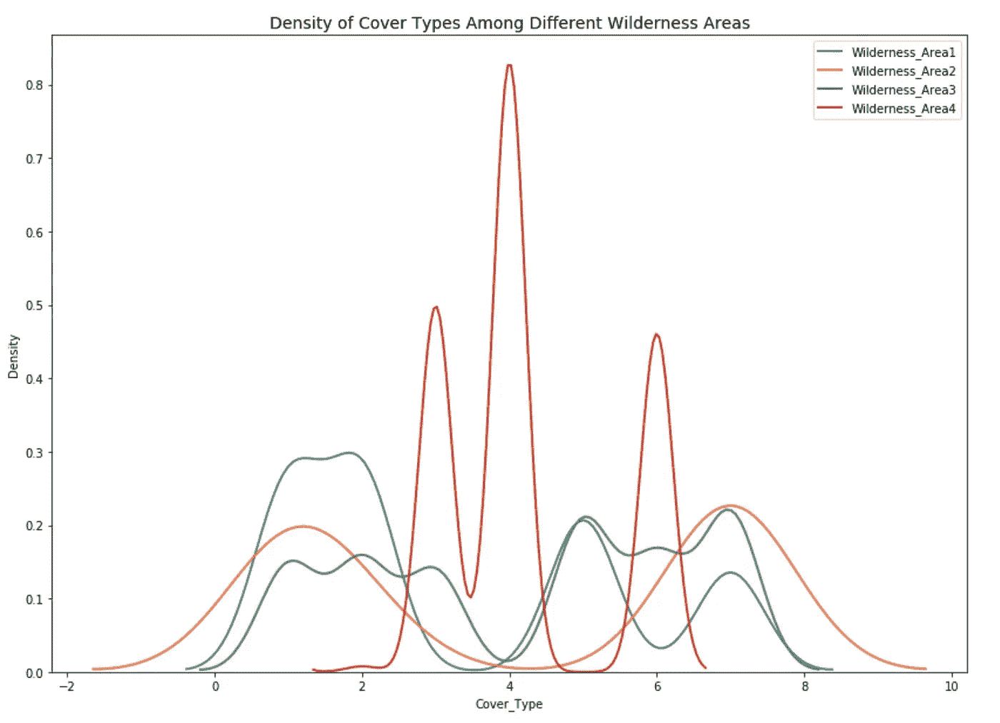

不同荒野地区覆盖类型的 KDE 样地

荒野区域是确定`Cover_Type`的显著特征。

**荒野地区—土壤类型—覆盖类型:**

反向一热编码将使用以下函数应用于土壤类型列。因此，将添加一个具有 1 到 40 之间的离散数字的列`Soil_Type`。

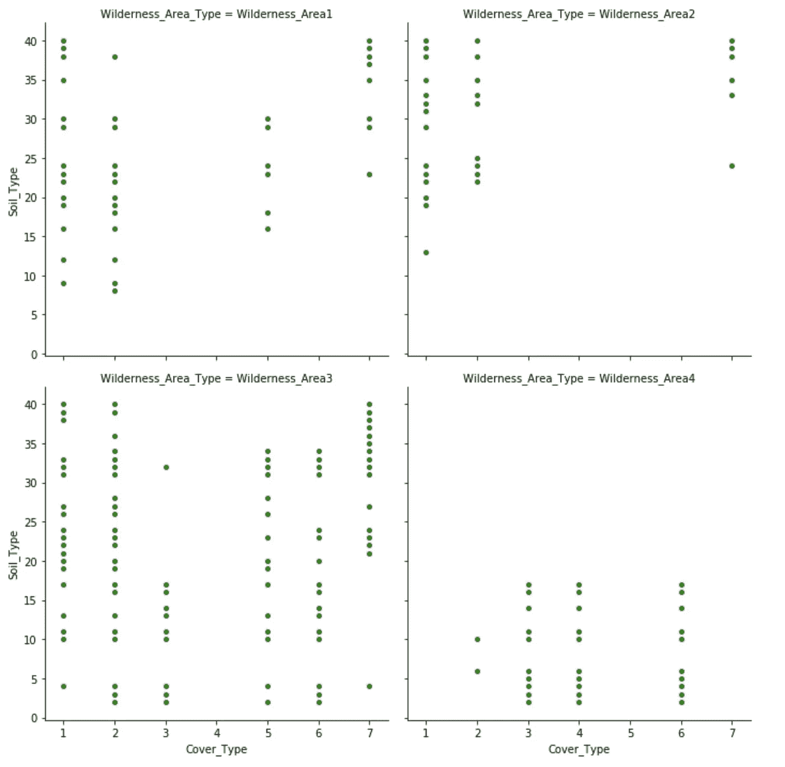

不同荒野地区土壤类型和覆盖类型散点图

不同的荒野地区由一些特定的树木组成。有趣的是，有一种奇妙的树，棉白杨/柳树，特别喜欢生长在 Cache la Poudre(荒野区域 4)。虽然云杉/冷杉、黑松、白杨和花旗松可以在任何土壤类型中生长，但其他覆盖类型可以在特定的土壤类型中生长。

**连续特征之间的关系:**

土壤类型和荒野区域列是离散的，并且都是一个分类要素的一个热编码版本。

其余要素被视为连续要素:*高程、坡向、坡度、水平距离水文、垂直距离水文、水平距离道路、山体阴影上午 9 点、山体阴影中午 3 点、水平距离火灾点。*

为了用一个函数将它们可视化，将绘制 Seaborn 的`PairGrid`,以提供用不同的图调整上下对角线的灵活性:

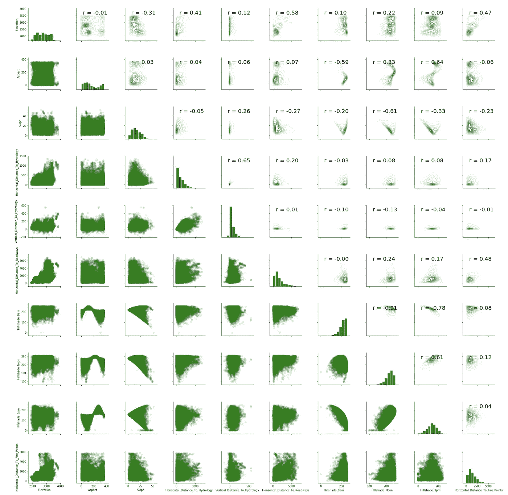

连续特征的成对网格

上半部分显示了具有皮尔逊系数的 KDE 图，下半部分显示了散点图。对角线是特定特征的直方图。正如所料，山体阴影特征是[共线的](https://en.wikipedia.org/wiki/Multicollinearity):

*   山体阴影中午-山体阴影下午 3 点
*   山体阴影下午 3 点—山体阴影上午 9 点

这些对为模型提供相同的输入，为了更好的可解释性，其中一个将在*特征工程&选择*中被删除。

**特性和目标的皮尔逊系数:**

作为 EDA 的最后一步，当观察特征和目标的 Pearson 系数时，只有 1%的 one-hot-encoded 土壤类型列在确定`Cover_Type`时是有效的(本文未显示，但在笔记本[这里](https://www.kaggle.com/cereniyim/fantastic-trees-where-to-find-how-to-detect-them#2.8.-Pearson-Coefficients-of-all-features))。因此，它们将被排除，皮尔逊系数将被重新使用连续特征、一个热编码的荒野区域、`Soil_Type`和`Cover_Type`。

```
continuous_variables = trees.columns[1:11].tolist()wilderness_areas = sorted(trees['Wilderness_Area_Type'].value_counts().index.tolist())all_features_w_label = continuous_variables + wilderness_areas + ["Soil_Type"] + ["Cover_Type"]trees_w_numeric_soil = trees[all_features_w_label]
```

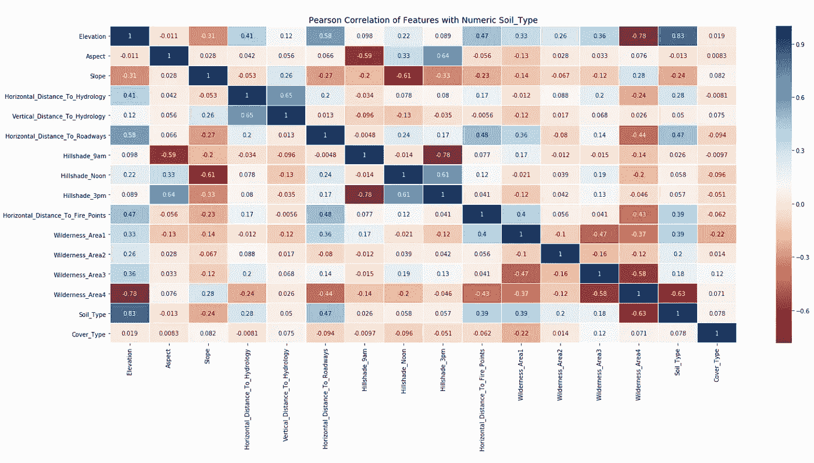

cover_type 数据集的皮尔逊系数热图

深色代表强烈的相关性。不幸的是，最后一列由浅色组成，导致特征相对于目标的弱皮尔逊系数，在[-0.22，0.12]的范围内。

用[标签编码的](https://www.geeksforgeeks.org/ml-label-encoding-of-datasets-in-python/) `Soil_Type`列与`Cover_Type`有更强的相关性。

`Hillshade_9am`在确定`Cover_Type`时最不重要。因此，它将在下一节中被删除。

## 3.特征工程和选择

在已有特征的基础上提取新特征，用一些[方法和算法](https://scikit-learn.org/stable/modules/feature_selection.html)消除特征，称为特征工程&选择。

水文要素有水平距离和垂直距离，两者的[欧几里德距离](https://en.wikipedia.org/wiki/Euclidean_distance)相加闪烁。

```
trees_w_numeric_soil['Euclidian_Distance_To_Hydrology'] = (trees_w_numeric_soil['Horizontal_Distance_To_Hydrology']**2 +                                                        trees_w_numeric_soil['Vertical_Distance_To_Hydrology']**2)**0.5
```

此外，添加数字特征的线性组合是特征工程中的常见做法。对于一些数字特征，两个变量的平均值相加:

```
trees_w_numeric_soil['Mean_Elevation_Vertical_Distance_Hydrology'] = (trees_w_numeric_soil['Elevation'] +                                                               trees_w_numeric_soil['Vertical_Distance_To_Hydrology'])/2trees_w_numeric_soil['Mean_Distance_Hydrology_Firepoints'] = (trees_w_numeric_soil['Horizontal_Distance_To_Hydrology'] +                   trees_w_numeric_soil['Horizontal_Distance_To_Fire_Points'])/2trees_w_numeric_soil['Mean_Distance_Hydrology_Roadways'] = (trees_w_numeric_soil['Horizontal_Distance_To_Hydrology'] +                                                   trees_w_numeric_soil['Horizontal_Distance_To_Roadways'])/2trees_w_numeric_soil['Mean_Distance_Firepoints_Roadways'] = (trees_w_numeric_soil['Horizontal_Distance_To_Fire_Points'] +                              trees_w_numeric_soil['Horizontal_Distance_To_Roadways'])/2
```

另一种常见的做法是对数字特征执行对数和平方根变换。再添加 5 个特征后，对正特征应用平方根变换:

```
for col **in** trees_w_numeric_soil.columns:
    if trees_w_numeric_soil[col].min() >= 0:
        if col == 'Cover_Type':
            next
        else:
            trees_w_numeric_soil['sqrt' + col] = np.sqrt(trees_w_numeric_soil[col])
```

在重新访问皮尔逊系数之后，如果新添加的特征显示出与目标更强的相关性，则保留该新添加的特征，而丢弃原始特征。此外，`Hillshade_9am`因与`Hillshade_3pm`密切相关而被剔除。

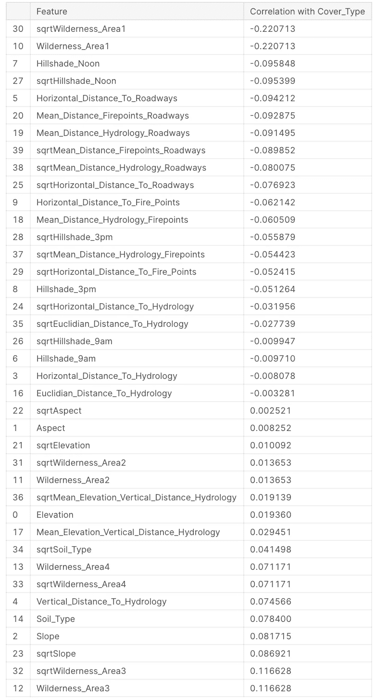

特征工程后的皮尔逊系数

最后的特点是:

```
*# final list of features*
transformed_features = ['sqrtHorizontal_Distance_To_Hydrology', 'sqrtMean_Distance_Hydrology_Roadways', 'sqrtEuclidian_Distance_To_Hydrology', 
'Mean_Elevation_Vertical_Distance_Hydrology', 'Mean_Distance_Firepoints_Roadways', 'Mean_Distance_Hydrology_Firepoints']all_features =  (['Elevation', 'Aspect', 'Slope', 'Vertical_Distance_To_Hydrology', 'Horizontal_Distance_To_Roadways', 
'Hillshade_Noon', 'Hillshade_3pm', 'Horizontal_Distance_To_Fire_Points' ] + 
wilderness_areas + ['Soil_Type'] + transformed_features)trees_training = trees_w_numeric_soil[all_features]
labels_training = trees_w_numeric_soil["Cover_Type"].as_matrix()
```

为了比较 ML 模型并建立基线，`trees_training`和`labels_training`数据帧被分成训练集和验证集。

```
X_train, X_valid, y_train, y_valid = train_test_split(trees_training, labels_training, test_size=0.2, random_state=1)
```

*   训练集用作输入，以便机器学习模型可以捕捉特征中的模式，并利用它们来区分目标。
*   验证集用于评估 ML 模型的性能，并量化其将模式归纳到新数据集的能力。

**创建基线度量:**

在深入研究 ML 分类算法之前，我将计算一个常识基线。常识基线可以定义为了解该领域的人如何在不使用任何 ML 技巧的情况下解决问题。它可以用人类的直觉以及一个虚拟或简单的算法来计算，只需要几行代码。

我将使用 scikit-learn 库中的一个虚拟算法。使用该算法，我将建立一个具有准确性的基线度量，即所有覆盖类型中正确预测的覆盖类型的百分比。准确性是本次竞赛的评估标准，将在整个项目中使用，记住它[对于某些分类问题来说不是最有效的标准](https://medium.com/techspace-usict/measuring-just-accuracy-is-not-enough-in-machine-learning-a-better-technique-is-required-e7199ac36856)。

基线指标在某种程度上很重要，如果机器学习模型不能击败人的简单直观预测或算法的猜测，那么原始问题需要重新考虑或训练数据需要重新构建。

```
*# Create dummy classifer*
dummy = DummyClassifier(strategy='stratified', random_state=1)*# train the model*
dummy.fit(X_train, y_train)*# Get accuracy score*
baseline_accuracy = dummy.score(X_valid, y_valid)
print("Our dummy algorithm classified {:0.2f} of the of the trees correctly".format(baseline_accuracy))
**Our dummy algorithm classified 0.14 of the of the trees correctly**
```

现在，我期望以下 ML 模型击败 0.14 的准确度分数！

## 4.比较几种机器学习模型

有时很难知道哪种机器学习模型将有效地解决给定的问题。所以，我总是尝试几种机器学习模型。

一项[研究](https://pdfs.semanticscholar.org/7944/be8a9d4209bea4fcea210eacc6be95681b2f.pdf?_ga=2.122963467.1406864965.1578477399-206203046.1578477399)显示，基于树和基于距离的算法在分析的 165 个数据集上优于其他最大似然算法。


机器学习算法性能比较([来源](https://www.semanticscholar.org/paper/Data-driven-advice-for-applying-machine-learning-to-Olson-Cava/1279fe26020af034fd6f16b04a1c23427c127db3/figure/3))

我将比较一个基于距离的算法和四个基于树的算法的准确性。

基于距离:

*   k-最近邻分类器(使用[欧几里德距离](https://en.wikipedia.org/wiki/Euclidean_distance)来聚类标签；之前需要进行规范化，并在原始笔记本中的处应用[。)](https://www.kaggle.com/cereniyim/fantastic-trees-where-to-find-how-to-detect-them#4.1.-Z-Score-normalization-for-K-Nearest-Neighbors-and-LightGBM)

基于树:

*   l[light GBM](https://lightgbm.readthedocs.io/en/latest/)库中的 light Gradient Boosting Machine(light GBM)分类器
*   来自 [xgboost](https://xgboost.readthedocs.io/en/latest/) 库的额外梯度增强(XGBoost)分类器
*   来自 [scikit-learn 库的随机森林分类器](https://scikit-learn.org/stable/modules/ensemble.html#forests-of-randomized-trees)
*   来自 [scikit-learn 库](https://scikit-learn.org/stable/modules/ensemble.html#forests-of-randomized-trees)的额外树(随机森林)分类器

(型号后面的代码是[这里是](https://www.kaggle.com/cereniyim/fantastic-trees-where-to-find-how-to-detect-them#4.2.-Build-models)。)

与研究结果不同，额外树分类器优于其他分类器。所有模型都优于基线度量，表明机器学习适用于森林覆盖类型的分类。

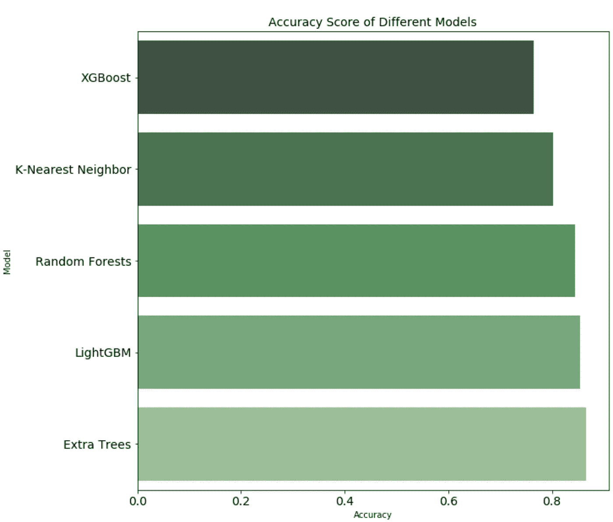

我们最好的模型，额外树分类器，是一个基于集合树的模型。[sci kit-learn 库中的定义](https://scikit-learn.org/stable/modules/generated/sklearn.ensemble.ExtraTreesClassifier.html)如下:

> 该类实现了一个元估计器，它在数据集的各个子样本上拟合多个随机决策树(也称为额外树),并使用平均来提高预测精度和控制过度拟合。

与随机森林算法的主要区别在于:

1.  不是为节点中的特征寻找最有区别的分裂值，而是完全随机地选择分裂作为阈值。
2.  子样本取自整个训练集，而不是训练集的[引导](https://machinelearningmastery.com/a-gentle-introduction-to-the-bootstrap-method/)样本。

因此，该算法对于过拟合变得更加鲁棒。

## 5.对最佳模型执行超参数调整

寻找模型参数的最佳组合被称为超参数调整，它可以极大地提高模型的性能。我将使用交叉验证的随机搜索算法进行超参数调整:

*   **随机搜索:**在一个范围内定义一组 ML 模型的参数，并输入到 [sklearn 的](https://scikit-learn.org/stable/modules/generated/sklearn.model_selection.RandomizedSearchCV.html)T0。该算法随机选择一些参数组合，并将定义的`score`(精确度，对于这个问题)与迭代进行比较。可以用参数`n_iter`控制随机搜索运行时间和迭代次数。
*   **K-Fold 交叉验证:**一种用于评估超参数在整个数据集上的性能的方法。(目测此处[为](https://scikit-learn.org/stable/_images/grid_search_cross_validation.png))。不是将数据集分成训练集和验证集的两个静态子集，而是对于给定的 K，数据集被均等地划分，并且随着迭代，不同的 K-1 个子集被训练，并且用不同的子集测试模型。

使用以下一组参数和 5 重交叉验证，`RandomizedSearchCV`将寻找最佳组合:

```
*# The number of trees in the forest algorithm, default value is 100.*
n_estimators = [50, 100, 300, 500, 1000]

*# The minimum number of samples required to split an internal node, default value is 2.*
min_samples_split = [2, 3, 5, 7, 9]

*# The minimum number of samples required to be at a leaf node, default value is 1.*
min_samples_leaf = [1, 2, 4, 6, 8]

*# The number of features to consider when looking for the best split, default value is auto.*
max_features = ['auto', 'sqrt', 'log2', None] 

*# Define the grid of hyperparameters to search*
hyperparameter_grid = {'n_estimators': n_estimators,
                       'min_samples_leaf': min_samples_leaf,
                       'min_samples_split': min_samples_split,
                       'max_features': max_features}*# create model*
best_model = ExtraTreesClassifier(random_state=42)

*# create Randomized search object*
random_cv = RandomizedSearchCV(estimator=best_model,                          param_distributions=hyperparameter_grid,
                               cv=5, n_iter=20, 
                               scoring = 'accuracy',
                               n_jobs = -1, verbose = 1, 
                               return_train_score = True, 
                               random_state=42)*# Fit on the all training data using random search object*
random_cv.fit(trees_training, labels_training)
random_cv.best_estimator_
```

以下是参数的最佳组合:

*   `n_estimators` = 300
*   `max_features` =无
*   `min_samples_leaf` = 1
*   `min_samples_split` = 2

当我将它们输入额外的树分类器时:

```
**Accuracy score in the previous extra random forests model: 0.8659106070713809
Accuracy score after hyperparameter tuning: 0.885923949299533**
```

导致精确度增加 2 个点。

另一种搜索方法是`GridSearchCV`，与`RandomizedSearchCV`相反，搜索是在给定参数的每一个组合上进行的。(此处[应用和讨论【原笔记本](https://www.kaggle.com/cereniyim/fantastic-trees-where-to-find-how-to-detect-them#5.1.2.-Possible-further-improvements-with-the-GridSearch))

## 6.解释模型结果

**混乱矩阵:**

可视化分类模型结果的最常见方法之一是混淆矩阵。

奇异树混淆矩阵将是一个 7x7 矩阵。我将使用标准化的混淆矩阵，因此在该特定类别的所有猜测中，正确猜到的实际封面类型的百分比将出现在矩阵的对角线上。

非对角线元素将显示模型错误标记的元素。混淆矩阵对角线上的百分比越高、颜色越深越好，表明有许多正确的预测。

我将使用 scikit 中的[函数](https://scikit-learn.org/0.22/auto_examples/model_selection/plot_confusion_matrix.html)——学习绘制它:

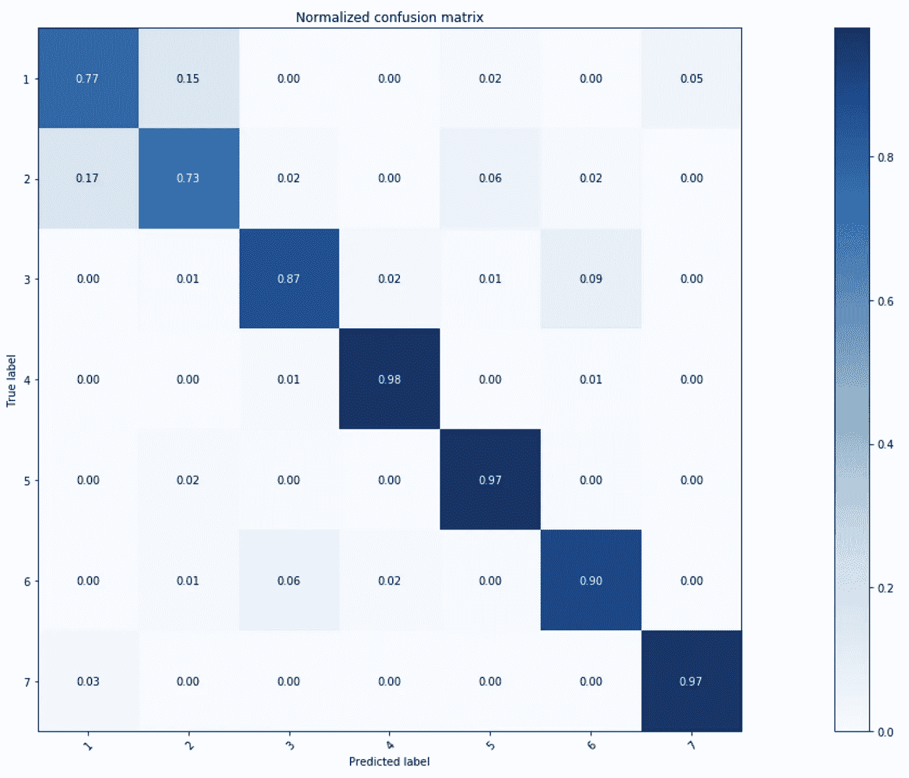

超参数调整的超随机森林分类器的混淆矩阵

该模型很好地检测了美国黄松、三叶杨/柳树、白杨、花旗松、克拉姆霍尔茨等奇异的树木，但似乎对检测云杉/冷杉和黑松(覆盖类型 1 和 2)有些混淆。

**特征重要性:**

另一种方法是查看具有`feature_importances_`的特征重要性:一个介于 0 和 1 之间的数字，显示每个特征对预测的贡献。数字越高，说明贡献越大。

利用当前选择的功能、额外的树分类器和参数，前 10 个功能是:

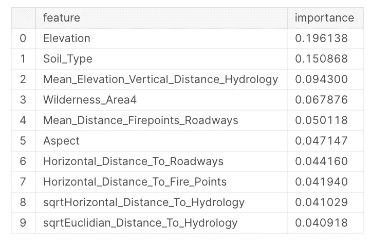

其中 5 个是在本项目范围内创建的。这个列表强调了特征工程和选择的重要性。

## 7.用测试数据评估最佳模型(回答初始问题)

**如何检测奇异的树(生成最终预测):**

Kaggle 为比赛提供单独的训练和测试设备。直到现在，我都在训练台上工作。尽管如此，测试集用于最终预测，所以我将测试集和训练集[在这里](https://www.kaggle.com/cereniyim/fantastic-trees-where-to-find-how-to-detect-them#6.1.-Align-test-set-with-the-training-set)对齐，并将其输入超参数调整的额外树分类器

> **成功检测奇异树，准确率 78%。**

**哪里可以找到神奇的树:**

云杉/冷杉、Lodgepole Pine 和 Krummholz 喜欢在 Rawah、Neota 和 Comanche Peak 荒野地区出没。

Cache la Poudre 荒野区是种植黄松和棉白杨/柳树的最佳地点。

如果你看到一个白杨，怀疑你是在 Rawah 或 Comanche。

花旗松是一种容易相处的物种，适合任何荒野地区。

## 8.总结和结论

在本文中，我重点介绍了端到端的机器学习工作流在有监督的多类分类问题中的应用。我从使用 EDA 理解和可视化数据开始，并形成了对 cover 类型数据集的见解。利用 EDA 的输出，我进行了特征工程，在其中我转换、添加和删除了特征。

额外树分类器很好地匹配了这个分类问题的准确性度量。随着超参数的调整，通过调整`n_estimators`参数，模型的准确度分数增加了 2 个点。解释模型结果显示了最重要的特征以及如何进一步提高准确性(通过更好地区分封面类型 1 和 2)。

**项目背后的综合代码:**

【https://github.com/cereniyim/Tree-Classification-ML-Model】Github 回购:T4

**Kaggle 笔记本:**[https://www . ka ggle . com/cereniyim/fantastic-trees-where-to-find-how-detect-them/Notebook](https://www.kaggle.com/cereniyim/fantastic-trees-where-to-find-how-to-detect-them/notebook)

感谢阅读，这种端到端的工作流程可以应用于任何机器学习问题，我鼓励你去尝试一下！

对于任何问题、评论或建设性反馈，您可以通过回复联系我， [Twitter](https://twitter.com/cereniyim) 或 [Linkedin](https://www.linkedin.com/in/ceren-iyim) ！