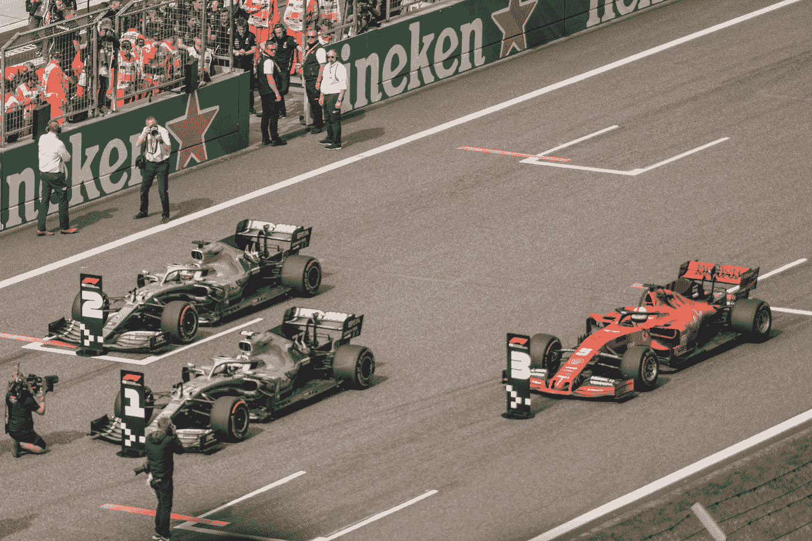
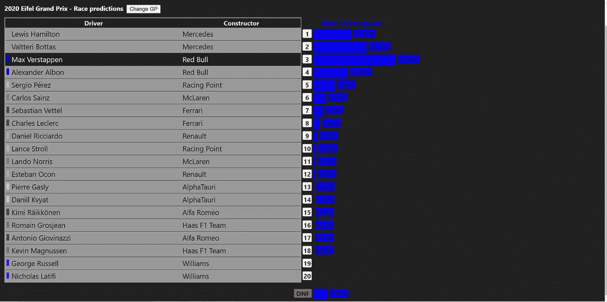

# 使用 Elo 评级预测一级方程式赛车结果

> 原文：<https://towardsdatascience.com/predicting-formula-1-results-with-elo-ratings-908470694c9c?source=collection_archive---------26----------------------->

## [体育分析](https://towardsdatascience.com/sports-analytics/home)

## 通过模型、数据管道和蒙特卡洛模拟建立预测

由[达伦·努尼斯](https://unsplash.com/@dnunis?utm_source=medium&utm_medium=referral)在 [Unsplash](https://unsplash.com?utm_source=medium&utm_medium=referral) 上拍摄的照片

一级方程式赛车比赛通常感觉是可预测的:梅赛德斯在 2020 赛季赢得了过去的 5 个冠军和前 9 个 gp 中的 7 个。网上当然不乏 f1 预测——从专业专家到自封的纸上谈兵的“专家”，任何人都经常热衷于分享他们的预测。我的目标是对这个问题进行更深入的分析:一级方程式比赛能被算法预测吗？

在过去的两年里，我一直致力于预测 f1 资格赛的结果。从一开始，我的目标也是预测比赛结果，但这比预期的要复杂。排位赛结果相对更容易建模:在一级方程式排位赛中，获胜者是创下最快时间的车手。因此，司机的表现可以被认为是独立于其他人的:他们与时间竞争，只是间接的相互竞争。这使得预测结果更容易:每个司机的预测结果可以直接与他们的成绩进行比较。一级方程式比赛的建模更加复杂，因为车手之间直接竞争。但是随着一个封闭的夏天的到来，我决定是时候尝试一下赛车模型了。两位伟大的开发人员 Raiyan 和 Philip 加入了我的行列，共同探索建立一个预测 f1 比赛结果的模型。

在 F1 比赛中，完成时间并不重要:无论你以 20 秒还是 0.1 秒的优势赢得比赛，你都可以获得相同的分数。我们决定将比赛建模为成对参与者之间的一系列独立的、面对面的比赛，最终一名参与者获胜或失败(或者未解决，如果一方或双方没有完成比赛)。该模型不考虑完成时间或获得的分数，而是检查参与者赢得了多少场比赛，以及它与他们的预期分数如何匹配。这种方法背后的一个主要好处是它在“反常”比赛中的相对弹性:例如，在一个只关注终点位置的模型中，大多数领先者没有完成的比赛将导致较弱的车手获得不合理的大收益。一个关于头对头比赛的推理模型不会将退役的车手考虑在内，从而导致对车手分数的现实调整。

这些车手之间的竞争可以用一个叫做 [Elo ratings](https://en.wikipedia.org/wiki/Elo_rating_system) 的概念来模拟。Elo 评级最初是为国际象棋选手排名而开发的。在 Elo 系统中，战胜一个更强的对手比战胜一个统计上更弱的对手获得更多的分数。每位车手的 Elo 评分在比赛结束后会根据他们在每场比赛中的表现与预期分数的对比情况进行上调或下调。预期分数是通过比较两个参与者的 Elo 评级计算出来的，它是一个介于 1 和 0 之间的值。预期分数 1 意味着车手将永远赢得比赛，而预期分数 0.5 意味着他们将赢得一半的时间。一级方程式赛车比赛的“真实”分数总是 1 或 0，取决于车手是赢还是输(如果一名或两名车手没有完成比赛，比赛不计算分数)。实际分数和预期分数之间的差异将应用于每位驾驶员的分数，K 系数为 4。

f1 比赛因排位赛而变得更加复杂，排位赛规定了比赛的发车顺序。因为车手的发车位置对他们的预期完成位置有着重大影响，所以参与者的 Elo 分数会根据他们的发车位置上下调整。网格调整后的 Elo 分数(gaElo)是用于预测车手比赛成绩的分数。与排位赛模型一样，预测是通过蒙特卡洛模拟生成的，在模拟过程中，每个车手、建造商和引擎的 gaElo 分数都会随机上调或下调。这里还模拟了一名车手退出比赛的可能性。通过多次运行模拟，可以计算出每个车手完成位置的百分比概率。

如前所述，比赛模型的预测取决于给定的起始网格。除了在周六的排位赛中决定的发车，我们还可以使用排位赛模型的模拟排位赛结果来生成比赛预测。这被称为“资格前预测”，它往往比“资格后预测”具有更大的分数方差。这是可以理解的，因为定性前的预测包含两倍的不确定性。构建允许两个模型顺序运行的管道并不容易，但是结果是非常值得的！

比赛模型产生的预测与现有的排位赛模型一起出现在[项目的网站](https://villekuosmanen.github.io/F1PredictWeb/#/race)上。对 2020 年德国 Eifel GP 的预测是由当前的模型生成的，而早期的预测是由实验模型生成的。

马克斯·维斯塔潘的比赛预测截图。图片作者:Ville Kuosmanen

该模型的性能是根据两个基准来衡量的:一个随机模型，随机预测结果；一个模型，总是预测结果与起始网格相同。我们的评估显示，该模型的性能优于基准测试，尽管与基于网格的模型相比，它的性能仅略胜一筹，这表明该模型在准确性方面还有很长的路要走。比赛模型尤其难以预测由于发车区处罚或排位赛中的问题而在场地后部起步的快速车手的成绩，这是我们希望在未来解决的问题。

比赛模式仍然有很多需要改进的地方。尽管如此，我不相信比赛模型能够匹配排位赛模型的表现:f1 比赛从本质上来说比排位赛更随机(这是否是真的还有待证明)。我们想做的下一个功能包括通过模拟未来的比赛来预测整个锦标赛。就像连接排位赛模型和正赛模型一样，这是一个工程问题，需要建设新的数据管道。我还想通过在网站上展示对模型内部工作的一些见解来提高模型的可解释性(这是我在推荐系统中写过的一个主题)。调查赛季前测试的数据也很有趣:比赛和排位赛车型往往在每个赛季开始时表现最差，因为制造商之间的力量平衡被打破了。

如果你有兴趣了解我们的一级方程式预测项目，你可以查看 [GitHub](https://github.com/villekuosmanen/F1Predict) 上的项目页面(完整的开源代码)。虽然作为一名工程师，我希望看到一个可以完美预测每场比赛结果的模型，但作为一名观众，每隔一段时间就有一场意想不到的比赛获胜者被证明是错误的，这令人耳目一新！