# 使用 NLP +深度学习预测欺诈性新闻文章

> 原文：<https://towardsdatascience.com/predicting-fraudulent-news-articles-using-nlp-deep-learning-ffdf64f19537?source=collection_archive---------58----------------------->

## 利用 NLP、ML 和深度学习分析和预测欺诈性新闻文章。

[乔·塞拉斯](https://unsplash.com/@joaosilas?utm_source=medium&utm_medium=referral)在 [Unsplash](https://unsplash.com?utm_source=medium&utm_medium=referral) 上的照片

生活在一个网上信息泛滥的时代，让我们容易相信欺骗性的新闻报道。这个问题在互联网上大量存在，其需求要求我们用机器学习和深度学习模型进行实验，以对潜在虚假的新闻进行分类。

这篇文章希望阐明“如何”利用自然语言处理、机器学习和深度学习来预测和识别欺诈性新闻文章。它还分享了从分析中得出的方法、结果和结论。

# **获取数据:**

包含真假新闻文章的数据集是从 [Kaggle](https://www.kaggle.com/c/fake-news/data) 获得的。数据集的形状是 20800 行和 5 列。数据集中有 10413 篇真实文章和 10387 篇虚假文章，表明数据集是平衡的。“**标签“**栏表示该商品是真的还是假的； **1** 表示假， **0** 表示真。

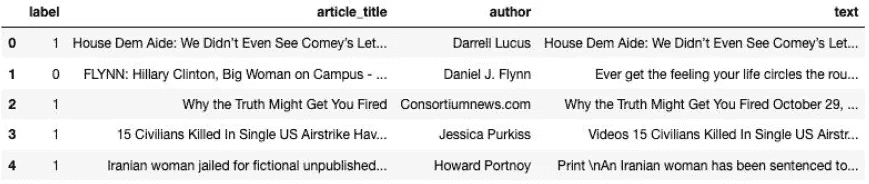

图 1:数据快照。

# **清理数据:**

由于文本数据是非结构化和杂乱的，因此需要进行文本预处理。一个[助手函数](https://github.com/mominasadullahkhan/Predicting-Fake-News-Articles/blob/master/Final%20Model%20%2B%20Analysis%20Notebook/helper_functions.py)被应用于数据，以移除换行符、新行、超链接、与符号、大于/小于符号、不间断空格、电子邮件、新行字符和分散注意力的单引号。创建了一个包含文章文本长度的新列“length”。

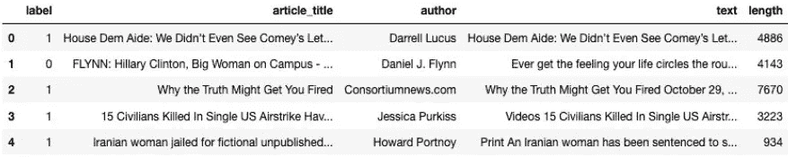

图 2:创建长度列后的数据集。

数据集还在“author”和“article_title”列中包含由“Unknown”替换的空值。长度少于 50 个字符的文章也被删除，理由是少于 50 个字符的文章不是文章。

# **探索性数据分析**

名为**‘text _ polarity’**的列被添加到数据集中。使用 [**TextBlob**](https://textblob.readthedocs.io/en/dev/quickstart.html) 库的情感极性函数对**‘文本’**列返回文本的极性，从 1 到 1 表示从负到正。

观察真实文章和虚假文章之间文本极性的分布如何不同将是有趣的。下图 3A 和 3B 分别展示了真文和假文的文本极性分布。

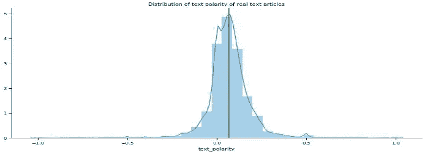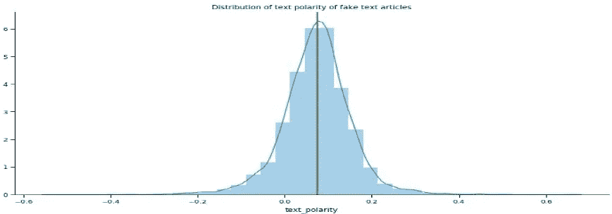

左图 3A，右图 3B

这两类文章中文本极性的分布似乎是均匀的，有些文章是完全负面的，有些是完全正面的。

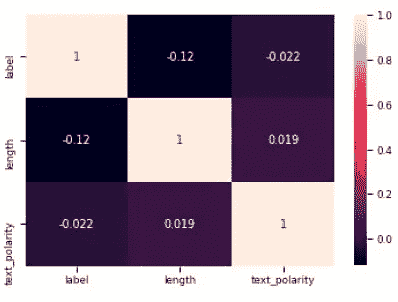

图 4 —相关矩阵

为了检查数据集中不同特征之间的相关性，使用了热图。数据集中不存在强相关，数据集中长度和标签之间的最大相关值为-0.12，表明非常弱的负相关。

使用 CountVectorizer 方法，绘制了去除和不去除停用词的前 20 个单字、双字和三元字。停用词指的是语言中最常见的词。在下面的例子中，图 5A 和 5B 显示了去除停用词后真实文章和虚假文章中的前 20 个三元模型。

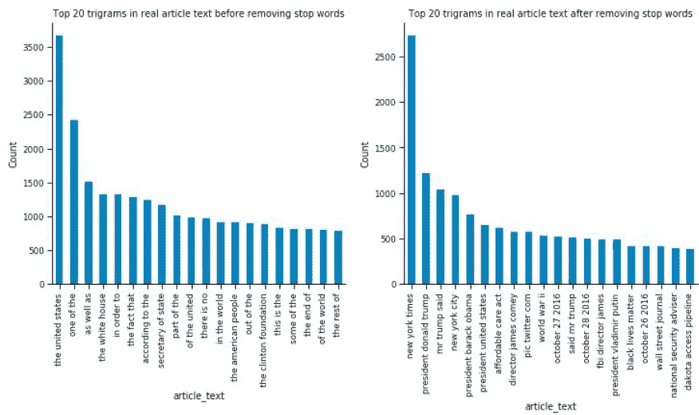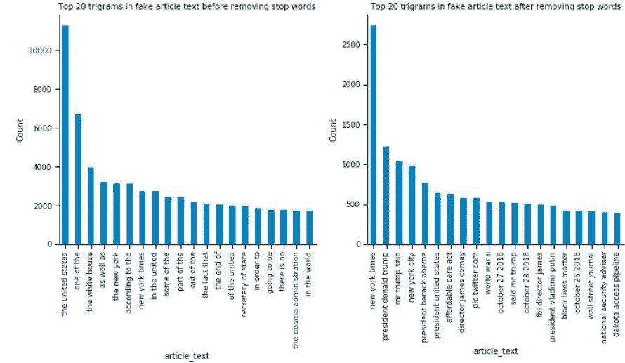

左侧—图 5A，右侧—图 5B

**推断统计分析:**

接下来，进行单样本 t 检验，以检验总体平均值是否与某些假设值有显著差异。进行统计 t-检验以确定假文章的平均文本极性是否不同于所有文章的平均文本极性。

**假设检验:**是假的文章和全文字文章在文字极性的均值上有显著差异吗？

**无效假设:**无效假设将是假文章和所有文本文章之间的文本极性没有差异。

**备选假设:**备选假设将是假文章和所有文章之间的文本极性存在差异。

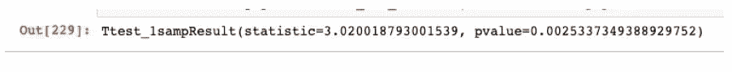

图 6

基于图 6 中的单样本 t-检验结果，所有文章的平均文本极性与虚假文章的平均文本极性之间存在显著差异。在 5%置信区间 0.0025 的低 P 值是拒绝零假设的良好指标。

# **建模**

下一步，也是我们分析的关键，需要训练模型来预测一篇新闻文章是真是假。在训练模型之前，我们需要将文本转换成适合这些算法的输入。为此，我们将使用两种方法，称为计数矢量器和 TF-IDF(术语频率-逆文档频率)矢量器。

CountVectorizer 用于通过将文本语料库转换为表示相应语料库中字数的向量来对其进行标记化。它还允许我们删除文本中的停用词，并检查最流行的 N ' unigrams，bigrams 和 trigrams。

相反，TF-IDF 是通过检查语料库并计算“术语频率”和“逆文档频率”获得的词频分数。术语频率是术语在文档中出现的频率，逆文档频率为文档中常见的词分配低权重。因此，TfidfVecotrizer 获取一组文档，并将它们分配给一个 TF-IDF 特性矩阵。然后，这种矢量化形式可以用作训练模型的输入。

这两种方法都将作为多项式朴素贝叶斯分类器和逻辑回归分类器的输入。逻辑回归被用作基准模型。基准模型是一种用于参考的模型，用来比较其他模型相对于它的表现。

没有为逻辑回归执行超参数调整，并且使用 0.01 的 ***C 值*** 对其进行训练。或者，对于多项式 NB 模型，使用交叉验证执行超参数调整，并发现 ***alpha*** = 0.1 是计数矢量器和 TF-IDF 矢量器模型中的最佳值。

LSTM(长短期记忆)神经网络是一种特殊类型的递归神经网络。*简单来说，LSTM 网络有一些内部情境状态细胞，充当长期或短期记忆细胞。LSTM 网络的输出由这些单元的状态调制。当我们需要神经网络的预测依赖于输入的历史背景，而不是仅仅依赖于最后一个输入*时，这是一个非常重要的属性。”[1] [阿萨德·莫瓦德](https://medium.com/@assaad.moawad?source=post_page-----6775e8b540cd----------------------)，[LSTM 神经网络的魔力](https://medium.com/datathings/the-magic-of-lstm-neural-networks-6775e8b540cd) (2018)

创建 LSTM 模型时，每个文本中使用的*最大字数等于 50，000， ***最大字数*** 为 250。LSTM 模型的***spatial drop out 1d***值为 0.2， ***脱落值*** 为 0.1， ***经常性脱落值*** 为 0.1。*

# ***结果***

*为了检验结果，计算了不同输入(计数矢量器和 TF-IDF)和不同模型的准确性和 AUC-ROC 评分。在评估模型时，准确性本身可能是一个误导性的指标，因此还查看了 AUC-ROC 评分和 ROC 图。AUC-ROC 是一个很好的评估指标，因为它考察了模型正确分类的能力，也为我们提供了假阳性和假阴性的概念。如果 AUC 分数高，则模型在预测类别标签方面做得很好，即 0 表示 0，1 表示 1。在这种特殊情况下，如果 AUC 很高，这意味着模型预测真实的文章是真实的，而假文章是假的。*

*图 7A 显示了使用计数矢量器和 TF-IDF 转换数据的不同分类器的结果。图 7B 显示了相同分类器的 ROC 曲线。*

*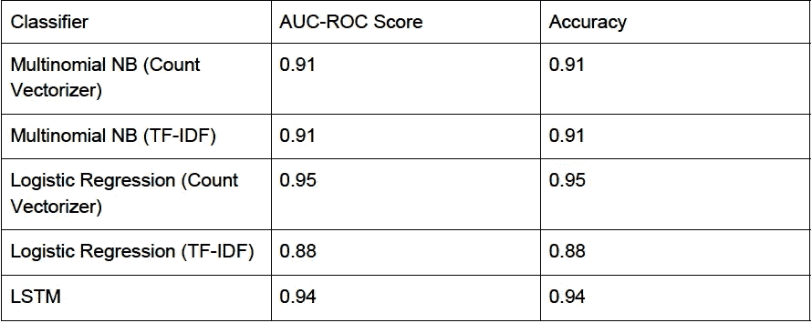**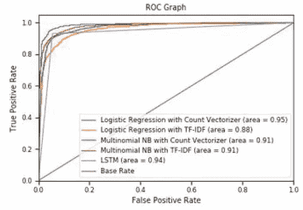*

*左—图 7A，右—图 7B*

*用计数矢量器来表征数据的逻辑回归给了我们最好的结果。它实现了 95%的准确性和 95%的 AUC-ROC 评分。尽管 LSTM 模型获得了更高的 AUC-ROC 评分，但使用它可能会矫枉过正，因为逻辑回归在准确性方面表现更好，并且具有更高的 AUC-ROC 评分。此外，逻辑回归计算成本较低。*

*最差的模型性能也是通过用 TF-IDF 矢量器的逻辑回归实现的，准确度和 AUC-ROC 得分为 0.88。*

# *模型评估*

*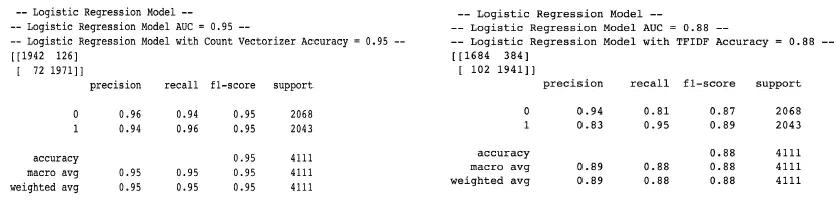*

*图 8A*

*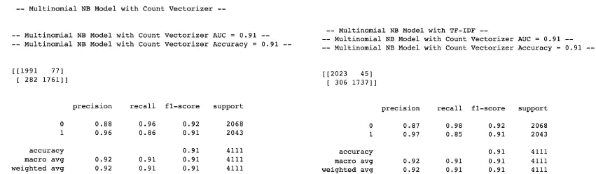*

*图 8B*

*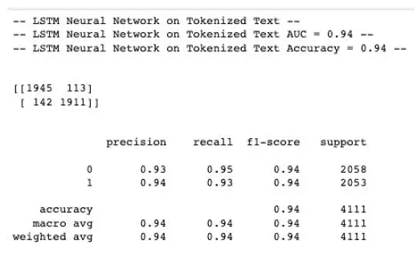*

*图 8C*

*除了仅使用准确性作为评估指标之外，我们还使用了 **AUC-ROC 评分**，它绘制了真阳性率与假阳性率的关系。我们还应该考虑假阳性和假阴性误差来评估我们的模型的性能。*

***假阳性(I 型错误)**:你预测文章是假的但却是真的。*

***假阴性(ⅱ型错误)**:你预测文章是真的但却是假的。*

*图 8A、8B 和 8C 显示了每个分类器的混淆矩阵和分类报告。*

# ***解释结果***

*重要的是，我们不仅要预测新闻文章是真是假，还要估计新闻文章是真是假的概率。这将允许我们标记假新闻文章，并显示它是假的概率。*

*用这种方法我们会遇到两种问题。首先，考虑新闻文章被模型预测为假的，但实际上，新闻文章是真实的。这被称为误报，这种错误可能代价高昂，因为它可能导致公司尴尬，还可能导致用户流失。不过，这可以通过建立一个机制来报告被错误标记为假的文章来快速纠正。这可能是这个项目发展的许多方向之一。*

*相反，考虑新闻文章被预测为真实但实际上是假的。随着越来越多的人接触到这篇假新闻，同时相信它是真实的，这篇文章将继续不受限制地被分享。这被称为假阴性，它有能力在敏感问题上播种不信任和分化在线用户。这对我们模型的有效性以及提供这些服务的公司的声誉更有害，因为它会导致人们不信任这个平台及其辨别真相和谎言的能力。为了缓解这个问题，可以建立一种机制，允许人们报告文章是否是假的，然后一个负责检查文章事实的团队根据他们的分析做出最终决定。这些只是一些可以实现的解决方案，它们既不意味着完美，也不声称是完美的。*

*你可以在这里找到代码为*的完整笔记本。如果您有问题、可以提出的改进建议或想要讨论想法，请随时联系我们。**