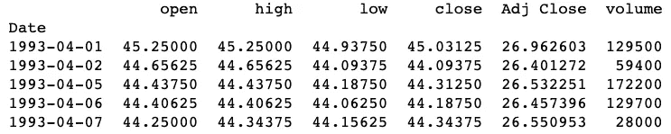
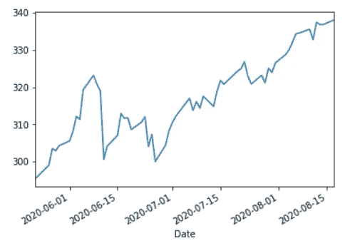
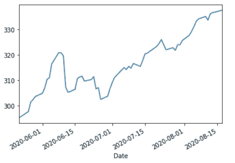
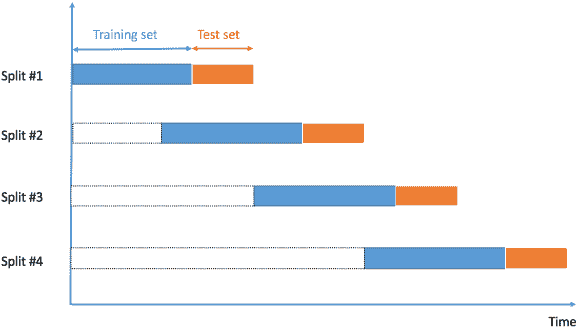
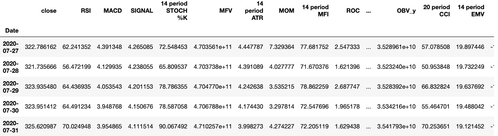

# 用 Python 和机器学习预测未来股市趋势

> 原文：<https://towardsdatascience.com/predicting-future-stock-market-trends-with-python-machine-learning-2bf3f1633b3c?source=collection_archive---------0----------------------->

## 利用集成建模和交叉验证准确预测股票市场趋势


***注来自《走向数据科学》的编辑:*** *虽然我们允许独立作者根据我们的* [*规则和指导方针*](/questions-96667b06af5) *发表文章，但我们不认可每个作者的贡献。你不应该在没有寻求专业建议的情况下依赖一个作者的作品。详见我们的* [*读者术语*](/readers-terms-b5d780a700a4) *。*

随着最近由于新冠肺炎疫情引起的股票市场的波动，我认为尝试和利用机器学习来预测股票市场的近期趋势是一个好主意。我对机器学习相当陌生，这是我的第一篇媒体文章，所以我认为这将是一个很好的开始和展示项目。

这篇文章讨论了关于数据科学的不同主题，即:数据收集和清理、特征工程，以及创建机器学习模型来进行预测。

> 注意:我之前在这篇文章的代码中使用了前瞻偏差，这产生了一些非常好的结果(非常好)。然而，它们是误导性的，我现在的目标是尝试用交叉验证来解决这个问题。

***作者声明:本项目非财务或投资建议。这并不能保证它在大多数情况下都能提供正确的结果。因此，你应该非常小心，不要把它作为交易洞察力的主要来源。***

> 你可以在我的 github 上的 jupyter 笔记本上找到所有代码:

[](https://github.com/lucasrea/StockForecast) [## Lucas rea/股票预测

### 此时您不能执行该操作。您已使用另一个标签页或窗口登录。您已在另一个选项卡中注销，或者…

github.com](https://github.com/lucasrea/StockForecast) 

# 1.导入和数据收集

首先，我们包括了这个项目使用的所有库。我使用 yfinance API 收集了所有的历史股票市场数据。它直接取自雅虎财经网站，所以是非常可靠的数据。

然后我们定义一些用于数据检索和数据处理的常数。带有指示符号的列表有助于为我们的模型生成更多特征。

这里有一个链接，你可以在这里找到这些功能的实际名称。

[](https://github.com/peerchemist/finta) [## 同行化学家/finta

### 熊猫实施的通用财务技术指标。这是正在进行的工作，错误是意料之中的，结果…

github.com](https://github.com/peerchemist/finta) 

现在我们从 yfinance 中提取历史数据。我们没有太多可以使用的特性——除非我们找到一种方法来至少规范化它们或者从它们派生出更多的特性，否则这些特性不是特别有用。



“关闭”列中的数据

# 2.数据处理和特征工程

我们看到上面的数据是粗略的，包含了大量的时间序列峰值。它不是很平滑，模型很难从中提取趋势。为了减少这种情况的出现，我们希望在计算技术指标之前指数平滑我们的数据。



来自“Close”的数据，但已被平滑

我们可以看到数据平滑了很多。当计算技术指标时，有许多波峰和波谷会使它难以近似，或者难以提取趋势。它会让模型失控。

现在是时候计算我们的技术指标了。如上所述，我使用 finta 库结合 python 内置的 eval 函数来快速计算指标列表中的所有指标。除了正常的成交量，我还计算了一些不同平均长度的均线。

我去掉了像“开盘”、“高”、“低”和“收盘调整”这样的栏，因为除了指标之外，我们还可以用均线得到足够好的近似值。成交量已经被证明与价格波动有相关性，这也是我将其归一化的原因。

```
Index(['close', 'RSI', 'MACD', 'SIGNAL', '14 period STOCH %K','MFV', '14 period ATR', 'MOM', '14 period MFI', 'ROC', 'OBV_x', 'OBV_y', '20 period CCI', '14 period EMV', 'VIm', 'VIp', 'ema50', 'ema21', 'ema14', 'ema5', 'normVol'], dtype='object')
```

就在我们收集预测之前，我决定保留一点数据来预测未来的值。这一行捕获了与 7 月 27 日这一周的 5 天相对应的 5 行。

```
live_pred_data = data.iloc[-16:-11]
```

现在是这个项目最重要的部分之一——计算真值。如果没有这些，我们甚至无法训练一个机器学习模型来进行预测。

我们如何获得真理价值？这很直观。如果我们想知道一只股票何时上涨或下跌(希望赚一百万美元！)我们只需要展望未来，观察价格，以决定我们现在是应该买入还是卖出。嗯，有了这些历史数据，这正是我们能做的。

回到我们最初提取数据的表格，如果我们想知道 1993 年 3 月 29 日当天(收盘价为 11.4375)的买入(1)或卖出(0)决定，我们只需要向前看 X 天，看看价格是高于还是低于 1993 年 3 月 29 日的价格。因此，如果我们向前看 1 天，我们会看到价格上升到 11.5。因此，1993 年 3 月 29 日的真实价值是买入(1)。

由于这也是数据处理的最后一步，我们删除了指标和预测生成的所有 NaN 值，并删除了“close”列。


因为我们使用了 Pandas 的 shift()函数，我们从数据集的末尾丢失了大约 15 行(这就是为什么我在这一步之前捕获了 7 月 27 日这一周)。


# 3.模型创建

在训练我们的模型之前，我们必须将数据分成训练集和测试集。然而，由于时间序列的性质，我们需要小心处理这部分。如果我们随机化我们的训练测试集，我们可能会遇到*前瞻偏差*，这对于预测股票市场是不利的。这是因为你用模型已经看过的数据训练它。

为了防止这种情况，我们将使用一种称为交叉验证的不同技术来训练该模型。下图说明了我们将如何划分数据并测试模型的准确性。



时间序列中交叉验证的滑动窗口方法

首先，我们将使用多个分类器来创建一个集成模型。这里的目标是结合几个模型的预测，尝试提高可预测性。对于每个子模型，我们还将使用 Sklearn 的一个特性 GridSearchCV 来优化每个模型，以获得最佳结果。

首先，我们创建随机森林模型。

然后是 KNN 模式。

最后，我们创建投票分类器

一旦我们建立了模型，我们就可以把它和交叉验证放在一起。我们从编写一些代码开始，这些代码将允许我们用许多大小均匀的块来迭代我们的数据。

打印出我们的数据帧的索引，我们已经成功地分割了我们的数据，就像在滑动窗口图像中一样。

```
10 50
20 60
30 70
40 80
50 90
60 100
.
.
.
6820 6860
6830 6870
```

现在我们添加代码，将分区分成训练集和测试集。在 *train_test_split* 函数中设置 *shuffle=False* 非常重要——这是避免前瞻偏差的方法。

最后，我们合并我们的模型。

这样的样本运行看起来像…结果被夸大了。

```
rf prediction is  [1\. 1\. 1\. 0\. 0\. 1\. 1\. 1\. 1\. 1\. 1\. 1.]
knn prediction is  [1\. 1\. 1\. 1\. 1\. 1\. 1\. 1\. 1\. 1\. 1\. 1.]
ensemble prediction is  [1\. 1\. 1\. 1\. 1\. 1\. 1\. 1\. 1\. 1\. 1\. 1.]
truth values are  [1\. 1\. 1\. 0\. 1\. 1\. 1\. 1\. 1\. 1\. 1\. 1.]0.9166666666666666 0.9166666666666666 0.9166666666666666
```

最后的结果给了我们

```
RF Accuracy = 0.6732649071358748
KNN Accuracy = 0.67460899315738
Ensemble Accuracy = 0.6925708699902248
```

我们可以看到，通过使用集合建模，我们获得了更高的精度。与不使用交叉验证相比，结果的准确性要低得多。然而，这是解决这个问题的更正确的方法……大约 70%的准确率也不错！

# 4.结果验证

下一步，我们将使用预测模型预测 S&P500 的行为。我在 8 月 17 日的周末写这篇文章。因此，为了看看这个模型是否能产生准确的结果，我将使用本周的收盘数据作为预测的“真实”值。由于这个模型被调整为 15 天的窗口，我们需要输入 7 月 27 日这一周的数据。

七月二十七日->八月十七日

七月二十八日->八月十八日

七月二十九日->八月十九日

七月三十日->八月二十日

7 月 31 日-> 8 月 21 日

我们保存了将要在 live_pred_data 中使用的周。

```
live_pred_data.head()
```



以下是我们将要进行预测的五个主要日期。看起来模型预测价格每天都会上涨。

让我们用实际结果来验证我们的预测。

```
del(live_pred_data['close'])
prediction = ensemble_model.predict(live_pred_data)
print(prediction)[1\. 1\. 1\. 1\. 1.]
```

结果

7 月 27 日:322.78 美元——8 月 17 日:337.91 美元

7 月 28 日:321.74 美元——8 月 18 日:338.64 美元

7 月 29 日:323.93 美元——8 月 19 日:337.23 美元

7 月 30 日:323.95 美元——8 月 20 日:338.28 美元

7 月 31 日:325.62 美元——8 月 21 日:339.48 美元

正如我们从实际结果中看到的，我们可以确认模型的所有预测都是正确的。然而，决定股票价格的因素有很多，所以说这个模型每次都会产生相似的结果是幼稚的。然而，在相对正常的时间段内(没有导致股票市场波动的重大恐慌)，该模型应该能够产生良好的结果。

# 5.摘要

总结一下我们在这个项目中所做的，

1.  我们已经收集了用于分析和特征创建的数据。
2.  我们已经使用熊猫来计算许多模型特征，并产生干净的数据来帮助我们进行机器学习。使用熊猫创建预测或真实值。
3.  利用交叉验证来避免前瞻偏差。训练许多机器学习模型，然后使用集成学习将它们结合起来，以产生更高的预测精度。
4.  确保我们的预测与真实世界的数据相符。

通过这个项目，我学到了很多关于数据科学和机器学习的知识，希望你也一样。作为我的第一篇文章，我喜欢任何形式的反馈来帮助提高我作为程序员和数据科学家的技能。

感谢阅读:)