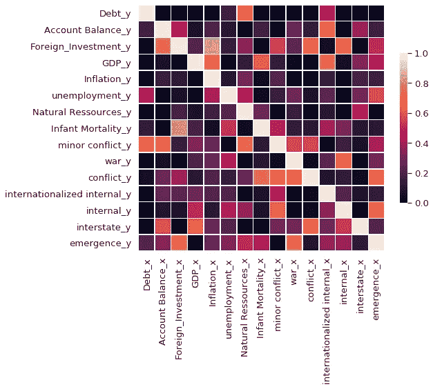
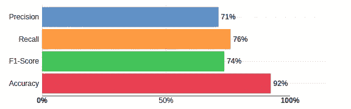
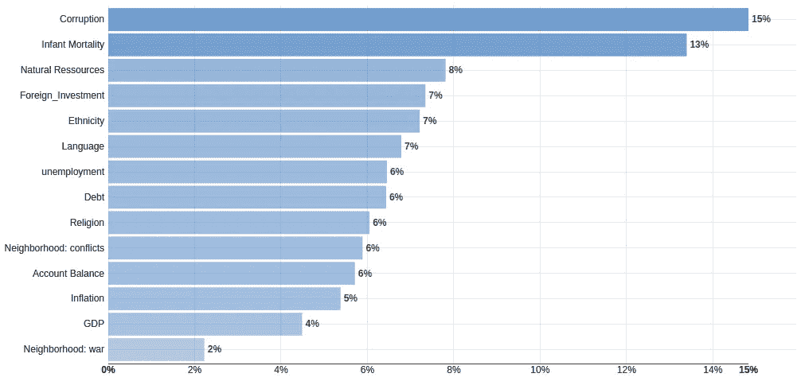
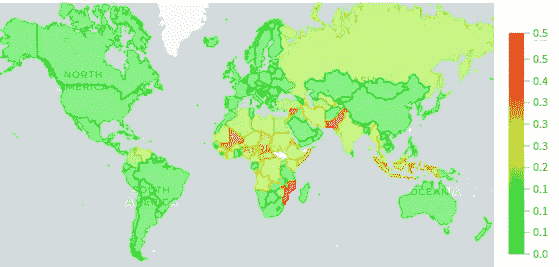
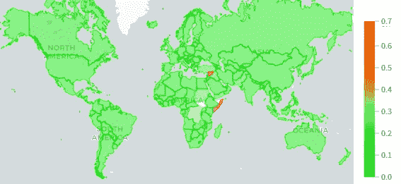

# 预测未来战争

> 原文：<https://towardsdatascience.com/predicting-future-wars-7764639f1d8d?source=collection_archive---------20----------------------->

在 [Unsplash](/s/photos/war?utm_source=unsplash&utm_medium=referral&utm_content=creditCopyText) 上由 [Stijn Swinnen](https://unsplash.com/@stijnswinnen?utm_source=unsplash&utm_medium=referral&utm_content=creditCopyText) 拍摄的照片。

## 来自开放数据和机器学习的见解

我知道你在想什么:战争是罕见而复杂的事件，人们不能指望考虑到它们的全部复杂性。你是对的，它们源于错综复杂的政治、经济和历史原因，但不要忘记厚厚的随机性外衣，因此应该谨慎对待。甚至政治专家也一直在争论是什么导致了冲突，有时是在事件发生几十年后。冲突可能是黑天鹅，本质上不可预测的改变游戏规则的事件(即使专家经常声称事后发现了明显的警告信号)。但这并不意味着我们不能通过使用机器学习来评估导致战争的氛围。

用经济指标来预测冲突并不是什么新想法，关于这个问题已经做了很多研究  。结果是有希望的，但他们使用给定年份的数据来预测同一年一个国家的状态，这有点违背直觉。如果你已经知道了国家的经济状况，那么为什么还需要“预测”它是否处于战争状态呢？信息已经有了。这迫使他们使用联合国等组织提供的预测来应用他们的模型。这使得他们的预测依赖于他们。在这里，只有过去和现在的数据被用来预测一个国家在不久的将来的状态。

## 使用的功能

为了将这些指标与冲突联系起来，使用了 UCDP/PRIO 武装冲突数据集  ，其中列出了 1946 年至 2018 年的所有武装冲突。根据冲突的致命程度和所反对的群体类型，冲突被分为不同的类型。就特征而言，采用了主要来自世界银行的年度时间序列形式的经济和社会指标。目标特征是通过增加表明一个国家在未来五年内是否会陷入冲突的变量而获得的。在这里，我们跳过预处理阶段，更详细的描述见[报告](https://github.com/chekirou/International-conflict-prediction/blob/master/Conflict_Prediction.pdf)。最终数据集包含 12 900 行(60 年* 215 个国家)。

## 分析因果关系

对于多变量时间序列，皮尔逊相关是不合适的，当前冲突状态可以是其他变量的过去值的函数。这就是应用格兰杰因果关系检验的原因。它决定了一个时间序列如何影响另一个时间序列。每年的汇总版本用于计算测试。

经济指标和冲突的格兰杰因果关系测量(X 影响 Y)。鸣谢:作者。

小冲突受到债务、账户余额和自然资源租金的强烈影响。总的来说，冲突受到婴儿死亡率的强烈影响，婴儿死亡率是贫困引发冲突的一个指标。国家间的冲突是由国内生产总值和账户余额引发的。外国直接投资与新冲突的爆发或出现之间也有着密切的联系。这些观察表明，经济是有影响的，但是经济的不同方面与不同类型的冲突有关。

## 模型

最好的结果不是通过特定于时间序列的模型(VAR 模型)获得的，而是通过将每个国家的每一年作为一个数据点。一个有 100 棵树并且最大深度为 15 的随机森林获得了如下所示的结果。

随机森林模型的结果:准确率为 92%，F1 值为 74%，精确度为 71%，召回率为 76%。鸣谢:作者。

用于区分的特征如下所示。

根据辨别能力对每个特征进行排序。鸣谢:作者。

对该模型最有影响的特征是腐败、婴儿死亡率和自然资源租金。这意味着该模型的预测基于政权类型(腐败)、贫困(婴儿死亡率)和对资源的依赖(自然资源)。

## 预言

最后，有趣的部分是，最近几年(2018 年和 2019 年)的数据被输入到模型中，以查看世界上哪个国家将在未来五年(2019 年至 2024 年)陷入新的冲突。结果如下图所示。

我们的模型给出的每个国家在 2019-2024 年经历新冲突的概率。鸣谢:作者。

许多更有可能面临新冲突的国家已经经历了动荡。但像巴基斯坦、印尼这些相对稳定的国家，近期爆发新冲突的概率很大。伊朗最近因制裁和最近的政治气氛而承受巨大压力，与其他国家相比，它也很有可能陷入新的冲突。

如果只考虑主要的冲突，即战争，我们会得到这些预测。

我们的模型给出的每个国家在 2019-2024 年面临新的重大冲突的概率。鸣谢:作者。

在这种情况下，只有叙利亚和索马里这两个已经处于非常不稳定状态的国家很有可能在未来几年面临新的战争。

尽管战争远不是一个确定性的系统，但机器学习是评估一个国家历史上关键时期的有用工具。

完整的项目可以在这里访问[。](https://github.com/chekirou/International-conflict-prediction)