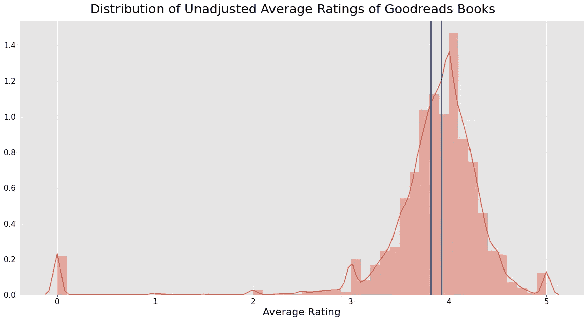
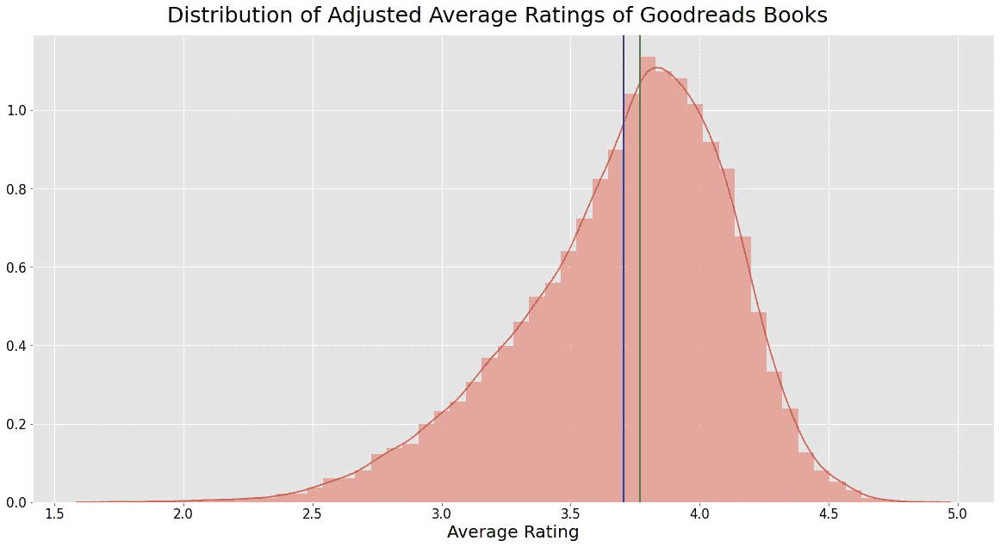
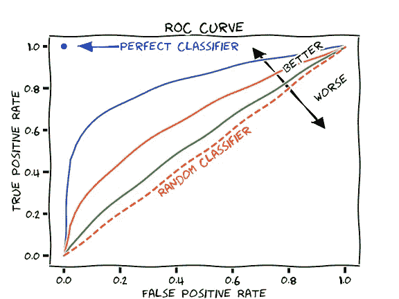
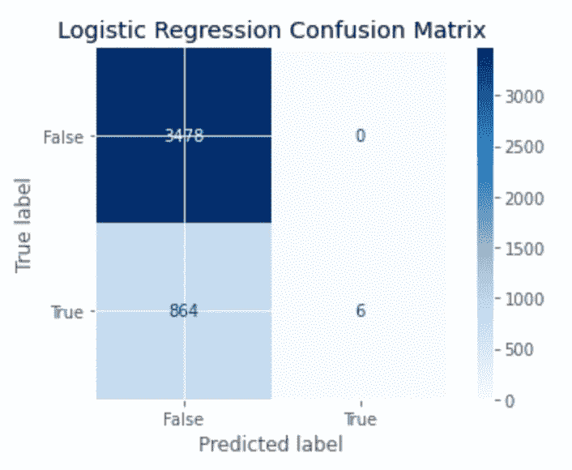
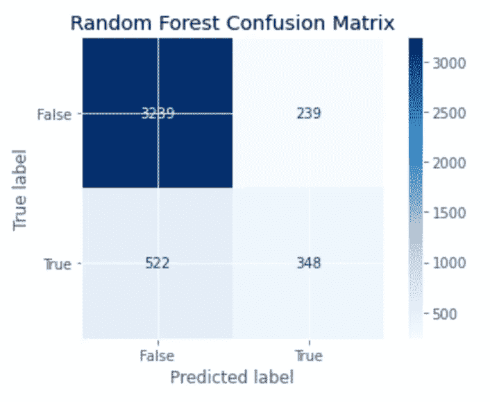
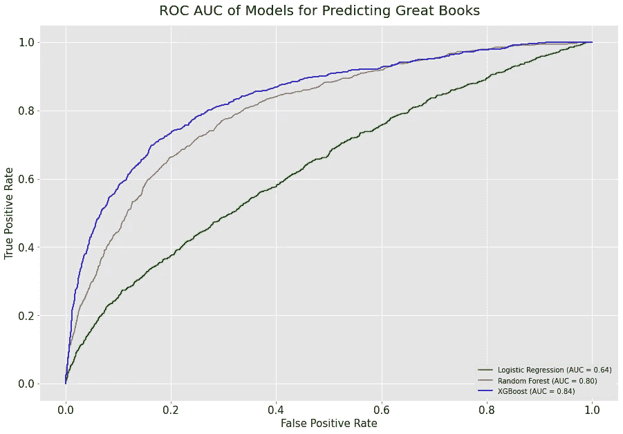
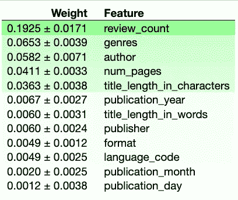

# 从好书到名著

> 原文：<https://towardsdatascience.com/predicting-great-books-from-goodreads-data-using-python-1d378e7ef926?source=collection_archive---------38----------------------->

## 使用 python 来预测是什么让书籍变得伟大


[艾德·罗伯森](https://unsplash.com/@eddrobertson?utm_source=medium&utm_medium=referral)在 [Unsplash](https://unsplash.com?utm_source=medium&utm_medium=referral) 拍的旧书照片

# 什么

这是 2020 年 7 月 30 日从 Goodreads 的 API 中提取的前 50，000 个图书 id 的数据集。几千个 id 没有通过，因为图书 id 被更改，URL 或 API 被破坏，或者信息以非典型格式存储。

# 为什么

从读者的角度来看，书籍是一种多小时的学习和休闲的承诺(他们不会称之为**好的**免费阅读)。从作者和出版商的角度来看，书是一种生活方式(也有一些学习和休闲)。在这两种情况下，知道哪些因素解释和预测伟大的书籍将节省您的时间和金钱。因为虽然不同的人有不同的品味和价值观，但了解一本书的总体评价是一个明智的起点。你可以随时更新它。

# 环境

在虚拟环境中工作是很好的实践，一个有自己的库和版本的沙箱，所以我们将为这个项目制作一个。有几种方法可以做到这一点，但是我们将使用 [Anaconda](https://www.anaconda.com/products/individual) 。要使用 Python 3.7 创建并激活名为“gr”(Goodreads)的 Anaconda 虚拟环境，请在您的终端或命令行中运行以下命令:

# 装置

您应该在提示符的左侧看到“gr”或您命名的环境。如果是这样，请运行以下命令。Anaconda 将自动安装这些包的任何依赖项，包括 matplotlib、numpy、pandas 和 scikit-learn。

# 进口

# 数据收集

我们使用由 Michelle D. Zhang (代码和文档[在这里](https://github.com/mdzhang/goodreads-api-client-python))制作的 Goodreads API 的轻量级包装器提取前 50，000 个图书 id 及其相关信息，然后将每个 id 作为字典写入名为`book_data`的 JSON 文件。

# 数据清理

我们将在下面定义和描述一些关键函数，但是我们稍后将在一个大的 wrangle 函数中运行它们。

## **威尔逊下界**

基于 20 条评论的 4 星评价和基于 20000 条评论的 4 星评价是不相等的。基于更多评论的评级具有较少的不确定性，因此是对“真实”评级的更可靠的估计。为了正确定义和预测伟大的著作，我们必须通过惩罚不确定性来改变`average_rating`。

我们将通过计算[威尔逊下限](https://www.evanmiller.org/how-not-to-sort-by-average-rating.html)来实现这一点，其中我们估计特定评级的置信区间，并将其下限作为新的评级。基于数万条评论的评级几乎不会受到影响，因为它们的置信区间很窄。然而，基于更少评论的评级具有更宽的置信区间，并且将被降低更多。

**注**:我们修改了公式，因为我们的数据是从 5 分制计算的，而不是 Wilson 描述的二进制。具体来说，我们将`average_rating`减 1，作为真实非膨胀评级的保守估计，然后将其归一化。如果这个惩罚太重或太轻，随着时间的推移，更多的评级将分别提高或降低该书的评级。换句话说，随着更多的信息，这种调整是自我纠正的。

## **流派**

Goodreads 的 API 返回了“书架”,它包含了像“科幻小说”这样的真实类型和像“阅读”这样的用户创建的类别。在提取数据时，我们只提取了 5 个最受欢迎的货架，以限制这种清理；在这里，我们会完成任务。

经过一些检查，我们看到这些子串代表了非流派书架的主体。我们将使用正则表达式过滤掉它们。**注意**:我们在正则表达式中使用了两个字符串，所以这一行不会被切断。圆括号内的相邻字符串在编译时连接在一起。

## **多功能一体清洗**

现在，我们将构建并运行一个函数来处理数据集。这样，清理更具可重复性和可调试性。

## **比较未调整和调整后的平均评分**

从数字上看，平均值(蓝色)和中值(绿色)趋势的中心度量值略有下降，方差显著下降。

视觉上，我们可以看到评级调整在更平滑和更宽的分布中(尽管注意 x 轴被截断)。这是因为消除了没有评级或评级很少的异常书籍，并缩小了具有高度不确定性的评级。



*作者图片*

```
Unadjusted mean: 3.82
Unadjusted median: 3.93
Unadjusted variance: 0.48
```



*作者图片*

```
Adjusted mean: 3.71
Adjusted median: 3.77
Adjusted variance: 0.17
```

# 数据泄露

因为我们的目标来源于评级，使用评级来训练我们的模型*实际上是用目标来训练。为了避免扭曲模型，我们必须删除这些列。*

也有可能`review_count`有点漏，但它似乎更像是*流行度*的代理，而不是伟大，就像流行(ular)歌曲通常不被认为是经典一样。当然，如果它的排列重要性高得可疑，我们会重新考虑这个问题。

# 分割数据

我们将进行 85/15 的训练测试分割，然后重新分割我们的训练集，使验证集与测试集的大小大致相同。

```
(20281, 12) (20281,) (4348, 12) (4348,) (4347, 12) (4347,)
```

# 评估指标

对于这种不平衡的分类，准确性(正确预测/总预测)可能会产生误导。对于这个分数来说，没有足够的真阳性作为模型性能的最佳度量。因此，我们还将使用 ROC AUC，曲线下的受试者操作者特征面积。这是一张彩图，由马丁·托马斯提供。



Martin Thoma 绘制的 XKCD 风格的 ROC AUC 图，在[知识共享](https://en.wikipedia.org/wiki/en:Creative_Commons) [CC0 1.0 通用公共领域专用](https://creativecommons.org/publicdomain/zero/1.0/deed.en)下提供

ROC 曲线是分类模型的真阳性率(TPR)与其假阳性率(FPR)的关系图。ROC AUC 是从[0，1]到该曲线右下方的面积。因为最佳模型性能使真阳性最大化，假阳性最小化，所以这个 1x1 图中的最佳点在左上角，曲线下面积(ROC AUC) = 1。

对于像`great`这样的不平衡类，ROC AUC 作为一个指标优于准确性，因为它更好地反映了真阳性和假阳性之间的关系。它还描述了分类器在其所有值上的性能，为我们提供了更多关于模型何时何地改善、停滞或受损的信息。

# 适合模型

预测名著是一个二元分类问题，所以我们需要一个分类器。下面，我们将对一个线性模型(逻辑回归)和两个基于树的模型(随机森林和 XGBoost)进行编码、估算和拟合，然后将它们相互比较并与多数基线进行比较。我们将计算它们的准确性和 ROC AUC，然后进行可视化。

## 多数类基线

首先，从结构上来看，`great`的书是 Wilson 调整后排名前 20%的书。这意味着我们的多数类基线(*没有*书是伟大的)有 80%的准确性。

第二，这个“模型”不会改进、停滞或受损，因为它从一开始就没有洞察力。随机选择的阳性和随机选择的阴性将被同等对待。在其他研究中，其 ROC AUC = 0.5。

```
Baseline Validation Accuracy: 0.8
Baseline Validation ROC AUC: 0.5
```

## 逻辑回归

现在，我们将使用交叉验证拟合线性模型，重新计算评估指标，并绘制混淆矩阵。

```
Baseline Validation Accuracy: 0.8
Logistic Regression Validation Accuracy: 0.8013
Baseline Validation ROC AUC: 0.5
Logistic Regression Validation ROC AUC: 0.6424
```

## **逻辑回归混淆矩阵**



作者图片

## 随机森林分类器

现在我们将使用基于树的模型和 bagging 做同样的事情(**B**ootstrap**AGG**regation)。

```
Baseline Validation Accuracy: 0.8
Logistic Regression Validation Accuracy: 0.8013
Random Forest Validation Accuracy: 0.8222

Majority Class Baseline ROC AUC: 0.5
Logistic Regression Validation ROC AUC: 0.6424
Random Forest Validation ROC AUC: 0.8015
```

## 随机森林混淆矩阵



作者图片

## XGBoost 分类器

现在，我们将使用另一个基于树的模型做同样的事情，这次使用 boosting。

```
Baseline Validation Accuracy: 0.8
Logistic Regression Validation Accuracy: 0.8013
Random Forest Validation Accuracy: 0.8245
XGBoost Validation Accuracy: 0.8427

Majority Class Baseline ROC AUC: 0.5
Logistic Regression Validation ROC AUC: 0.6424
Random Forest Validation ROC AUC: 0.8011
XGBoost Validation ROC AUC 0.84
```

XGBClassifier 在准确性和 ROC AUC 方面表现最佳。

# 绘制并比较模型的 ROC AUC

下面，我们看到逻辑回归在获得高 ROC AUC 方面远远落后于 XGBoost 和 Random Forests。在前两者中，XGBoost 最初优于 RandomForest，然后两者大致收敛在 FPR=0.6 左右。然而，我们在右下方的图例中看到，XGBoost 的 AUC 最高，为 0.84，其次是随机森林，为 0.80，逻辑回归为 0.64。

用不太专业的语言来说，XGBoost 模型最擅长将好书归类为好书(真阳性)，而不将不太好的书归类为好书(假阳性)。



作者图片

# 排列重要性

一个直观的识别某样东西是否重要以及重要到什么程度的方法是看当你拿走它时会发生什么。在不受时间和金钱约束的情况下，这是最好的。

但是在有实际约束的现实世界中，我们可以用置换来代替。我们不是通过删除列值来消除它们，而是通过随机化来消除列的*信号*。如果该列真的是一个预测特性，那么它的值的顺序就很重要，如果不破坏关系的话，将它们移动会大大削弱关系。因此，如果特征的预测能力*没有真正受到伤害，或者随机化甚至有所帮助，我们可以得出结论，它实际上并不重要。*

让我们仔细看看 XGBoost 模型的排列重要性。我们将不得不改装它以与 eli5 兼容。

## 排列重要性分析



作者图片

正如我们在开始时假设的那样，`review_count`很重要，但并没有高到令人怀疑的程度。这似乎没有上升到数据泄露的程度。这意味着，如果你想知道下一本书该读什么，一个有用的指标是它有多少评论，代表有多少人读过它。

我们看到`genres`是 XGBoost 模型中 ROC AUC 的第二个最重要的特征。

`author`排在第三，这令人惊讶，或许也有点令人担忧。因为我们的测试集并不大，这个模型可能只是识别出按 Wilson-adjusted 术语评价最高的作者，比如 J.K .罗琳和苏珊·科林斯。更多的数据将有助于检验这一理论。

第四个是`num_pages`。我认为这个数字会更高，原因有二:

1.  很长的书的评分似乎有一点向上的倾向，因为愿意开始和完成它们的人会给它们更高的评分。冗长的篇幅筛选掉了不太感兴趣的边缘读者，他们可能一开始就不会给这本书很高的评价。
2.  阅读并炫耀你正在阅读或已经阅读了长篇大论是社会地位高的标志。典型的例子:无限的玩笑。

# 外卖食品

我们已经看到了如何收集、清理、分析、可视化和建模数据。一些可操作的要点是，什么时候和谁出版一本书并不重要，但它的评论数很重要——评论越多越好。

为了进一步分析，我们可以分解`genres`和`authors`来找出哪些被评为最高。现在，快乐阅读。