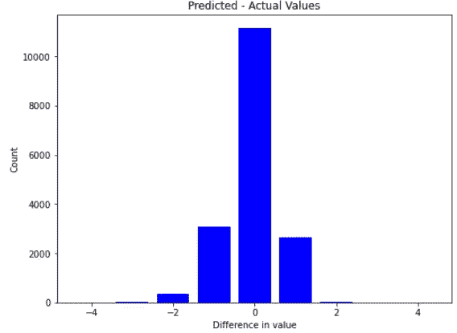

# 用随机森林预测幸福

> 原文：<https://towardsdatascience.com/predicting-happiness-using-random-forest-1e6477affc24?source=collection_archive---------51----------------------->

## 使用机器学习探索影响人们幸福水平的因素


迈克·彼得鲁奇在 [Unsplash](https://unsplash.com/@mikepetrucci?utm_source=unsplash&utm_medium=referral&utm_content=creditCopyText) 上的照片

为什么我们试图预测幸福？能够预测幸福意味着我们能够操纵或试图改善某些因素，以增加我们自己的幸福，也可能增加政府的国民幸福。我发现随机森林(RF)是最简单和最有效的软件包，所以让我们开始吧！

## 内容:

1.  数据
2.  随机森林模型
3.  数据清理
4.  培训和测试
5.  特征重要性
6.  修改变量的数量
7.  评估模型

## **数据:**

从 [#WorldValuesSurvey](http://www.worldvaluessurvey.org/WVSDocumentationWV7.jsp) 获得的数据包含了> 290 个问题&在去除了缺失的幸福水平数据后，由大约 69k 个回答组成。是跨年度的跨国调查，问卷可以在网站上找到。特别是，我们将关注 2017 年至 2020 年的数据集。数据集的大小使其成为机器学习的最佳选择。

## **随机森林模型:**

首先，我们将使用 RF 分类器*，因为我们希望机器能够预测群体的幸福水平(非常幸福、相当幸福、不太幸福、一点也不幸福)。

```
import pandas as pd
import numpy as np
import matplotlib.pyplot as plt
from sklearn.ensemble import RandomForestClassifier
from sklearn.model_selection import train_test_split
from sklearn import metrics
```

## **数据清理:选择数据**

让我们先从问题栏开始，去掉 Q46 关于幸福水平的回答中的负值。

```
var="Q46"
df=df[df.columns[32:349]]
df=df[df[var]>0]
```

**负值表示受访者表示不知道、没有答案、没有被问到或回答缺失。这些值将使机器更难对它们进行分类，因为它增加了类别的数量，而不是我们所寻找的。*

剩余的数据集如下所示:


## **进一步的数据清理:**

下一个问题是，我们必须处理其他列中缺失的值。有 3 个选项可供考虑:

1.  用 0 替换丢失的值
2.  用平均值替换缺失的值
3.  删除缺少值的行(数据集变为空)。

由于第三个选项不可行，我们必须检查选项 1 或 2 中哪一个会给出最高的精度。在这种情况下，我发现用 0 替换会更准确。

```
df.fillna(0, inplace=True)
```

## **准备列车标签:**

现在，我们为机器设置“标签”,以识别我希望它预测的特征，并将数据分为训练集和测试集。

```
train_labels = pd.DataFrame(df[var])
train_labels = np.array(df[var])
train_features= df.drop(var, axis = 1)
feature_list = list(train_features.columns)
train_features = np.array(train_features)
train_features, test_features, train_labels, test_labels = train_test_split(train_features, train_labels, test_size = 0.25, random_state = 42)
```

## **训练并测试模型:**

培训和测试的过程很简单。为了提高预测能力和/或模型速度，我们可以简单地修改 RF 分类器中的参数。

## **增加精度:**

n_estimators —多数表决前算法构建的树的数量

max _ features 随机森林考虑分割节点的最大要素数

min _ sample _ leaf 分割内部节点所需的最小叶子数。

## **增加速度:**

n_jobs —允许使用的处理器数量。如果= 1，只使用一个处理器。If =-1，无限制

random _ state 使模型的输出可复制，即给定相同的超参数和训练数据，总是产生相同的结果

oob_score:随机森林交叉验证方法

```
rf=RandomForestClassifier(n_estimators = 1000, oob_score = True, n_jobs = -1,random_state =42,max_features = “auto”, min_samples_leaf = 12)
rf.fit(train_features, train_labels)
predictions = rf.predict(test_features)
print(metrics.accuracy_score(test_labels, predictions))
```

该模型需要 1.3 分钟来训练~52k 训练行和> 290 列，并需要 1 秒来测试。准确率为 **63.70%** 。如果我们选择用平均值**来填充缺失值**，精确度将是 **63.55%** 。但重要的是找出是什么影响了机器的预测，因为这些是我们想要研究的变量。我们当然不能指望每个人都回答 290 多个问题，或者试图在所有 290 个方面努力提高幸福感(这将花费很多)。因此，我们将着眼于特性的重要性。

## **特性重要性:**

如果您还记得，feature_list 包含除 Q46 之外的所有其他变量的列。目标是了解影响预测的变量。

```
importances = list(rf.feature_importances_)
feature_importances = [(feature, round(importance, 2)) for feature, importance in zip(feature_list, importances)]
feature_importances = sorted(feature_importances, key = lambda x: x[1], reverse = True)
[print('Variable: {:20} Importance: {}'.format(*pair)) for pair in feature_importances]
x_values = list(range(len(importances)))# Make a bar chart
plt.bar(x_values, importances, orientation = 'vertical', color = 'r', edgecolor = 'k', linewidth = 1.2)
# Tick labels for x axis
plt.xticks(x_values, feature_list, rotation='vertical')
# Axis labels and title
plt.ylabel('Importance'); plt.xlabel('Variable'); plt.title('Variable Importances');
```


特征重要性总和为 1，我们注意到，与其他变量相比，某些变量对预测的影响更大，几乎每个变量都有某种形式的影响，尽管由于变量太多而非常小。接下来的事情是继续改进我们的模型，让我们更好地理解幸福。

## **修改变量数量:**

让我们来看看前 20 个特征，并用这 20 个变量(+ var 本身)建立一个新模型。我们将重复数据清理和相同的 RF 模型。我得到了 **64.47%的准确率。**如果我们选择用平均值替换缺失值，则精确度将为 **64.41%** 。这里令人惊讶的是，随着变量数量的减少，模型变得更加精确(从 **63.70%** 到 **64.47%** )。这可能是因为其他变量在模型中产生噪声，导致模型不太准确。

## **让我们再来看看特性的重要性:**

这一次，可以更清楚地看出哪些变量更重要。你可以参考 WVS 网站上的调查问卷了解更多详细信息。我将总结一下这些问题所涉及的主题。


## **评估模型:**

让我们看看前 200 个测试值的实际值与预测值的图表。为了更好地了解整个测试集，让我们简单地计算一下预测值和实际值之间的差异(预测值减去实际值)。



该模型在预测幸福水平方面似乎是消极的多于积极的，但在其他方面仍然被认为是平衡的！

## **感悟:**

我所做的是检查 WVS 中 290 多个与幸福水平更相关的关键问题。这将意味着我们在研究幸福时可以试着特别关注这些方面。

在调查问卷中，我们还会注意到 Q261 和 Q262 是同一个东西(年龄和出生年份)，因此我们可以删除其中一个以包含另一个特征。对于问题 266，267，268(回答者和父母的出生国)，它们似乎是重复的，但并不完全相同，因为移民/跨文化婚姻可能会发生。尽管如此，我们可以考虑删除其中两个，因为这种情况很少发生。

## **一般话题有:**

**个人层面:**
生活满意度、健康、财务、自由、年龄、安全、宗教、婚姻、家庭。
**国家层面:**
国家、对腐败的看法、民主/政治影响力、民族自豪感

特别是，健康、财务和年龄是机器认为最重要的特征。从这个意义上说，个人层面的因素比国家层面的因素对一个人的幸福水平有更大的影响。

然而，我注意到 WVS 没有关于睡眠时间的数据，这是我在之前的文章中观察到的一个关键因素。尽管如此，它仍然非常有用，因为我们可以考虑这些方面进行进一步的分析！我会带着对这些方面和幸福之间的相关性的更多见解回来，以确定我们如何才能提高我们的幸福水平。在那之前，记得保持快乐！