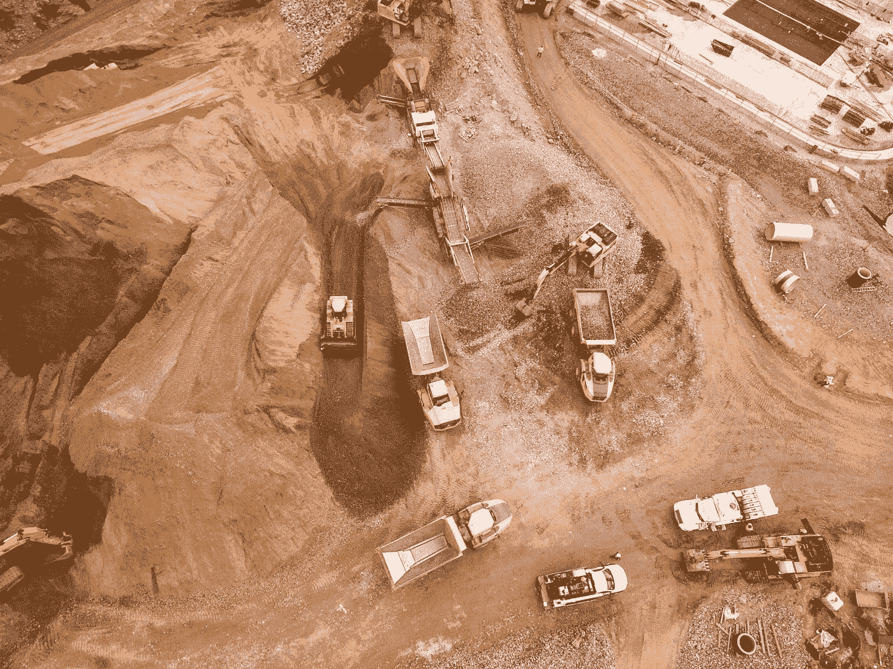
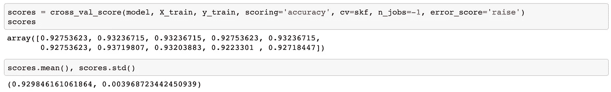
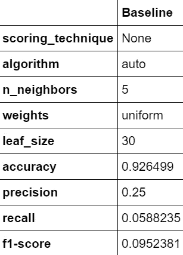
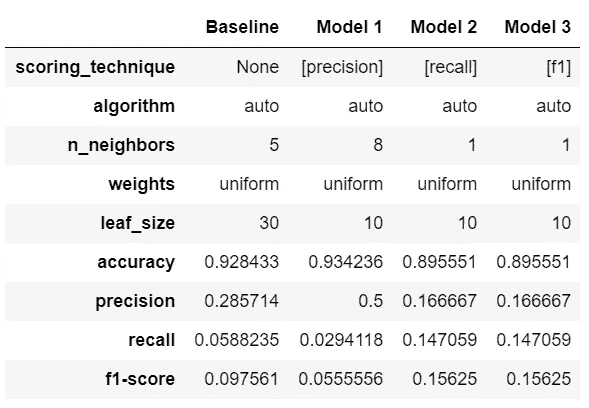
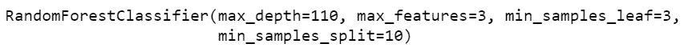
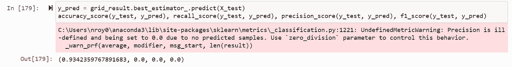
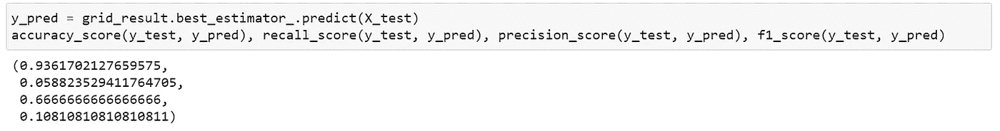
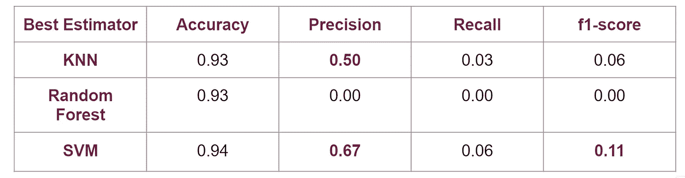

# 预测危险的地震颠簸第二部分:训练和调整监督最大似然分类器和模型性能分析

> 原文：<https://towardsdatascience.com/predicting-hazardous-seismic-bumps-part-ii-training-supervised-classifier-models-and-8b9104b611b0?source=collection_archive---------43----------------------->

## 本文演示了使用不同的监督分类器预测危险的地震颠簸、调整模型超参数、准确性悖论以及理解“业务问题”对性能评估的重要性



肖恩·麦克伦登在 [Unsplash](https://unsplash.com?utm_source=medium&utm_medium=referral) 上的照片

# 介绍

在我的[上一篇文章](/predicting-hazardous-seismic-bumps-using-supervised-classification-algorithms-part-i-2c5d21f379bc)中，关于来自 UCI 数据档案库的地震颠簸数据集，我应用了特征工程的基本数据分析技术和不平衡数据集的测试序列分割策略。在本文中，我展示了如何应用监督机器学习算法(KNN、随机森林和 SVM)进行预测，并调整超参数(使用 GridSearchCV)以获得最佳结果。性能评估的结果也清楚地展示了**准确性悖论**，我将在下面的章节中详细阐述。此外，它还展示了**为什么理解“业务问题”对于选择最佳模式至关重要**。

完整的笔记本可以在我的 [GitHub 库](https://github.com/royn5618)中找到


照片由[丹妮尔·麦金尼斯](https://unsplash.com/@dsmacinnes?utm_source=medium&utm_medium=referral)在 [Unsplash](https://unsplash.com?utm_source=medium&utm_medium=referral) 上拍摄

# 我从…

创建一个文件夹来保存我的模型。将多种算法用于数据时，最好在训练和调整后保存模型。为此，我使用 [datetime python 模块](https://docs.python.org/3/library/datetime.html)创建了一个文件夹。

```
**import** **datetime****def** model_store_location():
    **return** "model-store-**{}**".format(datetime.date.today())model_store_location = model_store_location()
print(model_store_location)!mkdir {model_store_location}
```

每个性能最好的模型都将存储在该文件夹中。

# 接下来，我建立了一个基线

这是一个二元分类任务，我选择了最简单的分类模型，K-最近邻(KNN)来开始预测建模。KNN 是最简单的分类器之一，它基于前 K 个相似的可见实例中标签的最大数量来将标签分配给不可见实例。

为了改进模型，需要一个基线，随后的模型将与该基线进行比较。因此，它被称为“*基线模型*”。因此，对于基线模型，我使用默认参数初始化了 KNN 分类器:

```
model = KNeighborsClassifier()
```

接下来，我首先检查了性能，使用 10 次分割的 StratifiedKFold，保持评分标准“准确性”。

```
skf = StratifiedKFold(n_splits=10)
```



作者图片

对于所有的折叠，精确度在 0.92 到 0.93 之间，并且数值的接近性通过分数的标准偏差来显示。

这里的准确率真的很高。现在，让我们在训练数据中拟合模型，并检查模型的性能—

```
model.fit(X_train, y_train)
y_pred = model.predict(X_test)
```

我添加了一个数据框来保存每个模型的超参数和性能，如下所示:

```
df_results = pd.DataFrame(index = ['scoring_technique', 
                                   'algorithm', 'n_neighbors',
                                   'weights', 'leaf_size', 
                                   'accuracy', 'precision', 
                                   'recall', 'f1-score'])
```

并添加了我的基线模型的性能:

```
**from** **sklearn.metrics** **import** accuracy_score, precision_score, recall_score, f1_scoredf_results['Baseline'] = ['None', model.algorithm,
                          model.n_neighbors, 
                          model.weights, 
                          model.leaf_size,
                          accuracy_score(y_test, y_pred), 
                          precision_score(y_test, y_pred), 
                          recall_score(y_test, y_pred), 
                          f1_score(y_test, y_pred)]
```



*作者图片*

这就是 KNN 的表演看起来超越了准确性。这是一个典型的**准确性悖论**的例子。由于大多数地震凸起是无危险的，因此真负值(TN)比 TP、FP 和 FN 的总和要大得多， ***从而在数字上提高了准确性，并创造了预测正确的假象*** ，但正如精度和召回率所示，危险地震凸起识别率低于 30%。

***二元分类性能指标—***

**= TP+TN/(TP+FP+TN+FN)**

****精度*** *= TP / (TP + FP)**

****回忆*** *= TP / (TP + FN)**

****F1-Score****= 2 * Precision x Recall/(Precision+Recall)= 2TP/(2TP+FP+FN)**

*因此，基于基线性能度量，只有 25%的预测危险隆起是正确的，只有 5%的实际危险地震隆起被模型正确识别。93%的数据实际上包含无危险的地震隆起，因此`cross_val_score` 中的精确数字是有意义的，也在 93%左右。*

*然而，正如您所看到的，精确度和召回率都受到了影响，让我们看看如何使用`GridSearchCV`来调优超参数*

# *GridSearchCV 用于调整 KNN 超参数*

**

*马库斯·温克勒在 [Unsplash](https://unsplash.com?utm_source=medium&utm_medium=referral) 上拍摄的照片*

*[GridSearchCV](https://scikit-learn.org/stable/modules/generated/sklearn.model_selection.GridSearchCV.html) 是一个函数，它接受超参数的可能值或范围，运行指定的超参数值的所有组合，并根据提到的评分标准计算性能。这个评分标准应该基本上与业务价值或您的目标一致。*

*要查看提供了哪些评分标准，此代码有助于:*

```
***import** **sklearn**
sorted(sklearn.metrics.SCORERS.keys())*
```

*该代码将生成可用评分方法的完整列表。*

*接下来，我为 KNN 定义了超参数，如下面的代码所示，并创建了一个名为`param_grid` 的字典，其中包含 KNN 超参数的参数，如 [Scikit-Learns 关于 KNN 的文档](https://scikit-learn.org/stable/modules/generated/sklearn.neighbors.KNeighborsClassifier.html)中所定义的键，而值包含相应的值列表。*

```
*n_neighbors = [1, 2, 3, 4, 5] 
weights = ['uniform', 'distance'] 
algorithm = ['ball_tree', 'kd_tree', 'brute'] 
leaf_size = [10, 20, 30 , 40, 50]  #param_grid = dict(n_neighbors=n_neighbors, 
                  weights=weights, 
                  algorithm=algorithm, 
                  leaf_size=leaf_size)*
```

*接下来，我使用模型、最佳超参数搜索的网格、交叉验证类型、作为精度的评分度量来初始化 GridSearchCV，并且我还使用了`refit`参数来确保最佳评估的估计值作为`best_estimator_`可用，这是当训练集可用于进行预测时的拟合模型。`Verbose`决定您希望在屏幕上显示多少日志信息。*

```
*grid = GridSearchCV(estimator=model, 
                    param_grid=param_grid, 
                    cv=StratifiedKFold(shuffle=**True**), 
                    scoring=['precision'],
                    refit='precision',
                    verbose=10)*
```

*我调用 fit 方法来启动超参数调优过程。*

```
*grid_result = grid.fit(X_train, y_train)*
```

*基本上，`grid_result`包含了所有的输出，从拟合时间到个人得分，以及基于传递的参数评估的最佳模型。`grid_result.best_estimator_`包含最佳拟合模型的超参数的选定值，根据评分标准进行优化。*

*我试验了不同的`scoring`*

***型号 1 —** `scoring`:精度*

***型号 2 —** `scoring`:召回*

***型号 3 —** `scoring` : f1*

*以下是模型性能的总结:*

**

**作者图片**

*如果您在此网格中注意到，每个模型的评分指标的最佳可能结果属于在整个网格中指定的相应`scoring`指标，即，当参数为“precision”时，任何其他模型的“precision”性能都不如模型 1。同样，对于“召回”，网格中的最佳由模型 2 和模型 3 共享。其实他们的表现是一样的。*

*在模型 1 中，其精度为 50%，即 50%的预测的危险地震颠簸是正确的，有可能评论说该模型只不过是掷硬币。但是抛硬币是公平的，而我们的数据集却不是，它是一个不平衡的数据集。在一次公平的掷硬币中，正面和反面同样可能发生，但是对于这个数据集，危险的和非危险的地震颠簸不会发生。*

*在模型 2 和模型 3 中，召回率最高，可以解释为正确识别的实际危险地震碰撞的 14%。精度也是 16%。f1 的成绩远远好于 Model 1，相当不错。模型 1 的低 f1 分数是因为 2%的不良回忆，这意味着该模型只能预测实际危险地震颠簸的 2%,这是 *no bu* eno。*

# *随机森林分类器能赢得这场挑战吗？*

**

*由[卢卡·布拉沃](https://unsplash.com/@lucabravo?utm_source=medium&utm_medium=referral)在 [Unsplash](https://unsplash.com?utm_source=medium&utm_medium=referral) 上拍摄*

*我选择的下一个模型是随机森林分类器，竞赛获奖的 ML 模型。这是一个健壮的 ML 模型，其中构建了多个决策树来集成它们的输出。最终预测是所有单个决策树预测的函数。这就是随机森林模型表现更好的原因。*

*我从初始化随机森林分类器开始:*

```
*from sklearn.ensemble import RandomForestClassifier
model = RandomForestClassifier()*
```

*接下来，我构建了一个网格来寻找最合适的参数:*

```
*param_grid = {
 ‘bootstrap’: [True],
 ‘max_depth’: [80, 90, 100, 110],
 ‘max_features’: [2, 3, 4],
 ‘min_samples_leaf’: [3, 4, 5, 6],
 ‘min_samples_split’: [8, 10, 12],
 ‘n_estimators’: [100, 200, 300, 500]
}*
```

*我还再次为“得分”选择了“精确度”。以下是完整的代码:*

```
*from sklearn.ensemble import RandomForestClassifier
model = RandomForestClassifier()param_grid = {
 ‘bootstrap’: [True],
 ‘max_depth’: [80, 90, 100, 110],
 ‘max_features’: [2, 3, 4],
 ‘min_samples_leaf’: [3, 4, 5, 6],
 ‘min_samples_split’: [8, 10, 12],
 ‘n_estimators’: [100, 200, 300, 500]
}grid = GridSearchCV(estimator=model, 
                    param_grid=param_grid, 
                    cv=StratifiedKFold(shuffle=True), 
                    scoring=['precision'],
                    refit='precision',
                    verbose=10)
grid_result = grid.fit(X_train, y_train)file_name = 'seismic_bump_rf_model.sav'
joblib.dump(model, model_store_location + file_name)print(grid_result.best_estimator_)*
```

*由此得出的模型是—*

**

*然而，在预测测试集时，精度为零。*

**

**作者图片**

# *训练和调整支持向量机*

*由于随机森林模型真的让我失望，我想到了使用支持向量机(SVM)。支持向量机属于分类算法的*核方法*组，用于拟合决策边界。分类基于决策边界的哪一侧是数据点。*

*支持向量机的计算开销很大，可以通过以下网格搜索设置进行演示:*

```
*from sklearn.svm import SVC 
model = SVC()param_grid1 = {'C': [0.1, 1, 10, 100, 1000],  
              'gamma': [1, 0.1, 0.01, 0.001, 0.0001], 
              'kernel': [ 'linear', 'poly', 'rbf', 'sigmoid']}*
```

*安装这个网格花了超过 10 个小时，实际上我不得不中断。我检查了多边形内核有更好的结果。所有线性核都很快，但精度为零。总的来说，这个网格相当于 500 次拟合，每 100 个候选对象 5 次折叠(5 * 5 * 4)。*

*因此，我构建了一个新网格，如下所示:*

```
*param_grid2 = {'C': [1],  
              'gamma': [1], 
              'kernel': ['poly', 'rbf', 'sigmoid']}*
```

*这个网格总共有 15 次拟合，花了大约 3.5 个小时来完成调整过程。*

*现在，按照同样的过程，我看了看最适合的模型，如下所示:*

```
*grid_result.best_estimator_***Output:
SVC(C=1, gamma=1)****
```

*默认的核是“rbf”或径向基函数(RBF)。要了解更多关于内核函数的信息，请参考 [Scikit-learn 文档](https://scikit-learn.org/stable/modules/svm.html#svm-kernels)。*

```
*grid_result.best_estimator_.kernel***Output:
rbf****
```

*以下是 SVM 的最终性能结果:*

**

**作者图片**

*就精度而言，这看起来比迄今为止所有其他模型都要好。然而，召回只是稍微好一点。*

# *现在，我们来对比总结一下…*

**

*每个分类器的最佳精度(图片由作者提供)*

*在上表中，SVM 的精确度略好，但精确度有了很大的提高，67%的危险地震隆起的实际数量被正确预测。然而，召回率是 6%，即实际危险的地震颠簸中只有 6%是正确的。KNN 车型的 f1 得分低于 SVM 车型。*

*总的来说，由于无法识别危险的地震碰撞带来的风险因素，该问题陈述需要更好的回忆。召回中唯一表现较好的模型是 KNN，其权重一致，n _ neighbours 为 1，leaf_size 为 10。*

*业务需求的重要性因情况而异。有时回忆是首选(像这里)，有时精确是首选。如果对预测的结果采取行动是有成本的，那么精确度就很重要，也就是说，你会想要更少的假阳性。当成本与每个假阴性相关联时，需要更高的召回率。在两者都重要的情况下，f1 分数，即精确度和召回率的调和平均值，变得重要。*

# *参考:*

*[1]西科拉·m .、弗罗贝尔·l .:规则归纳算法在煤矿地震灾害监测系统收集的数据分析中的应用。采矿科学档案，55(1)，2010，91–114。*

**感谢您的来访。我希望你喜欢阅读这个博客！**

*有关使用 SMOTE 处理不平衡类的更多信息，请参考这篇由 [CathL](https://medium.com/u/7a033ba6b705?source=post_page-----8b9104b611b0--------------------------------) 及其团队撰写的博客:*

*[](https://medium.com/womeninai/predicting-hazardous-seismic-bumps-part-iii-improving-model-performance-for-imbalanced-datasets-88fa64b4d622) [## 预测危险的地震颠簸第三部分:改善不平衡数据集的模型性能

### 新手评估试用机器学习模型进行分类和数据扩充，以更好地支持…

medium.com](https://medium.com/womeninai/predicting-hazardous-seismic-bumps-part-iii-improving-model-performance-for-imbalanced-datasets-88fa64b4d622)* 

***本笔记本的 GitHub 链接:***

*[](https://github.com/royn5618/Medium_Blog_Codes/blob/master/Predicting%20Hazardrous%20Seismic%20Bumps/Predicting_Seismic_Bumps.ipynb) [## royn5618/Medium_Blog_Codes

### permalink dissolve GitHub 是超过 5000 万开发人员的家园，他们一起工作来托管和审查代码，管理…

github.com](https://github.com/royn5618/Medium_Blog_Codes/blob/master/Predicting%20Hazardrous%20Seismic%20Bumps/Predicting_Seismic_Bumps.ipynb)* 

***我的链接:** [中](https://medium.com/@nroy0110)|[LinkedIn](https://www.linkedin.com/in/nabanita-roy/)|[GitHub](https://github.com/royn5618)*