# 预测危险的地震碰撞第一部分:EDA，不平衡数据集的特征工程和训练测试分裂

> 原文：<https://towardsdatascience.com/predicting-hazardous-seismic-bumps-using-supervised-classification-algorithms-part-i-2c5d21f379bc?source=collection_archive---------30----------------------->

## 本文展示了探索性数据分析(EDA)、特征工程以及使用 UCI 数据档案中的地震颠簸数据集对不平衡数据进行分割的策略。


[张秀坤·万尼](https://unsplash.com/@dominik_photography?utm_source=medium&utm_medium=referral)在 [Unsplash](https://unsplash.com?utm_source=medium&utm_medium=referral) 上的照片

# 简介:

地震冲击数据集是一种鲜为人知的二进制分类数据集，它使用长壁煤矿中的地震和地震声学系统来捕捉地质条件，以评估它们是否容易发生导致地震灾害的岩爆。

【https://archive.ics.uci.edu/ml/datasets/seismic-bumps】链接到数据集:

这是一个很好的数据集，它实际展示了**不平衡数据集**，处理不同类型的数据分割，并评估分类器的性能指标，包括展示**准确性悖论**。

关于该数据集的另一件事是，它既有**分类**又有**数字**特征，这为争论和尝试不同的**特征转换**方法提供了一个平台。

这篇文章代码不多，但是在理解什么是对的和错的方面更直观一点！代码可以在我的 [GitHub 库](https://github.com/royn5618)中找到。

*注意——我没有详细说明 EDA 和功能工程步骤中的每个功能，因为它们是重复的。我只有这个博客和* [*中的样本，完整的代码可以在 GitHub 的这个链接*](https://github.com/royn5618/Medium_Blog_Codes/blob/master/Predicting%20Hazardrous%20Seismic%20Bumps/Predicting_Seismic_Bumps.ipynb) *中找到。*

# 探索性数据分析


照片由[安德鲁·尼尔](https://unsplash.com/@andrewtneel?utm_source=medium&utm_medium=referral)在 [Unsplash](https://unsplash.com?utm_source=medium&utm_medium=referral) 上拍摄

## 数据事实:

该数据集有 19 列 2584 个实例，其中有 4 个分类特征、8 个离散特征和 6 个数值特征。最后一个是标签列，包含 0 表示无危险，0 表示无危险的地震碰撞。为了便于使用，我将特性名称分类并保存如下:

```
**col_list_categorical** = ['seismic', 'seismoacoustic', 'shift', 'ghazard']
**col_list_numerical** = ['genergy', 'gpuls', 'gdenergy', 'gdpuls', 'energy', 'maxenergy']
**col_list_discrete** = ['nbumps', 'nbumps2', 'nbumps3', 'nbumps4', 'nbumps5', 'nbumps6', 'nbumps7', 'nbumps89']
**label** = 'class'
```

*属性信息[* [*来源*](https://archive.ics.uci.edu/ml/datasets/seismic-bumps)*:*
1 .地震:通过地震方法获得的矿山工作中的移位地震危险评估结果(a-无危险，b-低危险，c-高危险，d-危险状态)；
2。地震声学:通过地震声学方法获得的矿山开采中的移位地震危险性评估的结果；
3。班次:有关班次类型的信息(W —采煤，N—准备班次)；
4。地震能量:监测长壁的
地震检波器中最活跃的地震检波器(GMax)在前一个班次内记录的地震能量；
5。gpuls:GMax 在前一个班次内记录的脉冲数；
6。gdenergy:GMax 在前一个班次中记录的能量与前八个班次中记录的平均能量的偏差；
7。GD puls:GMax 在前一次移位中记录的脉冲数与前八次移位中记录的平均脉冲数的偏差；
8。ghazard:根据仅来自 GMax 的注册，通过地震声学方法获得的矿山作业中的移位地震危险评估结果；
9。nbumps:前一个班次内记录的地震颠簸次数；
10。nbumps2:前一个班次内记录的地震颠簸次数(能量范围[1⁰,1⁰])；
11。nbumps3:前一个班次内记录的地震颠簸次数(能量范围[1⁰,1⁰⁴])；12。nbumps4:前一次移动中记录的地震颠簸次数(能量范围[1⁰⁴,1⁰⁵])；
13。nbumps5:在最后一次移动中记录的地震颠簸次数(能量范围[1⁰⁵,1⁰⁶])；14。nbumps6:前一个班次内记录的地震颠簸次数(能量范围[1⁰⁶,1⁰⁷])；15。nbumps7:前一个班次内记录的地震颠簸次数(能量范围[1⁰⁷,1⁰⁸])；16。nbumps89:前一个班次内记录的地震颠簸次数(能量范围[1⁰⁸,1⁰⁰])；17。能量:前一次移动中记录的地震冲击的总能量；18。最大能量:前一次移动中记录的地震冲击的最大能量；19。类别:决策属性—“1”表示高能地震冲击发生在下一个班次(“危险状态”)，“0”表示在下一个班次(“非危险状态”)没有高能地震冲击发生。

## 目标类别分布

在 2584 份记录中，只有 6.5%的危险事件。换句话说，50 次地震中有 3 次是危险的。

```
sns.countplot(x=label, data=df, palette=colors)
plt.xlabel('CLASS')
plt.ylabel('COUNT')
```

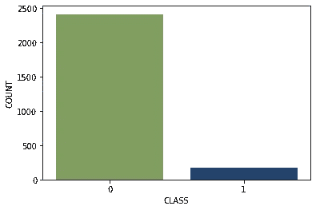

## 分类特征

首先，我查看了分类特征，以了解它们与标签类别之间是否存在关系偏差。为此，我使用 [pandas.crosstab](https://pandas.pydata.org/pandas-docs/stable/reference/api/pandas.crosstab.html) 函数构建了列联表，并评估了分类特征中每个类别的内容相对于类别标签的比率和比例，以确定是否存在偏差。

```
data_crosstab = pd.crosstab(df['seismoacoustic'], df[label], colnames=['class'])
```

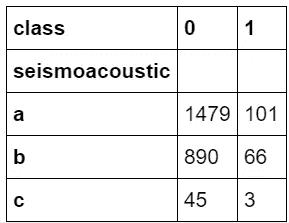

类别 1 到类别 0 的每个地震声学类别的比率约为 0.06，没有表现出任何强偏差。特征“地震”和“移动”包含一些分布偏差。“地震”特征中的“b”类包含更多的危险地震碰撞，而“shift”特征中的“W”类包含的地震碰撞比“N”类多。这些分类特征的列联表如下:

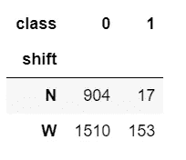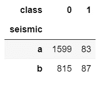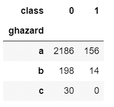

左侧——针对“班次”与“等级”的列联表；中心——地震与等级的应变表；右侧——针对“ghazard”与“Class”的列联表

## 数字特征

接下来，我查看数据并挑选出数字列，以理解它们的描述性统计、相关性和分布图。

*   **描述性统计**

在 Pandas 中， [*描述*](https://pandas.pydata.org/pandas-docs/stable/reference/api/pandas.DataFrame.describe.html) 方法仅提供计数、平均值、最小值、最大值、标准值和百分位数，我们可以从这些值中评估数据在某种程度上的偏斜度。为了更好地理解它们的分布，视觉效果是必不可少的，如分布图和直方图。

```
df[col_list_numerical].describe()
```

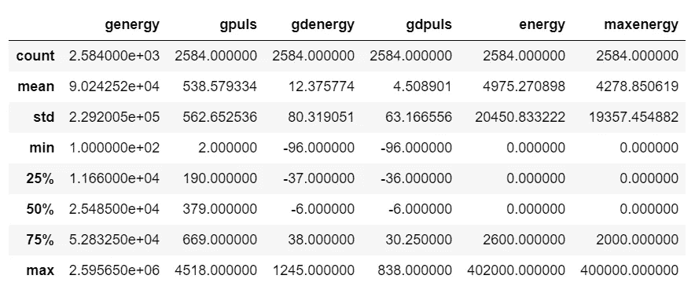

*   **相关性&热图**

我用[熊猫评估了这些特征之间的相关性。DataFrame.corr](https://pandas.pydata.org/pandas-docs/stable/reference/api/pandas.DataFrame.corr.html) 并使用 [seaborn.heatmap](https://seaborn.pydata.org/generated/seaborn.heatmap.html) 可视化。

```
df_corr = df[col_list_numerical].corr()
plt.figure(figsize=[8, 8])
sns.heatmap(data=df_corr, vmin=-1, vmax=1, cmap=’gist_earth_r’, annot=True, square=True, linewidths=1)
plt.xticks(rotation=90)
plt.yticks(rotation=0)
```

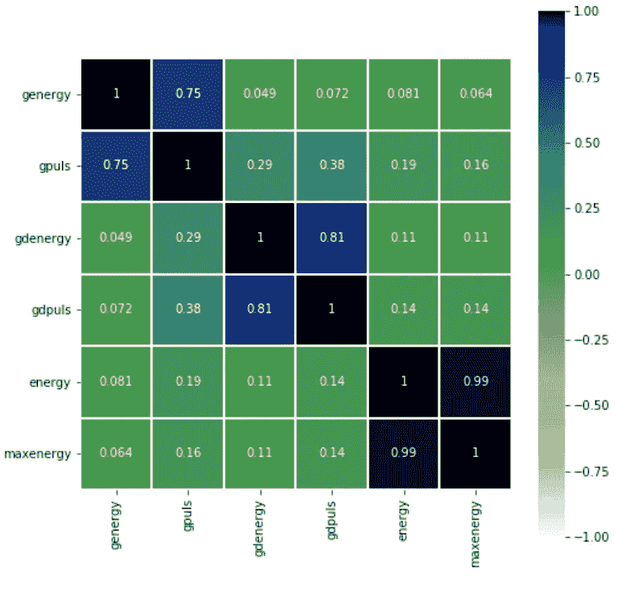

*   **来自描述性统计和相关性的观察:**

能量和最大能量的分布看起来很相似。genergy 看起来右倾。为了更好地理解分布，我使用了 [seaborn.distplot](https://seaborn.pydata.org/generated/seaborn.distplot.html) 来可视化每个特性，如下所示。

在热图中，很明显 genergy 和 gpuls、gdenergy 和 gdpuls 之间有很强的相关性。能量和最大能量几乎是完全相关的。在 EDA 的后面部分，我试图为这些高度相关的对构建散点图，并可视化它们在每个目标类中的分布。

*   **更多 EDA 可视化:分布图&散点图**

就像我说的，我想将分布可视化如下，很明显 genergy 是右偏的，就像所有其他数字特性一样(如 Github Notebook 所示)。

```
sns.distplot(df['genergy'], hist=True)
```

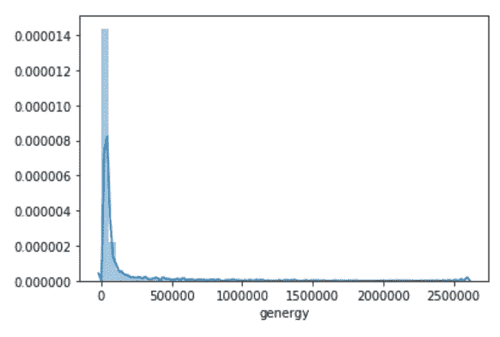

genergy 的更多实例在 0 到 200000 的范围内，并且分布随后向更高的能量值逐渐减少。所有其他数值特征的模式相同，但 gdenergy 和 gdpuls 的范围小于其他数值特征。

此外，我使用散点图来可视化相关系数大于 0.70 的相关特征。我构建了散点图来查看这些数值是如何分布在每个目标类中的。

```
plt.figure(figsize=[10, 8])
sns.scatterplot(x='genergy', y='gpuls', hue='class', data=df)
```

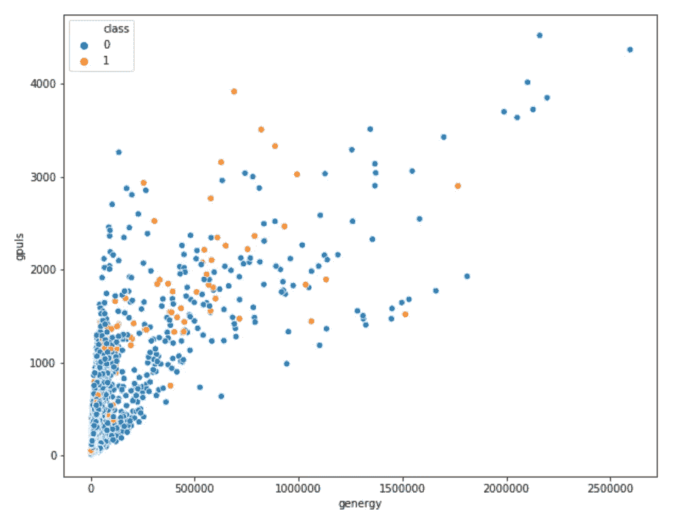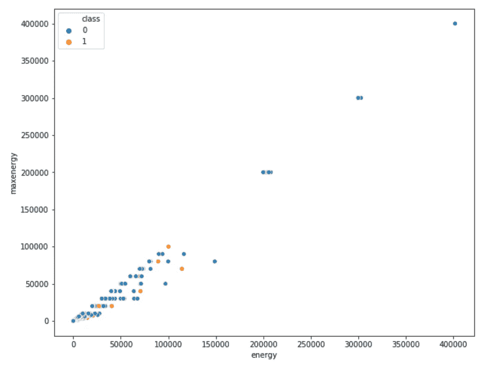

左侧 genergy 与 gpuls 的散点图；右侧—能量与最大能量的散点图

在左图中，地震凸起更集中在较高的 gpuls 和 genergy 值处。右侧散点图中观察到的能量与最大能量的线性关系也很强，如描述性统计数据、它们的散点图和此散点图所示。

## **离散特征**

“nbumpsX”是包含从 0 到 9 的整数的离散特征。这里可以看到，‘nbumps 6’全是零，与‘nbumps 7’和‘nbumps 89’相同。此外，它们都是右偏或正偏分布。

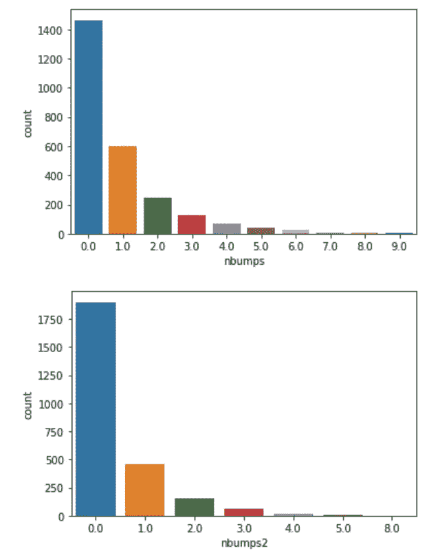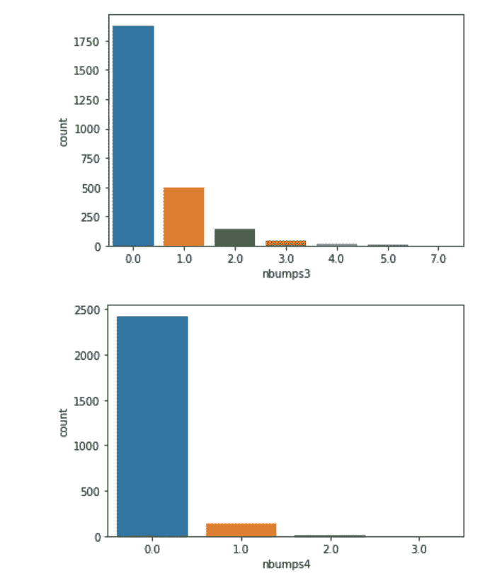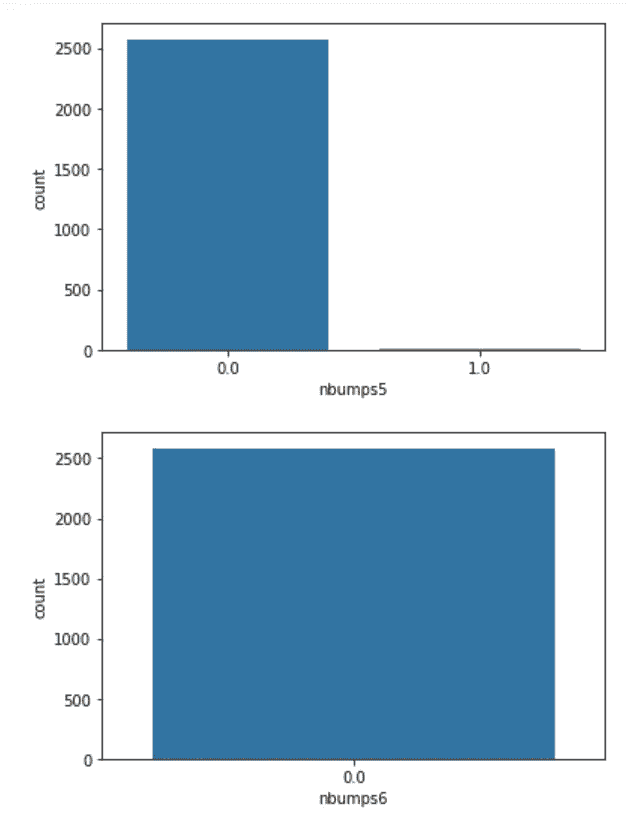

我使用下面的代码删除了“nbumps6”、“nbumps7”和“nbumps89”。其他一切看起来都很好，但是任何 ML 模型都很有可能将‘nbumpsX’信息视为序数。

```
df.drop(columns=['nbumps6', 'nbumps7', 'nbumps89'], inplace=True)
```

我还使用以下代码再次构建了列联表，以查看 nbumpsX 如何与目标类联合分布:

```
for each_col in col_list_discrete:
    data_crosstab = pd.crosstab(df[each_col], df[label], colnames=['class'])
    print(data_crosstab)
    print('-----'
```

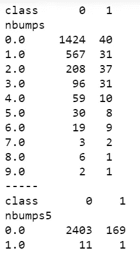

在表中，危险和非危险情况的分布没有明显的差异。在所有这些分立特性中，它们在 nbumpsX 计数中按比例出现。

因为所有这些看起来都很好，所以我转到了下一节“特性工程”，在这里我处理了分类和数字特性。

# 特征工程

我一次性编码了分类变量，并转换了数值列以缩小范围。我保持了独立的特征不变。

*   **分类特征的一键编码**

我将所有两个类别的分类特征编码成一个包含 0 和 1 的特征，同时将两个以上类别的特征转换成每个类别的二进制列。这个 [one-hot encoded](https://scikit-learn.org/stable/modules/generated/sklearn.preprocessing.OneHotEncoder.html) feature 列表示该实例是否包含该特定类别。

例如，地震声学特征包含三个类别——a、b 和 c(如左图所示),它们被转换为扩展的三个二元特征(如右图所示)。我使用 drop='first '来避免伪变量陷阱。

```
label_encoder = LabelEncoder()
onehot_encoder = OneHotEncoder(drop='first', sparse=False)
encoded_array = label_encoder.fit_transform(df[col_name])
encoded_array_reshaped = encoded_array.reshape(len(encoded_array),1)
one_hot_encoded_array = onehot_encoder.fit_transform(encoded_array_reshaped)
num_features = one_hot_encoded_array.shape[1]
new_enc_col_names = [col + '_enc_' + str(num) for num in range(0, num_features)] 
df_enc = pd.DataFrame(one_hot_encoded_array)
df_enc.columns = new_enc_col_names
df = pd.concat([df, df_enc], axis=1)
df.drop(columns=col, inplace=True)
```

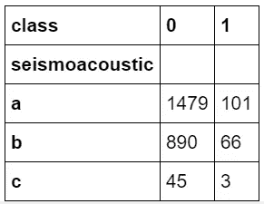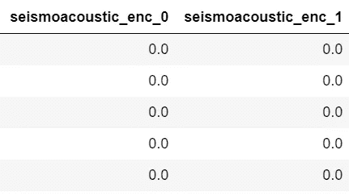

*   **数字列的转换**

然后，我使用对数变换来转换所有的数字特征。z 分数变换并比较原始分布的变换。分布现在看起来更“正常”，范围也更好了。参考下面的代码和可视化进行比较。

```
sns.distplot(**np.log**(df['genergy']), hist=True)
# Results in the figure on the right
```

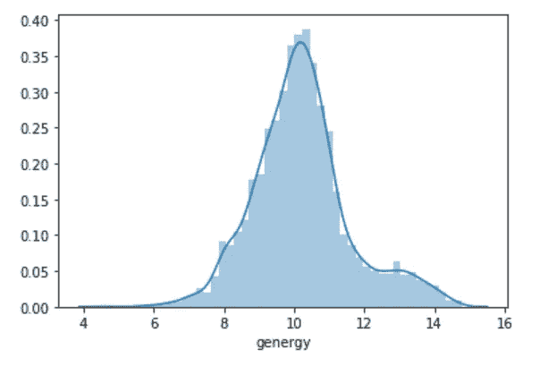

左 genergy 的实际分布；右——遗传的对数变换分布

我基本上创建了一个字典来定义我希望在这些列上应用什么转换，然后循环遍历字典条目，如下所示:

```
def shifted_log_func(df_col):
    return np.log(1 + df_col)dict_num_cols_trnsfm = {'genergy': np.log,
                        'gpuls' : np.log,
                        'gdenergy': stats.zscore,
                        'gdenergy': stats.zscore, 
                        'energy': shifted_log_func}for col_names, transfm_func in dict_num_cols_trnsfm.items():
    df['scaled_' + col_names] = transfm_func(df[col_names])
df.drop(columns=col_list_numerical, inplace=True)
df[[col for col in df.columns if 'scaled_' in col]].describe()
```

由于两者的数据相似，删除 maxenergy 后，数值的最终描述性统计数据。

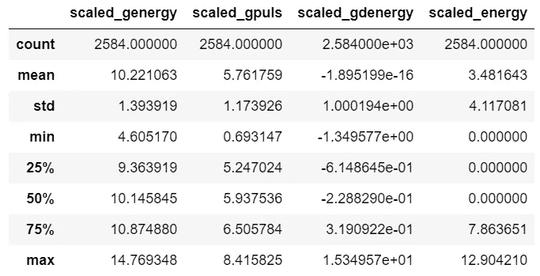

左侧-缩放数字要素的描述性统计数据；右-原始数值数据的描述性统计信息

左侧表格中的范围似乎不错。右边的表格包含一些能量和最大能量的零值。为了解决这个问题，我在“能量”栏中加了 1(因为我去掉了 maxenergy ),然后应用对数变换。

# 分割培训和测试数据

由于这是一个不平衡的数据集，我使用分层混洗分割来分割和按比例分配目标类。

```
stratified_split = StratifiedShuffleSplit(n_splits=1, test_size=0.20)for train_idx, test_idx in stratified_split.split(X, y):
    y_train= y[train_idx]
    X_train = X[train_idx]
    X_test, y_test = X[test_idx], y[test_idx]print("Training Set Target Class Distribution:")
print(y_train.value_counts()/len(y_train))
print("Test Set Target Class Distribution:")
print(y_test.value_counts()/len(y_test))
```

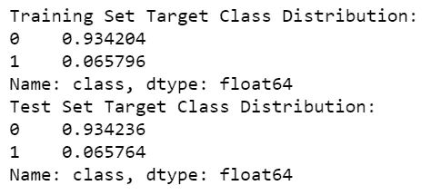

如果我没有使用这种技术，我可能会以稍微不平衡的比例结束危险的地震颠簸，如下图所示。机器学习算法将能够从更公平比例的类别标签中学习，而不是从随机分布中学习，在随机分布中，目标类别的较小类别可能太少而无法学习，因此降低了模型的性能。

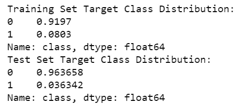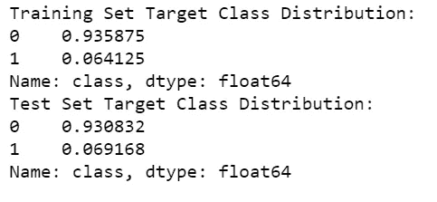

(左)-使用 train_test_split with shuffle 进行拆分时的分布= False(右)-使用 train_test_split with shuffle 进行拆分时的分布=True

这些微小差异的影响可能会影响机器学习算法的性能，因此对于二进制和多类分类问题都是如此。因此，建议对分类问题使用分层分割，尤其是当存在不平衡数据集时，以保留每个类别的样本百分比并避免采样偏差。

感谢您的来访。我希望你喜欢阅读这篇博客。 [*下一篇文章*](/predicting-hazardous-seismic-bumps-part-ii-training-supervised-classifier-models-and-8b9104b611b0) *是这篇探索模型构建和性能指标比较的博客的继续。下面链接-*

[](/predicting-hazardous-seismic-bumps-part-ii-training-supervised-classifier-models-and-8b9104b611b0) [## 预测危险的地震颠簸第二部分:训练和调整监督 ML 分类器和模型…

### 本文展示了预测危险的地震颠簸使用二元分类器，调整模型超参数…

towardsdatascience.com](/predicting-hazardous-seismic-bumps-part-ii-training-supervised-classifier-models-and-8b9104b611b0) [](https://medium.com/womeninai/predicting-hazardous-seismic-bumps-part-iii-improving-model-performance-for-imbalanced-datasets-88fa64b4d622) [## 预测危险的地震颠簸第三部分:改善不平衡数据集的模型性能

### 新手评估试用机器学习模型进行分类和数据扩充，以更好地支持…

medium.com](https://medium.com/womeninai/predicting-hazardous-seismic-bumps-part-iii-improving-model-performance-for-imbalanced-datasets-88fa64b4d622) 

**本笔记本的 GitHub 链接:**

[](https://github.com/royn5618/Medium_Blog_Codes/blob/master/Predicting%20Hazardrous%20Seismic%20Bumps/Predicting_Seismic_Bumps.ipynb) [## royn5618/Medium_Blog_Codes

### permalink dissolve GitHub 是超过 5000 万开发人员的家园，他们一起工作来托管和审查代码，管理…

github.com](https://github.com/royn5618/Medium_Blog_Codes/blob/master/Predicting%20Hazardrous%20Seismic%20Bumps/Predicting_Seismic_Bumps.ipynb) 

**我的链接:** [中](https://medium.com/@nroy0110)|[LinkedIn](https://www.linkedin.com/in/nabanita-roy/)|[GitHub](https://github.com/royn5618)