# 基于神经网络的 HDB 房价预测

> 原文：<https://towardsdatascience.com/predicting-hdb-housing-prices-using-neural-networks-94ab708cccf8?source=collection_archive---------24----------------------->

## [实践教程](https://towardsdatascience.com/tagged/hands-on-tutorials)

[朱洪志](https://unsplash.com/@zhuzhutrain?utm_source=medium&utm_medium=referral)在 [Unsplash](https://unsplash.com?utm_source=medium&utm_medium=referral) 上拍照

除了问你的房屋中介，你有没有想过你的 HDB 值多少钱？或者想知道对你的 HDB 有很大影响的主要特征是什么？看到超过 92.2%的新加坡人拥有 HDB，我相信这些是大多数新加坡人都有过的常见问题，如果我能使用数据分析来获得对新加坡政府住房市场的任何见解，那将是很好的。序列预测模型给出的平均绝对误差为 22，429 美元(+/- 571.83)

关于可视化的更多信息，请查看我的 [tableau 公共简介](https://public.tableau.com/views/HDB_16024210053850/AverageResalePriceVsRank?:language=en&:display_count=y&:origin=viz_share_link)。有关代码的更多信息，请查看我的 GitHub。所有数据均在[data.gov.sg](https://data.gov.sg/dataset/resale-flat-prices)获得。

# 概观

data.gov 的所有数据都有。以下数据分析项目遵循典型的方法(CRISP-DM)。

*   数据清洗+探索性数据分析
*   顺序神经网络(3 层)
*   估价
*   结论
*   未来的工作

在接下来的 EDA 阶段，我将致力于数据可视化方面的深入研究，为我的读者提供对新加坡 HDB 房地产市场的更深入的见解。

# 数据清理

该数据集包括从 1990 年到 2020 年的数据。总共有 677，114 行和 10 列。虽然数据集中没有空值，但也有一些异常值(例如，封顶与未封顶的要素等。).首先，由于我们考虑的是在 MOP(最短入住期)后出售的公寓，任何超过 95 年租约(剩余租约)的公寓都将被删除。

然而，在数据集中有大量的重复，它们已被删除。

## 目标功能概述

我们整个数据集的中值价格约为 35 万美元。另外我们可以看到，80 万以上的房子只有少数。有趣的事实:根据我们的数据，这些年来卖出的最贵的房子是 123.2 万英镑。

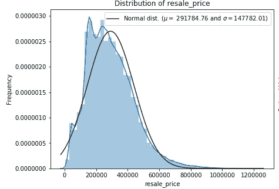

图一。房价分布

# 探索性数据分析

## 相关矩阵

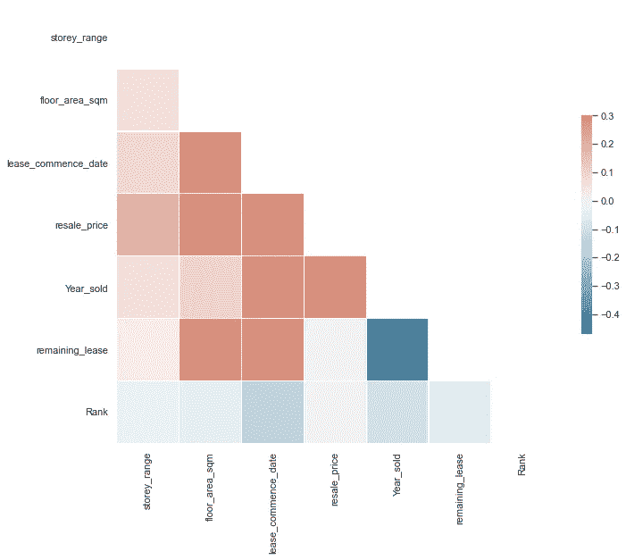

图二。所有定量特征的相关矩阵

## 公寓类型和建筑面积

正如我们所知，在新加坡有多种类型的公寓，一室，两室，行政等。直觉上，我们认为更大的房子(更大的建筑面积)是价格的有力指标。我把两张图拼在一起，这样你就可以看到公寓类型/建筑面积和转售价格之间的强烈相关性。正如我们所想象的，房子越大，价格就越高。

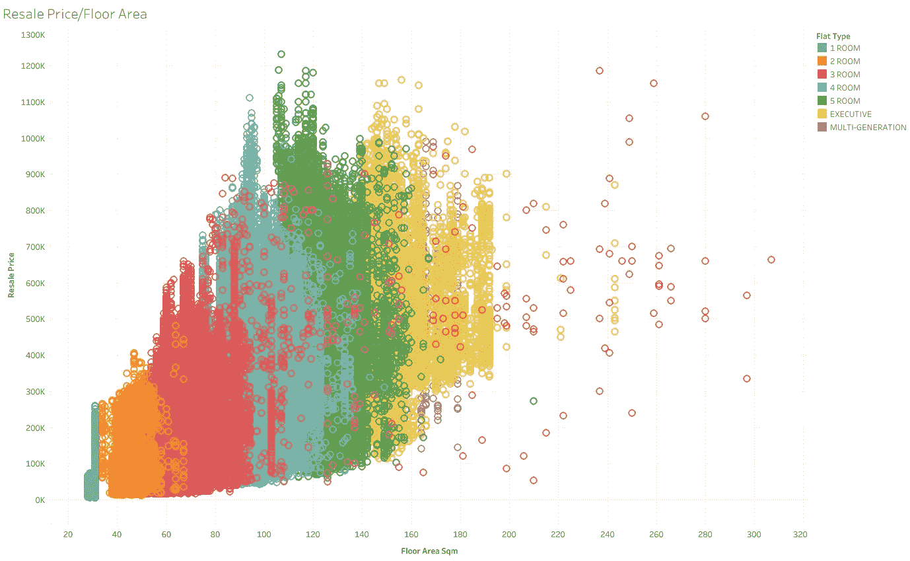

图 3。建筑面积(平方米)与转售价格

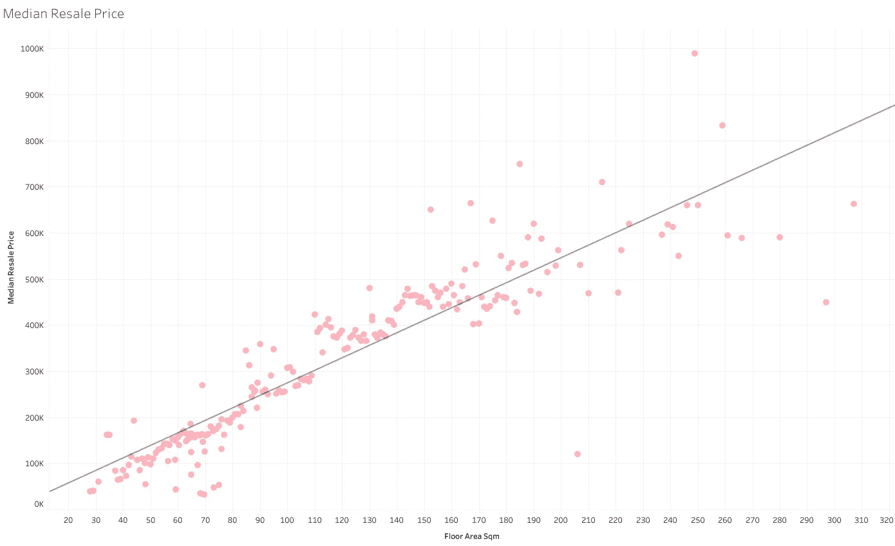

图 4。建筑面积与转售价格中位数

越大=越好？简短的回答；是的。

## 故事范围

在数据集中，地板水平被给定为一个范围并被注册为一个字符串。(例如“01 至 03”、“03 至 05”等。).此外，还有一些从 01 到 05 的楼层范围，跨越两个特征。我根据这些特征的平均楼层对它们进行了编码，并相应地将它们从 1(最低楼层范围)到 17(最高楼层范围)进行了排序。

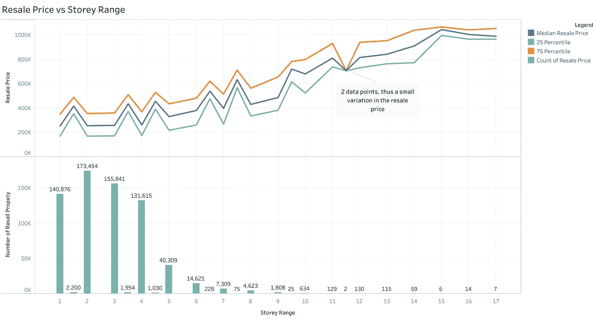

图 5。转售价格与楼层范围

根据转售价格对它们进行排序，我们注意到，与其他功能相比，故事范围从 01 到 05 具有更高的中值价格。而总的趋势显示，地板越高，转售价格越高。

同样，对于故事范围 15、16 和 17，它们转换为 43 到 45、46 到 48 和 48 到 51，差异是< $200,000 (1 Sigma). There aren't too many HDB in Singapore that has floor that are higher than 43 floors, deeper analysis shows that most apartments sold there are from here.

## Flat Model/Flat Layout

Flat model essentially refers to the layout of the house. As HDB have a long history in Singapore housing market. some of these models are obsolete, as the land are getting scarcer, some flat models will never return (e.g. Masionette).

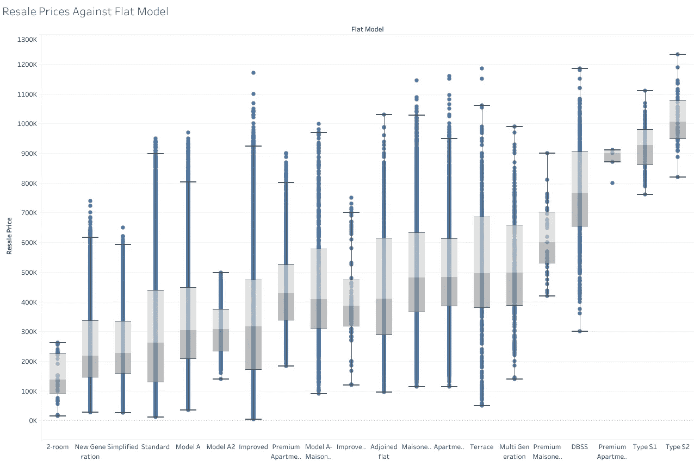

Figure 6\. Resale Price VS Model Type, ranked according to mean

## Date (Month & Year)

The date was split into month and years as I firmly believe that the months do not matter as much as compared to the years. Perhaps changing them into Q1Y19 would give a deeper resolution into how HDB resale price changes overtime.

**月**

显然，这几个月没有太大的区别。月份从最小的中间转售价格开始排序。

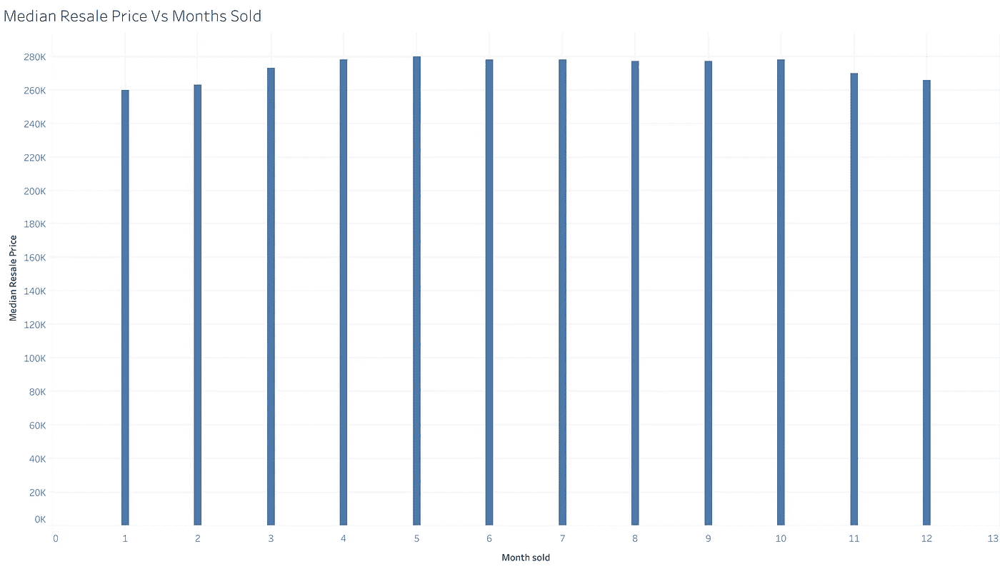

图 7。转售价格中位数与月数

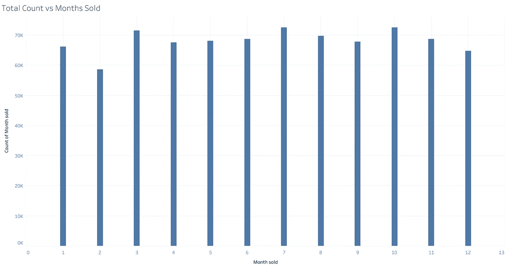

图 8。几个月内售出的房产总数

我把几个月作为一个特征，因为它们不会对转售价格的变化产生很大影响。有趣的是，计数图显示，多年来，二月一直是不受欢迎的购房月份。我认为这是因为二月的天数最少。

**年份(HDB 转售指数)**

通过对历年(1990 年至 2020 年)转售价格的排名，我们可以看到 HDB 转售价格多年来有明显的趋势。

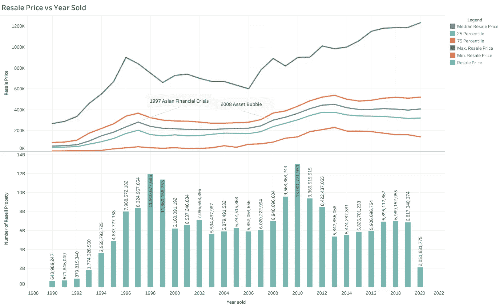

图 9。转售价格与年销售量

HDB 转售指数随时间波动，在 2013 年达到峰值，HDB 的平均售价约为 40 万美元。从 1997 年到 1998 年，一年中最大的年同比降幅约为 50，000 美元。

塑造转售指数的一些值得注意的事件是 1997 年和 2008 年房地产泡沫期间发生的亚洲金融危机。然而，我们看到，HDB 转售指数在 2008 年房地产危机期间并没有受到太大影响。相反，由于我不知道的原因，它在 2013 年至 2014 年期间出现了更严重的下降。我最初的假设是 SIBOR 利率上升，或者在 2013 年和 2014 年有更好的资产类别可以投资

## 镇(区)

我认为，我认识的大多数新加坡人对财产有一种近乎不健康的痴迷(包括我在内)。新加坡人几乎愿意花大价钱住在黄金地段/成熟地区，其中一个原因可能是因为连通性和良好的小学。不用进一步滚动，你大概就能猜出哪些区域会卖高价。

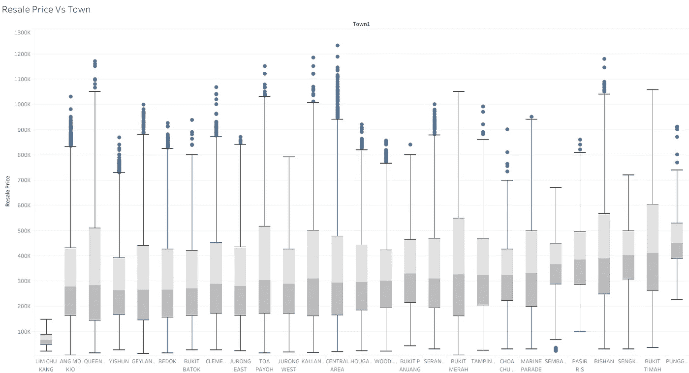

图 10。转售价格与城镇

令人惊讶的是，远离市中心的丰戈尔获得了最高的转售价格，然而，从数据来看，丰戈尔是最近 10 年才开发的，这意味着平均零售价格已经很高了。

另一方面，虽然璧山、中央区和武吉提马的平均价格较低，但与其他地区相比，它们的 75%销售价格都较高。

对于成熟的房地产，如皇后镇，芽笼，昂莫桥和大巴窑。虽然它们靠近中心区，被认为是成熟的住宅区，但它们的收入中位数较低。这可能是因为这些地区的房屋一般都比较旧，可能已经过了最佳剩余租期。

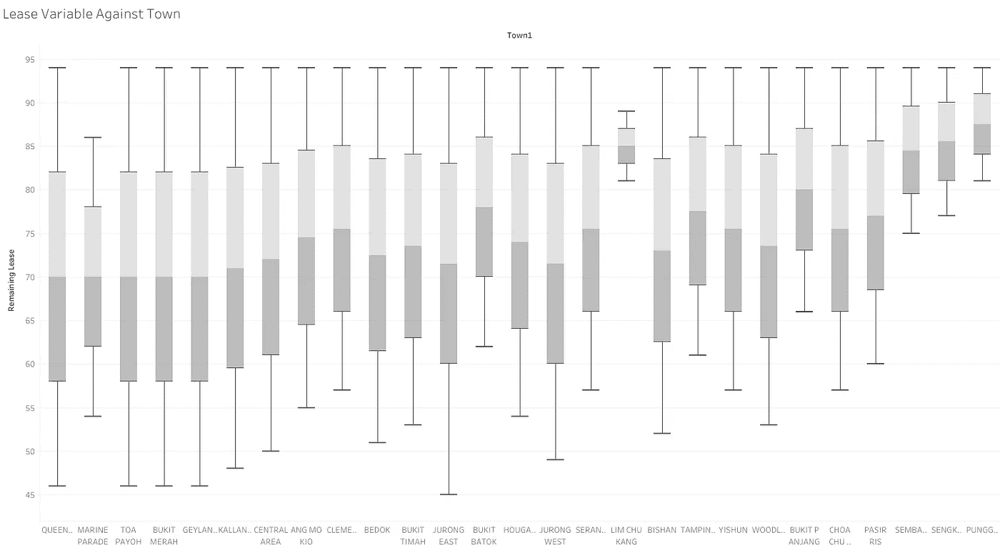

图 11。剩余租约与城镇

## 剩余租约

正如我们可以看到的密度图显示，大多数人在两点出售他们的房子。94 年(紧接着 5 年的 MOP)**2。70-85 岁**(又名升级者/降级者)。这很直观，因为新加坡的组屋租期为 99 年，最短入住期为 5 年。因此，一旦最低入住期结束，人们可能会升级。第二个最常见的销售期在 70-85 左右是因为房地产价格大幅上涨。

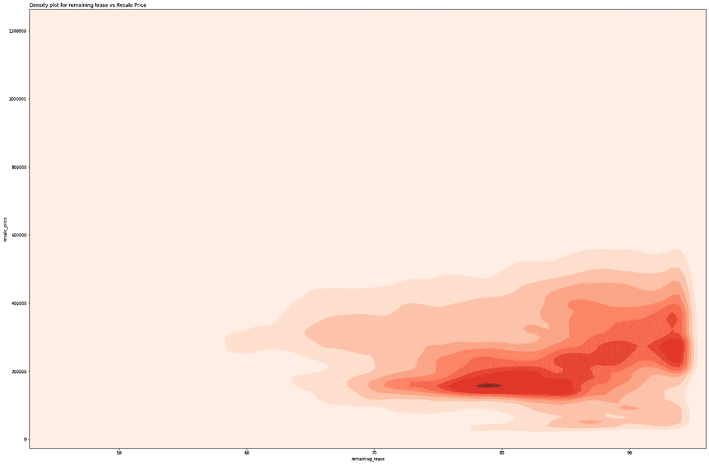

图 12。转售价格与剩余租赁的热图。

## 小学

对于大多数新加坡人来说，我们听说过父母搬家只是为了更接近一所更好的(主观的)小学。这是因为在投票时，居住在更靠近首选学校的新加坡公民和永久居民会得到优先考虑*。*

学校首先根据其受欢迎程度排名。最后，学校被地理标记到各自的城镇(区),然后进行平均。形成新的特色(学校排名)。

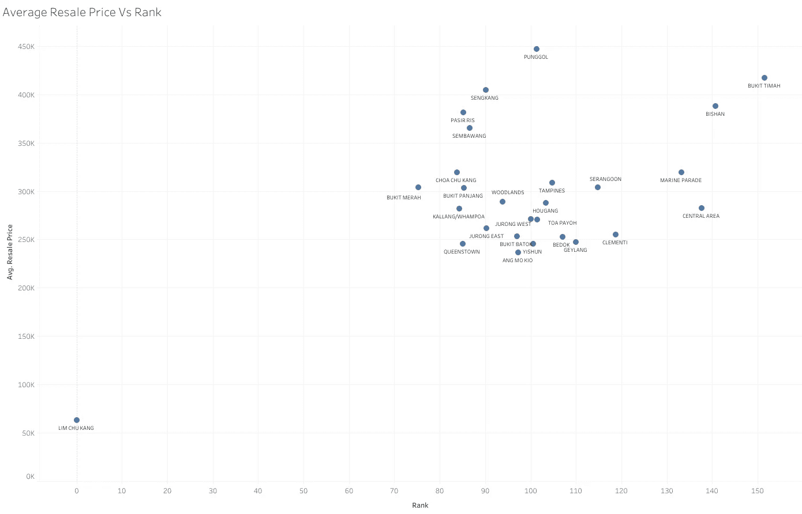

如你所见，武吉提马、璧山和中部地区的平均排名非常高。林珠港没有学校，事实上，快速搜索谷歌会发现林珠港几乎没有任何组屋。

# 序列神经网络

部署了三层神经网络，因为当与 SGDregressor 和 XGBoost 比较时，它产生最佳结果。基于 MAE 对结果进行评估。

我们利用了一个简单的 3 层[序列神经网络](https://keras.io/guides/sequential_model/)，所有特征都被归一化。使用 minmax scaler 将分类特征拆分到单独的列中。

**重复 K 倍**

使用重复的 K-fold 来评估模型的性能。重复的 K-fold 随机地将数据分成大小大致相等的 5 个块。每个块依次被排除，而另外 4 个块用于训练模型。预测保持的块，并且这些预测被总结为 MAE(平均绝对误差)和 RMSLE(均方根误差)。然后重复该过程 3 次，并对各自的性能指标进行平均。更多关于重复 k 倍的信息，我们可以参考[这个](https://machinelearningmastery.com/repeated-k-fold-cross-validation-with-python/)。

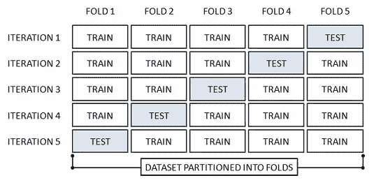

图 14。k 倍交叉验证，混洗数据集，重复该过程 3 次。

**结果**

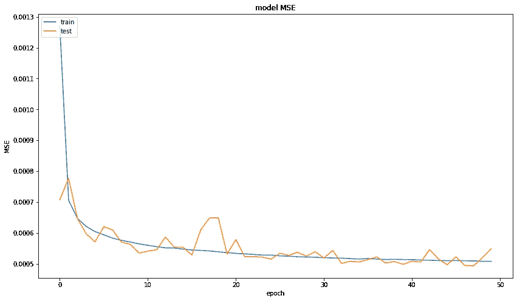

图 15。历元数与 MAE(左)和 MSE(右)

随着时代数量的增加，我们的损失(MAE，MSE，MAPE)减少，除了 MAPE，我相信这是因为它是原始房价的函数。我相信我们还没有找到“最佳点”,因为我们看到，随着我们的训练和验证数据中的时期增加，我们的损失仍在继续减少。

**评估指标**

重复 k 折叠序列神经网络模型结果是，

平均汇率:22767.46 (+/- 571.83)

MAPE: 9.07% (+/- 0.35%)

均方根误差:0.017(+/- 0.006)

# 结论

总的来说，模型的表现比我预期的要好。我试图寻找 HDB 预测模型的基准，它徘徊在 0.09 到 0.03 RMSLE 之间。然而，神经网络缺乏可解释性。与线性回归模型相比，我们可以看到不同系数的具体权重。

**沙普利值**

由于神经网络在很大程度上是黑盒模型，利用 Shapley 值来解释哪些特征在确定价格方面贡献最大。Shapley 值显示了哪些特征对价格预测贡献最大。

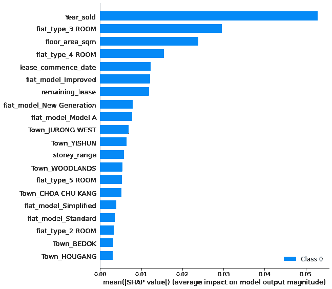

图 16。平均 SHAP 值

特征年销售量对价格预测贡献最大，其次是户型(3 房和 4 房)和建筑面积平方米。这意味着销售年份在很大程度上影响了预测，其次是公寓类型是三房还是四房。

# 未来的工作

最初的数据分析表明，确实有某些特征有助于更高的转售价格。然而，我相信我们可以更多地使用街区号码和街道名称。如果我们能够地理定位每个地址的纬度和经度，我们就能够创建新的距离特征。

此外，我还将尝试不同的算法，为模型提供更好的解释能力。目前，我们无法看到不同的功能如何影响最终的预测价格。

第二部分:[https://towards data science . com/predicting-hdb-prices-using-machine-learning-algorithms-part-2-614 c 54646998](/predicting-hdb-prices-using-machine-learning-algorithms-part-2-614c54646998)