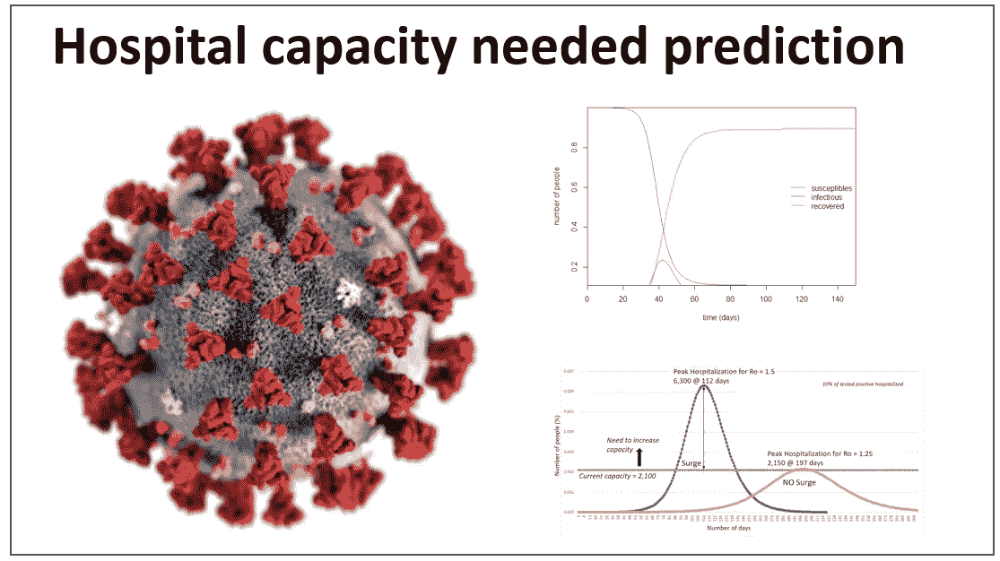
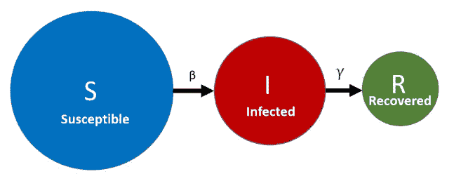
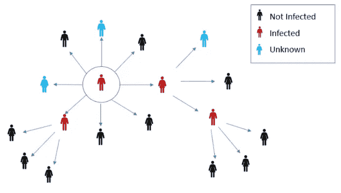
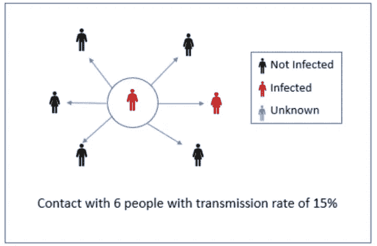
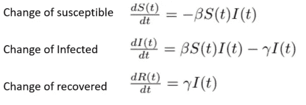
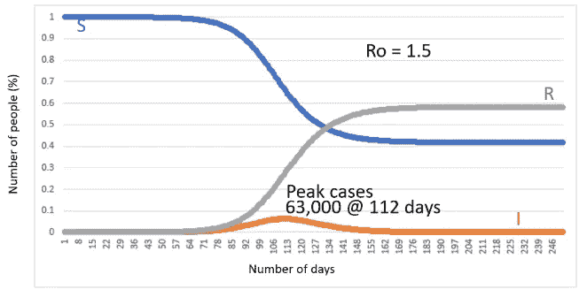
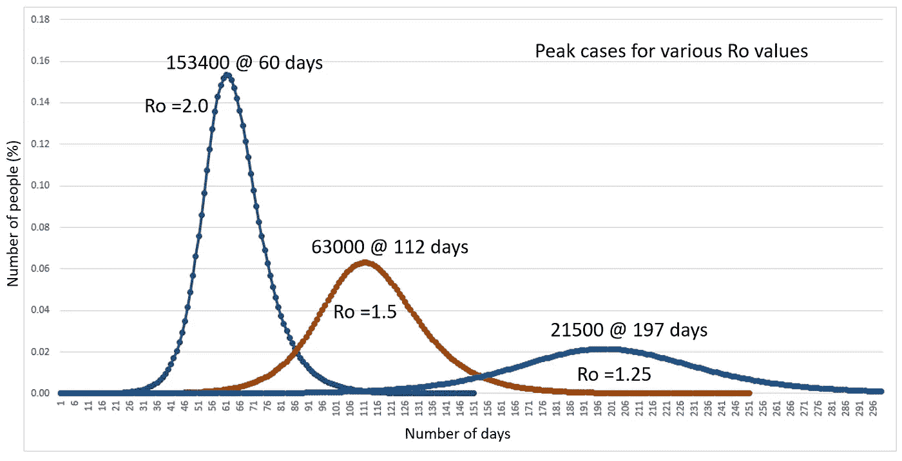
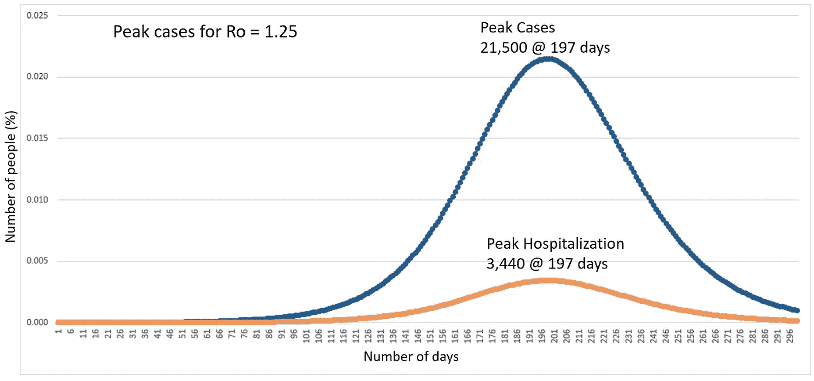
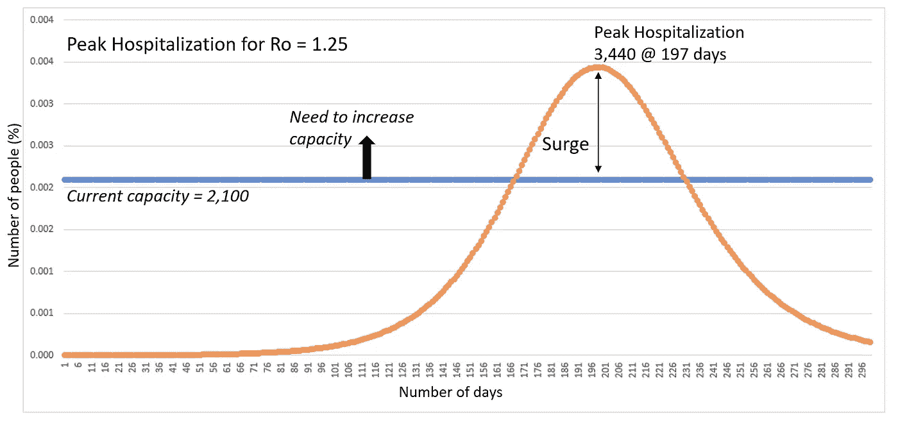
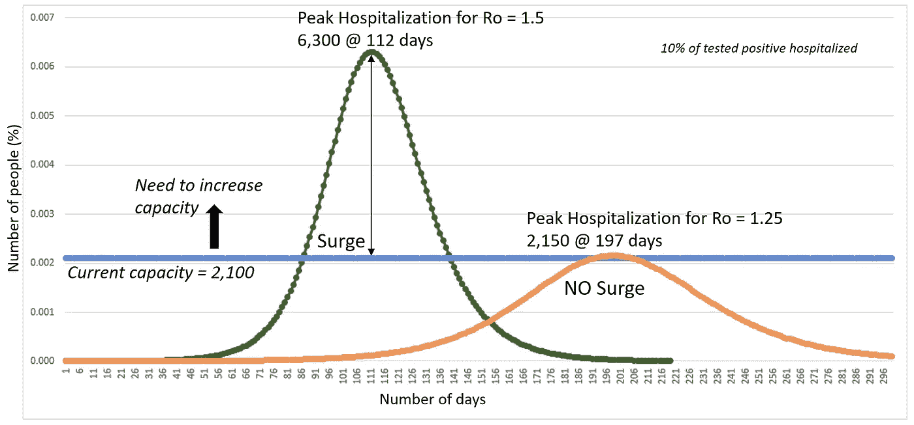

# 预测新冠肺炎疫情所需的医院容量

> 原文：<https://towardsdatascience.com/predicting-hospital-capacity-needed-for-covid-19-pandemic-af743d7c3210?source=collection_archive---------40----------------------->

*预测疾病传播和住院需求，确定应对激增所需的床位数量。*

在我的[上一篇文章](https://dzone.com/articles/predicting-coronavirus-confirmed-cases-in-usa)中，我使用时间序列预测了确诊病例的指数增长&应用了修正以考虑社会距离和其他类似的措施。在这篇文章中，我将使用一个简单的流行病学模型来关注传染病传播的建模。在文章的开始，我将简要介绍该模型如何工作的基础知识，并使用该模型预测传播和住院需求

*请注意，本文仅用于数据分析目的，本文观点不应被解释为专业建议。*

**流行病模型**是基于分室的模型，将人群分成不同的组。目标是模拟这些疾病如何从一个群体的一个成员传播到另一个群体。一个最简单的房室模型叫做 [SIR](https://mathworld.wolfram.com/SIRModel.html) ，它将种群分为 3 组:

1.  可能被感染的易感人群
2.  受感染的个人(一)
3.  康复个体(R)。

请注意，术语“康复”指的是可能已经痊愈并产生免疫力的患者，或者可能已经去世的患者。他们不会再被感染，这在现实中还没有被证实。

SIR 模型基于当前观察到的局部参数，如患病率和倍增时间，提供了对未来疾病在人群中传播的洞察。请注意，传播对隔离政策、检测可用性和其他当地因素非常敏感。这个模型的目标是理解

1.  疾病传播的速度有多快
2.  有百分之几的人口会被感染？
3.  有百分之多少的人康复了？
4.  我们的医院容量应该是多少？

SIR 模型预测将被感染的潜在个体总数。该数字可用于进一步估计需要医院资源(如住院、ICU、通气等)的患者比例。请注意，该模型对所有人都一视同仁，而实际上，患有更多慢性病的老年人群似乎风险更高。

SIR 模型使用初始(当前)疾病流行参数预测未来感染，如

1.  群体大小
2.  恢复时间
3.  传输速率

# 方案

我们举个简单的例子。假设我们有一个拥有 100 万人口的县/州，在那个镇上，有五个人被感染。目标是确定它能传播多少和多快。这取决于许多因素。

*   **我们是否在跟踪家中的避难所及其对感染者每天可感染人数的影响**:每个感染者每天可联系或多或少的人，这取决于是否实行社交距离。假设每个人每天接触两个人。不是每个他/她接触的人都会被感染。存在传播的可能性(易感者和受感染者接触后的感染可能性)。比方说传输概率是 15%。

*   这意味着，如果这个人每天遇到 6 个人，传播概率为 15%，他每天会感染 6 * 15 % = 0.9 人。这个数字被称为 **beta (𝛃)又名传播率**，代表一个感染者每天感染的人数。出于建模的目的，每天接触的人数可能低至 1 人，高至 10 或 15 人，传播概率在 5%至 15%之间。较高的传播概率可能与具有较高风险的人群(患有其他慢性疾病的老年人群)相关
*   **疾病可以从感染者身上传播的天数:**我们已经知道这个感染者每天可以传染 0.9 人。这个人多少天会被感染，传播疾病？假设这个病人与人接触了 5 天。如果他/她每天感染 0.9 人，5 天就感染 0.9 * 5 = 4.5 人。这个数字被称为基本繁殖数，用来估计疾病在人群中传播的速度。这是一个感染者感染的总人数。这是一个需要理解的重要数字，因此让我们在下面对此进行更多的讨论。
*   **再现号** *Ro* 读作“R 零”这是一个数学术语，表示疾病的传染性。告诉你平均有多少人会从一个有传染性的人身上染上疾病。如果一种疾病的 Ro 为 6，只要没有人接种过疫苗或在他们的社区中已经对其免疫，感染者就会将该疾病传播给平均 6 个其他人。2009 年的猪流感或 H1N1 病毒的 Ro 值约为 1.5。由于疫苗和抗病毒药物的作用，影响并不大。在冠状病毒的情况下， *R* o 值估计在 1.5 到 3.5 之间，其中 1.5 到 2.5 用于良好的社交距离。

*   **痊愈率(ɣ)**是单位时间内痊愈的感染者的比率。在这种情况下，感染持续了 5 天，⅕是伽马值，是目前每天恢复的感染人数。

这些参数可用于通过识别感染和康复人群的变化来定义传播。

随着时间的推移，易感人群的数量下降，被感染的人数上升。康复的人数也在上升。(𝛃)传染率是指一个人感染多少人。既然我们有我感染的人，那就是𝛃 *我就是感染的力量。当我们将其乘以易感人群，即新感染人群。由于一些种群可能已经恢复，ɣ* I 给出了恢复的种群数量。必须减去这个数字才能得到感染人数。这可以用一个简单的等式来描述，如下所示。我不打算在本文中解释这个公式的数学原理，但会解释它的实际用法。

使用 SIR 模型进行预测

**预测一个州/县所需的医院床位**

现在，我们将上述知识应用于拥有 100 万人口的县/州(如前所述)。假设这个县/州在 3 月 10 日左右宣布了 5 个病例。

这里要解决的问题是

1.  疾病传播的速度(到达高峰的时间)
2.  有百分之几的人口会被感染？
3.  社交距离的影响？
4.  对我们医院容量的影响？

截至 2010 年 4 月 20 日，美国主要一般统计数据的简要总结。这些是我们可以在计算中使用/参考的一些公开可用的统计数据。这些数据来源于世卫组织和疾病预防控制中心。

1.  被测试人口的百分比相当低(< 1%).
2.  Out of the tests conducted, on an average anywhere from 10 to 20% of the people tested are becoming positive.
3.  Out of the individuals who have confirmed positive, 10 to 16% of those are hospitalized.
4.  Most states in the USA the number of beds range from 1.6 to 4.4 beds for every 1,000 people. The average for the USA is 2.4.

**用于模拟的关键数字**

*   假设一个人感染了 5 天。如前所述，这意味着**γ**(回收率)是⅕ = 0.2。为了限制建模的范围，我保持伽玛为常数。在后续文章中，我可能会进一步阐述这种影响。
*   从本文前面的讨论来看，对于新冠肺炎来说基本的**再生数 *R* o** 的范围是从 1.25 到 3.5。我们将使用 1.25 的 *Ro* ，1.5 的& 2 并比较结果。告诉你平均有多少人会从一个有传染性的人身上染上疾病。例如， *R* o 为 2 表示一个感染者会将疾病传染给另外两个人。如果 *R* o 值大于 1，则感染率大于恢复率，因此感染将在整个人群中增长。如果 Ro 小于 1，感染将很快消失，因为人们愈合的速度比传播的速度快。
*   相同的**β**值将分别为( *R* o * gamma) 0.25，0.3 & 0.4。β代表一个感染者每天感染的人数。
*   对于 SIR 模型，截至 3 月 10 日，最初的易感人群约为 100 万，其中有 5 人被感染。

下一节总结了这个模拟的结果。

**Ro 1.5 的结果汇总**

对于 Ro = 1.5，从下图可以看出，峰值出现在 3 月 10 日之后的 112 天。这将是 7 月初左右，高峰病例为 63，000 例。注意 y 轴表示人数(%)，x 轴表示天数。

比方说，我们县每个病人有 2.1 张病床& 16%的检测呈阳性的人住院了(根据上面的统计)。让我们用那个计算来估计医院的容量。

从 3 月 10 日起的 112 天中，峰值病例为 63，000，相应的峰值住院需求为 10，080。

添加可用的医院容量，见下图。在现有床位为 2，100 张的情况下，要为 10，080 张床位的激增做好准备，需要通过增加医院容量以及练习社交距离来减少激增。在下一节中，我们将讨论将 Ro 从 1.5 降至 1.25 的影响。

**社交距离的影响或缺乏社交距离**

下图显示了范围从 1.25 到 2.0 的各种 *Ro* 值的影响。y 轴显示人数(%)，x 轴显示天数。如果一个人做了很好的社交距离，我们可以看到 Ro = 1.25 时的行为。如果我们开始放松社交距离，你会看到更接近于 2.0(或者更高)的行为。这就是为什么社交距离、测试、追踪和隔离极其重要。

对于 *Ro* = 1.25，假设继续做好社交距离等隔离方式，197 天左右可以看到 21500 例。这是从 3 月 10 日开始的大约 7 个月，也就是 9 月底/10 月初。

让我们加上每 1000 个可用床位 2.1 张的计算结果(来自统计数据)& 16%(来自统计数据)测试呈阳性的人住院了。考虑到这些因素，所需床位计算如下。

相应的高峰住院需求为 3440 人，而容量仅为 2100 人。

**预测不同 Ro 值的医院床位容量**

下表总结了 3 个不同 *Ro* 值的建模结果。峰值表示自模拟开始(2020 年 3 月 10 日)以来可以找到的最大案例数，天数为天。

让我们加上每 1000 个可用床位 2.1 张的计算结果(来自统计数据)& 16%(来自统计数据)测试呈阳性的人住院了。考虑到这些因素，所需床位计算如下。

对于 Ro = 1.25，该模型预测高峰病例将在 197 天后发生，大约高峰日期为 9 月 23 日，需要医院床位 3440 张。假设每 1000 人 2.1 张床位，该县将短缺 1340 张床位。

类似地，对于 Ro = 1.5，该模型预测高峰病例将在 112 天后发生，大约高峰日期为 6 月 30 日，所需医院床位为 10，080 张。假设每 1000 人拥有 2.1 张床位，该县将缺少 7980 张床位..

如果我们假设需要住院治疗的检测呈阳性的人口百分比为保守估计的 10%,则以下是相应的所需医院床位容量。

对于 Ro = 1.25，该模型预测该县不会出现短缺。就 Ro 1.5 而言，预计短缺 4，200 个床位。

通过适当的管理，将 Ro 保持在 1.25 以下，并采取适当的谨慎措施，人们可以处理这一危机。

**总结**

使用 SIR 模型，我们预测了一个拥有 100 万人口的县的传播范围，该县截至 3 月 10 日有 5 例确诊病例，具有不同的 Ro 值。如果该县能够将 Ro 保持在 1.25 或以下，我们应该能够很好地控制病毒爆发。如果 Ro 达到峰值，那就是我们开始不知所措的时候。这表明了社会距离、接触者追踪和隔离的重要性。更重要的是，知道大概的高峰时间和潜在的住院需求，县可以通过增加适当的临时床位来帮助减少影响。