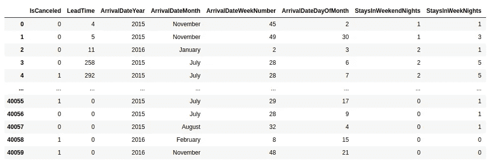
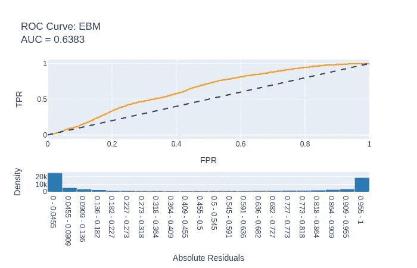
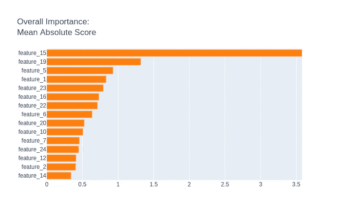
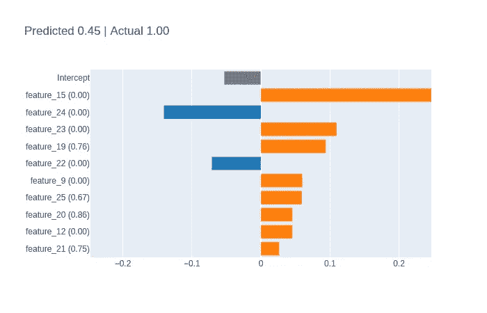
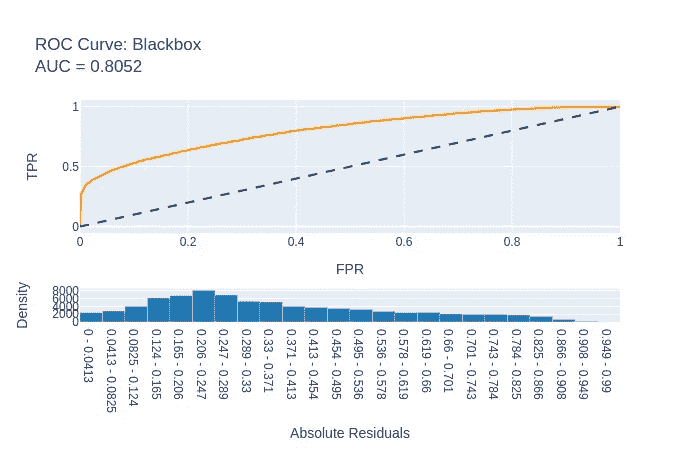

# 使用 InterpretML 预测酒店取消预订

> 原文：<https://towardsdatascience.com/predicting-hotel-cancellations-using-interpretml-e4e64fefc7a8?source=collection_archive---------43----------------------->

## 可解释性是机器学习的一个被忽视但又必要的方面。

为了将模型部署到生产中，并使非技术受众能够理解研究结果，模型结果的可理解性或理解与准确性一样重要。

微软开发的 InterpretML 包的目的是允许增加黑盒机器学习模型的可理解性，同时保持强大的准确性性能。

下面是一个使用可解释助推机(EBM)预测客户是否会取消酒店预订的例子(1 =客户取消，0 =客户不取消)。

# 数据准备

H1 数据集用于训练目的，而 H2 数据集用于测试模型预测。

Antonio 等人的原始数据集和研究可以在本文末尾的参考资料中找到。以下是数据集的一个示例:



来源:使用数据科学预测酒店预订取消(Antonio 等人)

除了包含空值的变量(*子*、*代理*、*公司*)以及 *ReservationStatusDate* 之外，数据集中的所有特征都包括在内。

最小最大缩放器用于将特征转换为 0 到 1 之间的比例。

假设未消除(0)的发生率比消除(1)多，SMOTE 过采样方法用于创建样本训练数据以模拟消除发生率的特征数据。

```
>>> counter = Counter(y_train)
>>> print(counter)Counter({0: 21672, 1: 8373})
```

最初， **0** 有 21672 个条目，而 **1** 有 8373 个条目。

```
>>> oversample = SMOTE()
>>> x_train, y_train = oversample.fit_resample(x_train, y_train)
>>> counter = Counter(y_train)
>>> print(counter)Counter({1: 21672, 0: 21672})
```

0 和 1 的发生率现在相等。

# 可解释的助推分类器

可解释的提升分类器被用作训练模型。

```
>>> from interpret.glassbox import ExplainableBoostingClassifier
>>> ebm = ExplainableBoostingClassifier()
>>> ebm.fit(x_train, y_train)
>>> print("Accuracy on training set: {:.3f}".format(ebm.score(x_train, y_train)))
>>> print("Accuracy on validation set: {:.3f}".format(ebm.score(x_val, y_val)))Accuracy on training set: 0.907
Accuracy on validation set: 0.623
```

验证准确率达到 62%。

## 精确度与召回率和 f1 分数

当比较准确度分数时，我们看到在每个混淆矩阵中都提供了大量的读数。

然而，在**精度**和**召回**之间存在一个特别重要的区别。

```
Precision = ((True Positive)/(True Positive + False Positive))Recall = ((True Positive)/(True Positive + False Negative))
```

这两个读数经常相互矛盾，也就是说，通常不可能在不降低召回率的情况下提高精确度，反之亦然。

对理想指标的评估很大程度上取决于所分析的具体数据。例如，癌症检测筛查出现假阴性(即表明患者没有患癌症，而事实上他们患有癌症)是一大禁忌。在这种情况下，召回是理想的衡量标准。

然而，对于电子邮件，人们可能更喜欢避免误报，例如，将一封重要的电子邮件发送到垃圾邮件文件夹，而实际上它是合法的。

f1 分数在设计一个更通用的分数时考虑了精确度和召回率。

哪个因素对预测酒店取消更重要？

从酒店的角度来看，他们可能希望更准确地识别出最终会取消预订的客户，这使得酒店能够更好地分配房间和资源。确定不打算取消预订的客户不一定会增加酒店分析的价值，因为酒店知道，无论如何，很大一部分客户最终都会坚持预订。

## 测试集上的性能

当在测试集(H2)上运行该模型时，以下混淆矩阵表明基于 f1 分数的总体准确性为 **55%** ，而取消类别的召回率为 **87%** (这意味着在所有取消预订的客户中，该模型正确识别了 87%):

```
[[14848 31380]
 [ 4437 28665]]
              precision    recall  f1-score   support 0       0.77      0.32      0.45     46228
           1       0.48      0.87      0.62     33102 accuracy                           0.55     79330
   macro avg       0.62      0.59      0.53     79330
weighted avg       0.65      0.55      0.52     79330
```

下面是生成的 ROC 曲线:



来源:InterpretML

确定了前 5 个特征。



来源:InterpretML

交付时间(*功能 1* )、周末住宿(*功能 5* )、所需停车位(*功能 15* )、国家(*功能 19* )和分配的房间类型(*功能 23* )被确定为对客户是否会取消其酒店预订最有影响的五个因素。

让我们将混淆矩阵的准确性指标与使用相同功能运行的标准 XGBoost 模型的准确性指标进行比较:

```
[[12650 33578]
 [ 1972 31130]]
              precision    recall  f1-score   support 0       0.87      0.27      0.42     46228
           1       0.48      0.94      0.64     33102 accuracy                           0.55     79330
   macro avg       0.67      0.61      0.53     79330
weighted avg       0.70      0.55      0.51     79330
```

XGBoost 的召回率略高，为 **94%** ，而总体准确率保持在 **55%** 。

# 随机森林分类器

让我们看看 *RandomForestClassifier* 作为一个黑盒分类系统如何解决这个问题。

```
from sklearn.ensemble import RandomForestClassifier
from sklearn.decomposition import PCA
from sklearn.pipeline import Pipelinepca = PCA()
rf = RandomForestClassifier(n_estimators=100, n_jobs=-1)blackbox_model = Pipeline([('pca', pca), ('rf', rf)])
blackbox_model.fit(x_train, y_train)
```

让我们按照重要性顺序来看一下已确定的特性。

```
from interpret.blackbox import LimeTabular
lime = LimeTabular(predict_fn=blackbox_model.predict_proba, data=x_train, random_state=1)
lime_local = lime.explain_local(a_scaled[:5], b[:5], name='LIME')
show(lime_local)
```



来源:InterpretML

虽然功能的重要性与可解释的 Boosting 分类器有所不同，但所需的停车位和国家(*功能 15 和 19* )仍然被确定为酒店取消的重要影响因素。

这是在测试集上生成的 ROC 曲线:



来源:InterpretML

以下是相关的混淆矩阵:

```
[[43711  2517]
 [17992 15110]]
              precision    recall  f1-score   support 0       0.71      0.95      0.81     46228
           1       0.86      0.46      0.60     33102 accuracy                           0.74     79330
   macro avg       0.78      0.70      0.70     79330
weighted avg       0.77      0.74      0.72     79330
```

基于 f1 分数的总体准确率要高得多，为 74%，而取消类的召回率要低得多，为 46%。在这方面，该模型在预测总体结果(取消和未取消)方面做得更好。

然而，如果我们希望具体预测哪些客户将取消他们的预订，那么可解释的提升分类器是一个更好的模型。

# 结论

如前所述，InterpretML 的重点是让模型结果既准确又易懂。从这个角度来看，这个库是一个非常有用的工具，它允许直观和可理解地显示结果。

非常感谢您的阅读，这个项目的 GitHub 库和相关代码可以在这里找到。

*免责声明:本文是在“原样”的基础上编写的，没有担保。本文旨在提供数据科学概念的概述，不应以任何方式解释为专业建议。*

# 参考

*   [安东尼奥、阿尔梅迪亚和努内斯(2019)。酒店预订需求数据集](https://www.sciencedirect.com/science/article/pii/S2352340918315191)
*   GitHub:适合可解释的模型。解释黑盒机器学习。
*   [微软开发者:解释背后的科学:可解释的助推机器](https://www.youtube.com/watch?v=MREiHgHgl0k)