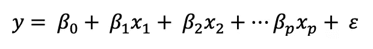
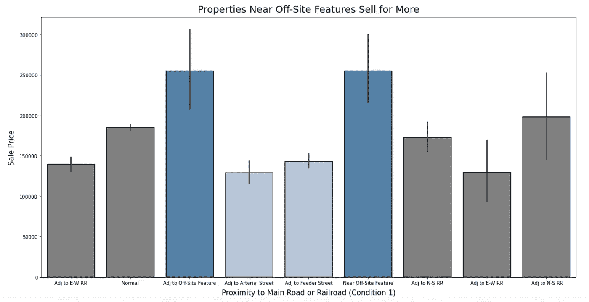
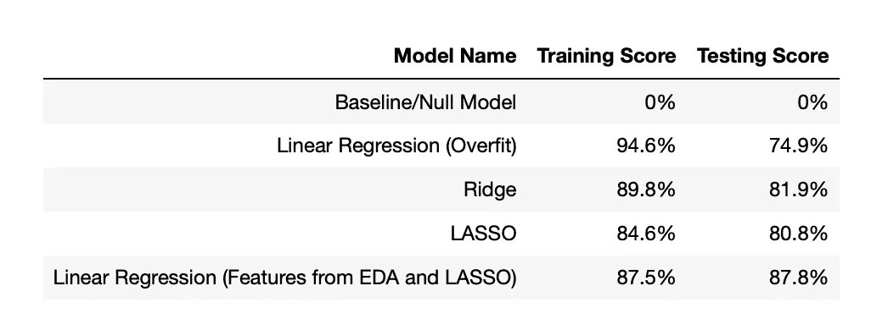
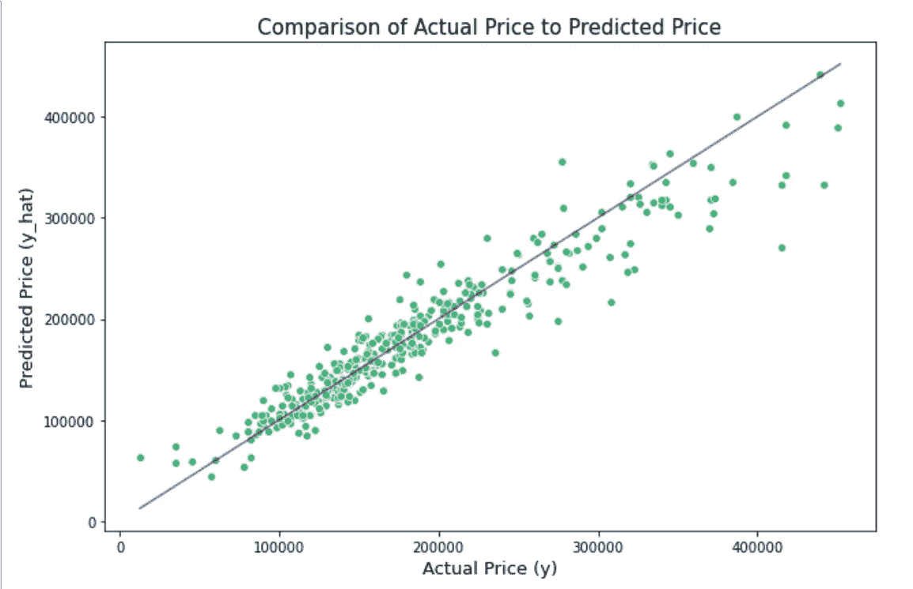

# 用线性回归预测房价

> 原文：<https://towardsdatascience.com/predicting-house-prices-with-linear-regression-4fc427cb1002?source=collection_archive---------16----------------------->

## 以埃姆斯住房数据集为特色的项目

史蒂文·昂格曼在 [Unsplash](https://unsplash.com?utm_source=medium&utm_medium=referral) 上的照片

在学习数据科学时，许多学生将学习的第一个有监督的机器学习模型之一是线性回归。线性回归试图模拟*预测变量* (X)和*数字目标变量* (y)之间的线性关系。对于用模型评估的每个观察值，将目标的实际值(y)与目标的预测值(ŷ)进行比较，并且这些值的差被称为 r*esidials。*线性回归模型的目标是最小化残差平方和。多元线性回归的方程式如下所示。

**图一**。多元线性回归方程。在该等式中，β0 是 y 轴截距，x 的每个值都是预测变量。对于每个预测因子，如果所有其他特征保持不变，β系数描述了 x 增加一个单位时 y 的变化。随机误差用ε表示。

对于初学者来说，学习线性回归最常见的方法之一是建立一个模型，根据房子的具体特征来预测房子的价格。对于这个项目，使用了 [Ames 住房数据集](http://jse.amstat.org/v19n3/decock.pdf)。该数据集包括 2006 年至 2010 年爱荷华州埃姆斯市出售的房屋信息。数据集中包含 2930 个观测值和 80 多个特征。

下面，我将描述我建立一个线性回归模型来预测房价的步骤。所有代码都托管在 [GitHub](https://github.com/jlu90/Ames-Housing-Project) 上。

# 步骤 1:导入库；获取和清理数据

埃姆斯住宅数据集是通过大会主办的 Kaggle 竞赛提供给我的。(然而，数据集也可以在这里公开[。)在开始研究数据或建模之前，我导入了代码 1 中所示的库。我还清除了丢失的值，确保没有异常值，并且每个特性都是适当的数据类型。](https://www.kaggle.com/prevek18/ames-housing-dataset)

**代码 1。**用于本项目的库

# 步骤 2:探索性数据分析(EDA)

在[之前的一篇文章](/discovering-patterns-in-data-with-exploratory-data-analysis-fd07ce1c5efa)中，我讨论了 EDA 对于在数据集中发现模式的重要性。对于这个项目，EDA 对于探索不同特征和目标(房屋销售价格)之间的关系同样重要。对于数字特性，我创建了一个相关矩阵，专门寻找相关系数的绝对值为 0.5 或更高的特性。这一步帮助我确定了与销售价格密切相关的几个特征，包括房子的整体质量、居住面积和车库的大小(就汽车数量和面积而言)。

**代码 2** 。数字特征的探索性数据分析

对于分类变量，理解不同类别和销售价格之间的关系要稍微复杂一些。总的来说，这个数据集包含超过 20 个分类特征，一些特征有超过 10 个不同的类别。为了降低模型的维度，我知道简单地对类别进行一次性编码是不可行的。为了解决这个问题，我为每个分类特征创建了条形图，以探索不同类别之间平均销售价格的差异。有趣的是，如下图所示，我开始注意到各种功能的一些类别开始聚集在一起。通过识别这些聚类，我能够设计特征来表示分类变量。

**代码 3。**具有分类特征的探索性数据分析条形图

**图一。**按条件 1 的销售价格。在这个用 Matplotlib 和 Seaborn 创建的条形图中，很明显，浅蓝色条形图和深蓝色条形图在销售价格和类别描述方面彼此相似。认识到这些相似性，这个具有九个类别的分类特征可以仅由两个二元特征来表示。

**代码 4。**将图 1 中的聚类转化为二元变量

# 第三步:模型准备

一旦我完成了对数据和工程特性的探索，就该为建模准备数据了。在这一步中，我使用`pd.get_dummies()`对任何感兴趣的分类变量进行虚拟化，并使用`train_test_split()`将我的数据分成训练集和测试集。

# 第四步:建模

建模是一个迭代的过程，在这个过程中，为了给我的最终模型提供信息，构建了几个模型。总共制造了六个模型。所有模型均采用 R2 评分进行评估。

**代码 5。**功能用于打印 R2 分数

**模型 1:** 该模型是使用`DummyRegressor()`创建的基线/空模型。当对每次观察的平均值进行预测时，进行研究以探索 R2 评分。

**代码 6。**虚拟回归模型

**模型 2:** 该模型是一个线性回归模型，使用在 EDA 过程中被识别为重要的特性。

**模型 3:** 在看到线性回归模型有改进的空间后，我将所有可能的特征放入一个模型中，以创建一个过拟合模型，然后可以将其正则化。

**模型 4:** 我尝试的第一种正则化是岭回归，它使用 L2 罚函数。

**代码 9。**缩放数据和岭回归

**模型 5:** 我尝试的第二种正则化是 LASSO 回归。

**代码 10。**套索回归

**模型 6:** 最终模型是线性回归，其特征在 EDA 和 LASSO 回归中被识别为重要。因为目标不是正态分布的，所以对于这个模型，它是对数变换的。

**代码 11。**最终线性回归模型。模型中有 47 个特征，包括:地段临街面、地段面积、整体质量、整体状况、建造年份、改造年份、砖石饰面面积、未完工地下室平方英尺、地上总房间数、车库大小(汽车)、车库面积、出售年份、总浴室数、可居住平方英尺、车库汽车 x 面积互动、邻里群 1、邻里群 2、1 层房屋(1946 年及以后)、2 层房屋(1946 年及以后)、1 层规划开发单元、靠近场外特征、靠近繁华街道、石材饰面、新销售、 房地产销售，良好的地下室，优秀的厨房，分区组 1，铺面街道，丘陵地带等高线，低土地等高线，水平土地等高线，复式，两户转换，联排别墅，联排别墅(末端单元)，附属车库，地下室车库，内置车库，汽车港口，独立车库，无车库，一般外观质量，良好外观质量，一般外观质量，部分铺面车道，全铺面车道。

# 第五步:型号选择

在我建立了我的模型之后，我比较了训练和测试的 R2 分数来挑选最好的模型。

**图二。**基线、过度拟合、山脊、套索和最终模型的 R2 得分

对我来说，最好的模型与线性回归建立在 EDA 和 LASSO 中确定的特征。该模型解释了测试集销售价格变化的 87.8%。

# 第六步:模型评估

在选择了我的最佳模型后，我通过计算均方根误差(RMSE)和比较实际值与预测值来进一步评估它的性能。

**均方根误差(RMSE)**

**代码 12。**计算均方根误差

根据 RMSE 的值，线性回归模型对销售价格的预测可能会相差约 23，625.19 美元。这小于训练数据中销售价格的标准偏差的 1/3。虽然提高这个数字很好，但这是一个很好的起点。

**销售价格的预测值与实际值相比如何？**

**图三。**显示预测销售价格与实际销售价格的图表

通过将预测价格与实际价格进行对比，我发现这个模型在预测所有价格时表现得并不一样好。具体来说，该模型似乎擅长预测 90，000 美元至 225，000 美元范围内的房地产价格，但它在两个极端都做得不好。在最初的测试数据集中，75%的房屋价格在 214，000 美元或以下。由于这些情况下的训练数据不足，该模型在极端值下可能表现不佳。

# 结论

虽然这篇文章中创建的线性回归模型并不完美，但它能够解释大约 87.8%的房产销售价格变化，并且能够预测 23，625.19 美元以内的销售价格。对该模型残差的进一步研究揭示了该模型在预测极值方面的一个特定弱点。具体来说，预测的理想范围似乎在 90，000 美元到 225，000 美元之间。为了更好地预测这个范围之外的价格，可以对模型进行一些更改。改进的想法包括对数转换特征和将一些分类变量编码为序数。

你参加过艾姆斯住宅挑战赛吗？你有什么建议或窍门？