# 用 Scikit-Learn 的随机森林模型预测房价

> 原文：<https://towardsdatascience.com/predicting-housing-prices-using-a-scikit-learns-random-forest-model-e736b59d56c5?source=collection_archive---------11----------------------->


图片来自 Getty Images

# **动机**

拥有一个房价预测模型对买卖双方来说都是非常重要的工具，因为它可以帮助他们做出明智的决定。对卖家来说，它可以帮助他们确定出售房屋的平均价格，而对买家来说，它可以帮助他们找到购买房屋的正确平均价格。

# **目标**

建立随机森林回归模型，能够预测房屋的中值。我们还将简要介绍一些探索性数据分析、特征工程和超参数调整，以提高我们的随机森林模型的性能。

# **我们的机器学习管道**

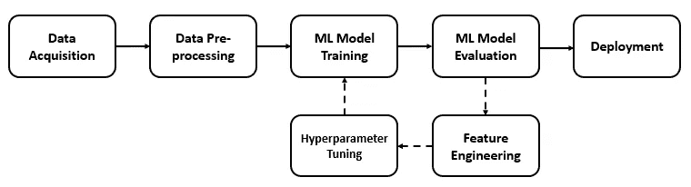

图片作者:简单的机器学习管道

我们的机器学习管道可以概括为以下任务:

1.  数据采集
2.  数据预处理和探索性数据分析
3.  创建基础模型
4.  特征工程
5.  超参数调谐
6.  最终模型培训和评估

# **第一步:数据采集**

我们将使用波士顿住房数据集*:*[*https://www.kaggle.com/c/boston-housing/data*](https://www.kaggle.com/c/boston-housing/data)*。*

```
#Importing the necessary libraries we will be using%load_ext autoreload
%autoreload 2
%matplotlib inlinefrom fastai.imports import *
from fastai.structured import *from pandas_summary import DataFrameSummary
from sklearn.ensemble import RandomForestRegressor
from IPython.display import displayfrom sklearn import metrics
from sklearn.model_selection import RandomizedSearchCV#Loading the DatasetPATH = 'data/Boston Housing Dataset/'
df_raw_train = pd.read_csv(f'{PATH}train.csv',low_memory = False)
df_raw_test = pd.read_csv(f'{PATH}test.csv',low_memory = False)
```

# 步骤 2:数据预处理和探索性数据分析(EDA)

**2.1 数据缺失和异常值的检查和处理。**

```
df_raw_train.info
```

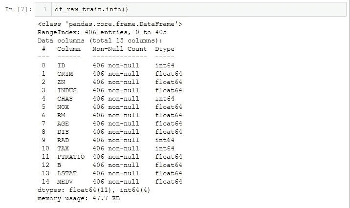

作者图片

了解原始数据:

根据上面的原始训练数据集:

(a)共有 **14 个变量(13 个自变量—特征和 1 个因变量—目标变量)**。
(b)**数据类型**要么是**整数**要么是**浮点数**。
(c) **不存在分类数据**。
(d)我们的数据集中没有**缺失值**。

**2.2 作为 EDA 的一部分，我们将首先尝试确定因变量(MDEV)的分布。**

```
#Plot the distribution of MEDVplt.figure(figsize=(10, 6))
sns.distplot(df_raw_train['MEDV'],bins=30)
```

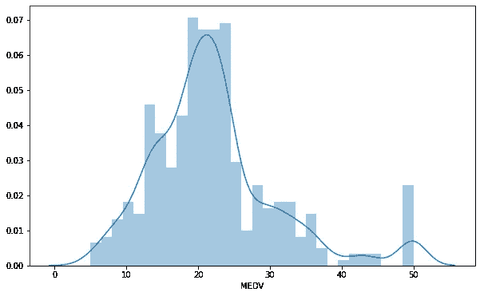

作者图片:MEDV 分布

MEDV **的值遵循**正态分布**且平均值约为 22。右边有一些异常值。**

**2.3 接下来，试着确定:**
**(i)自变量本身
(ii)自变量与因变量**之间是否有相关性

为此，我们来做一个关联热图。

```
# Plot the correlation heatmapplt.figure(figsize=(14, 8))
corr_matrix = df_raw_train.corr().round(2)
sns.heatmap(data=corr_matrix,cmap='coolwarm',annot=True)
```

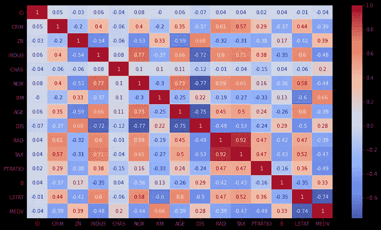

作者图片:相关热图

**(i)独立变量之间的相关性** :
我们需要寻找多重共线性的特征(即彼此相关的特征)，因为这将影响我们与独立变量的关系。

注意到 **RAD** 和 **TAX** 彼此**高度相关**(相关分数:0.92)，而有几个特征彼此稍微相关，相关分数约为 0.70 (INDUS 和 TAX、NOX 和 INDUS、AGE 和 DIS、AGE 和 INDUS)。

**(二)自变量与因变量之间的相关性** :
为了让我们的回归模型表现良好，理想情况下我们需要选择那些与我们的因变量(MEDV)高度相关的特征。

我们观察到 **RM** 和 **LSTAT** 都与和 **MEDV** 相关，相关系数分别为 0.66 和 0.74。这也可以通过散点图来说明。

```
#Scatter plot to observe the correlations between the features that are highly correlated with MEDVtarget_var = df_raw_train['MEDV']plot1 = plt.figure(1)
plt.scatter(df_raw_train['RM'],target_var)
plt.xlabel('RM')
plt.ylabel('MEDV')plot2 = plt.figure(2)
plt.scatter(df_raw_train['LSTAT'],target_var)
plt.xlabel('LSTAT')
plt.ylabel('MEDV')
```

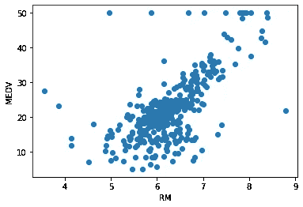

作者图片:RM 与 MEDV 散点图

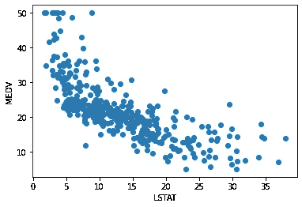

作者提供的图片:RM 与 LSTAT 的散点图

从上面的散点图来看:
i) **MEDV 随 RM 线性增加。这是有道理的，因为我们预计随着房间数量的增加，房子的中值价格会更贵。MEDV 随 LSTAT 线性下降。这也是有道理的，因为我们可以预期，在社会地位较低的地方，房子的中值价格通常会更便宜。**

# 步骤 3:创建基础模型

停下来。在我们创建我们的基本随机森林模型之前，选择一个合适的评估标准是非常重要的。


图片来自 imgflip.com

**3.1 选择正确的评估指标**
选择正确的评估指标将有助于我们评估我们的模型性能是否良好。对于回归问题，最常用的评估指标是**均方根误差(RMSE)** 或**均方根逻辑误差(RMLSE)** 。

**RMSE** :这是我们的模型预测值和实际值之间的平方差。

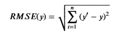

均方根误差公式

*其中 y:预测值，y:实际值*

**RMSLE** :它是我们的模型预测的对数和实际值的对数之间的平方差的度量。

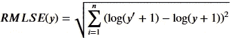

均方根逻辑误差

*其中 y:预测值，y:实际值*

RMSLE 可能是一个更好的评估指标，因为(1)它足够稳健，可以处理我们在数据集中看到的异常值(2) RMSLE 会因低估实际值而招致更大的损失。如果我们站在卖家的角度，我们不想低估价格，因为这会导致损失。然而，对于这个项目，我们不会站在任何一方，我们将选择 **RMSE** 作为**评估指标**，因为我们将使用不受异常值影响的随机森林模型。

**3.2 创建我们的基础随机森林模型**

下一步是首先创建一个基本模型，不进行任何特征工程和超参数调整。在我们完成特征工程和超参数调整之后，我们将使用这个模型的性能作为比较的基准。

我们选择的机器学习模型是随机森林回归模型，原因如下:

1.  随机森林模型**需要最少的数据准备**。它能够轻松处理分类、数字和二进制特征，无需缩放或标准化。
2.  随机森林模型可以帮助我们执行隐含的特征选择，因为它们提供了重要特征的良好指标。
3.  随机森林模型**不受离群值**的影响，离群值存在于我们的数据中，它们**完全忽略了统计问题**，因为不像其他机器学习模型在标准化后表现得更好。


照片摄于 frontiersin.org

我们想创建一些有用的函数:

```
# A function to split our training data into a training set to train our  model and a validations set, which will be used to validate our model.def split_vals(a,n):
    return a[:n],a[n:]# Functions that will help us calculate the RMSE and print the score.def rmse(x,y):
    return math.sqrt(((x-y)**2).mean())def print_score(m):
    res =[rmse(m.predict(X_train),y_train),rmse(m.predict(X_valid),y_valid),m.score(X_train,y_train),m.score(X_valid,y_valid)]
    if hasattr(m,'oob_score_'):res.append(m.oob_score_)
    print(res)
```

进一步拆分我们的训练数据—用于训练随机森林模型的训练数据和用于验证模型性能的验证数据。

```
n_valid = 100
n_train = len(df_raw_train)-n_valid
X_train,X_valid = split_vals(df_raw_train.drop('MEDV',axis=1),n_train)
y_train,y_valid = split_vals(df_raw_train['MEDV'],n_train)
X_test = df_raw_test
```

在没有特征选择和超参数调整的情况下创建和拟合我们的随机森林模型**。**

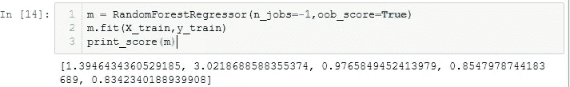

从我们的基本随机森林模型中，我们已经得到了一个非常不错的结果，其中**训练 RMSE** 为 **1.394** ，而**验证 RMSE** 为 **3.021** 。但是，请注意，我们的模型似乎**比**更适合，因为验证 RMSE 比训练 RMSE 大约高 3 倍。

因此，击败的**基线分数是**验证 RMSE 3.021** ！**

# 步骤 4:特征工程

特征工程和超参数调整是机器学习管道中的**基本步骤**。

**4.1 确定重要特征**
我们数据中的特征直接影响着我们的随机森林模型及其实现的结果(即，我们准备和选择的特征越好，我们实现的最终结果就越好！).因此，我们将通过确定哪些特性在之前的基础模型中被认为是重要的，来探索和微调我们的随机森林模型。

```
def feat_importance(m,df_train):
    importance = m.feature_importances_
    importance = pd.DataFrame(importance,index=df_train.columns,columns=["Importance"])
    return importance.sort_values(by=['Importance'],ascending=False)importance = feat_importance(m,X_train)
importance[:]
```

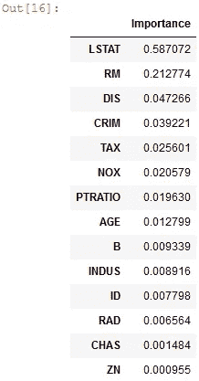

分级特征重要性系数

```
importance.plot(kind='barh')
```

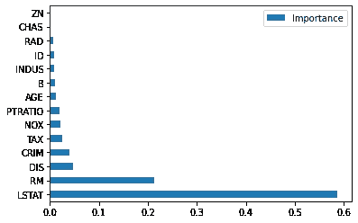

分级特征重要性条形图

我们观察到在预测 MDEV 时最重要的特征是 **LSTAT** 和 **RM** 。回想一下，之前发现这两个参数与 MDEV 高度相关。

**4.2 丢弃不重要的特征**
下一步将尝试丢弃重要性系数小于 0.01 的特征，并使用它再次为我们的随机森林建模，以查看我们的预测结果是否有改进。

```
#Discarding features with feature coefficients less than 0.01to_keep = importance[importance['Importance'] > 0.01].index
df_raw_train_keep = df_raw_train[to_keep].copy()
df_raw_test_keep = df_raw_test[to_keep].copy()#Splitting data into training and validation setX_train,X_valid = split_vals(df_raw_train_keep,n_train)# Fitting our Random Forest Model after discarding the less important features.
```

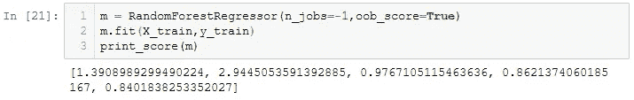

我们的随机森林模型在移除了一些冗余功能(即 6 个功能)后，表现**稍好**！).我们已经获得了确定因变量 MEDV 的前 9 个最重要的特征(LSTAT、RM、DIS、CRIM、TAX、NOX、PTRATIO、NOX 和 AGE)。

接下来，让我们看看对于我们的随机森林模型来说重要的特性的等级是否有任何变化。

```
def feat_importance(m,df_raw_train_keep):
    importance = m.feature_importances_
    importance =
pd.DataFrame(importance,index=df_train.columns,columns=["Importance"])
    return importance.sort_values(by=['Importance'],ascending=False)importance
```

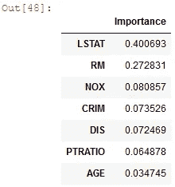

去除冗余特征后的分级特征重要性系数

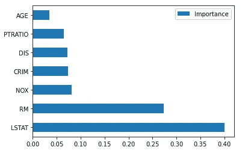

移除冗余特征后的分级特征重要性条形图

我们观察到，在先前移除冗余特征之后，最重要的特征仍然是 LSTAT 和 RM。我们想探究逐一删除剩余的每个功能会如何影响我们的总体得分。

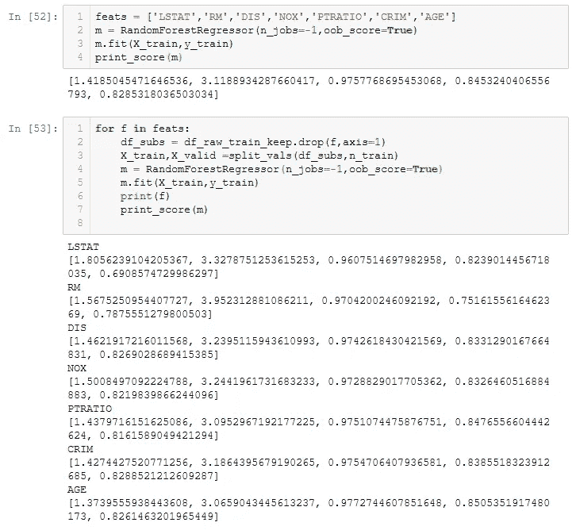

请注意，删除 RM、LSTAT、DIS 和 CRIM 会导致更差的验证 RMSE，而删除 AGE 和 PTRATIO 会给我们一个稍好的分数。因此，在运行最终模型之前，我们将**进一步从数据集中删除 AGE** 和 **PTRATIO** 。

**4.3 去除独立要素间的多重共线性**

在 2.3(i)中，有一些相互关联的特征。为了提高模型的性能，我们最好是**移除特征之间的多重共线性**。

为了了解这些特征是如何相互关联的，我们可以绘制一个树状图。

```
#Dendogram plotfrom scipy.cluster import hierarchy as hc
corr = np.round(scipy.stats.spearmanr(df_raw_train_keep).correlation,4)
corr_condensed = hc.distance.squareform(1-corr)
z = hc.linkage(corr_condensed,method='average')
fig = plt.figure(figsize=(16,10))
dendogram = hc.dendrogram(z,labels=df_raw_train_keep.columns,orientation='left',leaf_font_size=16)
plt.show()
```

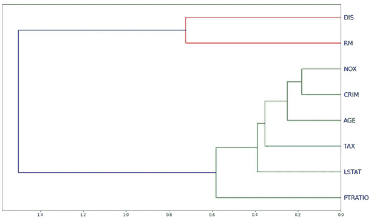

重要特征之间的树状图

从树状图中，**在排名方面**我们可以看到，没有一个特征是衡量同样的东西。排名最接近的是 NOX 和 CRIM。

如果在排名方面存在非常接近的特征，下一步将是移除这些特征，一次移除一个，看看我们的模型是否可以进一步简化，而不影响我们的验证 RMSE 分数。然而在这种情况下，我们不需要。

# 步骤 5:超参数调整

我们已经到了最后一步(万岁！)才能建立最终的随机森林模型。

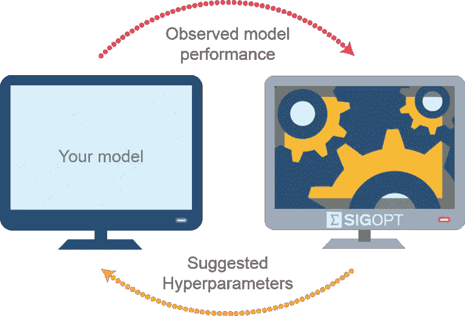

图片来自 tech-quantum.com

超参数调整是一个**迭代过程** s，由此我们**选择**超参数的**最佳配置**，这为我们提供了**最佳模型性能输出**。对于随机森林模型，我们将重点调整 3 个超参数:

**(1) n_estimators** :在我们的随机森林中创建和推广的树的数量。很可能，我们创建的树越多越好，因为这将使我们能够对更多的数据集进行采样，并帮助我们更好地进行归纳。然而，会有这样一种情况，即以计算能力为代价，增加树的数量只会对我们的验证 RMSE 产生非常小的改变。

**(2) min_samples_leaf** :表示叶子节点中的样本数。每当我们将 min_sample_leaf 加倍时，我们就从树中删除了一层，并将叶节点的数量减半。因此，增加 min_samples_leaf 的结果是，我们的每个叶节点内将有多个样本，因此当我们计算该叶节点的平均值时，它将更加稳定，尽管我们将获得稍小的深度和较少的节点数。因此，尽管每棵树的预测性和相关性都不会降低，但我们的模型应该能够更好地概括并防止过度拟合。

**(3) max_features** :表示每次分割要考虑多少个特征。

为了优化和搜索最佳超参数，我们将使用**随机网格搜索方法**！

```
n_estimators = [int(x) for x in np.arange(start = 10, stop = 2000, step = 10)]
max_features = [0.5,'auto', 'sqrt','log2']
min_samples_leaf = [1, 2, 4]
bootstrap = [True, False]
random_grid = {'n_estimators': n_estimators,
               'max_features': max_features,
               'min_samples_leaf': min_samples_leaf,
               'bootstrap': bootstrap}# First create the base model to tune
m = RandomForestRegressor()
# Fit the random search model
m_random = RandomizedSearchCV(estimator = m, param_distributions = random_grid, n_iter = 100, cv = 3, verbose=2, random_state=42, n_jobs = -1)
m_random.fit(X_train, y_train)
m_random.best_params_
```

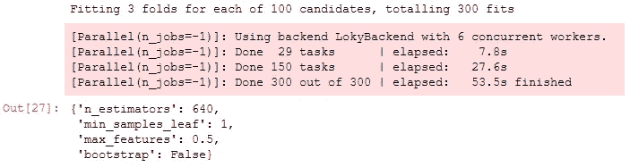

从我们的随机网格搜索中，我们发现我们的随机森林模型的最佳超参数是上面那些。

# 第六步:最终模型

最后一步——构建我们的最终模型。为此，我们将放弃前面讨论过的年龄和比率特性。


图片来自 gurutzeunzalu.blogspot.com

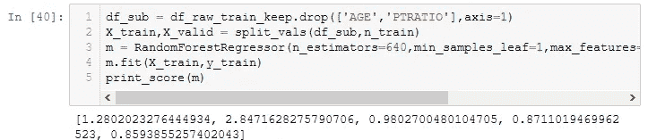

我们已经获得了 2.847 的**验证 RMSE 分数，这比我们原来的基础模型**验证 RMSE 分数 3.021** 要好！**

另外，****最终验证 R 分**为 **0.87** ，这比**基础款**的**验证 R 分**0.85 要好。R 分数告诉我们我们的模型能够在多大程度上解释数据集中的变化。得分为 0.87 表明我们的模型可以解释数据集中 87%的变化。**

**因此，我们看到简单的最终模型即使具有较少的输入特性也表现得更好！**

# **额外的一步:部分独立**

**虽然我们已经创建了一个更好的模型，让我们后退一步，进一步探索我们的结果。**

**之前，我们观察到房价上涨中值(MDEV)和房间数量(RM) 之间存在**线性关系。****

**让我们试着做一个 ggplot。**

```
from pdpbox import pdp
from plotnine import *
ggplot(df_raw_train, aes('RM', 'MEDV'))+stat_smooth(se=True, method='loess')
```

**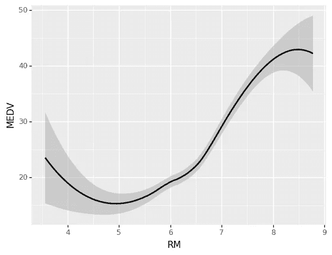**

**ggplot**

**基于上面的 gg 图，我们观察到 RM 和 MEDV 之间的关系是**而不是**我们所期望的。例如，人们通常会认为房价会随着房间数量的增加而上涨。然而，我们看到 4 房和 5 房之间的价格下降，同样 8 房和 9 房之间的价格下降。**

**这里的问题是我们正在查看**单变量关系**并且在单变量图中**丢失**的特征之间有**许多相互作用**。例如，为什么 5 间房的价格比 4 间房的价格低，而 6 间房的价格和 4 间房的价格差不多？**

**因此，要找到 RM 和 MEDV 之间的真实关系，我们需要做一个**部分独立图**(即假设所有其他特征相同，房子的价格如何随房间数量而变化)来查看真实关系。**

```
def plot_pdp(feat,clusters=None,feat_name=None):
    feat_name = feat_name or feat
    p = pdp.pdp_isolate(m,X_train,feat)
    return pdp.pdp_plot(p,feat_name,plot_lines=True,cluster=clusters is not None,n_cluster_centers = clusters)
plot_pdp('RM')
```

**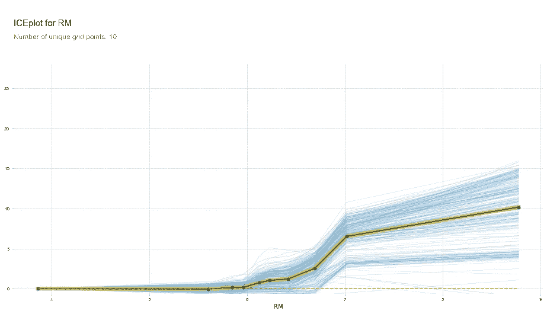**

**PDP 图**

**从上面的部分依赖图(PDP)中注意到，在去除所有其他外部因素后，我们观察到 RM 和 MEDV 之间的关系几乎是一条直线(即大致线性)，这正是我们所预期的。黄线代表所有交易的平均 MEDV。**

**现在我们来探讨 LSTAT 和 RM 是如何影响房价中位数的。**

```
feats = ['LSTAT','RM']
p = pdp.pdp_interact(m,X_train,feats)
pdp.pdp_interact_plot(p,feats)
```

**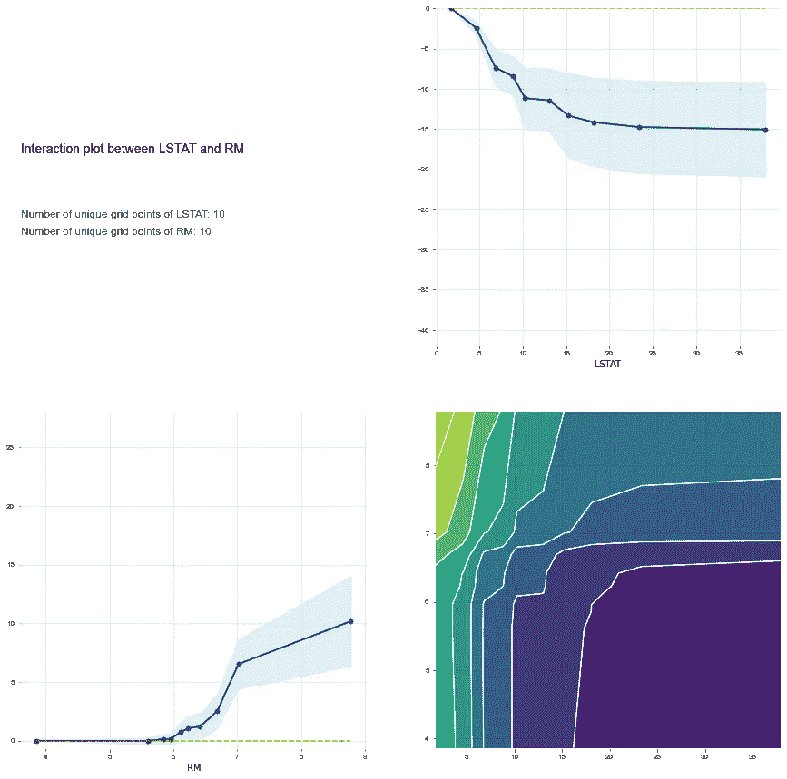**

**因此，查看 PDP 图，我们可以有把握地得出结论:**房间数量(RM)线性影响中值房价(MEDV)**。人口的状况反过来影响着 MEDV。**

# **最后的想法和下一步**

**我们建立了一个随机森林模型，其**验证 RMSE 分数为 3.021** 和**验证 R 分数为 0.87** 。**

**我们还从我们的随机森林模型中确定了**影响**的**关键特征**。波士顿的**中值房价(MEDV)** 是 **(1) LSAT** :低人口状况的百分比 **(2) RM** :每所住宅的平均房间数 **(3) NOX** :氮氧化物浓度 **(4) CRIM** :城镇人均犯罪率。**

**我们建造的最终模型远非完美。例如，观察我们最终模型中的**培训 R 分数**比 **0.87** 的**验证 R 分数**高出**0.98**。这表明最终模型能够解释训练数据中 98%的变化，而仅解释验证数据中 87%的变化(即最终模型仍然**过度拟合**训练数据，并且**没有将** **以及**推广到验证数据)。**

**解决过度拟合的一个简单方法是尝试**增加数据集的大小来训练我们的模型。**目前，我们的数据集中只有 406 个条目，**根本不够用**。**

**祝贺并感谢你坚持到最后。我真诚地希望你学到了新的东西！快乐学习！😬**