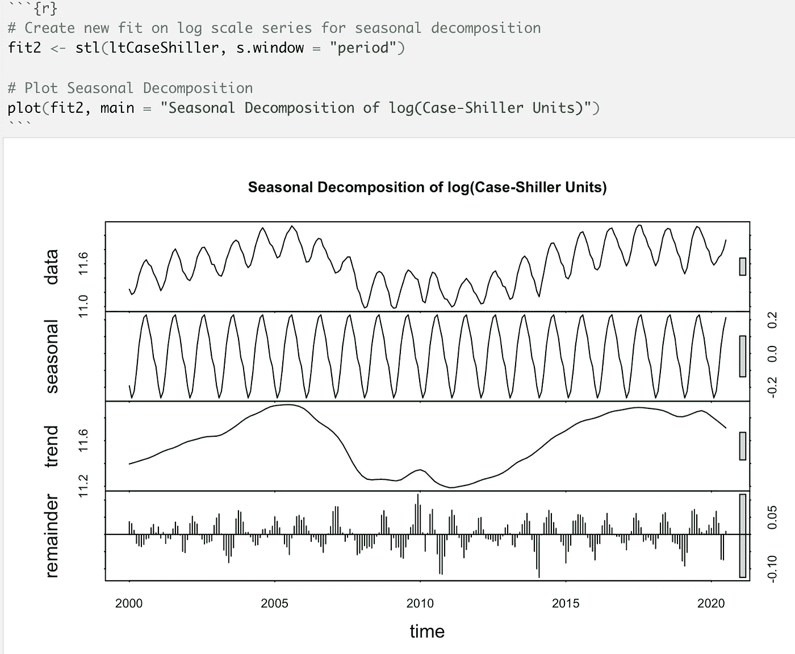
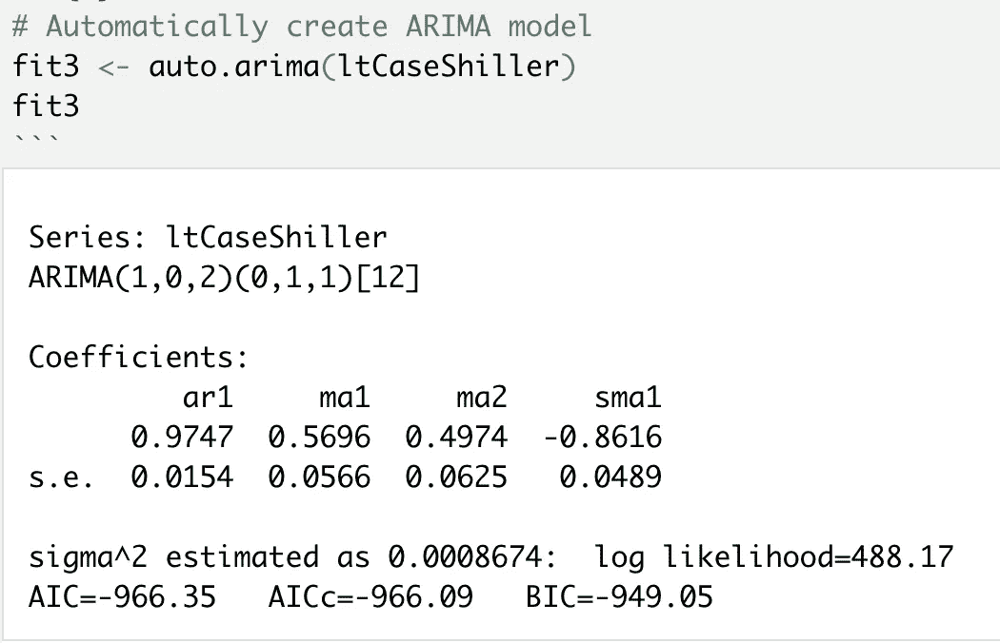

# 用 R 预测房价

> 原文：<https://towardsdatascience.com/predicting-housing-prices-with-r-c9ec0821328d?source=collection_archive---------17----------------------->

## [实践教程](https://towardsdatascience.com/tagged/hands-on-tutorials)

## *使用 ARIMA 模型和 Case-Shiller 指数以及一些创造性的 R 程序，我们可以预测下一年的全国房价。这怎么可能呢？！让我们来了解一下！*


照片由[亚历克斯·瓦西](https://unsplash.com/@alexrvasey?utm_source=medium&utm_medium=referral)在 [Unsplash](https://unsplash.com?utm_source=medium&utm_medium=referral) 上拍摄

# 目标

1.  预测下一年美国房价
2.  获得使用真实经济数据的经验
3.  将数据可视化
4.  理解数据的基本假设
5.  了解使用 ARIMA 方法的预测建模

# 介绍

这个项目是为两种人设计的——对代码感兴趣的人和对房地产市场感兴趣的人。虽然这些概念将通过技术定义和代码示例来介绍，但要了解房价、预测模型或经济数据的周期性本质，并不需要理解代码。

对于那些只是阅读的人来说，尽量不要被代码所困扰。沿途寻找图像和情节，因为我会尽可能简单地用简单的英语解释正在发生的事情以及为什么这对我们很重要。

对于那些跟随代码的人来说，我假设您可以设法设置一个 R 环境。我的示例将使用 RStudio 在 Mac 上的 R Markdown 文件中本地运行，但任何其他本地或基于云的方法也应该工作得很好。

你可以从我的 GitHub [这里](https://github.com/ARIMA-Consulting/Case-Shiller-Project)获得所有文件。

让我们投入进去吧！

# 获取数据

获取数据最简单的方法是从我的 GitHub [这里](https://github.com/ARIMA-Consulting/Case-Shiller-Project)下载文件，或者去 FRED(美联储经济数据)为自己下载 [S & P/Case-Shiller 20 个城市房价销售对计数(SPCS20RPSNSA)](https://fred.stlouisfed.org/series/SPCS20RPSNSA) 数据[1]。如果你是从 FRED 那里下载的，就把它作为一个 CSV 文件来使用。

出于各种原因，我们在这个项目中使用了 20 个城市的变量，但主要是因为它没有经过季节性调整，并能很好地反映房地产市场每月的变化。

数据的原始来源来自标准普尔基于一个指数，该指数最初由耶鲁大学教授、2013 年诺贝尔经济学奖得主罗伯特·希勒[2][3]和卡尔·凯斯(Karl Case)共同开发，后者获得了哈佛大学经济学博士学位，并在韦尔斯利大学任教数十年[4]。看看最后参考文献中的链接，了解更多关于席勒博士和凯斯博士的信息。

# 代码

## 加载库

第一项任务是加载一些我们需要完成项目的库。为此，我们所需要的就是[预测](https://cran.r-project.org/web/packages/forecast/forecast.pdf)、[序列](https://cran.r-project.org/web/packages/tseries/tseries.pdf)和[潮汐](https://www.tidyverse.org/)库。单击上一句中的名称可获得每个文档的链接！

代码如下:

```
# If these libraries are not installed on your machine, you can use the install.packages("name_of_package") command and library(name_of_package) to do the same thing as the require() function I am using below. I just like require because it is a single line of code :)# Import Libraries
require(forecast)
require(tseries)
require(tidyverse)
```

## 导入数据

接下来，我们需要导入数据。我使用的是直接从 FRED [1]下载的 CSV(逗号分隔值)文件。您还可以通过不同的方式阅读 Excel 格式，或者通过获得加分并从 FRED API 中提取来使用 Excel 格式。对于这个，它只有几千字节，所以本地 CSV 就可以了。确保数据与您的 R 或 R Markdown 文件在同一个目录下，以便使用 my code，或者如果数据在不同的位置，则从其确切的文件路径导入数据

**MAC 用户注意:不要打开带数字的 CSV 文件。如果你这么做，r 将很难解码数据。下载的时候忍住双击的冲动。如果您这样做，您将需要删除该文件并下载一份新的副本，而不要在 Numbers 中打开它。**

代码如下:

```
# Import Data
CaseShiller <- read.csv("SPCS20RPSNSA.csv")# Check data import
head(CaseShiller)
```

以下是输出结果:


凯斯席勒索引的前 6 行。数据由标准普尔和圣路易斯美联储银行提供(美联储经济数据)。参考文献中的引文[1]。

## 将数据转换为时序对象

为了做 ARIMA 模型(我们马上就要到了！)，我们需要用 *ts()* 函数将原始数据转换成时间序列对象。通过一点数据争论，我们可以使列名更好一些，简化数据结构，并使我们的日期更容易配合。做这件事的方法不止一种，但这是我知道的最简单的方法。

代码如下:

```
# Change name of data column to Units
names(CaseShiller)[2] <- "Units"# Creates a Units Object as intermediate to transform into time series
CSUnits <- CaseShiller$Units# Creates Time Series Object that starts in January 2000 with a monthly frequency
tCaseShiller <- ts(CSUnits, start = c(2000, 1), frequency = 12)# Check Data Transformation
tCaseShiller
```

以下是输出结果:


为 Case-Shiller 索引创建的时序对象的表。数据由标准普尔和圣路易斯美联储银行提供(美联储经济数据)。参考文献中的引文[1]。

那么，为什么我们需要将数据转换成时间序列对象呢？这不是和我们开始的时候一样的数据吗？

嗯，是和不是。当创建 ARIMA(自回归综合移动平均)，只有一个变量被使用[5]。ARIMA 模型使用真实值，然后将数据滞后一段时间以创建残差，残差是衡量现实和预期之间差异的值[5]。当处理这样的数据时，创建一个时间序列对象是让单变量数据与 R [5]合作的最佳方式。

ARIMA 模型是复杂的统计工作。他们有 *p* 、 *d* 和 *q* 值与之相关联[5]。通常会写成这样:ARIMA(p，d，q) [5]。

*p* 值处理模型的自回归部分，通常处理模型的线性部分如何与前面的点结合的顺序[5]。

*d* 值处理模型中出现差异的次数，这有助于使数据随着时间的推移更加稳定，不同的值以不同的方式影响输出[5]。

*q* 值处理模型的移动平均部分，通常处理误差如何以线性方式与模型交互[5]。

为 ARIMA 模型确定正确的 *p* 、 *d* 和 *q* 值是一门艺术和科学，我们需要检查一些自相关数并做一些实验，但我们在这里学习并将使用自动选择功能，如下一段代码所示[5]。

要记住的最后一个想法是，ARIMA 模型不喜欢方差很大的数据，所以需要做一些工作，这通常涉及到对数变换[5]。我们以后再担心那个，所以你会明白我的意思的。

## ARIMA 模型创建

现在是有趣的部分！我们可以使用 R 中的 *auto.arima()* 函数来替我们完成这项艰巨的工作。

代码如下:

```
# Automatically create ARIMA model
fit <- auto.arima(tCaseShiller)
fit
```

以下是输出结果:


R 中 auto.arima()函数对时间序列 Case-Shiller 数据的结果

根据我的理解，当自动函数给出两组 *p* 、 *d* 和 *q* 值时，这意味着它们给出了相同的结果，这种情况确实会不时发生，取决于数据如何通过建模过程计算出来[5]。

我们可以再花一个小时来详细说明这里的每一点统计数据，但故事的重点是我们希望我们的模型少出错。为此，我们将重点关注 AIC(赤池的信息标准)值，并使其尽可能小。

## 模型精度

通过测量模型准确性，我们可以得到各种统计方法来衡量模型错误程度。

代码如下:

```
# Check Accuracy
accuracy(fit)
```

以下是输出结果:


时间序列 Case-Shiller 数据的第一个 auto.arima 拟合精度

如果你擅长统计学，你会认识这些术语。就我们的目的而言，大数值是不好的，小数值是好的。我们稍后将回到这些值。如果你不知道这些是什么意思，试着在谷歌上搜索“统计*在这里插入缩写*”来获得更完整的定义。

## 制作并绘制我们的第一个预测

通过创造性地使用 *plot()* 和 *forecast()* 函数，我们可以用预测值绘制原始数据，预测值周围有 80%和 95%的误差阴影。我选择预测 12 个周期，因为我们有月度数据，我们可以真正看到该模型在一年的时间内是否有意义。

代码如下:

```
# Create a Simple Plot with a forecast for the next year
plot(forecast(fit, 12), xlab = "Date", ylab = "Units", main = "ARIMA Forecast for Case-Shiller Index")
```

以下是输出结果:


基于凯斯席勒指数 ARIMA 模型的历史值和预测值图。数据由标准普尔和圣路易斯美联储银行提供(美联储经济数据)。参考文献中的引文[1]。

如果您想查看带有置信区间的预测值表，请使用以下代码:

```
# Get table of forecasted values. Check back next year to see whether this was close!
pred_values <- forecast(fit, 12)
pred_values
```

这是表格的前 10 行:


凯斯席勒指数 R 中 ARIMA 模型的预测值和置信带数。

很神奇，对吧？！蓝线是下一年的预测值。较暗的阴影区域是 80%置信区间，较亮的阴影区域是 95%置信区间。

看起来很棒，但是这是什么话？如果我们打算用它来计算如何投资，我们真正能看到的是它上下波动，我们不知道价格会比往年更高、更低还是完全一样。这是一个好的开始。我们继续吧。

## 检查我们的假设

我们有一个模型，但我们如何知道我们甚至可以开始信任它？首先，我们需要检查数据是否正常(或者至少足够正常！)分布式[5]。其次，我们需要看看我们是否有任何有意义的自相关[5]。

为此，我们将使用 Q-Q 图来观察常态。简而言之，如果我们几乎所有的点都在这条线上或相对接近这条线，我们就有正常的数据[5]。对于 ARIMA 模型和一般的数据科学来说，正常的数据意味着我们的生活要容易得多。

对于自相关，我们将使用 Box-Ljung 检验。自相关对我们的目的是不利的。这意味着我们的数据本质上是一个逻辑同义反复，下一条数据有它的价值，因为前一条数据说那是它应该被估价的[5]。自相关有点像从 1 到 10 的整数序列，表示 2 跟随 1，3 跟随 2，4 跟随 3，等等。因为这就是模式。A 是 A，因为 A 是 A，我们不想用它来预测未来。这里没有帮助。

让我们来看看一个简单的方法来验证我们的假设是有根据的。

代码如下:

```
# Check assumptions of normality & Autocorrelation
qqnorm(fit$residuals)
qqline(fit$residuals)
Box.test(fit$residuals, type = "Ljung-Box")# Has high p-value, so autocorrelations not significantly different than 0
# There are a few possible outliers, but most of the data is pretty normally distributed
```

以下是输出结果:


我们第一个 ARIMA 模型的 Q-Q 图


我们的第一个 ARIMA 模型的 Box-Ljung 测试输出

这里的生活真好！我们的数据在 Q-Q 图上看起来很好，所以我们得出结论这是正常的[5]。对于 Box-Ljung 检验，我们有一个大的 p 值，表明我们的自相关与 0 没有显著差异[5]。如果这里的 p 值为 0.05 或更小，我们将至少 95%确定我们的数据不同于 0，这意味着自相关可能存在[5]。谢天谢地，这里一切正常！

## 时间序列数据的对数变换

目测数据，看起来我们的数据是季节性的。我们需要做一个季节分解来证实这是真的。然而，强烈建议使用对数转换数据[5]。所以让我们开始吧！

代码如下:

```
# Transform time series to log scale
ltCaseShiller <- log(tCaseShiller)# check it worked
head(ltCaseShiller)
```

以下是输出结果:


对数变换我们的时间序列数据的对数的 ARIMA 模型

## 季节性分解

做一个季节性分解可以去除每年的变化，从而发现数据是真的季节性的还是看起来像是季节性的[5]。我们可以看到去除所有噪声后的数据的季节变化和总体趋势[5]。让我们看看那个。

代码如下:

```
# Create new fit on log scale series for seasonal decomposition
fit2 <- stl(ltCaseShiller, s.window = "period")# Plot Seasonal Decomposition
plot(fit2, main = "Seasonal Decomposition of log(Case-Shiller Units)")
```

以下是输出结果:



凯斯席勒指数的季节性分解。数据由标准普尔和圣路易斯美联储银行提供(美联储经济数据)。参考文献中的引文[1]。

我们可以清楚地看到，这些数据始终具有很强的季节性，并且具有长期的涨跌趋势。

## 按年份的季节性绘图

让我们更仔细地看看这个问题，并在我们的数据集中绘制每年的指数。作为 tidyverse 的一部分，ggplot2 库可以通过使用 *ggseasonplot()* 函数来帮助使用。

代码如下:

```
# Create a Season Plot
ggseasonplot(tCaseShiller, year.labels = TRUE, col = rainbow(20))
```

以下是输出结果:


凯斯席勒指数的季节曲线图。数据由标准普尔和圣路易斯美联储银行提供(美联储经济数据)。参考文献中的引文[1]。

我们可以很清楚地看到，记录在案的每一年都遵循同样的模式。冬天价格低，夏天价格高。听起来差不多。

## 循环返回以比较模型

还记得我说过 ARIMA 模型喜欢波动性较小的数据吗？让我们看看当我们使用我们的日志转换数据时会发生什么。我们已经讨论了这些步骤，所以让我们用新数据快速地重复一遍这个过程，以比较结果。

## 创建新的 ARIMA 模式

自动创建我们的新 ARIMA 模型的代码与之前完全相同，除了我们将数据对象的名称改为 log 转换的名称。

代码如下:

```
# Automatically create ARIMA model
fit3 <- auto.arima(ltCaseShiller)
fit3
```

以下是输出结果:



使用对数转换数据的新 ARIMA 值

那么这里有什么不同呢？嗯，这次我们有不同的 *p* 、 *d* 和 *q* 值，以及非常不同的 AIC 值。未经对数变换的原始数据的 AIC 约为 4500。现在我们在-966。正负并不重要，所以我们唯一关心的是得到绝对值最小的 AIC 值[5]。这意味着我们基于对数转换数据的模型更适合[5]。

## 再次检查准确性

让我们再来看看准确度分数。原始精度在顶部，新精度在底部。请记住，较低的数字意味着模型错误较少。你注意到了什么？

代码如下:

```
# Check Accuracy
fitAccuracy <- data.frame(accuracy(fit))
fitAccuracy2 <- data.frame(accuracy(fit3))fitAccuracyFinal <- rbind(fitAccuracy, fitAccuracy2)
fitAccuracyFinal
```

以下是输出结果:


两种 ARIMA 模型的误差度量精度表

我注意到，当使用对数转换数据时，几乎每个误差的统计测量都至少比原始数据小一个数量级。这是一个好迹象！

## 绘制测井转换数据

就像之前一样，让我们看看一个基本的情节来形象化的预测。当然，y 轴是以对数为单位的，但是你也会有同样的想法。

代码如下:

```
# Create a Simple Plot with a logged forecast for the next year
plot(forecast(fit3, 12), xlab = "Date", ylab = "Units", main = "ARIMA Forecast for Case-Shiller Index")
```

以下是输出结果:


基于凯斯席勒指数 ARIMA 模型的历史和对数转换预测值图。数据由标准普尔和圣路易斯美联储银行提供(美联储经济数据)。参考文献中的引文[1]。

需要明确的是，这个模型中仍然存在大量的不确定性，但这里的要点是，它给了我们一组不同的值，可能更接近真实的中心趋势。

## 最终预测结果

为了轻松获得最终表格，我们可以将预测放入数据框中，使用 *exp()* 函数，通过将输出缩放回对数转换数据的正常值，然后将预测数字合并到带有适当标签的数据框中，从而消除对数值。

代码如下:

```
# Get table of forecasted values. Check back next year to see whether this was close!
# Original Data
pred_values <- data.frame(forecast(fit, 12))# Log transformed data
pred_values2 <- data.frame(forecast(fit3, 12))
pred_values2[,1:5] <- exp(pred_values2[,1:5])# Merge forecast predictions!
mergedDF <- data.frame(Date = rownames(pred_values), Original_Data_Forecast = pred_values$Point.Forecast, Log_Transformed_Data_Forecast = pred_values2$Point.Forecast, Difference = round(pred_values$Point.Forecast - pred_values2$Point.Forecast, 2))
mergedDF
```

以下是输出结果:


原始数据和对数转换数据预测的最终结果

对于最终的解释，模型通常是接近的。在接下来的几个月里，他们的预测更加接近 4-10 个月的时间范围。这是有道理的，因为不确定性源于多种原因。

# 结论

希望这篇文章有趣，有娱乐性，有教育意义。我认为使用真实数据用代码探索想法是学习和变得更好的好方法。这个项目和代码源自我的正规教育背景，是经济理念和编程的良好结合。我认为它也很好地强调了经济的某些部分既可以是周期性的，也可以是稳定的。

如果您有任何改进建议或未来要探索的主题，请联系我们。

# 参考

[1] S&P 道琼斯指数有限责任公司，S&P/凯斯席勒 20 个城市房价销售对计数[SPCS20RPSNSA]，从圣路易斯美联储银行的弗雷德检索；https://fred.stlouisfed.org/series/SPCS20RPSNSA, 2020 年 10 月 15 日。

[2] R .席勒，*在线数据罗伯特·席勒* (2018)，【http://www.econ.yale.edu/~shiller/data.htm】T2

[3]罗伯特·J·希勒——传记。NobelPrize.org。诺贝尔媒体 AB 2020。周四。2020 年 10 月 15 日。[https://www . nobel prize . org/prices/economic-sciences/2013/shiller/biographical/](https://www.nobelprize.org/prizes/economic-sciences/2013/shiller/biographical/)

[4]p·鲍尔、*卡尔·凯斯|美国经济学家* (2020)、[https://www.britannica.com/biography/Karl-Case](https://www.britannica.com/biography/Karl-Case)

[5] R. Kabacoff， *R 在行动(第二版。)* (2015)，纽约州谢尔特岛:曼宁出版公司