# 基于支持向量机的人力资源流失预测

> 原文：<https://towardsdatascience.com/predicting-hr-attrition-using-support-vector-machines-d8b4e82d5351?source=collection_archive---------38----------------------->

## 学习按照最佳实践训练 SVM 模型


凯文·Ku 在 [Unsplash](https://unsplash.com?utm_source=medium&utm_medium=referral) 上的照片

继我之前的帖子之后，我将介绍我们如何在真实世界数据集上使用 python 和 Scikit-Learn 来应用支持向量机。这些数据取自最近由 IIT、古瓦哈蒂在 Kaggle 上举办的 InClass hackathon，作为他们夏季分析 2020 顶点项目的一部分，你可以从[这里](https://drive.google.com/drive/folders/1wKpNOY20UhyG0JQ_Y1L2Rp5bEH0Gft5V?usp=sharing)下载。

在这篇文章中，你会看到训练和调音 SVM 并让他们为你的问题陈述工作是多么容易。用这个我在黑客马拉松中排名第 29 位(前 4%)，只做了很少的预处理和特征工程。

在我们继续之前，您必须对 SVM 的工作方式有一个直观的了解。我建议你仔细阅读我之前的文章，深入了解这个算法。

[](/decoding-support-vector-machines-5b81d2f7b76f) [## 解码支持向量机

### 直观理解支持向量机的工作原理

towardsdatascience.com](/decoding-support-vector-machines-5b81d2f7b76f) 

现在假设你理解支持向量机背后的理论…


来源: [imgflip](https://imgflip.com/i/346y74)

## 问题陈述

随着新冠肺炎不断释放它的浩劫，世界继续被推入大经济衰退的危机，越来越多的公司开始削减他们表现不佳的员工。公司解雇成百上千的员工是当今典型的头条新闻。裁员或降薪是一个艰难的决定。这一点需要非常小心，因为对表现不佳的员工的识别不准确可能会破坏员工的职业生涯和公司在市场上的声誉。

**目的:**根据给定的员工历史数据，预测员工流失情况。

## 导入所有必需的包

```
**import** **pandas** **as** **pd**
**import** **numpy** **as** **np**
**import** **matplotlib.pyplot** **as** **plt**
**from** **sklearn.model_selection** **import** StratifiedKFold
**from** **sklearn.compose** importmake_column_transformer
**from** **sklearn.ensemble** **import** RandomForestClassifier
**from** **sklearn.model_selection** **import** GridSearchCV,RandomizedSearchCV
**from** **sklearn.svm** **import**  SVC
**from** **sklearn.decomposition** **import** PCA
**from** **xgboost** **import** XGBClassifier
**from** **sklearn.model_selection** **import** cross_val_score
**from** **sklearn.preprocessing** **import** StandardScaler,RobustScaler
**from** **sklearn.preprocessing** **import** OneHotEncoder,LabelEncoder
**from** **sklearn.pipeline** **import** make_pipeline
pd.set_option('display.max_columns', 500)
pd.set_option('display.max_rows', 1000)
```

## 加载数据集

为了保存原始的培训数据，我制作了一份副本。

```
training = pd.read_csv('train.csv')
train_data = training.copy()
test_data = pd.read_csv('test.csv')
```

## 基础 EDA

```
train_data.info()
```

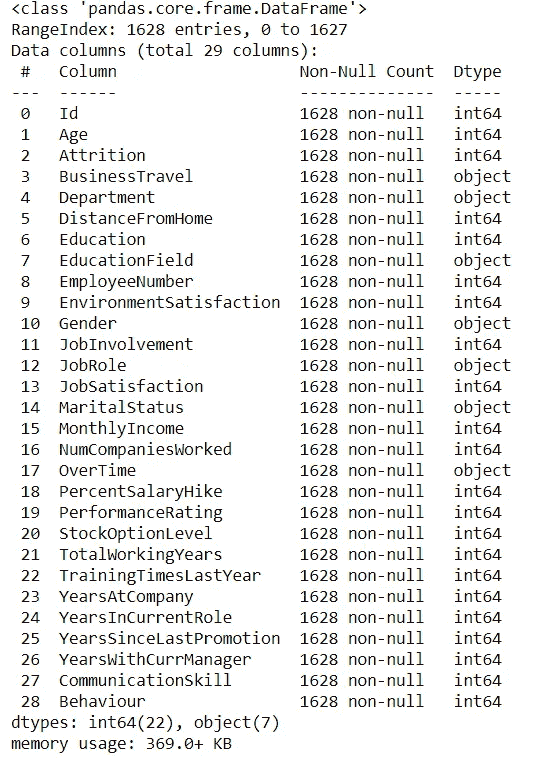

图 1

我们有 1628 个观察值和 29 个特征，其中 22 个是整数，7 个是对象。一些整数数据类型特征也可能是分类的。我们必须预测*自然减员*，它可以是 0 或 1(如果员工离开公司，则为 1)。

```
train_data.head()
```

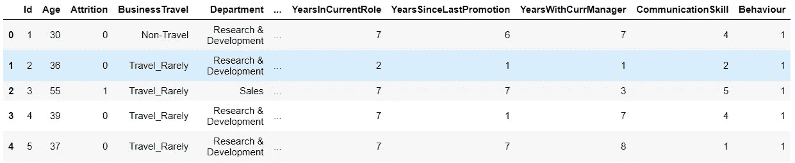

图 2

让我们打印出一些变量的统计数据

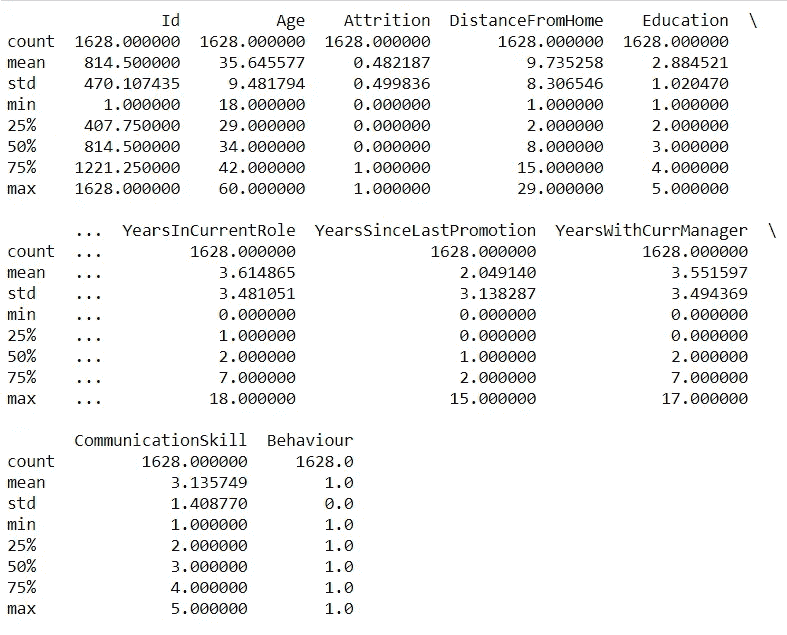

图 3

这里要注意的奇怪的事情是*行为*的标准差为 0，均值=min=max = 1。这意味着对于所有的观察，该列的值都是 1，所以我们将删除它。我们还将删除 *Id* ，因为它对所有员工都有唯一的值。

```
train_id = train_data.Id
train_data = train_data.drop(['Behaviour','Id'],axis = 1)

test_id = test_data.Id
test_data = test_data.drop(['Behaviour','Id'],axis = 1)
```

进一步研究后，我发现特性 P*performance rating*只有两个值，3 或 4，所以我将它们分别映射到 0 和 1。

```
train_data['PerformanceRating'] = train_data['PerformanceRating'].apply(**lambda** x: 0 **if** x == 3 **else** 1)
test_data['PerformanceRating'] = test_data['PerformanceRating'].apply(**lambda** x: 0 **if** x == 3 **else** 1)
```

让我们检查我们的目标变量*消耗*的分布。

```
train_data[‘Attrition’].value_counts().plot(kind = ‘bar’)
```

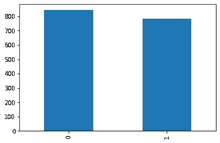

图 4

我们的分布大致平衡。

检查重复项

```
print('Number of duplicates: ',train_data.duplicated().sum())
```

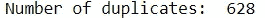

```
train_data[train_data.duplicated()]['Attrition'].value_counts().plot(kind = 'bar')
```

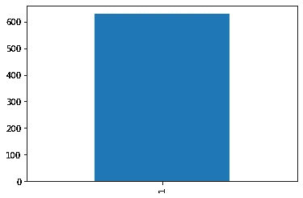

图 5

好了，数据有 628 个副本，所有副本都对应于损耗 1。这意味着数据被过采样以保持平衡。我们现在将删除重复的内容，并再次检查分布情况。

```
train_unq = train_data.drop_duplicates()
print('New train set: ',train_unq.shape)
X = train_unq.drop('Attrition',axis = 1)
y = train_unq['Attrition']
y.value_counts().plot(kind = 'bar')
plt.show()
```

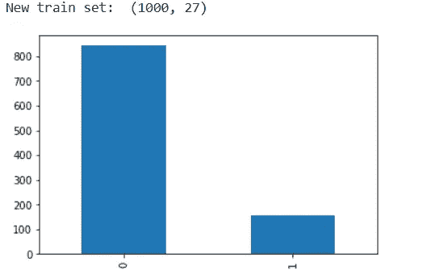

图 6

现在我们的训练数据有 1000 个数据点，而**目标变量是不平衡的**。有许多方法可以处理不平衡的数据集，如使用 SMOTE 进行上采样或下采样。

我们还可以使用交叉验证策略，例如分层 k 折叠，它可以保持目标变量(此处为*损耗*)在折叠中的分布相似。使用**分层抽样**而不是随机抽样来分割训练和验证数据。这里的 stratas 是我们的目标变量的两个值。如果你不明白这意味着什么，那么不要担心，只要记住这是一个有效的方法来处理不平衡的数据集，而我们训练我们的模型。你可以在 scikit-learn 交叉验证用户指南中了解更多信息[点击](https://scikit-learn.org/stable/modules/cross_validation.html#cross-validation)。

## 预处理、培训和验证

我们现在将遵循以下步骤:

*   降低性能等级(在探索中，我发现 85%的值属于一个类，这可能会导致过度拟合)
*   一个热编码所有的“对象”数据类型特征
*   对所有整数数据类型要素使用标准缩放。
*   使用预处理的数据，并使用分层 K-Fold 对其进行分割。
*   用 3 个候选模型进行拟合和验证:随机森林、XGBoost 和**支持向量分类器**

这是很多步骤。scikit-learn 允许我们使用[管道](https://scikit-learn.org/stable/modules/generated/sklearn.pipeline.make_pipeline.html)和[列变压器](https://scikit-learn.org/stable/modules/generated/sklearn.compose.ColumnTransformer.html)用几行简单的代码完成所有这些工作。

所以，首先，我们为预处理做一个管道

```
categorical = [f **for** f **in** training.columns **if** training[f].dtype == object]
numeric = [f **for** f **in** X.columns **if** f **not** **in** categorical+['Id',','Behaviour','PerformanceRating']]

pre_pipe = make_column_transformer((OneHotEncoder(),categorical),(StandardScaler(),numeric))
```

变量*分类*存储对象数据类型特征的所有列名，而*数字*存储所有整数数据类型列。

现在，我们为模型定义管道，并打印出不同模型的交叉验证分数。使用 cross_val_score，我们可以将“skf”传递给“cv”参数，它将负责为我们进行拆分迭代和计算分数。由于数据不平衡，我使用“roc_auc”作为评分标准。为了更好地理解 cross_val_score 的参数，请查看其[文档](https://scikit-learn.org/stable/modules/generated/sklearn.model_selection.cross_val_score.html)。

```
# random forest pipeline
pipe_rf = make_pipeline(pre_pipe,RandomForestClassifier())
#xgboost pipeline
pipe_xgb = make_pipeline(pre_pipe,XGBClassifier()) 
# SVM pipeline
pipe_svc = make_pipeline(pre_pipe,SVC(probability=**True**))print(‘RF:‘,np.mean(cross_val_score(X=X,y=y,cv=skf,estimator=pipe_rf,scoring=’roc_auc’))) print(‘XGB:‘,np.mean(cross_val_score(X=X,y=y,cv=skf,estimator=pipe_xgb,scoring=’roc_auc’))) print(‘SVC:’,np.mean(cross_val_score(X=X,y=y,cv=skf,estimator=pipe_svc,scoring=’roc_auc’)))
```

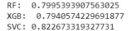

图 7

显然，支持向量分类器比基于树的模型表现更好。移除更多功能和调整后，随机森林和 XGBoost 的性能可能会更好，但在本文中，我们将使用 SVM。

在一次热编码后，我们在数据集中总共有 46 个特征，随着维度的增加，有更多的机会过度拟合，也可能有不相关的特征。所以我决定用主成分分析来降低维数。

所以，首先我拿了 46 个组件，并在我们的管道中加入了 PCA。我已经看到了累积的解释差异。

```
n = 46
pipe_svc = make_pipeline(pre_pipe,PCA(n_components=n),SVC(probability=**True**,C = 1,kernel='rbf'))

plt.figure(figsize=(10,8))
pipe_svc.fit(X,y)
plt.plot(range(1,n+1),pipe_svc.named_steps['pca'].explained_variance_ratio_.cumsum())
plt.xticks(range(1,n+1,2))
plt.title('Explained Variance')
```

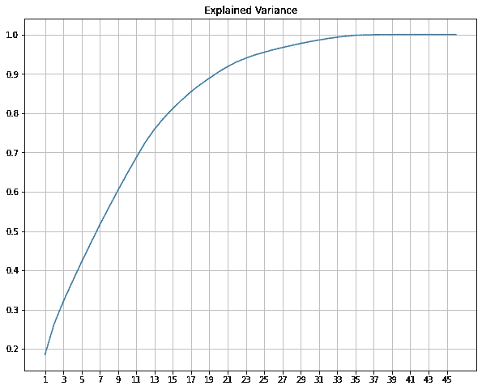

图 8

我们可以看到大约 34 个成分解释了 100%的方差。所以我们用了 34 个组件来适应我们的模型。

```
n = 34
pre_pipe = make_column_transformer((OneHotEncoder(),categorical),(StandardScaler(),numeric),remainder = 'passthrough')
pipe_svc = make_pipeline(pre_pipe,PCA(n_components=n),SVC(probability=True,C = 1,kernel='rbf'))
print('SVC: ',np.mean(cross_val_score(X=X,y=y,cv=skf,estimator=pipe_svc,scoring='roc_auc')))
```

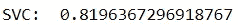

我们的分数降低了 0.01，但我们已经大大降低了维度，现在这个模型在看不见的数据上表现更好的机会更大了。

## 超参数调谐

为了从模型中挤出所有的性能，现在是时候调整我们的 SVM 模型了。我们将为此使用 GridSearchCV，如果你不熟悉它，请看一下[文档](https://scikit-learn.org/stable/modules/generated/sklearn.model_selection.GridSearchCV.html)。

我们可以调整的参数有:

*   c:这是正则化参数
*   核:线性、多项式或 RBF(高斯)
*   Gamma:相当于高斯核中的方差项
*   类别权重:平衡目标变量中类别的权重(权重与类别频率成反比)

还有更多参数，但这些是影响性能的重要参数，在进一步讨论之前，请查看 scikit-learn [文档](https://scikit-learn.org/stable/modules/generated/sklearn.svm.SVC.html)。

对于管道，调整也是一个非常简单的过程，我们只需定义参数网格，然后将整个管道传递到网格搜索中。我没有在这里调优内核。因为“rbf”是最常用的内核，并且适用于大多数任务，所以我只使用它来节省一些计算时间。您也可以继续尝试调优内核。

```
param_grid = {

    'svc__C':[0.001,0.01,0.1,1,10,100,1000],
    'svc__gamma': ['auto','scale'],
    'svc__class_weight': ['balanced',**None**]
}

grid_search = GridSearchCV(pipe_svc,param_grid=param_grid,cv = skf, verbose=2, n_jobs = -1,scoring='roc_auc')
grid_search.fit(X,y)
print('Best score ',grid_search.best_score_)
print('Best parameters ',grid_search.best_params_)
best_svc = grid_search.best_estimator_
```

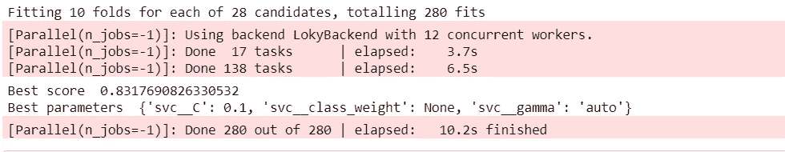

图 9

您可能已经注意到，我在参数网格中的所有参数前面添加了“svc__ ”,这样做只是为了指定我们在网格搜索中调整管道的哪个**步骤**,因为我们不只是将一个估计器传递给 GridSearchCV，而是传递给整个管道。我相信可能有更好的方法来做到这一点，如果你知道更好的技术，请在评论中告诉我。

我们可以尝试进一步调整我们的模型，通过调整 C 的范围和固定其他超参数的值来找到最佳的 C，就像这样

```
pipe_svc = make_pipeline(pre_pipe,PCA(n_components=n),SVC(probability=**True**,C = 1,kernel='rbf',class_weight=**None**,gamma='auto'))
param_grid={
    'svc__C':[0.01,0.03,0.05,0.07,0.1,0.3,0.5,0.7,1]  
}
grid_search = GridSearchCV(pipe_svc,param_grid=param_grid,cv = skf, verbose=2, n_jobs = -1,scoring = 'roc_auc')
grid_search.fit(X,y)
print('Best score ',grid_search.best_score_)
print('Best parameters ',grid_search.best_params_)
best_svc = grid_search.best_estimator_
```

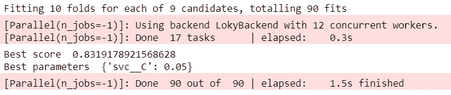

图 10

最终的平均验证分数现在是 0.8319。是时候向 Kaggle 提交了。

```
best_svc.predict_proba(test_data)[:,1]
submission = pd.DataFrame(prediction,columns=['Attrition'])submission['Id'] = test['Id']
submission = submission[['Id','Attrition']]
submission.to_csv('submissionfile_SVC.csv',index = None)
```

瞧啊。

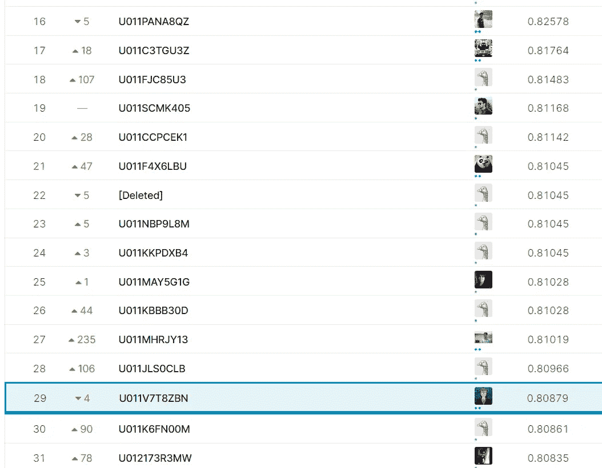

图 11

正如你所看到的，我的排名下降了 4 位。发生这种情况是因为我的模型过度适应训练数据，我可能不应该太疯狂地调整“C”。更好的特征选择也可能有助于提高分数。你怎么想呢?请随意查看我的 [Kaggle 笔记本](https://www.kaggle.com/mishraboi/hr-attrition-prediction)并执行代码。

如果你坚持到最后，谢谢你。我希望你觉得这篇文章有用，并从中学习到新的东西。请在评论中提供宝贵的反馈，我很想知道你对提高性能的想法。