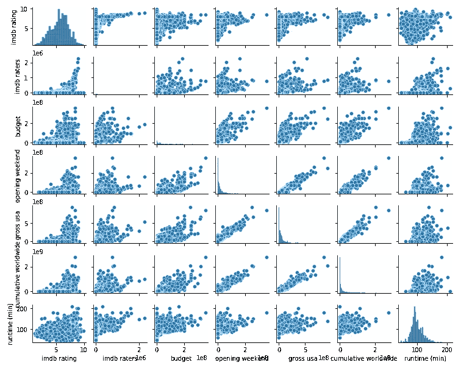
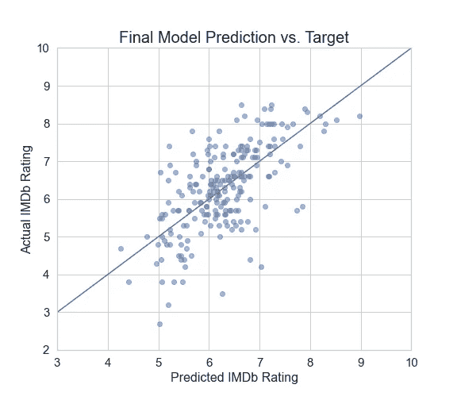
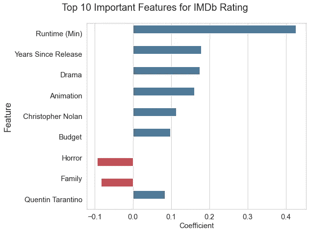

# 使用监督机器学习预测 IMDb 电影评级

> 原文：<https://towardsdatascience.com/predicting-imdb-movie-ratings-using-supervised-machine-learning-f3b126ab2ddb?source=collection_archive---------13----------------------->


照片由[佩克斯](https://www.pexels.com/photo/empty-char-near-pink-screen-1766485/)的达莉亚·谢夫索娃[拍摄](https://www.pexels.com/@daria)

我叫 Joe Cowell，我最近参加了 Metis 数据科学训练营。为期 12 周的沉浸式项目将把我从“数据新手”变成一名成熟的数据科学家。我的意思是，这个帖子的标题包括“有监督的机器学习”,而我只参加了这个项目三周，所以看起来 Metis 正在履行他们的承诺。无论如何，我会试着为感兴趣的人写一篇关于我是谁的帖子，但现在，让我们看看我是如何使用监督机器学习来预测 IMDb 电影评级的。

**背景:**

在我的音乐生涯中，问题总是“这首歌有多好？”也从来没有“这首歌会赚多少钱？”也许这就是为什么我们是典型的饥饿艺术家…不管怎样，我把这个概念应用到电影中。这个想法是，电影行业的艺术家可以利用这个模型来预测观众对电影的接受程度，因此，专注于 IMDb 评级作为目标，而不是 Metacritic 的评级系统或烂番茄的 Tomatometer。

总体而言，该项目探索了数据科学家所需的几项关键技能:

*   网络抓取(请求、HTML、美汤)
*   EDA(熊猫，numpy)
*   线性回归(scikit-learn)
*   数据可视化(seaborn，matplotlib)

**第一步:数据采集&清洗🔍**

简单地说，IMDb 有一个 API 可以下载大量数据，但是这个项目的主要需求是通过 web 抓取获得数据；因此，我继续使用请求和漂亮的汤从 IMDb 获得信息。Requests 是获取网页并将其转换为 python 中的对象所需的模块。Beautiful Soup 采用了该对象，即网页背后的 HTML 信息，并使搜索和访问 HTML 文本中的特定信息变得容易。你真的需要这两者来完全完成网页抓取的过程。

在 IMDb 的页面上，我使用了高级搜索功能来搜索 2000 年到 2020 年间的书籍。结果跨越了数千页，每一页都有 100 部电影的标题和链接。经过进一步检查，我注意到该 URL 包含短语:' *start=1 '。将起始数字增加 100 将会翻页。通过一个助手函数，我使用请求和漂亮的 Soup 来获取每个页面的链接，并返回这些链接的列表。*

为了利用电影超链接列表，我创建了另一个函数来从每个页面提取尽可能多的数据。该函数接收一个链接并返回一个包含以下信息的字典:标题、IMDb 评分、IMDb 评分者的数量、美国电影协会评分、类型、导演、作者、前三名明星、发行的初始国家、发行的原始语言、发行日期、预算、美国首映周末、美国总票房、全球累计总票房、制作公司和运行时间。

作为 EDA 的一部分，必须清理一些数据。这包括将字符串中的任何数值转换成整数。运行时间必须转换成分钟，所有的货币值都需要去掉逗号和美元符号，发布日期必须转换成日期时间。此外，包含列表的类别需要从字符串转换成实际的 python 列表(流派、导演、明星、制作公司)。检索函数完成了大部分清理工作，但是在将数据放入数据帧之后，还需要做一些其他的清理工作。

一个数据帧中有 2000 多部电影，我需要做更多的处理来获得一个用于建模的功能性数据帧。这意味着放弃没有预算信息的电影，预算低于 1000 美元的电影，以及评分低于 1500 美元的电影。关于最后一个要求，评级者数量少的电影被证明报告了更极端的电影评级(电影倾向于完美的 10 或一个大鹅蛋)。总而言之，我最终得到了一个包含 1100 多部电影的数据框架。现在是时候开始建模了。

在进入下一部分之前，我想提一下 Pairplots。Pairplots 是一个很好的可视化工具，用于探索数据中的关系，并告知 MVP 从哪里开始。看起来信息量很大，但是当您以第一列或最后一列为目标来格式化数据帧时，解释所有这些信息会容易得多。对于此配对图，第一列中的图显示了自变量和目标之间的关系。虽然我没有使用大部分数值数据，但很明显存在线性和指数关系，这可以很容易地告知从哪里开始建模。

```
sns.pairplot(movies_df_drop, height=1.2, aspect=1.25)
```



(图片由作者提供)

**第二步:模型和特征📈**

值得注意的是，这个项目的另一个要求是使用线性回归，所以我试验的模型是线性回归和岭回归。有了这么多可用的特性，而且这是我第一次使用 python 进行回归，我花了一些时间来整理每个特性。

首先，我决定走一条简单的路线，以运行时间为唯一特征，以 IMDb 评级为目标，进行简单的线性回归。这导致 R 值为 0.2687。老实说，我对任何大于零的数字都相当兴奋，所以我已经准备好钻研其余的数据了。

对于美国电影协会评分和流派，我创建了虚拟变量添加到数据框架中，得到的 R 为 0.3997。至于导演、编剧、明星和制作公司，我在每个类别中创建了一个最常出现的玩家列表，并为顶级竞争者创建了虚拟变量。如果一个导演只在我的数据中出现过一次，那么这个导演的权重(或系数)将是该特定电影评级的直接结果，因此让玩家拥有多行数据将为模型提供更多信息，以创建更好的知情系数。

为了更有创意，我选择了发布日期，制作了一个“发布月”专题。同样，我采用了上映日期，并创建了另一个功能来确定电影上映以来的年份。这可能不是最相关的特性，但是我很高兴能够试验日期时间信息。

将特征加载到模型中后，得到的 R 值为 0.4751，这看起来很有希望，但下一步是通过交叉验证对模型进行严格测试。

**第三步:测试和培训/结果🎥**

虽然线性回归完成了工作，但我知道我想比较模型的系数，使用岭回归是一种迫使自己缩放输入并尝试不同方法来创建模型的好方法。

对于这一部分，我建议查看一下[项目库](https://github.com/josephpcowell/cowell_proj_2)，以了解训练和测试模型背后的过程，但是我将直接跳到最终的模型和结果。



(图片由作者提供)

最终模型的 R 为 0.432，平均绝对误差为 0.64。这是一个相当低的 R，但是这篇[文章](https://blog.minitab.com/blog/adventures-in-statistics-2/regression-analysis-how-do-i-interpret-r-squared-and-assess-the-goodness-of-fit)描述了为什么预测人类行为的 R 低于 0.5 是可以预期的。此外，预测评级与实际评级左侧的图表为模型提供了更多的信心，因为两者之间存在某种线性关系。此外，残差最高的电影要么收视率低，要么是像*猫、五十度灰、*和*表情电影*这样的电影。这些特定的电影背后有很好的统计数据，但公众并没有很好地接受它们，这是一个很难纳入这个模型的指标。



(图片由作者提供)

查看与每个特征相关的系数也很重要。如左图所示，运行时间、发行后的年数和预算都是模型中的重要角色，一些类型和作者也在上面。这就是岭回归的美妙之处:能够使用系数来确定特定特征的权重。

最终，我有了一个预测 IMDb 评级的模型，其 R 为 0.432，明显优于仅用平均值进行预测，MSE 为 0.64，这意味着预测可能在两个方向上都有 0.64 个点的误差。

**总结:📘**

这不仅是我第一次在网上搜集数据，也是我第一次创建模型，更不用说线性回归模型了。总的来说，我对这种模式相当自豪。此外，单独遍历数据科学工作流的体验非常有益；我:

*   通过在网上搜集信息，我创建了自己的数据集
*   浏览数据集并清理掉所有不相关的内容
*   开发了一个 MVP，在任何给定的时刻都有一个工作模型
*   迭代地改进模型，以获得具有每个特性的更好的产品
*   可视化我的模型的有效性以及对电影评级的贡献

在训练营的三周内，我就熟悉了网页抓取、EDA、线性回归建模和数据可视化。再一次，对于我的过程的更多代码的解释，检查我的 [GitHub 库](https://github.com/josephpcowell/cowell_proj_2)，如果你有任何问题或意见，请随时联系我。

我真的很期待在 Metis 学习更多的技术和技能，所以如果你对我的数据科学之旅感兴趣，请回来查看更新。

随意伸手:
[LinkedIn](https://www.linkedin.com/in/josephpcowell/)|[Twitter](https://twitter.com/josephpcowell)