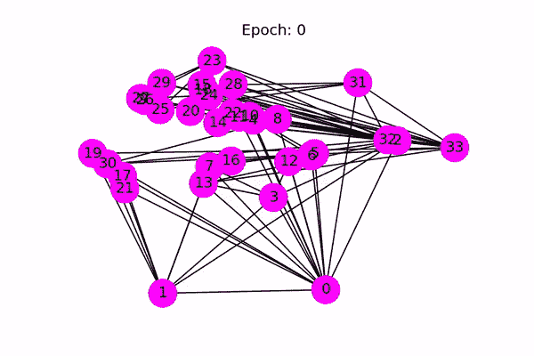

# 用图卷积神经网络预测首次公开发行股票

> 原文：<https://towardsdatascience.com/predicting-initial-public-offerings-using-graph-convolutional-neural-networks-42df5ce16006?source=collection_archive---------48----------------------->

## 从数据库到预测

大约一年前，我了解了图形数据库的概念，以及它们与表格、关系数据库相比，如何不同地表示数据。我很感兴趣的是，有一种存储和查找数据关系的方法，我发现这种方法比在表格数据上计算连接更直观。如果两条数据是相关的，在图形数据库中，您只需在它们之间创建一条边。由于数据在图中，您可以在数据库上执行所有标准的图算法，例如广度和深度优先搜索、最短路径算法和相似性算法。所有这些算法都处理不同数据点之间的边缘(关系)。事实证明，有机器学习算法也可以处理数据之间的关系。本文将详细介绍建立和运行您自己的图形机器学习管道的步骤——从数据库到预测。


照片由[里克在](https://unsplash.com/@ricktap?utm_source=medium&utm_medium=referral) [Unsplash](https://unsplash.com?utm_source=medium&utm_medium=referral) 上敲击

首先，我们将使用来自 Crunchbase 的示例数据集建立一个 TigerGraph 云实例。该数据包含大约 200，000 家处于不同融资阶段的公司，并包含诸如它们是否实现了首次公开募股(IPO)、公司的主要投资者、创始人及其总部所在地等信息。然后，我们将使用 Jupyter 笔记本中的 pyTigerGraph 和 Giraffle 连接到数据库。最后，我们将建立一个图形卷积神经网络(GCN)来预测我们数据集中的某个公司是否会 IPO。要了解代码，请点击这里的库。

# 设置 TigerGraph 云

我不打算深入介绍如何设置 TigerGraph 云实例，因为[这篇](https://medium.com/@jon.herke/deploy-a-graph-database-in-3-steps-no-code-need-d903bd062dae)文章很好地指导了您配置实例的步骤。在步骤 1 中，只需选择“企业知识图(Crunchbase)”初学者工具包。一旦你启动并运行了你的初学者工具包，我们将不得不通过 Gradle 获得一个 SSL 证书来访问服务器。在您的项目目录中，在您的终端中键入以下内容:

```
openssl s_client -connect <YOUR_HOSTNAME_HERE>.i.tgcloud.io:14240 < /dev/null 2> /dev/null | \
openssl x509 -text > cert.txt
```

我们还需要创建另外两个文件。首先，让我们在基础项目目录中创建一个**grad le-local . properties**文件。这应包括:

```
gsqlHost=YOUR_HOSTNAME_HERE.i.tgcloud.iogsqlUserName=tigergraphgsqlPassword=YOUR_PASSWORD_HEREgsqlAdminUserName=tigergraphgsqlAdminPassword=YOUR_PASSWORD_HEREgsqlCaCert=./cert.txt
```

另一个应该放在 py_scripts/目录中，命名为 **cfg.py** 。这应包括:

```
secret = "YOUR_SECRET_HERE"token = “”password = “YOUR_PASSWORD_HERE”
```

秘钥可以在 Graph Studio 的管理页面下获得。

# 安装查询和提取数据

我们将使用两种不同的工具与 TigerGraph 云实例进行交互:Giraffle 和 pyTigerGraph。Giraffle 将允许我们安装需要在数据库上运行的查询，而 pyTigerGraph 将为我们提供一个接口，将这些查询的结果拉入 Python。

## 长颈鹿

Giraffle 是 Gradle 的一个插件，一个构建系统。这允许您轻松地将代码打包以部署在各种不同的平台上，并使用版本控制软件(如 Git)来跟踪您为数据库编写的查询。更多信息，请查看其项目页面[这里](https://optum.github.io/giraffle/#/)。

## 这些疑问

我们通过几个终端命令将查询安装在 Jupyter 笔记本的前几个单元格中。每个查询的功能概述如下:

*   **companyLinks** 在 TigerGraph 中计算公司之间的关系，并将其返回到一个 JSON 有效负载中，我们可以用 Python 解析该负载。这过度简化了这里的图表。该查询返回有共同点的公司对。这损害了准确性，因为一些常见的元素(创始人、投资者等。)可能比位置或行业更重要。创建具有多种类型顶点的 GCN 是可能的，(称为关系图卷积笔记本)，但它更复杂。开始的一个好方法是简化图表，直到你只有相同类型事物之间的关系。
*   **getAllCompanies** 顾名思义，它返回数据集中所有公司的列表。我们需要它的原因将在下一节中变得明显。
*   getAllIpo 获取数据集中所有已经上市的公司。这在下一节很有用，也可以用来检查我们预测的准确性。

## pyTigerGraph

为了从我们安装的查询中获得结果，我们将使用 pyTigerGraph。要了解更多信息，请点击这里查看我的 GitHub [上的包。](https://github.com/parkererickson/pyTigerGraph)

# 欠采样数据

好了，现在我们已经安装了所有的查询，并将数据放入笔记本，请注意一些事情。首先，与公司总数(约 200，000 家)相比，IPO 公司的数量微不足道(约 1，200 家)。这意味着数据集非常不平衡，这将导致 GCN 预测每家公司不会 IPO(这样它的准确率将达到 99.4%)。另一件需要考虑的事情是，大多数计算机没有足够的内存来运行全图上的 GCN。便利的是，不平衡的数据意味着我们应该对未上市公司进行欠采样，以便得到一个更加平衡的数据集。这就产生了一个大约有 2000 个顶点的图，平均分布在已经上市和没有上市的公司之间。然而，这种方法有一个缺点。由于这些公司是从非 ipod 和 ipod 名单中随机抽样的，我们不能保证每个公司之间有很多边缘，这对我们的准确性有很大影响。

# 图形卷积神经网络



使用图卷积神经网络进行分类(来源:[https://docs.dgl.ai/en/latest/tutorials/basics/1_first.html](https://docs.dgl.ai/en/latest/tutorials/basics/1_first.html)

图形卷积神经网络(GCN)是一种半监督分类算法，它处理图形中的连接以及每个顶点的特征。这个概念类似于传统的基于图像的卷积神经网络，但 GCN 不是查看相邻的像素，而是查看通过边连接的顶点。顶点特征可以是任何向量，比如顶点的各种属性的 doc2vec 表示，或者仅仅是一个一键编码的向量，这就是我在这里选择做的。然后我们标记两个不同的顶点，一个已知有 IPOed，另一个没有。

我们的神经网络架构非常简单。它由两层组成，输入维数等于特征向量中的条目数(它也恰好是图中的顶点数，因为我们对它们进行了一次性编码)。然后，我们将输入通过一个有 32 个神经元的层，然后通过 2 个神经元输出。我们使用 Adam 作为训练过程的优化器。然后我们开始训练循环。不幸的是，由于我们之前对图表的采样不足，GCN 在图表中并不总是有足够的边来准确可靠地做出预测。我通常得到大约 60%的准确率，但由于公司的随机抽样，它确实变化很大。

# 结论

GCN 并不是一个预测一家公司是否 IPO 的好方法，因为内存限制和对图表的欠采样。其他图形机器学习方法，如 node2vec 可能会更好。另一种可能提高精确度的方法是使用关系图卷积神经网络(R-GCN ),它可以处理具有多种不同类型顶点的图。

# 信用

Parker Erickson 写的文章和笔记本，他是明尼苏达大学攻读计算机科学学士学位的学生。他的兴趣包括图形数据库、机器学习、旅行、演奏萨克斯管和观看明尼苏达双城棒球赛。随意伸手！在以下地址找到他:

*   领英:[https://www.linkedin.com/in/parker-erickson/](https://www.linkedin.com/in/parker-erickson/)
*   GitHub:【https://github.com/parkererickson 
*   邮箱:【parker.erickson30@gmail.com 

**GCN 资源:**

*   https://docs.dgl.ai/[DGL 文档](https://docs.dgl.ai/)
*   基普夫和韦林的 GCN 论文[https://arxiv.org/abs/1609.02907](https://arxiv.org/abs/1609.02907)
*   https://arxiv.org/abs/1703.06103 GCN 论文:

**笔记本改编自:**[https://docs.dgl.ai/en/latest/tutorials/basics/1_first.html](https://docs.dgl.ai/en/latest/tutorials/basics/1_first.html)