# 使用 Python +大数据预测住院患者的住院时间

> 原文：<https://towardsdatascience.com/predicting-inpatient-length-of-stay-at-hospitals-using-python-big-data-304e79d8c008?source=collection_archive---------18----------------------->

## 医疗保健中的机器学习

## 从原始数据集检索到机器学习建模的端到端项目


来自纽约邮报文章的[纽约医院病人的照片(图片来自 Shutterstock)](https://nypost.com/2020/03/28/coronavirus-in-ny-citys-icu-bed-capacity-ranks-in-bottom-quarter-nationally/)

# **背景:**

病人住院时间是医院管理效率的一个[关键指标](https://www.ncbi.nlm.nih.gov/pmc/articles/PMC5898738/)。医院资源有限，需要有效利用床位和临床医生的时间。随着最近新冠肺炎疫情的出现，这一概念得到了体现。现在，我们比以往任何时候都更能看到，将住院时间限制在不必要的时间内，并了解特定住院患者可能需要住院多长时间，符合患者、医院和公共卫生的最佳利益。

因此，只有在患者一进入医院并被诊断出就可以获得信息的情况下，预测患者将停留多长时间的能力可以对医院及其效率产生许多积极的影响。可以预测患者住院时间的模型可以让医院更好地分析对住院时间影响最大的因素。这种分析可以为缩短住院时间铺平道路，[从而降低感染风险和药物副作用，提高治疗质量，并通过更有效的床位管理增加医院利润。](https://www.ncbi.nlm.nih.gov/pmc/articles/PMC5898738/)此外，预测患者的住院时间也极大地有利于患者和患者家属，因为他们可以知道他们在入院时预计会住院多长时间。**该项目的目标是创建一个模型，用于预测患者入院后的住院时间，**此处详细介绍了完成此任务的步骤。

在整个分析中使用的全部代码可以在[这里](https://github.com/vtien/Predicting-Hospital-Stay-Project)找到。

# **数据集介绍:**

为了进行这一分析，我使用了公开的“2015 年纽约医院住院病人出院”数据集，该数据集可在[纽约州政府健康数据网站](https://health.data.ny.gov/Health/Hospital-Inpatient-Discharges-SPARCS-De-Identified/82xm-y6g8)上找到。该数据集包含 230 多万行患者数据，包括患者人口统计、诊断、治疗、服务、成本和收费等信息。根据 HIPAA 法规，患者数据已被取消身份。为了分析这种规模的数据集，我利用了 Python 接口中的各种大数据分析工具，如 Spark、AWS clusters、SQL 查询优化和降维技术。然而，本文中显示的大部分代码使用了 Pandas 和 scikit learn。让我们先来看看数据集中的所有要素和相关数据类型。

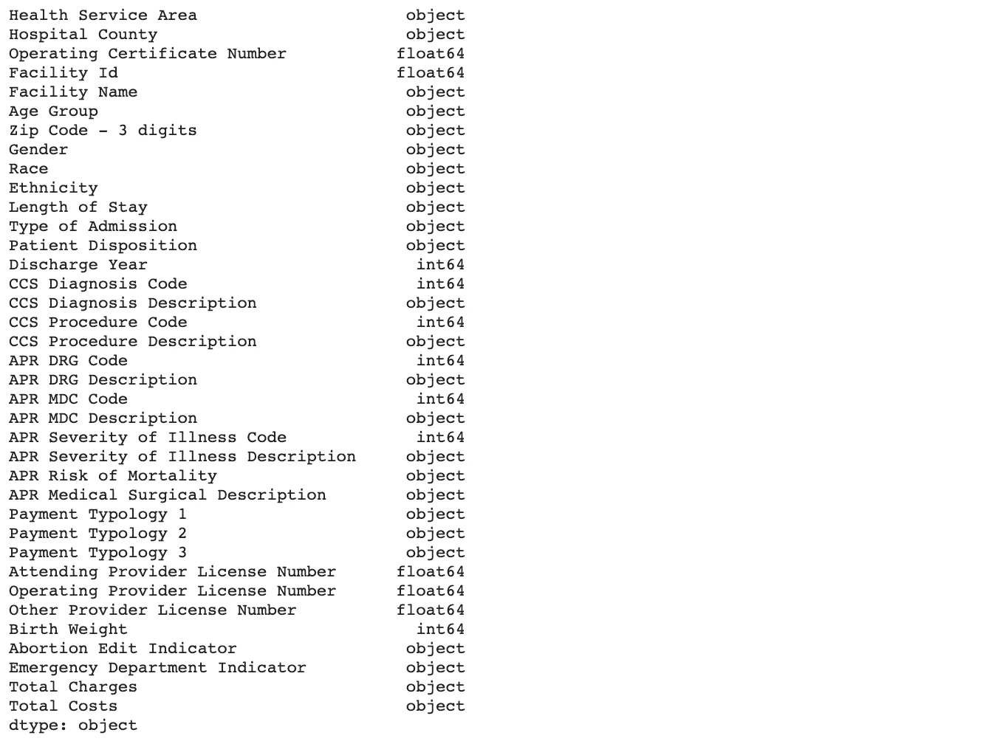

接下来，让我们看看我们的数字特征是如何相互关联的。我们可以通过使用关联热图来实现这一点。

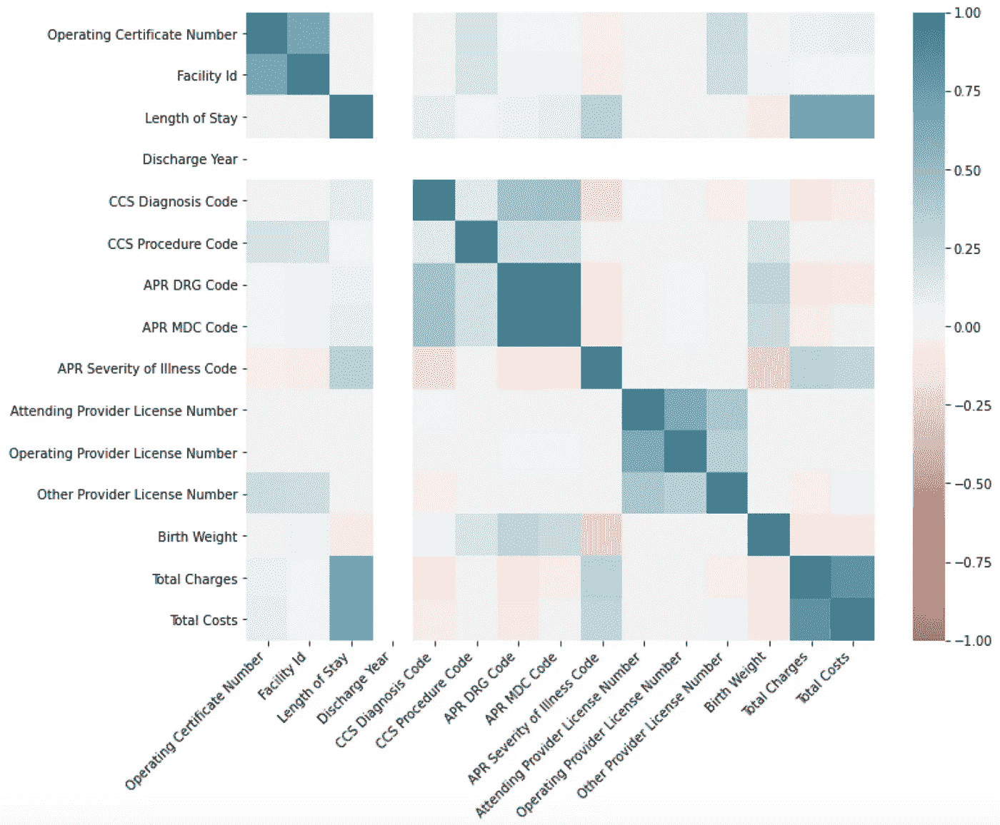

从我们数据的关联图中可以看出，有几个特征相互之间有很强的相关性，也许更重要的是，与住院时间有很强的相关性。尽管查看我们所有的列(如许可证号)的相关性矩阵没有意义，但我们可以从中看出，APR 疾病严重程度代码与住院时间、总费用和总成本有很强的正相关性。CCS 诊断代码似乎也与住院时间略有正相关。我们可以在数据集中看到特征之间的其他正相关，例如 CCS 诊断代码和 APR DRG 代码。除了让我们知道数据中是否存在多重共线性之外，该图还让我们了解了哪些功能对于预测住院时间可能特别重要。

# **探索性数据分析与可视化:**

接下来，让我们探索并可视化数据中的潜在关系。在下面的分析中，住院时间作为我创建的图的 y 轴上的主要变量，因为它是这个项目的预测变量。首先，住院时间的单变量分布是可视化的。


正如我们所看到的，停留时间值的范围从 1 天到 120 天以上(120 天已经被合计为包括所有停留 120 天或更长时间的时间)。此外，分布非常不均匀，数据中大多数患者的住院时间在 1 到 5 天之间。这是需要记住的数据的一个重要方面。我们暂时先把它放在这里，以后再来看。接下来，我们来看看不同年龄组的住院时间分布是如何变化的。

**住院时间长短会随着患者年龄的变化而变化吗？**

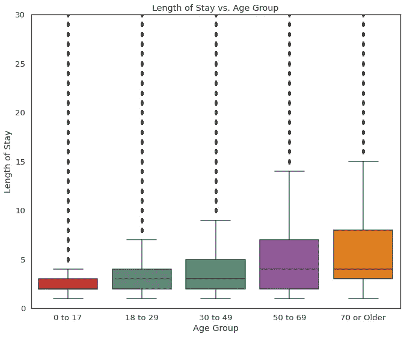

由于存在许多异常值，y 轴被限制在 0 到 30 之间。

从该图中，随着年龄组的增加，平均住院时间分布变长的趋势显而易见。

**哪些诊断的平均住院时间最长？**


平均而言，被诊断患有分娩并发症的患者平均住院时间最长，其次是患有呼吸系统疾病的患者。让我们来看看一些我们可能不认为会有太大影响的特性是如何随着停留时间的变化而变化的。

**停留时间长短会因种族而异吗？**

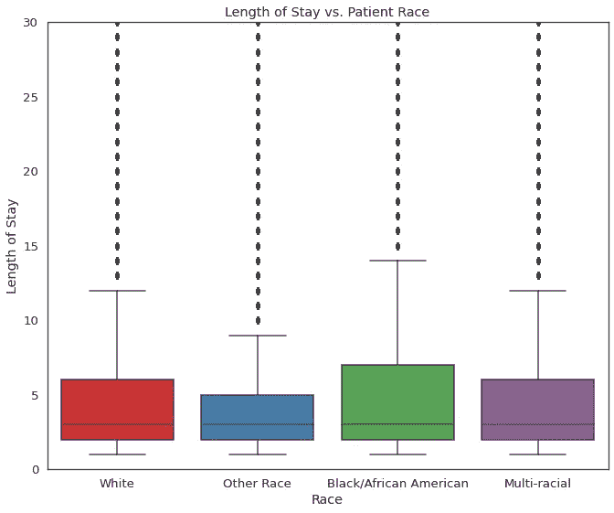

我们可以看到，正如人们可能会怀疑的那样，病人的种族不会导致住院时间分布的很大差异。然而，有趣的是，黑人/非洲裔美国人与分布第二大的群体(白人)在住院时间值上的差距最大，相差约 2 天。

**住院时间长短如何因患者付费类型而异？**

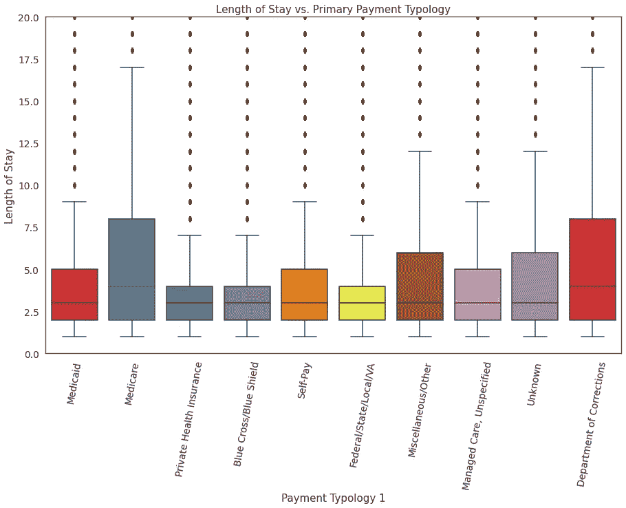

从该图中可以明显看出，不同的医疗保险支付方式往往具有不同的住院时间分布。具体来说，我们可以看到，例如，医疗保险患者往往平均住院时间最长。然而，健康保险计划与其他因素密切相关，如收入和年龄。因此，这可能是因为医疗保险患者往往有更长的住院时间，因为他们也在一个较大的年龄段。让我们更深入地探讨这个想法:

**以医疗保险为主要支付方式的患者年龄分布如何？**

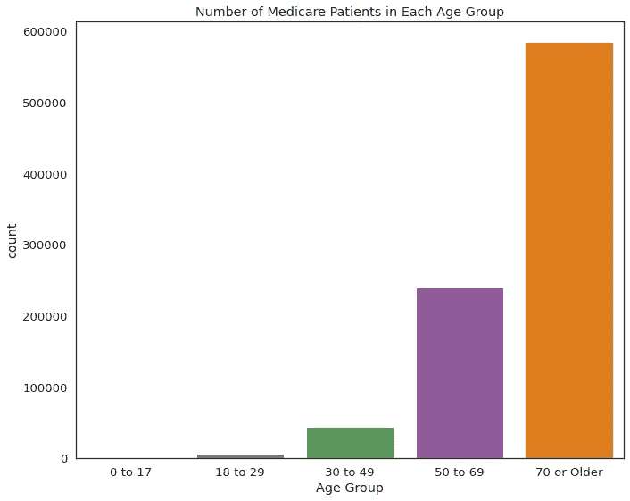

这一想法得到了上述图表的支持，并让我们了解了不同变量是如何相互作用来影响停留时间的。

让我们继续讨论数据集中存在的一些最重要的特征:疾病的严重程度和入院病人的类型。

**住院时间长短因病情严重程度而异？**


我们可以看到 APR 疾病严重程度特征中的大量差异，这表明它很可能是包含在机器学习(ML)模型中的一个重要特征。

**住院时间长短如何因入院类型而异？**


**每种疾病严重程度类型的诊断描述有何不同？**

在这里，我对数据集的诊断描述列执行文本解析分析，然后创建 wordclouds 来可视化这些结果。使用根据疾病严重程度分类的每个患者的诊断描述创建了词云。


使用了 NLTK tokenizer 包，随后移除了停用词(a、and、the 等。)来自 wordcloud 创建之前的描述。

从该分析中，我们可以看到每种疾病严重程度类型的诊断描述中的一些相似之处，但也有一些巨大差异。

# **网页抓取附加功能**

在上面关于健康保险项目的简短讨论中，我也提到了患者收入可能会起到一定作用，并且最终可能与住院时间长短相关。这种情况的一个例子是，对于一些低收入病人来说，医院提供的生活条件比他们在医院外的情况要好。因此，这些患者被激励尽一切努力延长他们的住院时间。不幸的是，我们的数据集不包括任何关于患者收入的信息。但是，它包括患者的 3 位数邮政编码。当我们准备开始这个项目的建模部分时，重要的是要考虑这样一个事实，即对于大多数 ML 模型来说，zipcode 并不是一个好的特性。虽然它的信息是用数字编码的，但它不是一个数字特征，因为它的数字在数学上没有任何意义。反过来，这使得邮政编码很难理解，也很难通过 ML 模型创建预测模式。因此，在我的分析中，下一步将是用患者收入的粗略衡量标准来取代这种原始的 3 位数邮政编码数据，这将证明是一个更有用的功能。

为了做到这一点，我通过邮政编码从这个网站收集了平均收入数据，包含了 2006-2010 年的数据。下面是数据集中每个 3 位数邮政编码的中值收入图，是通过内部连接(通过 python 中的 SQL)将网络抓取的数据连接到我们的数据框架上实现的。

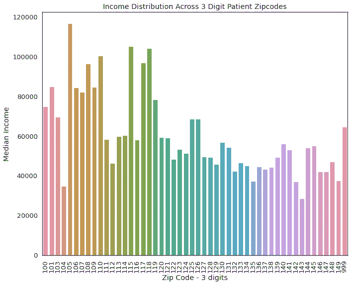

y 轴上的收入以美元为单位。请注意，邮政编码 999 是那些不在本州的患者的聚合邮政编码(详见博客开头的完整编码链接)。

我们可以使用这个新的收入特征来可视化其他特征如何随着新构造的特征而变化。

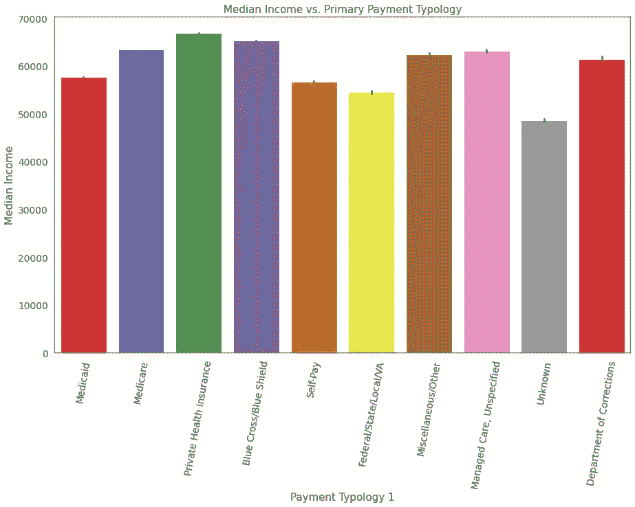

我们现在准备开始准备这个分析的建模部分。

# **建模准备:**

为了开始这一部分，我首先将删除所有对预测建模没有用的列。这包括邮政编码、诊断描述、操作证书编号等。，此外还有患者入院时不会出现的特征，如总费用和总收费，从而防止*数据泄露*。

接下来，我对包含字符串的所有分类列执行特征编码。使用具有相应数字代码的类别，如 APR 疾病严重程度代码与 APR 疾病严重程度描述，而不是它们的字符串对应物，以防止类别二进制化的需要，从而防止维度的潜在大幅增加。

此外，我将对特性的特定子集使用字符串索引。对于年龄组和 APR 死亡风险，由于这些特征中的类别存在固有的顺序性，所以进行了串索引。例如，“0 至 17 岁”年龄组比“70 岁或以上”年龄组更小。因此，用 1 对最小的年龄组“0 到 17”进行编码，用越来越大的整数对较大的年龄组进行编码是有意义的。类似地，APR 死亡风险的“轻微”类别为 1，而“极端”为 4。对这类特定要素进行字符串索引非常有益，因为它可以防止增加数据集的维度，并允许模型了解要素类别中存在的普通性。手动完成此操作的代码如下所示。但是，对不具有固有顺序性的要素(如“医疗服务区”)使用字符串索引时，一定要小心。因此，执行剩余分类特征的一键编码。

```
mort_string_index = {'Minor': 1, 'Moderate': 2, 'Major': 3, 'Extreme': 4}
age_string_index = {'0 to 17': 1, '18 to 29': 2, '30 to 49': 3, '50 to 69': 4, '70 or Older': 5}df['Age Group'] = df['Age Group'].apply(lambda x: age_string_index[x])
df['APR Risk of Mortality'] = df['APR Risk of Mortality'].apply(lambda x: mort_string_index[x])
```

现在，让我们来看看我们的预测功能，住院时间。停留时间的范围从 1 到 120，并且只接受整数值。我决定将预测停留时间视为一个多类分类问题(而不是回归)。与我使用的回归相比，多类分类产生了一个很大的优势:手动定义类仓来手动控制预测特异性的能力。我们可以将这些值分组到对预测更有意义的箱中，而不是将停留时间视为 120 个不同的类别，而不会显著降低预测的特异性。在探索了这些条柱的多种选择后，其中包括权衡模型的有用性(如果条柱太大，预测将不再有用)和模型准确性，我最终确定了以下条柱格式:

*1–5 天、6–10 天、11–20 天、21–30 天、31–50 天和 50–120 天以上*

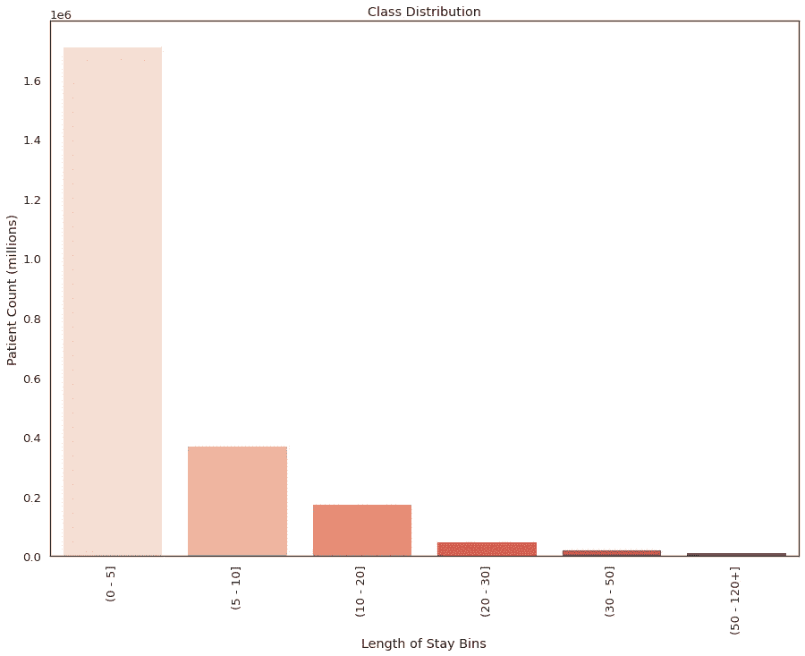

从这个图像来看，一个巨大的*阶级不平衡*是显而易见的。在回顾在本分析开始时绘制的原始住院时间数据的单变量分布时，同样的趋势是明显的。数据中的这种不平衡必须小心处理，因为它会导致误导性的准确性分数。类别不平衡会导致模型过度预测最常出现的类别，因为简单地预测大多数数据实例的类别，而不考虑它们的特征，将会导致最高的整体准确度分数。因此，旨在优化准确度分数的模型可能落入这个陷阱。例如，即使该模型总是预测住院患者的住院时间为 1 至 5 天(在该数据集中最常见的住院时间)，它也会达到约 1.6e6/2.3e6 = 69%的准确度。与模型的基线精度(如果随机猜测，模型将达到的精度)相比，它是 1/6 或大约 17%，乍一看，这是明显更好的模型性能。

# **处理阶层失衡**

对最频繁出现的类进行欠采样和对过度预测的类进行惩罚是处理类不平衡的两种最常见的方法，这两种方法都在该数据集上进行了探索。最终，我发现分配惩罚是最有效的方法，它比欠采样方法具有更高的模型精度，同时还能像欠采样一样防止与类别不平衡相关的风险。为了将这些惩罚分配给类，我使用了 scikit learn 的 ML 函数中的“类权重”参数，并将该参数设置为“平衡”。这有效地给每个类分配了一个与它出现的频率成反比的权重。

# **ML 造型**

**主成分分析:**

在训练任何模型之前，我在使用 StandardScaler()函数标准化训练和测试数据集之后对数据执行 PCA。主成分分析是一种强大的工具，它允许人们降低数据集的维数，这对大型数据集非常有益，例如我们在这里处理的数据集。此外，它还消除了数据中的任何多重共线性。尽管 PCA 不适合用于混合了数字和分类特征的数据集(已经进行了一键编码/字符串索引)，但使用 PCA 并不会对性能造成显著影响(更多信息请参见[此处](https://stats.stackexchange.com/questions/5774/can-principal-component-analysis-be-applied-to-datasets-containing-a-mix-of-cont)关于何时使用 PCA 与 MFA)。在应用 PCA 之前，务必对数据进行归一化处理，因为 PCA 会将原始数据投影到通过计算要素内点之间的相对距离来最大化方差的方向上。因此，当特征在不同的尺度上时，可以抛弃 PCA。

```
import numpy as np
from sklearn.decomposition import PCA
from sklearn.preprocessing import StandardScalerx_train = StandardScaler().fit_transform(X_train)
x_test = StandardScaler().fit_transform(X_test)
pca1 = PCA()
pca1.fit(x_train)
explained_variance_ratio = pca1.explained_variance_ratio_
pc_vs_variance = np.cumsum(pca1.explained_variance_ratio_)
```

下面，我绘制了相对于使用的 PCA 成分数量的%解释方差。从这个图中，我们可以决定在剩下的分析中使用多少个成分，以便在数据中保留一定百分比的解释方差。这里，我选择保留 29 个组件，因为这是解释数据中 95%的方差所需的最少组件数。


**逻辑回归:**

接下来，让我们训练一个一对多逻辑回归分类器。逻辑回归分类器是分类问题的强模型。让我们在将 PCA 应用于标准化数据后训练一个模型，如下所示。

```
pca = PCA(n_components=29) #29 components, as found above
x_train = pca.fit_transform(x_train)
x_test = pca.transform(x_test)from sklearn.linear_model import LogisticRegression
from sklearn.metrics import accuracy_score
import numpy as nplog_reg = LogisticRegression(multi_class='ovr').fit(x_train, y_train)
y_train_pred = log_reg.predict(x_train)
y_pred = log_reg.predict(x_test)test_acc = accuracy_score(y_test, y_pred)
train_acc = accuracy_score(y_train, y_train_pred)print('Test accuracy:', test_acc)
print('Train accuracy:', train_acc)
```

列车精度:0.7315117403879348
测试精度:0.20000001

鉴于该数据集的基线准确性和性质，我们得到了非常好的结果。然而，这个模型是在没有平衡任何类别权重的情况下对数据进行训练的。在进行预测后创建混淆矩阵是一个很好的做法，这样可以更仔细地检查模型性能，因为仅准确性分数就可能会产生误导。

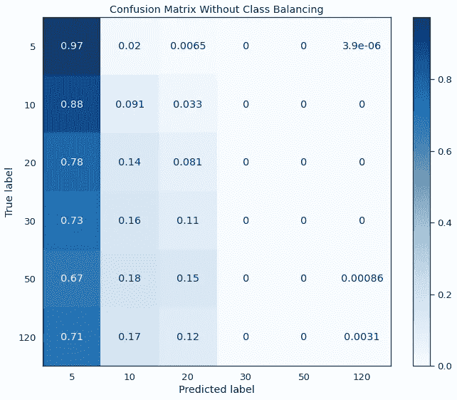

标签是根据每个箱子中较长的停留时间值创建的。例如，标签 5 对应于 bin (0，5)，或者停留时间范围从 1 天到 5 天。

混淆矩阵展示了忽视数据集中的类别不平衡的危险。虽然我们获得了非常高的准确度分数，但是该模型明显过度预测了预测标签 5，因为它是具有最高频率的标签。另一方面，该模型从不预测标签 30 和 50。这两种趋势在热图中第一列的较暗颜色中都很明显，与 30 和 50 列中的最亮颜色形成对比(也用 0 表示)。现在，让我们看看我们是否能处理这个问题。

**平衡类权重参数的 Logistic 回归:**

```
from sklearn.linear_model import LogisticRegression
from sklearn.metrics import accuracy_score
import numpy as nplog_reg = LogisticRegression(class_weight='balanced', multi_class='ovr').fit(x_train, y_train)
y_train_pred = log_reg.predict(x_train)
y_pred = log_reg.predict(x_test)test_acc = accuracy_score(y_test, y_pred)
train_acc = accuracy_score(y_train, y_train_pred)print('Test accuracy:', test_acc)
print('Train accuracy:', train_acc)
```

训练精度:0.5892498813701775
测试精度:0.200000001

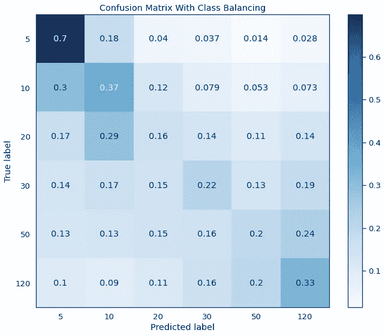

正如我们所看到的，定义类权重参数对我们的模型的性能有巨大的改善，防止分类器简单地过度预测最高频率的类。尽管整体准确性下降，但在未来的“真实世界”测试中，我们的模型现在将是任何给定实例的更好的预测器。此外，由热点图对角线上的深色表示，即使模型预测了错误的标签，它通常也会向右或向左偏离一个标签。

让我们打印出更多的分类指标，以便更好地了解我们的模型的表现:

```
from sklearn.metrics import classification_report
print(classification_report(y_test, y_pred))
```


让我们使用 f1 分数将逻辑回归分类器与我们将创建的其他模型进行比较。F1-score 是对模型准确性的度量，它是通过取精度和召回率的调和平均值来计算的，从而将精度和召回率组合成一个度量。如果您不熟悉精确度和召回率的概念，请参考[本文](/precision-vs-recall-386cf9f89488)了解更多信息。本质上，f1-score 提供了一种定量的方法来评估过度预测某些类别标签的趋势以及模型区分类别的能力。

**决策树:**

对于我们的下一个模型，让我们尝试在我们的数据上训练一个决策树分类器。决策树往往在多类分类问题中表现得非常好，并且直观易懂。然而，在我们创建模型之前，让我们首先优化决策树分类器的超参数。为此，我们可以在字典定义的超参数值组合范围内运行随机搜索。通过这种搜索，我们可以返回找到的最佳值。这种超参数搜索通过 scikit RandomizedSearchCV 函数实现。这里，我选择优化 max_depth 和 max_leaf_nodes 参数，因为它们是防止过度拟合的关键参数，这是决策树特别容易出现的一个属性。利用三重交叉验证。

```
from sklearn.tree import DecisionTreeClassifier
from sklearn.model_selection import RandomizedSearchCVdtree = DecisionTreeClassifier(class_weight='balanced')
search_vals = dict(max_depth=[35,50,75,100], max_leaf_nodes=[800,1000,1500,2000])
dtree_search = RandomizedSearchCV(dtree, search_vals, cv=3)
search = dtree_search.fit(X_train,y_train)
search.best_params_
```

输出:{ '最大深度':50，'最大叶节点':1000}

我还绘制了一条验证曲线，同时利用三重交叉验证，以可视化超参数优化和模型复杂性对模型准确性的影响。max_depth 参数的验证曲线如下所示。

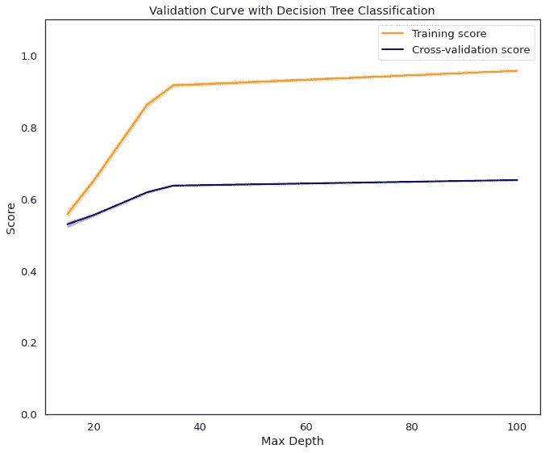

随着 max_depth 参数变得不太严格(允许更深的树)，验证曲线突出了决策树过度拟合的趋势。然而，有趣的是注意到，尽管在训练和验证精度之间有很大的差距，但是验证精度在这个最大深度范围之间并没有下降。

使用上面找到的超参数，让我们训练一个决策树分类器，并使用它来创建预测。下面是我用来训练模型的代码。让我们像以前一样将“class_weight”参数设置为“balanced”。注意，我在原始训练数据上训练模型，而不是 PCA 缩放+变换的数据，因为决策树是尺度不变的。因此，它们不需要对训练数据进行缩放。此外，当决策树在 PCA 变换的数据上训练时，实现了较低的准确性。

```
from sklearn.tree import DecisionTreeClassifier
dtree=DecisionTreeClassifier(max_depth= 50, max_leaf_nodes=1000, class_weight='balanced')
dtree.fit(X_train,y_train)from sklearn import metrics
train_predictions = dtree.predict(X_train)
test_predictions = dtree.predict(X_test)print("Train Accuracy:",metrics.accuracy_score(y_train, train_predictions))
print("Test Accuracy:",metrics.accuracy_score(y_test, test_predictions))
```

训练精度:0.6170775710955541
测试精度:0.200000001


最终，我们可以看到决策树分类器的准确性有所提高！每个类别标签的 F1 分数也有所增加，表明模型性能有所提高。让我们看看我们是否可以用决策树集成做得更好，或者被称为随机森林模型。

**随机森林:**

我们可以改进决策树分类器，将树打包成一个集合，并在所有构建的树之间利用多数投票的能力。这被称为随机森林模型。下面是这个模型的代码和模型性能。请注意，模型参数是通过反复试验(同时观察 f1 和准确度分数)选择的，因为网格搜索/随机搜索在计算上非常昂贵。然而，使用所述技术可以进一步优化参数。

```
from sklearn.ensemble import RandomForestClassifierrf = RandomForestClassifier(n_estimators=150, max_depth=15, class_weight='balanced')
rf.fit(X_train,y_train)train_predictions = rf.predict(X_train)
test_predictions = rf.predict(X_test)print("Train Accuracy:",metrics.accuracy_score(y_train, train_predictions))
print("Test Accuracy:",metrics.accuracy_score(y_test, test_predictions))
```

训练精度:0.6729519125323106
测试精度:0.100000001


我们提高了决策树的准确性，以及每个职业的 f1 分数。接下来，让我们利用 scikit 中的一个函数在随机森林模型中生成一个特性重要性图。这里，特征重要性是通过计算得到的[，即节点杂质的减少量，该减少量是通过到达树中该节点的概率来加权的。](/the-mathematics-of-decision-trees-random-forest-and-feature-importance-in-scikit-learn-and-spark-f2861df67e3)

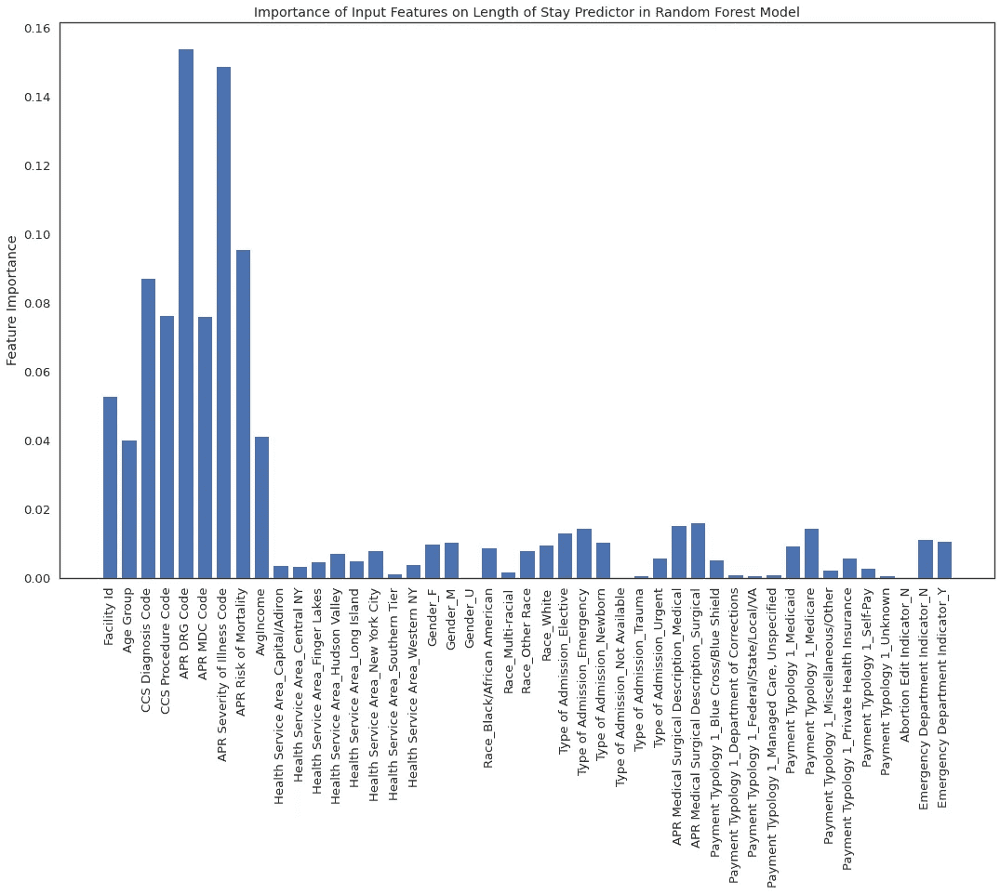

从该图中，我们可以看到 APR DRG 代码(根据入院原因、疾病严重程度和死亡风险对患者进行分类的分类系统)和 APR 疾病严重程度代码是预测患者住院时间的两个最重要的特征。有趣的是，与其他支付类型组相比，医疗保险支付类型组在预测住院时间方面具有相对较高的重要性。病人的平均收入也起了重要作用。

**提升决策树:**

最后，让我们看看另一种类型的集成方法:boosting 可以实现什么样的性能。使用 scikit learn 中的 AdaBoostClassifier，我们可以创建一个增强的决策树分类器。该模型通过创建 *n* 个短的决策树树桩来工作，其中每个连续的树桩都旨在改善前一个树桩的分类错误。这些树的多数投票然后被组合以产生最终的预测。用于实现这一点的代码如下所示，其中使用与随机森林模型等效的方法优化了超参数。

```
from sklearn.ensemble import AdaBoostClassifier
from sklearn.tree import DecisionTreeClassifier
from sklearn.metrics import accuracy_scoredtree = DecisionTreeClassifier(random_state = 1, class_weight = "balanced", max_depth = 15)
boost = AdaBoostClassifier(dtree, n_estimators=75, random_state=0)
boost.fit(X_train, y_train)train_predictions = boost.predict(X_train)
test_predictions = boost.predict(X_test)print("Train Accuracy:", accuracy_score(y_train, train_predictions))
print("Test Accuracy:", accuracy_score(y_test, test_predictions))
```

训练精度:0.9397049441494455
测试精度:0.20000001


在这里，我们可以看到增强决策树实现了最高的模型准确性，击败了逻辑回归分类器和随机森林集成。然而，少数民族班级(不经常出现)的大多数 f1 分数略低。因此，根据患者不同，假阳性或假阴性的严重程度的变化可以保证在使用随机森林模型或增强决策树分类器作为最佳模型之间进行切换。

**星火团环境:**

由于此数据的规模，一些建模方面(如超参数优化)需要很长时间来运行。因此，我想加入一个关于 Apache Spark 好处的注释。如果我们通过并行化许多计算密集型任务来利用 Apache Spark 和 AWS 集群，我们可以实现显著的代码加速。查看我在这篇博客文章开头链接的完整代码，了解可以用来完成这一任务的脚本。该代码包括如何在 Python 环境中设置 Spark，将 AWS 集群连接到笔记本，从 S3 桶中检索数据集，以及创建模型。我发现在这个项目中使用 Spark 的一个缺点是 Spark ML 模型函数中缺少类权重参数。在完整的代码中，我还展示了手动分配类权重的方法。这段代码改编自一篇博客文章，点击[这里](/build-an-end-to-end-machine-learning-model-with-mllib-in-pyspark-4917bdf289c5)可以看到。

# **结论**

最终，通过这篇博文中强调的步骤，我能够使用从患者进入医院并被诊断出的那一刻起就有的数据来预测患者的住院时间，准确率约为 70%。这种模式能够极大地改善医院管理和患者福祉。未来的方向可能是开发第二个模型，允许进行一系列模型预测，最终预测给定患者在住院期间的治疗费用。这可以通过首先通过模型预测住院时间来实现，例如这里创建的模型。接下来，可以创建第二个模型来根据住院时间预测“总成本”。

在将此处创建的模型投入使用之前，还需要考虑重要的伦理因素，因为患者收入和种族等特征被用来预测住院时间。关于这个话题的更多内容可以在这里阅读[。](https://news.uchicago.edu/story/how-algorithms-can-create-inequality-health-care-and-how-fix-it)

**外卖:**

*   多类分类设置中分类与回归的优势
*   字符串索引与一次性编码分类变量的重要性
*   处理阶层失衡的重要性
*   class_weights 参数的有效性，它消除了对最高频率类进行欠采样的需要(欠采样的缺点是减少了可用于训练的训练数据量)
*   获取原始数据集并使用它来收集见解和生成预测所需的一般步骤
*   APR DRG 代码和 APR 疾病严重程度代码是预测患者住院时间的两个最重要的特征。此外，与其他支付类型组相比，医疗保险支付类型组在预测住院时间方面具有相对较高的重要性。平均收入对住院时间也有显著影响。

**参考文献:**

[1].Baek，h .，Cho，m .，Kim，s .，Hwang，h .，Song，m .，和 Yoo，S. (2018 年)。使用电子健康记录分析住院时间长度:一种统计和数据挖掘方法。 *PloS one* ， *13* (4)，e0195901。[https://doi.org/10.1371/journal.pone.0195901](https://doi.org/10.1371/journal.pone.0195901)

[2].sci kit-学习。(未注明)。从 https://scikit-learn.org/stable/[取回](https://scikit-learn.org/stable/)

*本文中的工作扩展了我的最终项目，并利用了我在宾夕法尼亚大学的 CIS 545:大数据分析中学到的概念*