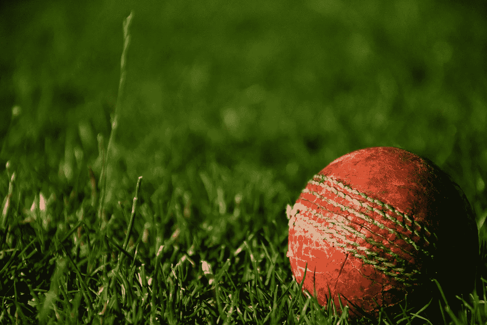
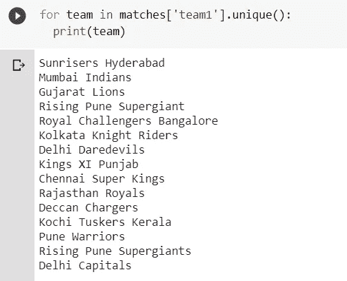
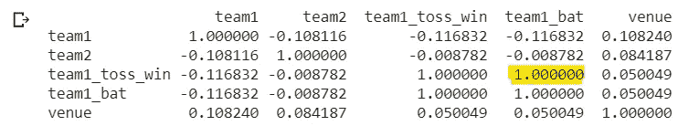
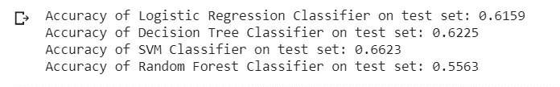

# IPL 比赛的预测分析

> 原文：<https://towardsdatascience.com/predicting-ipl-match-winner-fc9e89f583ce?source=collection_archive---------6----------------------->

## 使用 SVM 二元分类器的预测



Alessandro Bogliari 在 [Unsplash](https://unsplash.com/s/photos/cricket?utm_source=unsplash&utm_medium=referral&utm_content=creditCopyText) 上的照片

自 2008 年 IPL 诞生以来，它吸引了全球各地的观众。高度的不确定性和最后时刻的紧张刺激了球迷观看比赛。在很短的时间内，IPL 已经成为收入最高的板球联赛。长期以来，数据分析一直是体育娱乐的一部分。在一场板球比赛中，我们可能会看到根据当前比赛情况显示球队获胜概率的比分线。我的朋友，这是在行动中的 **D** ata **A** 分析！

想起什么了吗？我们可以把它看作是数据分析的人类版本！[来源](https://gfycat.com/aptgiddydaddylonglegs)

作为一个板球迷，可视化的板球统计数据是迷人的。当我在 Kaggle 上浏览 Medium 和 kernels(比如说代码剧本)的博客时，我被所做的分析迷住了。因此，我决定通过构建一个分类器来预测获胜的团队，从而获得第一次实践经验。

在机器学习中，问题主要分为两类:回归问题和分类问题。回归问题处理具有连续值作为输出的问题，而在分类问题中，输出是分类值。由于赢家预测的输出是一个分类值，我们试图解决的问题是一个分类问题。

那么从哪里开始，做什么呢？

1.  了解数据集。
2.  清理数据。
3.  分析要成为特征的候选列。
4.  按照模型/算法的要求处理特征。
5.  根据训练数据训练模型/算法。
6.  在测试数据上测试模型/算法。
7.  调整模型/算法以获得更高的准确性。

我们开始吧！

## 英国广播公司的

为了顺利学习，我建议浏览一下我用过的 Python 库，比如 [Pandas](https://pandas.pydata.org/) 、 [Numpy](https://numpy.org/) 和 [Scikit-learn](https://scikit-learn.org/stable/) 。

## 步骤 1 —了解数据集！

在处理数据的同时， [Kaggle:你的数据科学之家](http://kaggle.com)是 to-go 平台。我使用了 https://www.kaggle.com/nowke9/ipldata 的数据集。该数据集有 2 个文件:matches.csv，包含 2008 年至 2019 年的每场比赛的详细信息 deliveries.csv，包含每场比赛的逐球详细信息。

## 第 2 步—将数据放入操场并进行清理！

我用的是*。read_csv()* 读取 csv 文件。*中的路径。read_csv()* 函数可以是相对的，也可以是绝对的。在这里，我使用[谷歌合作实验室](https://adventuresinmachinelearning.com/introduction-to-google-colaboratory/)作为我的游乐场，因此文件存储在那里。

> 没有什么是完美的。生活很乱。关系很复杂。结果不确定。人是不理智的。—休·麦凯

正如 Hugh Mackay 在上面的引用中正确指出的“没有什么是完美的”,在这种情况下，它与我们的数据有关。我们拥有的数据在几列中包含空值。

```
column null_values
city      7 
winner    4 
player_of_match 4 
umpire1   2 
umpire2   2 
umpire3  637 
dtype: int64
```

有几种方法可以处理空值，其中，我将对列*城市*使用插补。插补是一种统计上填补缺失值的方法。更多参考，你可能会发现[https://www.kaggle.com/alexisbcook/missing-values](https://www.kaggle.com/alexisbcook/missing-values)很有帮助。由于在列 *winner* 中填充值是不合理的，我们可以删除这些记录。

*的组合。选择()*和*。如果*城市*中的值为*空，则 where()* from *numpy* 根据*地点*列替换*城市*列中的值。*

## 步骤 3 —进一步预处理数据

在摆弄数据时，我发现了一个有趣的冗余。队伍*上升浦那超级巨星*在*队伍 _1* 、*队伍 _2* 、*胜利者*和*投掷 _ 胜利者中被复制。*



用一个值替换这些值显然是下一步要做的事情。Python 库使得数据操作变得容易执行。Pandas 允许我们将数据加载到*数据帧*中，并轻松有效地对其进行操作。

**唷**！！数据现在是干净的。我们终于可以开始分析*特性*(列)了。

## 第 4 步—特征工程

> *注:考虑的栏目有:* team_1 *，* team_2 *，* toss_winner *，* toss_decision *，* venue *，* city *and* winner。

为了使这些列能够帮助模型进行预测，这些值应该对计算机有一定的意义。由于他们(仍然)没有能力理解文本并从中得出结论，我们需要将字符串编码为数字分类值。虽然我们可以选择手动完成这个过程，但是 *Scikit-learn* 库为我们提供了一个使用[*label encoder*](https://scikit-learn.org/stable/modules/generated/sklearn.preprocessing.LabelEncoder.html)*的选项。*

在我们开始构建模型之前，必须承认一个重要的观察结果。像 *toss_winner* 、 *toss_decision* 和 *winner* 这样的栏目对我们来说可能有意义，但是机器呢？


他刚刚过了什么日子？照片由:[Guylaine Brunet](https://www.flickr.com/photos/photo-g-nick/)[Flickr](https://www.flickr.com/photos/photo-g-nick/2088769073/in/photolist-4bzugT-ifGsm-ffkJs7-28zqmg-TxBMf3-GwH1c-697j3u-qTS9Sv-Tw1RdC-6AHKj9-X9yi4c-KKLYiY-2gtTCzG-J4Pye5-2fbsyWW-2gLUGw1-2irZBck-ScHj9E-2i2Np5v-2ezHLjW-EaQpzn-8pvrwv-9CdpE-85jCgF-7izQpG-4XqeDx-4XuuMm-784o9R-4XqeyX-dNjXFB-2i2LtkP-2gi9VVg-Lqrzr-Dwc8P-D37cDE-M2R1Ty-7bujef-MVTuJq-2hZ8nMr-PT3SCR-2gAFp4L-3n5Ar6-2ivWXDk-U4ErZw-2hhZCpT-Juniov-2i2Psax-2hSnuDH-4okwNM-HgsKtR)上的

我来详细说明一下。 *toss_winner* 和 *winner* 中的值包含团队名称，但这些变量与 *team_1* 或 *team_2* 有什么关系呢？他们之间唯一的共同点是他们会分享相同的价值，但这不足以成为逻辑。另外， *toss_decision* 可能是*球棒*或者*场地*，但是他们指的是哪支球队呢？为了解决这个问题，我们将为列 *winner* 、 *toss_winner* 和 *toss_decision* 添加新列 *team1_win* 、 *team1_toss_win* 和 *team1_bat* ，以便它们反映与列 *team_1 的关系。*

如果 team1 赢了，则列 *team1_win* 中的值将为 1，否则为 0，对于列 *team1_toss_decision* 来说，如果 team1 赢了，则该值将为 1，并且如果 team1 首先击球，则最后 *team1_bat* 将为 1。

## 步骤 5 —特征选择

我们基于我们所拥有的领域知识手动选择了一些特性。但是我们没有统计数据证明所选择的特征对我们的数据集是重要的。 *Scikit-learn* 提供了一个名为[***feature _ selection***](https://scikit-learn.org/stable/modules/feature_selection.html)*的优秀模块，它为我们提供了几种进行特征选择的方法。首先，我们将检查这些列中是否有任何一列表示与其他列相同的值。为此，我们需要创建一个相关矩阵来找出列之间的关系。如果列之间相关性的绝对值足够高，我们可以说它们表示相似的值。*

*我们数据的相关矩阵看起来像这样:*

**

*在这里，我们看到 *team1_bat* 表示与 *team1_toss_win* 相同的信息。很奇怪，对吧？这就是数据集是如何建立的，如果第一队赢了掷硬币，那么他们将一直击球，如果第二队赢了掷硬币，那么他们将一直投球。所以我们从我们的特性列表中删除了列 *team1_bat* 。*

## *步骤 6 —构建、训练和测试模型*

*对于一个分类问题，多种算法可以根据我们拥有的数据和使用的模式训练分类器，预测某些输入条件的结果。我们将尝试[决策树分类器](https://scikit-learn.org/stable/modules/generated/sklearn.tree.DecisionTreeClassifier.html)、[随机森林分类器](https://scikit-learn.org/stable/modules/generated/sklearn.ensemble.RandomForestClassifier.html)、[逻辑回归](https://scikit-learn.org/stable/modules/generated/sklearn.linear_model.LogisticRegression.html)和 [SVM](https://scikit-learn.org/stable/modules/generated/sklearn.svm.SVC.html) ，并选择最适合我们数据分布的算法。*

*一旦我们构建了模型，我们需要使用从未向模型公开的值来验证该模型。因此，我们使用[train _ test _ split](https://scikit-learn.org/stable/modules/generated/sklearn.model_selection.train_test_split.html)(Scikit-learn 提供的一个类)将我们的数据分成两部分，每部分 80–20。该模型针对 80%的数据进行训练，并针对另外 20%的数据进行验证。*

*我们现在可以训练各种模型并比较性能。*

*这导致了:*

**

*从结果可以明显看出，对于该数据分布，***【SVM】***给出了比其他算法更高的准确率 **66.23%** 。*

*尽管精确度不够高，没有用，但它给出了一个关于设计机器学习问题的解决方案时所使用的策略和方法的基本概念。*

## *下一步是什么？*

*影响比赛结果的还有很多其他因素，比如*天气*，球员的*状态*，*主场优势*等等，这里不包括。尝试添加这些功能，并尝试使用它。通过使用作为 *train_test_split* 替代方案的 [K 倍交叉验证](/train-test-split-and-cross-validation-in-python-80b61beca4b6)的概念，可以对代码进行进一步修改。在 [K-Fold](/train-test-split-and-cross-validation-in-python-80b61beca4b6) 的链接中查看一篇令人惊叹的文章。*

## *最后！*

*既然你已经做到了，我们在预测 IPL 团队获胜的概率方面做了很好的工作，通过将其转换为二进制分类问题，并在学习 Python 库的同时使用 Python 库。如果您有任何问题、建议或反馈，请随时通过[电子邮件](mailto: gpithadia@gmail.com)或 [LinkedIn](https://www.linkedin.com/in/geetpithadia3/) 联系我。你可以在我的 [GitHub](https://github.com/geetpithadia3/ipl_winner_prediction) 上找到这段代码，非常欢迎你来贡献。*

*预测快乐！*

**感谢* [*德鲁米尔·帕特尔*](https://medium.com/u/c6af1eb2c940?source=post_page-----fc9e89f583ce--------------------------------)*[*赛义德·祖拜尔*](https://www.linkedin.com/in/syed-zubair-939b57119/)*[*萨希尔·桑加尼*](https://www.linkedin.com/in/sahilsangani2/) *，以及* [*亚什·沙阿*](https://www.linkedin.com/in/yash-s-5b6b60102/) *的帮助！****