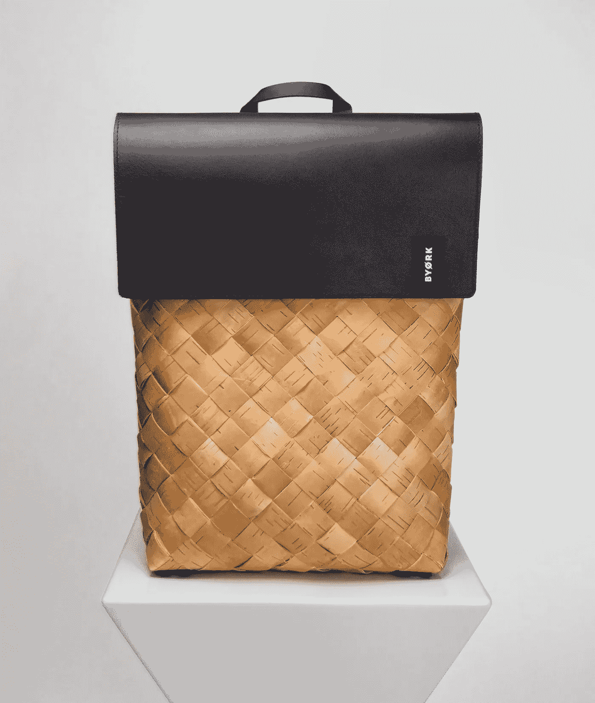
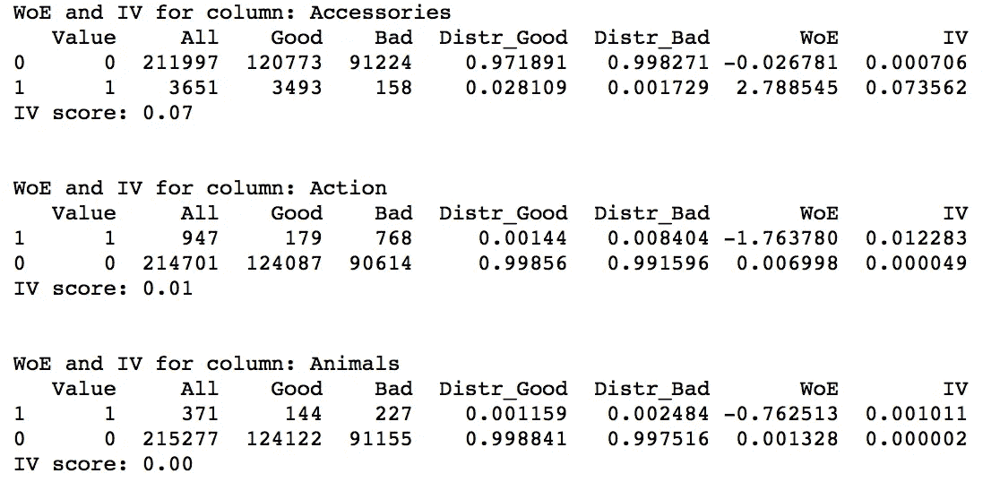
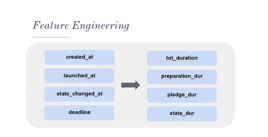
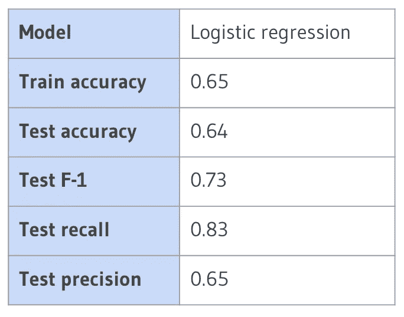
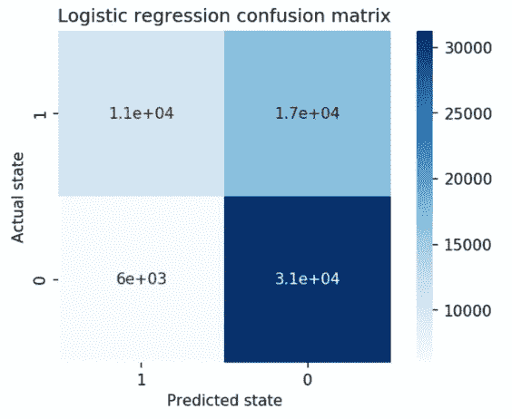
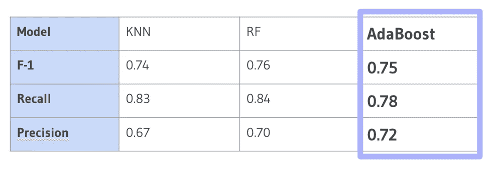
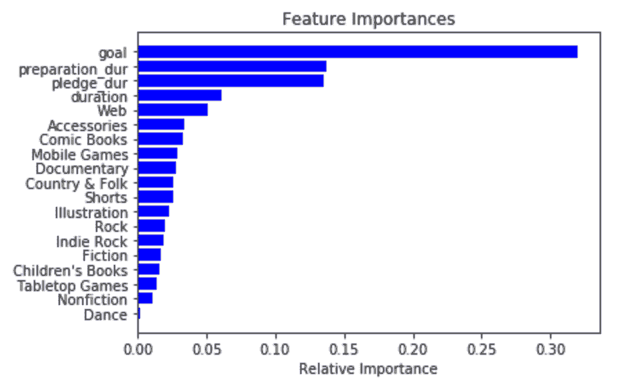
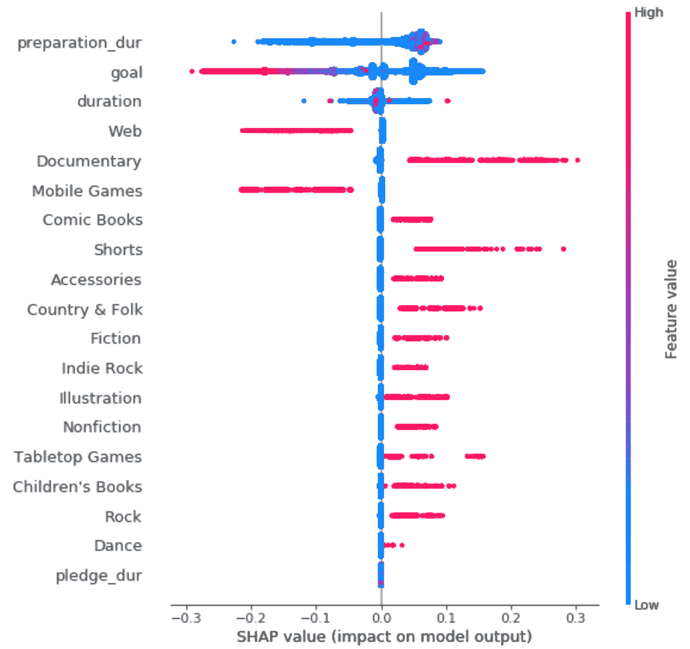

# 使用分类模型预测 Kickstarter 活动的成功

> 原文：<https://towardsdatascience.com/predicting-kickstarter-campaign-success-with-classification-models-91b07c63e6ec?source=collection_archive---------36----------------------->

## 旨在帮助活动家提高他们成功发起运动的机会！

由 [Unsplash](https://unsplash.com/s/photos/kickstarter?utm_source=unsplash&utm_medium=referral&utm_content=creditCopyText) 上的[byrk](https://unsplash.com/@byoerk?utm_source=unsplash&utm_medium=referral&utm_content=creditCopyText)拍摄的照片

[Kickstarter](http://kickstarter.com/) 是一个神奇的平台，帮助企业家发起运动，并“帮助将创意项目带入生活”。虽然任何人都可以在这个网站上传播他们的创意，但不是每个人都能在竞选截止日期前获得足够的承诺。我的项目旨在帮助活动家缩小关注标准，以发起一场成功的运动。

# 方法学

**1。数据来源**

从网站 [Web Robots](https://webrobots.io/kickstarter-datasets/) 获取 Kickstarter 数据集，该网站抓取所有 Kickstarter 项目并收集 CSV 和 JSON 格式的数据。

**2。数据清理**

在进一步研究数据之前，对我的特征和虚拟类别变量进行预处理。

**项目类别:**该功能是一个字典，包含有关活动类别的各种信息。我从这个变量中提取了类别名称、类别位置和类别父 ID 信息，做了三个新变量。

**类别名称:**从项目类别变量中提取这些信息后，我将它转换成一个哑变量。

**状态:**最初有 5 种不同的活动状态，包括暂停、取消、成功、失败和活动，为了简化预测，我将分组减少为成功/失败。

**3。特征选择&工程**

通过计算每个变量的信息值(IV)并仅保留值大于 0.1 的变量来执行特征选择。有关信息价值计算的更多信息，请访问本[网站](https://www.listendata.com/2015/03/weight-of-evidence-woe-and-information.html)。

我的功能 IV 表的快照

至于特性工程，我采用了时间戳特性，如创建时间、启动时间、状态更改时间和截止时间，计算它们的差异，得到每个阶段的持续时间。

不同时间戳特性的特性工程快照

**4。建模**

我选择逻辑回归作为我的基线模型，并将数据分成 20%测试、20%验证和 60%训练样本。在将不同的训练、验证和测试样本拟合到我的基线模型中之后，我得到了下表中的结果:

逻辑回归模型的结果

训练精度和测试精度非常相似，因此没有过度拟合的迹象。然而，测试召回率高于测试精确度，因此我在其他模型上的精确度得分还有一定的提升空间。

我们还可以查看混淆矩阵，以获得关于模型在哪里出错的更多信息。

逻辑回归模型的混淆矩阵

该模型做出的假阳性预测比假阴性预测更多，这意味着对实际上不成功的成功活动的预测比实际上成功的成功活动的预测更多。为了降低我的假阳性预测率，我运行了其他模型来寻求改进。

我首先将我的数据分成 20%的测试和 80%的交叉验证，并将样本拟合到 KNN、随机森林和 AdaBoost 等模型中。在 RandomizedSearchCV 的帮助下，我能够微调每个模型中的参数，并确保我从它们中获得最佳性能。下面是我得到的每个型号的结果表:

KNN、随机森林和 AdaBoost 的结果表

虽然随机森林给了我们三个模型中最高的 F-1 分数，但我认为 AdaBoost 是我最好的模型，因为它给了我们最高的精度分数。我把精确的表现放在回忆的表现之上，因为我不想预测不成功的活动会成功。AdaBoost 给我们的精确分数是 0.72，这意味着在 10 次活动中，我的模型正确预测了 7 次活动成功。

# 结果

为了更好地理解上面的模型是如何工作的，让我们来看看我的特性是如何执行的。下图显示了功能的重要性:

特征重要性图

我们可以看到，目标和时间相关特征是预测活动成功的最重要特征。这一发现是有意义的，因为你的竞选活动的成功取决于认捐的数额是否符合你的目标，以及你是否在竞选活动的最后期限内得到认捐的数额。

我们还可以查看下图，了解这些功能以何种方式影响营销活动的结果。

特征值与模型输出图

SHAP 值表示特征对模型输出变化的责任。SHAP 值越高，特征对模型的积极影响越大。如果我们只看图表的右半部分，即模型受到积极影响的那一半，我们可以看到哪些特征值有助于发起成功的营销活动。

以“准备持续时间”特性为例，其特性值在图表的整个右半部分都很低(蓝色)。这意味着较短的准备时间有更好的机会发起一场成功的运动。以“目标”特征为例，其特征值在图表的整个右半部分也很低(蓝色)。这意味着一个小目标有更好的机会发起一场成功的运动。至于其他与项目类别相关的特性，不同的类别会对模型产生不同的影响。

图表中的见解与我们的直觉相关，因为如果你的准备时间很短，你更有可能在项目截止日期内完成活动。同样，如果你有一个较小的目标，你就有更大的机会达到符合目标的认捐额。

我还用 Flask 和 Javascript 构建了一个 web 应用程序来演示我的模型性能。该应用程序允许用户输入前 4 个重要特性的值，并检索活动成功的预测。

Web 应用程序演示

# 结论

根据我的结果部分，我建议活动家:

*   设定一个适合项目范围的小目标
*   保持活动持续时间短
*   仔细考虑类别

为了增加他们成功发起运动的机会！

对于未来的步骤，我想做一个多类分类，考虑到不同的活动状态，而不是成功/失败。此外，我还想收集更长时间内的数据。根据我的直觉，有一些功能会影响模型的性能，但是，对当前模型没有太大影响。也许一旦我延长了数据收集的时间，这些特性就会显示出它们的影响。

如需更多信息，请随时[联系我](http://annieshieh12@gmail.com/)！你也可以在 [Github](https://github.com/anshieh12/Kickstarter-Campaign-State-Prediction) 上查看这个项目的源代码和文档。