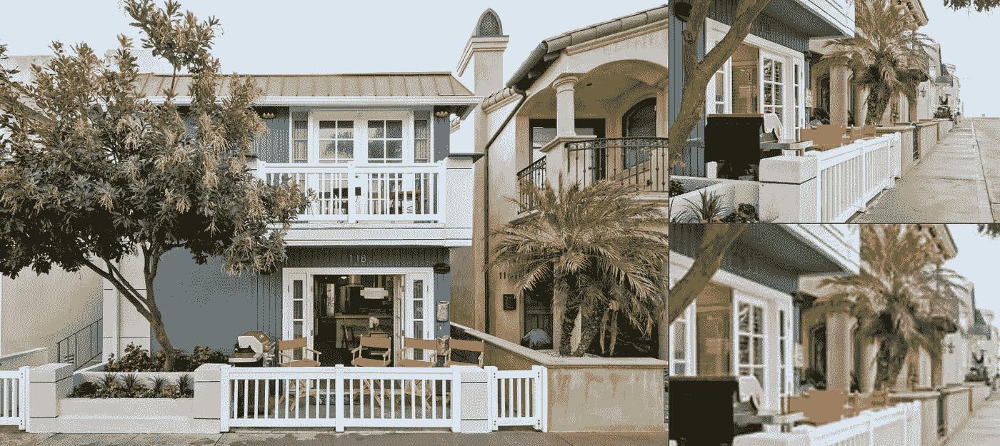
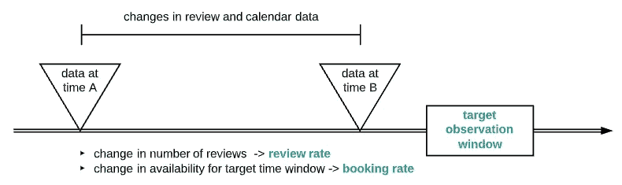
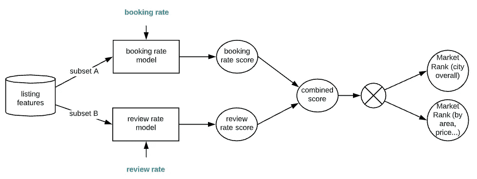
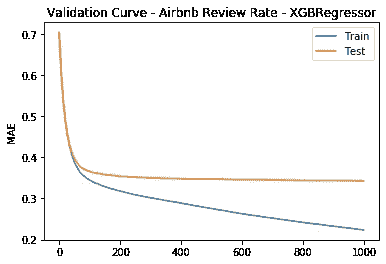
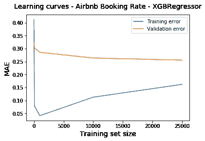
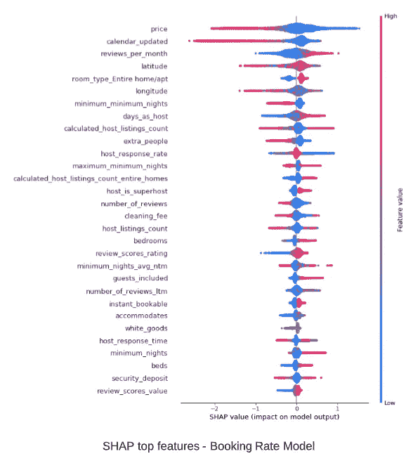
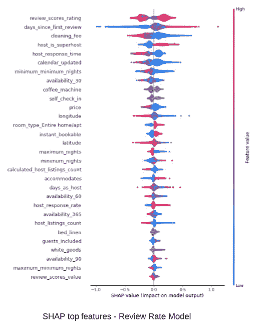
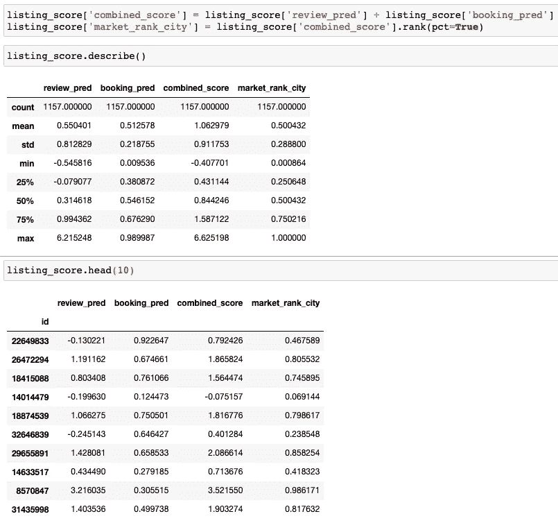
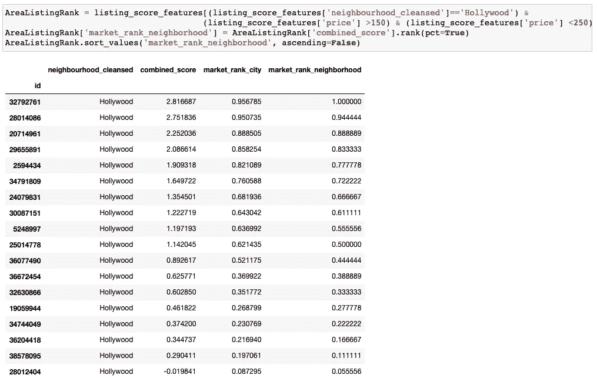

# 预测 Airbnb 房源的市场排名

> 原文：<https://towardsdatascience.com/predicting-market-rank-for-airbnb-listings-59009a886d6?source=collection_archive---------39----------------------->

## 使用机器学习模型量化房地产竞争力

图片来源:Airbnb

## 动机

有几个原因使得 Airbnb 数据更具挑战性，也更有价值:

*   与定义目标和指标的 Kaggle 不同，开放式问题定义是一项关键的数据科学技能-如何确定有价值的业务目标并围绕它创建分析框架和建模解决方案？
*   包括结构化数据、文本和图像在内的丰富信息需要评估和叙述——如何处理数据过多，同时又遗漏了某些数据？
*   来自 insideairbnb.com 等来源的定期数据更新，提供关键反馈并实现迭代优化
*   在数据的背后，是有待解释和发掘的地方、人和他们的多元文化。增强 Airbnb 体验可以为人类带来丰富，并使其成为数据科学家的一个有意义和迷人的目标

## 为什么预测市场排名而不是价格？

在设计机器学习模型之前，首先要问的问题是，我们的目标是什么？目标还应考虑数据的可用性和质量。许多已发表的工作集中在价格预测上。然而，价格可能在不同日期之间大幅波动，这限制了模型的实用性。相反，我会把重点放在一家上市公司相对于其市场竞争对手的排名上。这是一个重要的设计考虑因素，因为相对排名得分捕捉了列表的相对吸引力，并使模型更通用，以适应更多的数据并用于更多的应用。

在这里，我们将市场排名定义为一个列表在特定城市或社区的相对竞争力得分。这个预测模型怎么用？想象一下，如果你是一个主持人，你不仅可以看到你目前的排名与竞争对手相比如何，你还可以评估改变功能(降低价格，增加设施……)以提高你的排名的效果。对于 Airbnb 来说，预测房源受欢迎程度的能力可以为潜在的客人提供有效的推荐(“以下是好莱坞为你推荐的日期和价格范围的前 10 个房源”)，或者为主人提供优化推荐(“如果你将清洁费降低 20 美元，你的排名将从前 25%提高到前 10%)。最终，目标是增加销售额和提高客户满意度。

## 模型设计和培养目标

上市做得越好，它的市场排名就应该越高。我们如何定义和获取监督培训的“市场排名”信息？我们正在寻找能告诉我们一个列表有多受欢迎的数据。虽然我们没有实际的预订信息，但我们有每月更新的可用性和审查数据。让我们来看看这两个关键指标的优缺点:

可用性——可用性本身可能会产生误导，因为列表可能因为被预订或主机退出市场而不可用。通过观察从时间 A 到时间 B 的可用性变化，并查看主机上次更新日历的时间，我们可以更智能地解释变化并导出大多数列表的预订活动

评论——目标观察窗口中评论数量的增加很好地代表了列表的表现。仍然有一个陷阱，那些最小日期越长的列表评论越少(相对于预订的天数)

如图所示，预订率和点评增长率可通过以下方式估算:

*   对于目标时间范围，查看主机何时更新日历以及可用性如何随时间变化，计算预订率
*   对于相同的目标时间范围，查看添加了多少评论，并计算评论率

预订率和评论率相辅相成，为单个房源提供市场排名指标。它们被缩放和标准化以用作回归模型的训练目标。为了进一步多样化，我基于列表特征的子集训练了预订率模型和评论率模型，同时防止数据泄露。所得到的预订率得分和评论率得分然后被合计为一个组合得分，该组合得分然后被用来以百分位数的形式生成市场排名，量化列表在任何城市、区域或邻近地区的相对实力。

## 开发基线模型

对于原型，我使用了洛杉矶 airbnb 房源的数据，2019 年 3 月 6 日为时间 A，2019 年 12 月 5 日为时间 B，2019 年 12 月 5 日+ 30 日为目标预订时间窗口。为了简单起见，我使用 XGBoost 进行最少量的数据处理和调优。

下图显示了审核率模型的样本验证曲线，其 R2 分数约为 0.6。这将作为一个基线，通过添加功能、数据、调整等，有可能进行改进

下图显示了预订率模型的学习曲线示例。随着数据量的增加，训练和验证之间的差距(表示方差)显示出缩小的趋势。正如所料，从误差水平来看，偏差明显存在，可以通过特性和算法来改善。

下图显示了两个回归模型的 SHAP 汇总图。这些特征按照它们对模型结果的影响从上到下排列。对于每个特征，其影响通过其在水平轴上的范围来可视化。红色表示较高的特征值，蓝色表示较低的特征值。向右扩展量化了积极影响(特征值越高，预订和评论率越高，因此列表越热门)。向左延伸量化了负面影响。一些快速观察:

*   不出所料，更高的价格、更少的点评、更长的最低住宿时间会对预订率产生负面影响
*   客人最喜欢整个家/公寓
*   咖啡机、自助入住等简单功能有助于提升房源
*   这两种型号的功能影响不同，因此它们是互补的

[SHAP(SHapley Additive exPlanations)](https://arxiv.org/abs/1802.03888)是一种新兴的算法不可知的可解释 AI (XAI)方法，它利用博弈论来衡量特征对预测的影响。详细的 SHAP 分析超出了这里的范围。

## 图解市场排名

在这里，我们使用洛杉矶地区保留的列表测试集来评估模型。在结合预订模型和评论模型的得分后，我们以百分位数的形式获得一个城市范围的排名得分(“market_rank_city”)。例如，就其市场竞争力而言，列表 ID 8570847 位于顶部 98.6%，而列表 ID 14014479 位于底部 6.9%。

按照标准 url 格式【https://www.airbnb.com/rooms/<id>[查看实际列表，看看分数是否有意义。](https://www.airbnb.com/rooms/)

市场排名也可以计算出一个明确的目标群体，导致更多的应用。例如，我们可以对某个价格范围内某个特定区域的列表进行排名。我们可以应用任何特征值作为过滤器来比较子集中列表的竞争力。

下面是计算好莱坞附近价格为 150 美元到 250 美元的列表的百分位数排名(“market_rank_neighborhood”)的示例。

从上面的列表中，我们来看看最上面的列表，这是一个新的带完整厨房的 2 卧室公寓，售价 174 美元/晚:【https://www.airbnb.com/rooms/32792761】T4

下面是一个 13 平方英尺的房间，配有一张双人床，价格为 199 美元/晚:[https://www.airbnb.com/rooms/28012404](https://www.airbnb.com/rooms/28012404)

## 对新上市公司的业绩进行建模

请注意，我们包括历史信息，如评论和预订活动的增长率，以预测未来的结果。这不是数据泄露的一种形式。相反，它真实地反映了潜在客户对房源的评价。因此，model 对新上市的产品更加中立，因为它缺少许多特性的信息。这也是现实的真实反映。

为了更准确地区分新上市公司的质量，需要开发侧重于便利设施、照片、文本和位置等特征的模型。想想 KNN 建立在随时间恒定的特征子集上。

## 下一步是什么

我分享了一个利用真实世界数据的数据科学项目的旅程，从一个有意义的目标开始，通过研究可用数据和试验模型组合，到有希望的结果。开发的基线模型仅仅触及了可能的表面。由于 airbnb 数据的巨大数量和动态性质，进一步的改进可能来自更多的数据清理、功能工程和算法调整。添加图像和文本信息也有助于深度学习的激动人心的探索。

更多 Airbnb 功能分析及可解释 AI (XAI)的图解使用请参考:[https://medium . com/@ Wang . Sean . x/boosting-machine-learning-models-with-explable-AI-xai-601683119 c84](https://medium.com/@wang.sean.x/boosting-machine-learning-models-with-explainable-ai-xai-601683119c84)