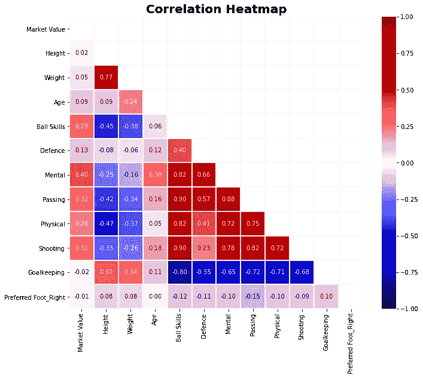
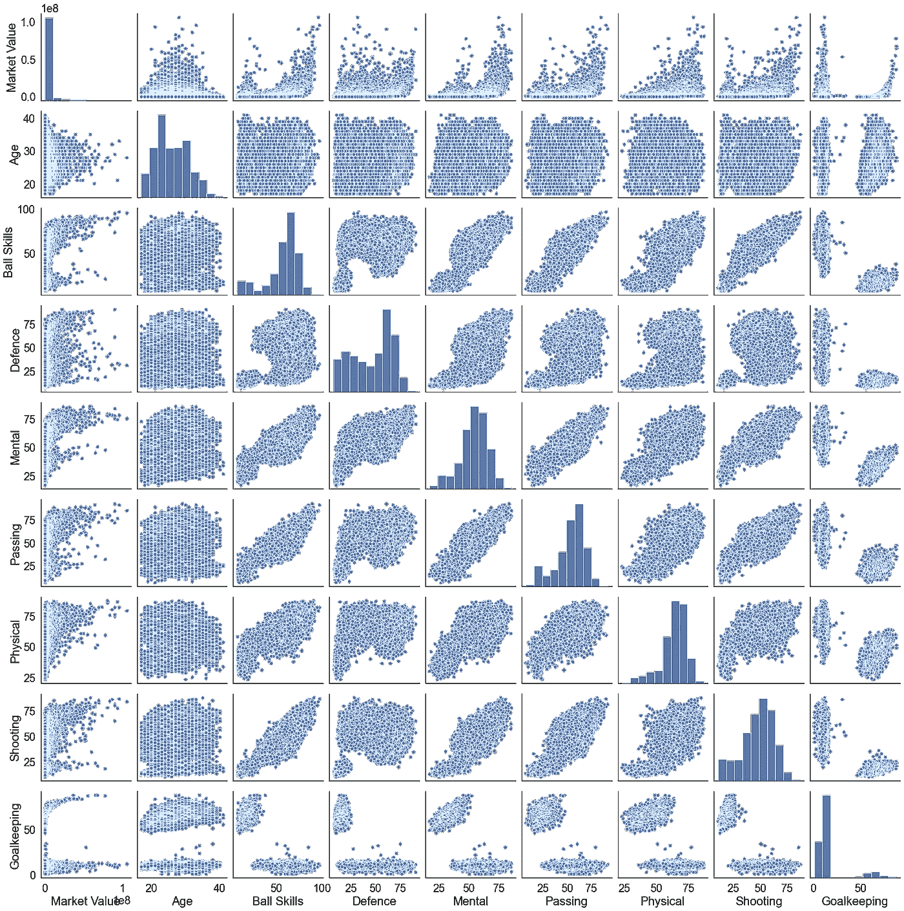
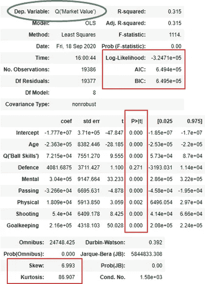
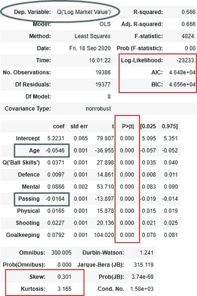
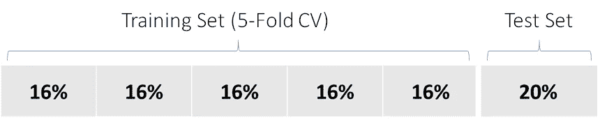
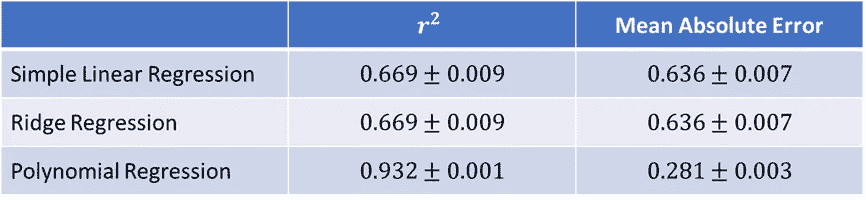
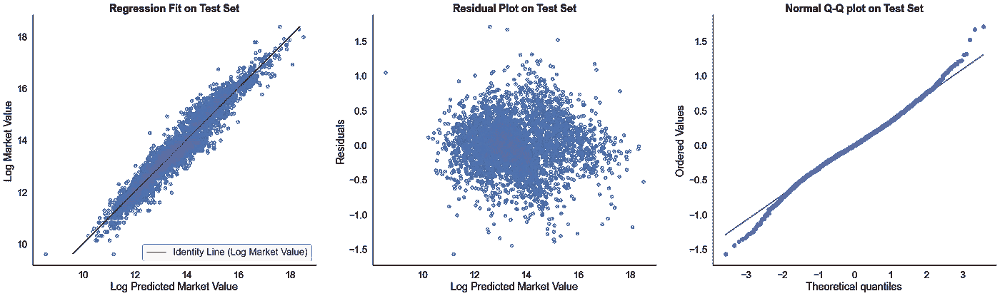
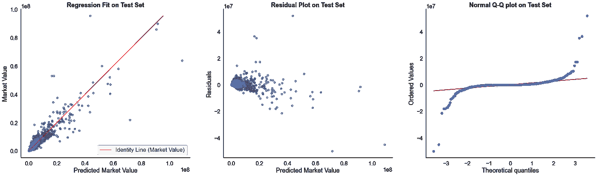

# 回归预测国际足联足球运动员的市场价值

> 原文：<https://towardsdatascience.com/predicting-market-value-of-fifa-soccer-players-with-regression-5d79aed207d9?source=collection_archive---------18----------------------->

## 线性、套索、岭、弹性网和多项式回归的案例研究。

由[福赞·萨里](https://unsplash.com/@fznsr_)在 [Unsplash](https://unsplash.com/) 上拍摄的照片

自 Metis 数据科学训练营开始以来，三周已经过去了，这段旅程可谓紧张而激动人心。在这篇文章中，我详细介绍了我利用过去两周仔细学习的关于 web 抓取和回归的技能和知识构建的项目。在浏览了各种网站后，我最终选定了一个有趣的话题——国际足联足球运动员的市场价值预测！

# 一个足球运动员的市场价值是多少？

当我们谈论一名足球运动员的市场价值时，我们指的是他的足球俱乐部可以出售或将其合同转让给另一家俱乐部的估计金额。足球俱乐部可以支付天文数字来获得顶级球员。正如我们将在后面看到的，足球运动员的市场价值遵循指数趋势，这表明一小部分运动员具有很高的价值。因此，预测市场价值的能力可能会给一些富有的足球俱乐部带来商业优势。

推动市场价值的最重要因素是什么？经过研究，我列出了以下因素:

*   **足球技能**:因为没有一个足球运动员是 100%全能的，所以足球技能分为防守、射门和守门几个领域。在这些领域中的任何一个领域拥有高评级都可以提升你的市场价值。
*   **场上位置**:平均来说，前锋比中场更被看重，其次是后卫。
*   **年龄**:或者青春的系数。自然，年轻球员将拥有更高的市场价值，因为他们有更大的增长潜力和更长的服务期限。
*   **媒体覆盖率:**或媒体系数。一般来说，拥有受欢迎的球员，他们会产生更大的媒体影响，可以为俱乐部带来更多的收入。

尽管如此，由于这些因素的一些数据很难获得，我将尝试创建一个可行的回归模型，仅基于足球技能和年龄来预测市场价值。下面我详细介绍这个项目的过程和结果。

# 美汤刮网

I web 用经典的 Python 模块美汤刮出了 [FIFA 指数](https://www.fifaindex.com/)网站。我总共收集了 19，401 名球员的数据，包括他们的身高、体重、年龄、偏好的脚和技能评分。每个技能等级都被细分到不同的领域，这些领域的得分从 0 到 100。因此，技能等级是通过取其领域的平均值来进行网络搜集的。足球运动员及其各自领域的技能评级如下:

*   **球技** : *控球，运球*
*   **传球** : *传中，短传，长传*
*   **防守** : *盯人，滑铲，立铲*
*   **心理** : *攻击性、反应、攻击位置、拦截、视野、沉着*
*   **体能** : *加速度、耐力、力量、平衡、冲刺速度、敏捷性、跳跃*
*   **射门** : *头球、射门力度、射门、远射、弧线球、任意球准确性、点球、凌空抽射*
*   **守门员** : *定位、假摔、处理、踢球、反应*

以下是我用来收集所有数据的脚本:

在做了一些轻微的处理和剔除一些没有市场价值数据的球员后，这里是数据框架的总结:

# 探索性数据分析

绘制特征和目标(市场价值)的热图揭示了一些有趣的趋势:身高、体重、年龄、偏好的脚和守门员似乎与目标变量无关:

作者图片

因此，问题是我们应该删除这些功能吗？我们已经从领域知识中了解到，年龄是市场价值的一个重要预测指标。守门员技术怎么样？请注意，守门与其他技能指标呈负相关。这并不奇怪，因为守门员大多是专业的，很少上场比赛。然而，如配对图所示，其中一些守门员的价值很高:

作者图片

因此，删除守门员特征可能会导致对守门员市场价值的预测下降，也使模型不稳定。配对图还显示了市场价值的指数分布，揭示了赢家通吃的情况。

# 特征选择和工程

因此，我们继续对市场价值取对数，试图使数据线性化。此外，身高、体重和偏好的脚的特征被删除。如使用 Statsmodels 软件包绘制的 OLS 回归总结所示，该模型得到了显著改进:

作者图片

更不用说调整后的 R 值从 0.32 提高到 0.67，对数似然性也增加了，表明拟合优度更好。此外，残差遵循更加正态的分布，偏斜度几乎降至 0，峰度几乎降至 3，满足正态假设。此外，与目标变量的相关性在所有特性中得到了极大的提高。

我们可以从 OLS 总结中观察到的其他见解是年龄和流逝特征的负系数。虽然我们已经知道年龄与市场价值呈负相关，但及格的负系数还是令人吃惊。这意味着，如果一个球员提高了他的传球技术，平均来说，他的市场价值会随之下降！一个可能的解释是，市场会奖励更有统治力的球员，而更擅长传球的球员可能在其他领域更弱。

# 型号选择

现在，为了拟合数据，我们希望比较的回归模型是简单线性回归、套索回归、岭回归、弹性网回归和多项式回归。请注意，LASSO、Ridge 和 Elastic Net 只是线性回归的正则化版本，它将额外的正则化项添加到我们希望最小化的成本函数中。这些正则化项中的每一项都包含超参数α，其值在模型选择期间选择。在继续之前，我们将整个数据框架随机分为 80%的训练集和 20%的测试集，其中我们保留测试集用于最终的模型评估。对于模型选择，我们进一步随机将训练集分成 5 个部分进行交叉验证。

作者图片

通过对 5 重 CV 中的验证集取平均分数(平均绝对误差),为套索、脊和弹性网选择最佳阿尔法。多项式回归也选择最佳次数。因此，最佳 Alphas 和度数为:

*   套索回归:大约。0
*   岭回归:0.93
*   弹性净回归:大约。0
*   多项式回归:4 次

因为套索和弹性网的 Alpha 值可以忽略不计，所以它们可以近似为线性回归模型。比较其余模型的性能，显然多项式回归(4 次)胜出:

# 模型评估

是时候在测试集上给我们的多项式回归模型打分了！在对**日志市场价值**的测试集进行评分时，结果仍然非常具有可比性，r 为 0.930，平均绝对误差为 0.279，尽管峰度约为 1。

作者图片

Q-Q 图也是非常线性的，代表了对数据的良好模型拟合。然而，在我们对结果感到高兴之前，我们应该记住，我们已经在前面对目标变量取了对数。当我们“取消记录”预测的目标变量，并与测试集中的原始市场价值进行比较时，会发生什么？

作者图片

在不取对数的情况下，对**市场价值**、**和**的测试集进行评分，我们得到 r 为 0.836，€平均绝对误差为 668，684，峰度为 234！结果是令人惊讶的，但是我应该强调，这是我们用回归和我们选择的有限特性可能实现的最佳模型。

下面是比较市场价值和预测市场价值的测试集的最终数据框架的快照。虽然预测通常遵循实际市场价值的趋势，但我们能够观察到一些异常值。此外，该模型似乎也有利于捍卫者，如将维吉尔·范·迪克和吉奥吉奥·基耶利尼排在前 5 行所证明的。一个更准确的模型会更有利于罢工者。

# 结论和未来工作

尽管如此，考虑到我使用的有限特性，最终模型的结果还是相当不错的。今后，如果有其他数据来源，应考虑球员在场上的位置和媒体系数等重要特征。

话虽如此，我期待在未来几周从 Metis 数据科学训练营学习更多的机器学习技术！谁知道呢？随着更多的机器学习工具，如神经网络，我们可能会重新访问该项目，并设计一个更好的模型。

这里是到我的 GitHub 的[链接](https://github.com/tanpengshi/Metis_Project_2_FIFA_Players)，它包含了这个项目的所有代码和演示幻灯片。

你觉得我的模型怎么样？通过我的 LinkedIn[联系我或者在下面评论来讨论！](https://www.linkedin.com/in/tanpengshi/)

*附:感谢阅读我关于* ***回归*** *的作品。如果你也有兴趣了解* ***分类*** *，那就来看看我的下一个项目:*

 [## 用分类预测航空旅客的满意度

### 案例研究与 KNN，逻辑回归，高斯 NB，决策树和随机森林。

towardsdatascience.com](/predicting-satisfaction-of-airline-passengers-with-classification-76f1516e1d16) 

> ***支持我！*** —如果你*没有*订阅 Medium，并且喜欢我的内容，请考虑通过我的[推荐链接](https://tanpengshi.medium.com/membership)加入 Medium 来支持我。

 [## 加入我的介绍链接媒体-谭师鹏阿尔文

### 阅读谭·师鹏·阿尔文(以及媒体上成千上万其他作家)的每一个故事。您的会员费直接…

tanpengshi.medium.com](https://tanpengshi.medium.com/membership)