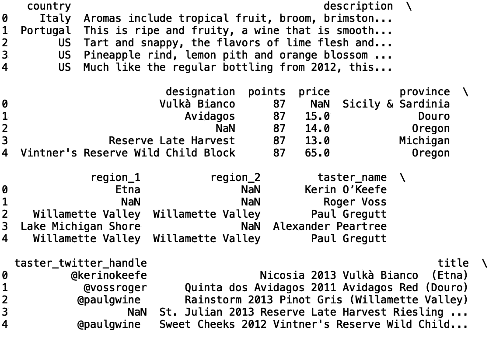
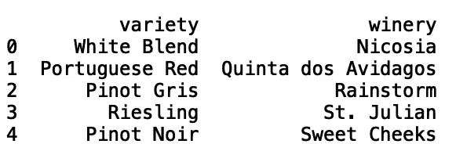
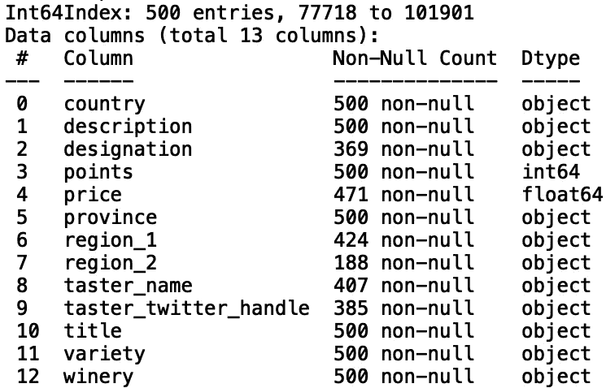
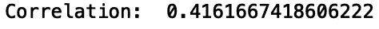
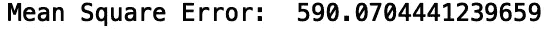
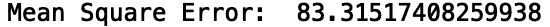
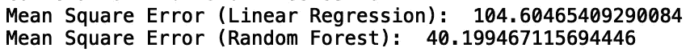
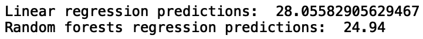

# 使用 Python 预测缺失值

> 原文：<https://towardsdatascience.com/predicting-missing-values-with-python-41e581511117?source=collection_archive---------14----------------------->

## 建立数据插补模型


[来源](https://www.pexels.com/photo/jigsaw-puzzle-3482442/)

对于数据科学家来说，处理缺失数据是数据清理和模型开发过程的重要部分。通常，真实数据包含多个稀疏字段或充满错误值的字段。在本帖中，我们将讨论如何构建模型来估算数据中缺失或错误的值。

我们开始吧！

出于我们的目的，我们将使用葡萄酒数据集，这个数据集可以在[这里](https://www.kaggle.com/zynicide/wine-reviews)找到。

首先，让我们将数据读入熊猫数据框:

```
import pandas as pd
df = pd.read_csv("winemag-data-130k-v2.csv")
```

接下来，让我们打印前五行数据:

```
print(df.head())
```



让我们从这些数据中随机抽取 500 条记录。这将有助于加速模型训练和测试，尽管读者可以很容易地修改它:

```
import pandas as pd
df = pd.read_csv("winemag-data-130k-v2.csv").sample(n=500, random_state = 42)
```

现在，让我们打印与我们的数据相对应的信息，这将使我们了解哪些列有缺失值:

```
print(df.info())
```



有几列的非空值少于 500 个，这相当于缺少值。首先，让我们考虑建立一个模型，使用“点”估算缺失的“价格”值。首先，让我们打印“价格”和“积分”之间的相关性:

```
print("Correlation: ", df['points'].corr(df['price']))
```



我们看到有一个微弱的正相关。让我们建立一个线性回归模型，用“点”来预测“价格”。首先，让我们从“scikit-learn”导入“LinearRegresssion”模块:

```
from sklearn.linear_model import LinearRegression
```

现在，让我们将我们的数据分开用于训练和测试。我们希望能够预测缺失的值，但是我们应该使用基本事实“价格”值来验证我们的预测。让我们通过只选择正价格值来过滤掉缺少的值:

```
import numpy as np 
df_filter = df[df['price'] > 0].copy()
```

让我们也初始化我们将用来存储我们的预测和实际值的列表:

```
y_pred = []
y_true = []
```

我们将使用 K 折交叉验证来验证我们的模型。让我们从“scikit-learn”导入“KFolds”模块。我们将使用 10 个折叠来验证我们的模型:

```
from sklearn.model_selection import KFold
kf = KFold(n_splits=10, random_state = 42)
for train_index, test_index in kf.split(df_filter):
    df_test = df_filter.iloc[test_index]
    df_train = df_filter.iloc[train_index]
```

我们现在可以定义我们的输入和输出:

```
for train_index, test_index in kf.split(df_filter):
    ...
    X_train = np.array(df_train['points']).reshape(-1, 1)     
    y_train = np.array(df_train['price']).reshape(-1, 1)
    X_test = np.array(df_test['points']).reshape(-1, 1)  
    y_test = np.array(df_test['price']).reshape(-1, 1)
```

并符合我们的线性回归模型:

```
for train_index, test_index in kf.split(df_filter):
    ...
    model = LinearRegression()
    model.fit(X_train, y_train)
```

现在让我们生成并存储我们的预测:

```
for train_index, test_index in kf.split(df_filter):
    ...
    y_pred.append(model.predict(X_test)[0])
    y_true.append(y_test[0])
```

现在让我们来评估我们模型的性能。让我们使用均方误差来评估我们模型的性能:

```
print("Mean Square Error: ", mean_squared_error(y_true, y_pred))
```



我们看到表演不是太好。我们可以通过对平均价格加上一个标准差的价格进行训练来改善这一点:

```
df_filter = df[df['price'] <= df['price'].mean() + df['price'].std() ].copy()
...
print("Mean Square Error: ", mean_squared_error(y_true, y_pred))
```



虽然这显著提高了性能，但代价是无法准确估算高价葡萄酒的价值。我们可以不使用单一特征的回归模型来预测价格，而是使用基于树的模型，如随机森林，它可以处理分类和数字变量。让我们建立一个随机森林回归模型，使用“国家”、“省份”、“品种”、“酒厂”和“点数”来预测葡萄酒的“价格”。首先，让我们将分类变量转换成可由随机森林模型处理的分类代码:

```
df['country_cat'] = df['country'].astype('category')
df['country_cat'] = df['country_cat'].cat.codesdf['province_cat'] = df['province'].astype('category')
df['province_cat'] = df['province_cat'].cat.codesdf['winery_cat'] = df['winery'].astype('category')
df['winery_cat'] = df['winery_cat'].cat.codesdf['variety_cat'] = df['variety'].astype('category')
df['variety_cat'] = df['variety_cat'].cat.codes
```

让我们将随机样本量增加到 5000:

```
df = pd.read_csv("winemag-data-130k-v2.csv").sample(n=5000, random_state = 42)
```

接下来，让我们从 scikit-learn 导入随机森林回归器模块。让我们还定义我们将用来训练我们的模型的特征列表:

```
from sklearn.ensemble import RandomForestRegressor
features = ['points', 'country_cat', 'province_cat', 'winery_cat', 'variety_cat']
```

让我们使用具有 1000 个估计器和最大深度 1000 的随机森林来训练我们的模型。然后，让我们生成预测并将它们追加到一个新列表中:

```
for train_index, test_index in kf.split(df_filter):
    df_test = df_filter.iloc[test_index]
    df_train = df_filter.iloc[train_index]

    X_train = np.array(df_train[features])
    y_train = np.array(df_train['price'])
    X_test = np.array(df_test[features])
    y_test = np.array(df_test['price'])
    model = RandomForestRegressor(n_estimators = 1000, max_depth = 1000, random_state = 42)
    model.fit(X_train, y_train) y_pred_rf.append(model.predict(X_test)[0])
    y_true_rf.append(y_test[0])
```

最后，让我们评估随机森林和线性回归模型的均方误差:

```
print("Mean Square Error (Linear Regression): ", mean_squared_error(y_true, y_pred))
print("Mean Square Error (Random Forest): ", mean_squared_error(y_pred_rf, y_true_rf))
```



我们看到随机森林模型具有优越的性能。现在，让我们使用我们的模型预测缺失的价格值，并显示预测示例:

```
df_missing = df[df['price'].isnull()].copy()X_test_lr = np.array(df_missing['points']).reshape(-1, 1)
X_test_rf = np.array(df_missing[features])X_train_lr = np.array(df_filter['points']).reshape(-1, 1)    
y_train_lr = np.array(df_filter['price']).reshape(-1, 1)X_train_rf = np.array(df_filter[features])
y_train_rf = np.array(df_filter['price'])model_lr = LinearRegression()
model_lr.fit(X_train_lr, y_train_lr)
print("Linear regression predictions: ", model_lr.predict(X_test_lr)[0][0])model_rf = RandomForestRegressor(n_estimators = 1000, max_depth = 1000, random_state = 42)
model_rf.fit(X_train_rf, y_train_rf)
print("Random forests regression predictions: ", model_rf.predict(X_test_rf)[0])
```



我就讲到这里，但我鼓励您尝试特性选择和超参数调整，看看是否可以提高性能。此外，我鼓励您扩展此数据估算模型，以估算分类字段中的缺失值，如“区域 _1”和“指定”。在这里，您可以构建一个基于树的分类模型，该模型根据分类和数字特征进行训练，以预测所列类别的缺失值。

## 结论

总之，在这篇文章中，我们讨论了如何建立机器学习模型，我们可以用它来估算数据中的缺失值。首先，我们建立了一个线性回归模型，对评论的葡萄酒进行“点数”训练，以预测葡萄酒的价格。然后，我们建立了一个随机森林模型，根据“点数”和其他分类变量来预测葡萄酒价格。我们看到随机森林模型明显优于基于线性回归的数据插补模型。我希望你觉得这篇文章有用/有趣。这篇文章的代码可以在 GitHub 上找到。感谢您的阅读！