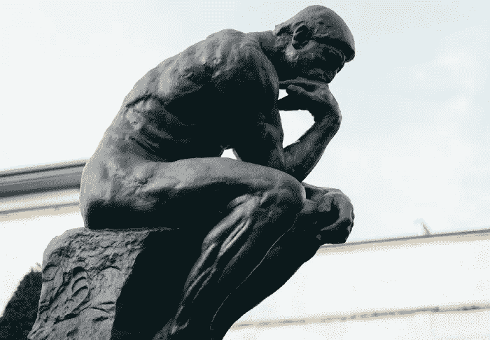

# 用 GPflow 预测分子性质

> 原文：<https://towardsdatascience.com/predicting-molecular-properties-with-gpflow-bd25bf4c08eb?source=collection_archive---------63----------------------->

拉斐尔·比斯卡尔迪在 Unsplash 上的照片

## [gp flow 中分子的高斯过程回归](/gaussian-process-regression-on-molecules-in-gpflow-ee6fedab2130)

由[瑞安-里斯·格里菲斯](https://medium.com/u/ef605a16eb6b?source=post_page-----bd25bf4c08eb--------------------------------) — 5 分钟阅读

这篇文章演示了如何通过创建自定义的 Tanimoto 内核来操作 Morgan 指纹，使用 GPflow 库训练高斯过程(GP)来预测分子属性。请访问我的 GitHub repo 获取 Jupyter 笔记本！

瓦伦汀·b·克雷默在 Unsplash 上的照片

## [来自深度学习大师的教训](/lessons-from-a-deep-learning-master-1e38404dd2d5)

到[罗摩罗摩克里希南](https://medium.com/u/28748480e8bd?source=post_page-----bd25bf4c08eb--------------------------------) — 11 分钟阅读

Yoshua Bengio 是深度学习的传奇人物，与 Geoff Hinton 和 Yann LeCun 一起获得了 2018 年的图灵奖。
在这篇简短的帖子中，我想为你强调一下 Yoshua 和他的合作者从 381 个参赛团队中赢得机器学习比赛的一些聪明的事情。也许这些想法会对你自己的工作有用。

布鲁克·卡格尔在 Unsplash 上拍摄的照片

## [10 标志着一家初创公司拥有令人敬畏的工作文化](/10-signs-a-startup-has-awesome-work-culture-90d7aa25e3a5)

由[凯特·玛丽·刘易斯](https://medium.com/u/feb55b31bbd5?source=post_page-----bd25bf4c08eb--------------------------------) — 15 分钟阅读

数据科学家需求量很大。因此，在寻找工作的公司时，你可以有点挑剔。即使你正在寻找你的第一份数据科学工作，我也要提醒你不要盲目接受你收到的第一份工作。做好功课，确保这家公司非常适合你是非常重要的。

我们的每日精选将于周一回归！如果你想在周五收到我们的 [*每周文摘*](/receive-our-newsletters-681049ffa0cf) *，很简单！跟随* [*我们的刊物*](http://towardsdatascience.com/) *然后进入你的设置，打开“接收信件”您可以在此* *了解更多关于如何充分利用数据科学* [*的信息。*](/how-to-get-the-most-out-of-towards-data-science-3bf37f75a345)