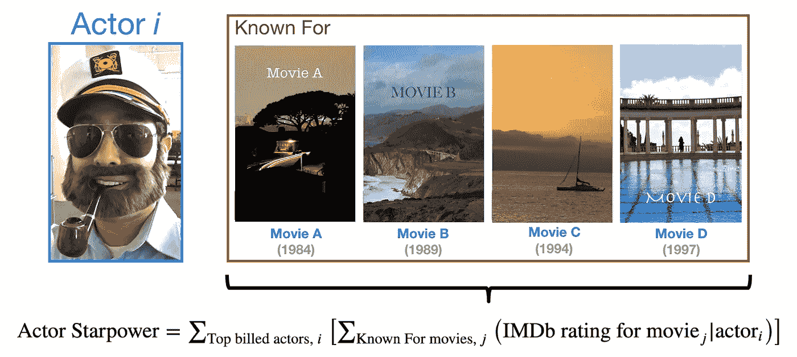
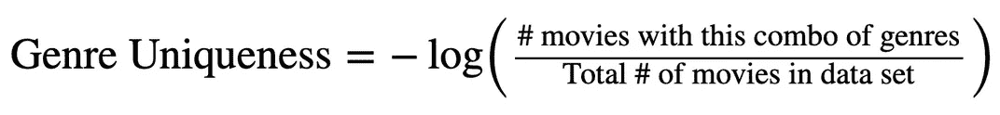
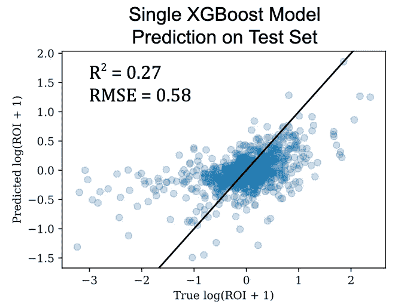
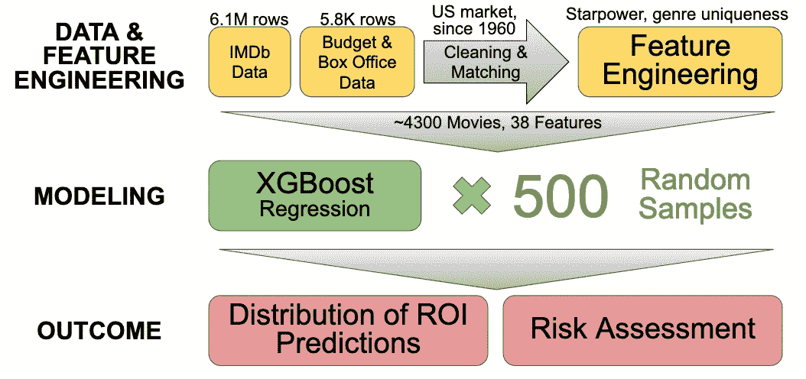
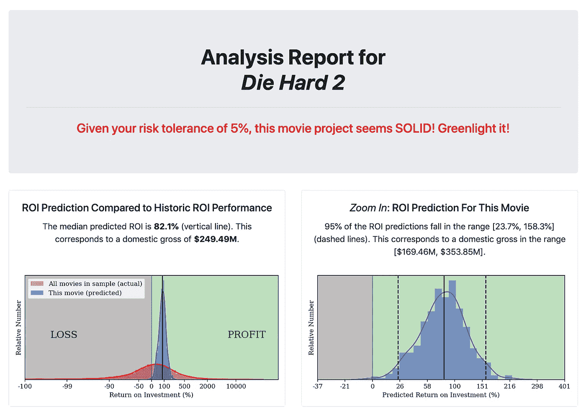
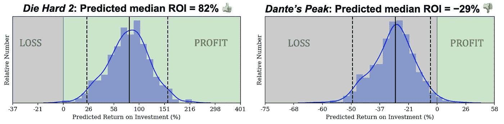

# 在前期制作阶段预测电影的盈利能力和风险

> 原文：<https://towardsdatascience.com/predicting-movie-profitability-and-risk-at-the-pre-production-phase-2288505b4aec?source=collection_archive---------16----------------------->

## 使用机器学习预测的可变性作为风险的代理，可以帮助电影公司的高管和制片人决定是否批准一个电影项目

由[凯尔·史密斯](https://unsplash.com/@kymasm?utm_source=medium&utm_medium=referral)在 [Unsplash](https://unsplash.com?utm_source=medium&utm_medium=referral) 上拍摄

好莱坞是一个年收入 100 亿美元的产业，电影从热门到票房炸弹。预测一部电影的票房会有多好是很难的，因为成功有太多的因素。编剧威廉姆·高德曼(*布奇卡西迪和圣丹斯小子*，*所有总统的男人*，*公主新娘*)对这个行业有一句名言，“没人知道任何事情。”

罗伯特·尼克森在 [Unsplash](https://unsplash.com?utm_source=medium&utm_medium=referral) 上拍摄的照片

人们已经花了很多精力来理解和预测电影的成功(例如，参见亚瑟·德·万尼的 [*好莱坞经济学*](https://books.google.com/books/about/Hollywood_Economics.html?id=5P_KrDloaRkC&source=kp_book_description) 和卡格尔最近的[票房预测挑战](https://www.kaggle.com/c/tmdb-box-office-prediction))，目前的尝试正在使用越来越复杂的技术。我在这里的目标不是改进当前的预测算法，而是描述我设计的一个名为 [**ReelRisk**](http://www.filmfundr.site/) 的模型，该模型使用随机重采样来生成一系列预测，然后可以用作风险评估工具，以尽早决定是否资助一部电影。2019 年，仅网飞就发布了 371 部新电视剧和电影。随着新内容的不断涌现，拥有像 **ReelRisk** 这样的工具可以帮助制作人选择何时前进或何时放弃。

## **电影数据和票房数字**

为了建立我的预测算法，我从几个网上来源收集了电影数据。我从互联网电影数据库(IMDb)获得了大部分数据，该数据库提供了一组免费下载的文件。然而，IMDb 档案并不包含电影预算和票房收入的估计数据。为此，我从一个名为[的行业网站上搜集了一些数据](https://www.the-numbers.com/movie/budgets)。为了简单起见，我将电影的范围限制在 1960 年后上映的非成人电影，并且只考虑美国票房收入(“国内总收入”)。

接下来，我花了相当多的时间清理数据；由于我有两个数据来源，它们之间的信息并不总是一致的。我必须根据电影名称将我的电影数据与适当的预算和票房数字相匹配。许多不匹配的标题案例可以通过删除或替换字符的算法来解决。即使在那时，一些手工清洗也是必要的(例如，最初的 1977 年*星球大战*电影在数字中被简单地列为*星球大战*，而在 IMDb 它被列为*星球大战:第四集——新的希望*)。

一旦两个数据集被清理和合并，我就剩下大约 4300 部电影要处理了。我拿出其中的 20%作为测试集，剩下的用于训练和验证。

## 特征选择和工程

我的模型的大部分输入要么是来自数据源，要么经过了最少的处理。这些是:

*   标题(以字符为单位的长度，用作数字特征)
*   预算(使用[消费者价格指数](https://fred.stlouisfed.org/series/CPIAUCNS)转换为 2019 年美元)
*   运行时间(分钟)
*   发布日期(月份和年份被视为独立的特征)
*   流派(23 个类别，每部电影可以有多个类别)
*   演员(排名前四的演员的名字)
*   导演
*   美国电影协会分级(例如，PG-13)
*   续作或特许经营的一部分(是/否)

我还花了大量时间来构建我自己的有用特性，以包含在我的模型中。我想到了三个:**演员 starpower** ，**导演 starpower** ，**流派独特性**。人们有理由认为，电影演员和导演的相对知名度将有助于电影的成功。如果一部电影以一种新颖的方式结合了几种类型(例如，黑色电影+科幻+惊悚)，这也可能会激起电影观众的兴趣。下图解释了演员 starpower 的计算。

演员 starpower 的计算。对于每部电影，演员明星效应是排名前四的演员的个人明星效应的总和。根据 IMDb 的说法，每个演员的明星效应是 IMDb 用户对该演员前四部“知名”电影的平均评分之和。

导演星光值的计算类似于单个演员的星光值。

流派独特性是衡量一部电影的流派类别组合相对于我的数据集中所有电影的独特程度。

这里的“**—**log”用于创建一个更正态分布的数量，同时确保更多独特的类型具有更大的正值。

最后，我有 38 个特征，其中大部分是分类的和[一次性编码的](https://scikit-learn.org/stable/modules/generated/sklearn.preprocessing.OneHotEncoder.html)。选择和设计特征的过程既费力又重要，因为任何模型的成功都在很大程度上取决于输入数据的数量和质量(回想一下:“垃圾进，垃圾出！”).

## 构建预测电影盈利能力的模型

在这里，我将盈利能力作为衡量一部电影成功的标准，并将盈利能力定义为投资回报率*(ROI)。投资回报率就是电影票房收入占预算的比例(即投资回报率=利润/预算)。由于投资回报率的极端值在电影中相当常见(包括巨大的成功和重大的失败)，而且范围很大，所以我打算预测的目标变量是 log(投资回报率+ 1)。*

*我使用 [XGBoost](https://xgboost.readthedocs.io/en/latest/) 作为我的回归模型，因为我发现当使用均方根误差(RMSE)作为品质度量时，它稍微优于随机森林回归。我使用了 5 重交叉验证来调优 XGBoost 模型的几个超参数，包括树的数量、每棵树的最大深度和学习速率。下面是单个 XGBoost 模型对 80%的数据进行训练并对未知的 20%进行测试的结果。*

**

*保留测试集的预测 ROI 与真实 ROI 的散点图。实线表示用于比较的 *y=x* 线。该模型表现相当好，但有很多分散，特别是在分布的极端。*

*散点图证明了预测电影的成功确实很难！从单个模型输出的 ROI 的单个预测是不太可信的。但是，使用训练数据的随机子样本创建 ROI 预测的分布可以给出预测的可变性，作为投资电影所涉及的风险的代理(这本质上也是刀切和引导重采样背后的想法)。给定我的完整训练集 *N* 个样本，我生成了 500 个子样本，每个子样本的大小为 *N* /2，每个子样本都是从完整的 *N* 集中随机抽取的。值 500 和 *N* /2 在某种程度上是任意的，但是选择它们是为了获得 ROI 值的平滑分布，并且平衡对预测中足够可变性的期望与为每个模型保持足够大的训练集的需要。我在这 500 个随机子样本上训练了 500 个模型，并建立了 ROI 值的分布，从中我可以提取汇总统计数据，如中值和 95%的置信区间。我的建模过程的示意图如下所示。*

**

*概述 ReelRisk 背后的建模流程的图表。*

## *ReelRisk:电影制作的风险评估工具*

*下面是我开发的 web 应用程序 [**ReelRisk**](http://www.filmfundr.site/) 的输入页面截图，该应用程序帮助电影公司高管和制片人评估资助拟议电影项目所涉及的风险。*

**

*ReelRisk 的输入页面。用户可以输入关于提议的电影项目的信息，并接收关于项目风险的报告。*

*在这里，用户可以输入关于提议的电影的信息(估计的预算和运行时间，他们想要签约的潜在演员，等等。)甚至设定自己的风险承受能力。例如，该页面预先填充了 1990 年成功的电影《虎胆龙威 2》的信息。单击绿色按钮后，用户将被重定向到结果页面，该页面给出了模型的建议操作过程以及一些分析:*

**

*《虎胆龙威 2》的 ReelRisk 结果。鉴于用户设定的风险承受能力，我们建议投资这部电影，因为 95%的投资回报率预测都在 24% — 158%之间(平均投资回报率为 82%)！*

*结果中显示的蓝色直方图是来自我的预训练 XGBoost 模型的 500 个 ROI 预测的分布。绿色阴影区域表示正利润(ROI > 0%)，而灰色区域表示亏损。几乎所有对《虎胆龙威 2》的投资回报预测都在“利润”范围内，所以建议是这个项目是“可靠的”,你应该投资这部电影！风险容忍度设置允许用户选择 ROI 预测的百分比可以落在“损失”范围内，同时仍然将电影评估为“可靠”投资。不被视为“可靠”投资的电影被标记为“高风险”，下面显示了每种投资的示例分布以供比较:*

**

*比较一个“可靠”的项目(虎胆龙威 2，一个重大的成功)和一个“危险”的项目(但丁的巅峰，一个失败)。前者的大部分预测位于盈利区域，而后者的大部分预测位于亏损区域。*

*我想指出，我预测投资回报率和投资回报率不确定性的技术是为了补充而不是取代创造性的决策过程。该方法也可以应用于其他领域的风险管理。*

## *警告和改进*

*电影制作是一项庞大而复杂的合作事业，因此有些特征很难量化。对我的模型的一个改进是加入捕捉电影情节的特征，例如，使用自然语言处理(NLP)来提取主题或情感，并将它们编码为数字向量。*

*我设计的 starpower 功能是对演员或导演受欢迎程度的粗略估计；一个更严格的算法将通过只允许在给定电影 *i* 之前上映的电影被包括在电影 *i* 的计算中来确保没有数据泄露。票房收入可能也是比 IMDb 用户平均评分更具体的成功衡量标准。一个更复杂但更有见地的算法是对演员/导演的网络分析，利用他们以前合作的成功来计算他们的联系强度(如 Lash &赵在[本文](https://arxiv.org/abs/1506.05382)中所做的)。即便如此，也没有演员“受欢迎程度”的硬性衡量标准，也没有电影“成功”的绝对知识——这也是造成这一点如此困难的部分原因！如今其他令人困惑的变量是通过点播流媒体平台发行的电影(*如何衡量它们的盈利能力？*)以及营销的效果，尤其是通过社交媒体进行的电影推广(*如何量化病毒式视频或模因的效果？*)。*

*另一个潜在的改进将是从许多不同的算法(即，从 XGBoost、随机森林、神经网络等的预测的某种加权平均)创建集合模型。).这可以更准确地描述预测的可变性。*

**我在担任* [*洞察数据科学研究员*](https://www.insightdatascience.com/) *期间，建立了*[***reel risk***](http://www.filmfundr.site/)*作为一个为期 4 周的项目。Insight 计划让拥有各种定量领域博士学位的人做好准备，帮助他们在行业中从事数据科学工作。**