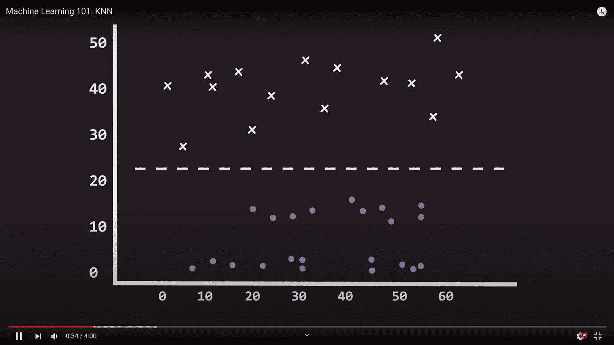
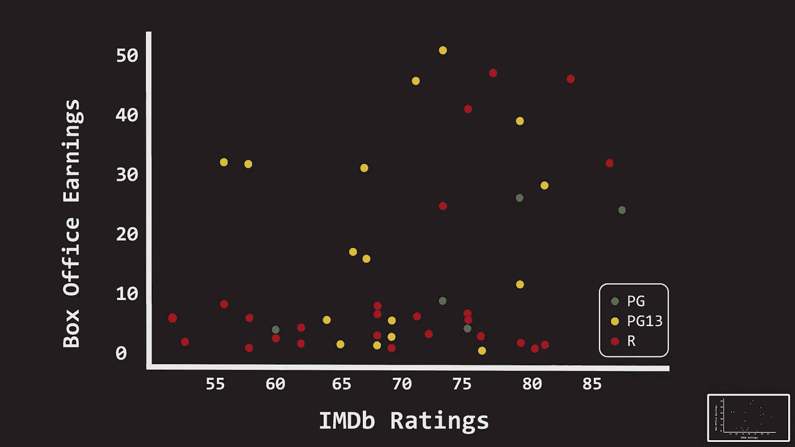
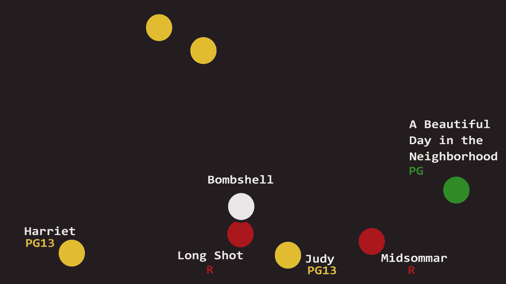

# 预测电影的美国电影协会评分

> 原文：<https://towardsdatascience.com/predicting-mpaa-ratings-for-movies-47fb85970bd4?source=collection_archive---------46----------------------->

## 利用 KNN 预测年龄分级使用 IMDb 评论和票房收入

除了回归，分类是监督机器学习中最常见的任务之一。分类是将事物分类的任务。例如，将图像分为狗和猫的图像，标记 x 射线是否有骨折，以及更具争议的是，某人是否会偿还贷款。

按照这个教程，你可以用这个 Colab 笔记本:
[https://Colab . research . Google . com/drive/1 xzibt _ y 4 be 22k 7 D1 btfakd 6-ax 8d dbxb？usp =分享](https://colab.research.google.com/drive/1XZiBt_y4bE22k7D1bTfakD6-ax8Ddbxb?usp=sharing)

请观看这段 4 分钟的视频:

在大多数情况下，分类是通过在数据点之间绘制决策边界来完成的。例如，在这个图中，我们可以画一个这样的决策边界来分隔 x 和 Os。如果一个点在这条线上，我们把它归类为 X，如果它在这条线以下，我们把它归类为 o。



让我们看一个可以使用分类解决的实际问题。我们可以仅仅通过查看关于电影的两个变量来将电影划分为美国电影协会评级(即 G、PG、PG13 或 R)吗？这两个变量是:电影在 iMDB 上的观众评级和电影在全球的票房收入。换句话说，这些变量对美国电影协会评级有任何预测价值吗？

让我们在这里画出 *48* 电影的数据。票房收入将在 X 轴上，而 iMDB 评级将在 Y 轴上。我们将美国电影协会分级编码为从 1 到 3 的数字，1 表示 PG，3 表示 R。为了更好地显示该数据集，我们将 PG 电影着色为绿色，PG 13 电影着色为橙色，R 电影着色为红色。正如我们所看到的，使用简单的决策界限将电影分为美国电影协会等级几乎是不可能的。



输入 K-最近邻。k-最近邻或简称 KNN 是一种分类和回归方法，它基于一个简单的前提，即彼此接近的数据点往往具有相似的值或结果。例如，如果你的邻居都有车，那么你可能会认为你也有车。

从数学上来说，为了预测特定点的结果，KNN 挑选 K 个最接近该点的数据点，并对它们的结果进行平均。

例如，让我们回到我们的电影数据集，选择一部我们想要预测其美国电影协会评分的电影。《重磅炸弹》是 2019 年的一部电视剧，讲述了福克斯新闻频道的三名女性着手揭露该网络首席执行官的性骚扰行为。当然，了解这一背景提供了关于电影分级的有价值的信息，但是假设我们只有这两条关于电影的信息。

在我们做出任何预测之前，让我们后退一步，看看我们的坐标轴。因为 KNN 依赖于点与点之间的欧几里得距离，这个过程的一个重要步骤是确保我们的轴被适当地缩放。我们希望垂直距离和水平距离一样重要。在我们的电影示例中，我们放大了 IMDB，缩小了票房收入，这样两个轴的范围都是大约 50 个点。每次使用 KNN 时，缩放坐标轴是非常重要的。

```
data["IMDB2"] = data["IMDB"]*10data["Box Office2"]=data["Box Office"]/(0.8*10**7)X =  data[["IMDB2","Box Office2"]].valuesy = np.expand_dims(data["MPAA"].values,1)train_split = 40knn = KNeighborsClassifier(5, weights='distance')knn.fit(X[:train_split],y[:train_split])
```



正如我们在 X 轴上看到的，它在 iMDB 上获得了 6.8 的收视率，在 Y 轴上我们看到它的票房收入接近 600 亿美元。KNN 将寻找 K 个最近的邻居，在我们的例子中我们选择 K 为 5，但这可以根据需要调高或调低。最接近的 5 部电影是 R 级的《长镜头》和《午夜梦回》，PG13 级的《朱迪》和《哈里特》，G 级的《邻居的美好一天》。然后，KNN 将对这 5 个美国电影协会评分进行加权平均，在图表中，距离“重磅炸弹”较近的电影比距离较远的电影权重更大。瞧啊。我们预测“Bombshell”的评级为 r。这不仅准确，而且我们的模型还在几乎 88%的时间内正确预测了测试集中所有电影的美国电影协会评级！

```
movie = 'Bombshell'dist,neighbors = knn.kneighbors(data[data['Title']==movie][["IMDB2","Box Office2"]])prediction = knn.predict( data[data['Title']==movie][["IMDB2","Box Office2"]])[0]
```

这就对了。KNN 是另一个简单的机器学习模型，在复杂的问题上效果惊人。在评论中让我们知道你打算把这个算法应用到什么样的问题上！

快乐学习！