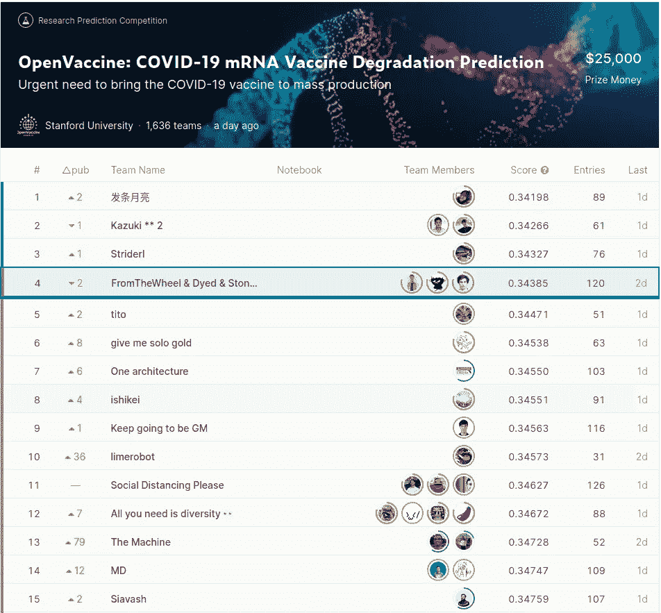
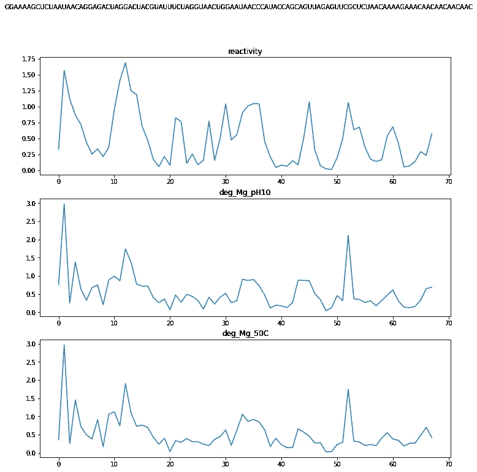
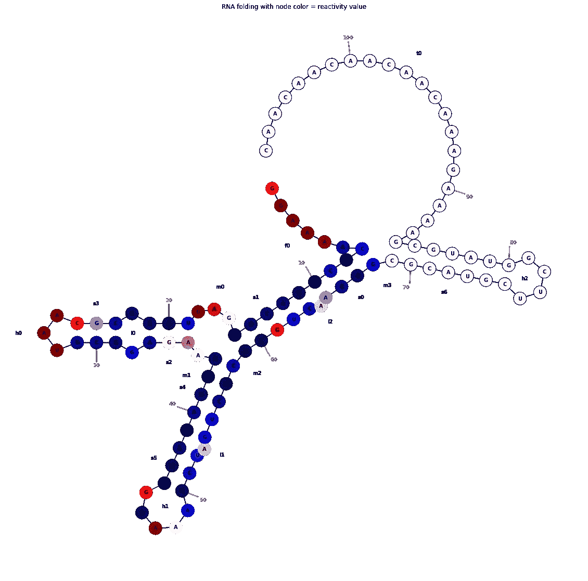
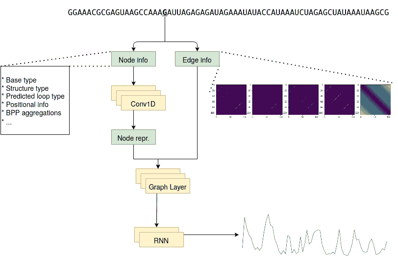

# 在新冠肺炎疫苗研究中使用 GNNs 和 RNNs 预测 mRNA 降解

> 原文：<https://towardsdatascience.com/predicting-mrna-degradation-using-gnns-and-rnns-in-the-search-for-a-covid-19-vaccine-b3070d20b2e5?source=collection_archive---------28----------------------->

## 关于 Kaggle OpenVaccine 竞赛第四名解决方案的报道

当前的新冠肺炎疫情需要一种有效的疫苗来赢得与这种病毒的斗争。斯坦福大学的研究人员正在研究 mRNA 疫苗，因为这可能很快提供一种候选解决方案。这些类型的疫苗面临的一个挑战是它们的稳定性:除非保存在强烈的冷藏条件下，否则它们往往会自发降解。为了找到稳定的 mRNA 序列，来自斯坦福大学的人们在 [OpenVaccine:新冠肺炎 mRNA 疫苗降解预测](https://www.kaggle.com/c/stanford-covid-vaccine/overview)比赛中联系了 Kaggle 社区。比赛于 9 月 11 日开始，仅持续了 26 天，由于时间紧迫，这对 Kaggle 来说是不寻常的短。前三名竞争者有 25，000 美元的奖金。[**Bram Steenwinckel**](https://www.kaggle.com/bsteenwi)**[**Michele Tinti**](https://www.kaggle.com/mtinti)**我和能够达到第四的位置，在金钱上差了一英寸！**希望我们能在新冠肺炎疫苗的研究中尽绵薄之力，我们发布了这篇讨论我们解决方案的博文。**

****

**我们的团队“来自鞋店&染坊&石店”获得了第四名！我们的团队名由我们的姓组成，这些姓是从我们的母语(荷兰语和意大利语)翻译成英语的。[此图为 Kaggle 排行榜截图。](https://www.kaggle.com/c/stanford-covid-vaccine/leaderboard)**

## **问题陈述**

**该竞赛的目标是预测提供的 RNA 序列中每种碱基(A、C、G 或 U)在某些情况下的反应性和降解，例如在高温或高 pH 下有或没有镁的情况下温育。总之，我们必须预测序列中每种碱基的三个连续值(即回归)(即序列对序列)。**

**训练集由 2400 个长度为 107 的序列组成，公共测试集包含 629 个长度为 107 的序列，私有测试集由 3005 个长度为 130 的序列组成。因此，私人测试数据中的序列长度存在差异。因此，模型对序列长度具有内在的不变性是非常重要的。此外，序列仅被部分评分。对于训练和公共测试集，只有 107 个碱基中的前 68 个被评分，而对于私有测试集，130 个碱基中的前 91 个被评分。下面提供了一个训练序列的目标的例子:**

****

**一个训练序列的目标值的时间序列。图片作者。**

**我们也可以在 RNA 序列图上直接显示这些目标值，就像在下面的例子中对反应性所做的那样:**

****

**RNA 序列可能的折叠之一。节点颜色描述了反应性值(红色=高，蓝色=低)。请注意，107–68 节点没有着色，因为没有为序列的尾部指定目标。图片作者。**

## **高级解决方案概述**

**通过查看目标，可以清楚地看到，某个值与其在时间序列中的相邻值相关联。递归神经网络非常适合这种情况，因为它们的内置内存会考虑附近的预测值。我们学习序列中每个碱基的表示，并通过 2 个(双向)RNN 层。通过使用节点本身的信息和关系或边信息来学习每个节点的表示。从引言中可以看出，RNA 序列可以用图表来表示，并且序列中某些碱基之间的关系是存在的。我们使用图层来聚集这种关系信息。我们的最终解决方案由 4 个不同的模型组成，其中我们改变了 RNN 层(LSTM+LSTM，LSTM+GRU，GRU+LSTM 和 GRU+GRU)。这个高层次的概述忽略了一些细节。一个重要的细节是，我们预先训练网络，直到 RNN 层作为自动编码器。这使得我们也可以在未标记的测试数据上进行训练。**

****

**我们解决方案的高级概述。图片作者。**

## **用[阿尼](https://github.com/DasLab/arnie)生成额外信息**

**[ARNIE](https://github.com/DasLab/arnie) 是一个软件包，包含 6 个不同的库，可用于为每个序列生成额外的信息:**

*   **[维也纳](https://www.tbi.univie.ac.at/RNA/#download)**
*   **[NUPACK](http://www.nupack.org/downloads)**
*   **[RNA 结构](https://rna.urmc.rochester.edu/RNAstructure.html)**
*   **[RNAsoft](http://www.rnasoft.ca/download.html)**
*   **[反折](http://contra.stanford.edu/contrafold/)**
*   **[永恒折叠](http://https://eternagame.org/about/software)**

**对于提供的 RNA 序列，ARNIE 能够计算碱基配对概率(BPP)矩阵。基于该 BPP，可以预测潜在的结构，并且从这些结构中，可以推断序列中每个碱基的环类型。**

**我们在 ARNIE 中使用不同的库来生成额外的信息。这通常需要一点 bash 魔法来安装所有的东西。[我们提供了一个笔记本来演示如何生成这些信息。我们对所有 6 个文库进行了实验，但只发现 CONTRAfold 是最有用的，其次是 RNAsoft、RNAstructure 和 Vienna。](https://www.kaggle.com/group16/generating-bpps-with-arnie)**

## **节点特征**

**从我们的高级概述中，我们可以看到我们的网络需要两种类型的输入:节点信息和边缘信息。节点信息是一个`NxLxV`矩阵，其中`N`是 RNA 序列的数量，`L`是序列的长度，`V`是每个节点的特征数量。我们总共使用`V=25`功能:**

*   **一次热编码**底座**(‘A’、‘G’、‘C’或‘U’)(4 个特征)**
*   **单热编码**循环类型**(提供:' S ':成对茎，' M ':多循环，' I ':内部循环，' B ':凸出，' H ':发夹循环，' E ':悬空端或' X ':外部循环)(7 个特征)**
*   **一次热编码**位置**特征(索引% 3) (3 个特征)**
*   ****确定性**:预测`(`、`)`或`.` (3 个特征)的包的分数(3 个不同的包:Vienna、CONTRAfold 和 RNAstructure)。**
*   ****CapR 循环类型**概率(6 个特征)**
*   ****BPP** 零和数(2 个特征)**

## **边缘特征**

**在`NxLxLxE`矩阵中捕获边缘信息，其中`N`是 RNA 序列的数量，`L`是序列的长度，`E`是边缘特征的数量。总的来说，每条边都有`E=5`个特征:**

*   **3 个不同的**bpp**:提供的，用 RNAsoft (ARNIE)生成的，用 contrafold (ARNIE)生成的**
*   **结构(`(`和`)`)中是否有指示的**碱基配对****
*   **碱基之间的**距离**(曼哈顿)，通过序列长度标准化**

## **模型**

**我们的作品改编自 mrmakr 的《T7》。一定要给那个笔记本一个向上的投票！我们确实对原始笔记本做了一些修改:**

*   **修正了网络分类部分的损失函数。**
*   **改变了自动编码器的损失函数，它是为二进制表示而定制的(它是二进制交叉熵的变体)。我们简单地使用重建损失/MAE (|y — y_hat|)。**
*   **在编码器后增加了两个 RNN 层。正如比赛期间所展示的那样(由 [@tuckerarrants](https://www.kaggle.com/tuckerarrants) 和其他人)，混合 GRU+GRU、LSTM+GRU、GRU+LSTM 和 LSTM+LSTM 的模式会产生轻微的推动作用。我们为这 4 个组合中的每一个生成了 10 倍 CV 的模型(总共 40 个模型),并以统一的权重混合这些模型。**
*   **调整了一些超参数。AE 的时代，分类部分，GCN 层中的单元数，…**
*   **添加补充数据，来自 [@its7171](https://www.kaggle.com/its7171) 制作的[笔记本](https://www.kaggle.com/its7171/how-to-generate-augmentation-data)。**
*   **对所有样本进行训练，但是基于它们的信噪比使用不同的样本权重。为此再次向 [@its7171](https://www.kaggle.com/its7171) 喊出！仅对 SN_filter=1 的数据执行评估。因为我们预计私人银行也会这么做。)**

## ****不起作用的事情****

**我们尝试了很多不奏效的方法:**

*   **我们得到了所有 RNA 的 3D 折叠，并计算了 RNA 碱基之间的 3D(欧几里德)距离。我们还尝试使用角度信息(装箱，然后分类编码):这提高了我们简单的 LSTM 架构，但恶化了 AE+LSTM 的性能。这些功能肯定有一些潜力，但它们需要一些更彻底的实验。允许这种实验的数据集可以在找到。**
*   **许多提供一些 RNA 特征的软件包信息不多。其中一些包括 RNAup，Shaker，MXFold，…**
*   **本文中[讨论的所有光谱表示法。](https://www.biorxiv.org/content/10.1101/2020.06.08.140368v1.full)**
*   **更丰富的图形表示(例如，包括氨基酸信息)**
*   **熵特征**
*   **原子信息**

## **总结词**

**我真的很喜欢这场比赛。我特别喜欢它只持续了相当短的一段时间。在整个比赛过程中，这是一场公共排行榜上不分上下的比赛。压力很大，但是很有趣！这种“闪电战”比赛或许可以被卡格尔认为是一种独立的形式？**

**虽然我们刚刚错过了奖金(1 个位置)，但我们仍然为我们的结果感到非常自豪！有了这个结果，我的两个队友:[布拉姆](https://www.kaggle.com/bsteenwi)和[米歇尔](https://www.kaggle.com/mtinti)也成为了 Kaggle 比赛高手。因此，向他们表示热烈祝贺！**

**我们在 [Kaggle](https://www.kaggle.com/group16/covid-19-mrna-4th-place-solution) 和 [Github](https://github.com/GillesVandewiele/covid19-mrna-degradation-prediction) 上都提供了我们解决方案的代码。**

****像往常一样，如果有任何不清楚的地方或者需要更多的解释:不要犹豫，留下你的评论或者联系我！****

**请关注这篇文章，因为它可能会在不久的将来收到一些更新！**

**下次比赛再见！吉勒、布拉姆和米歇尔**