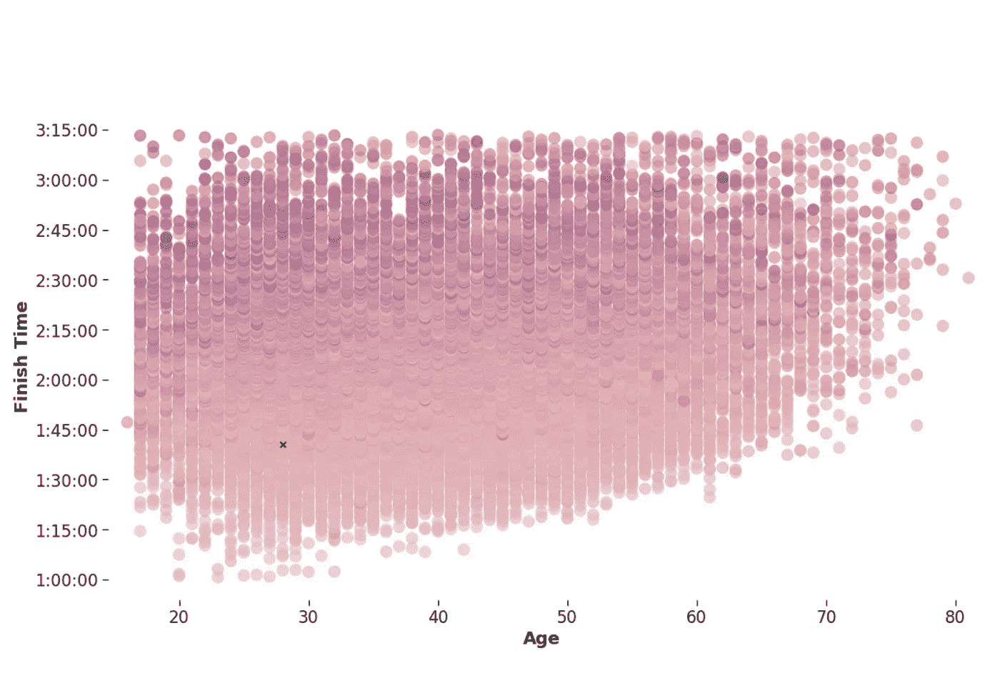
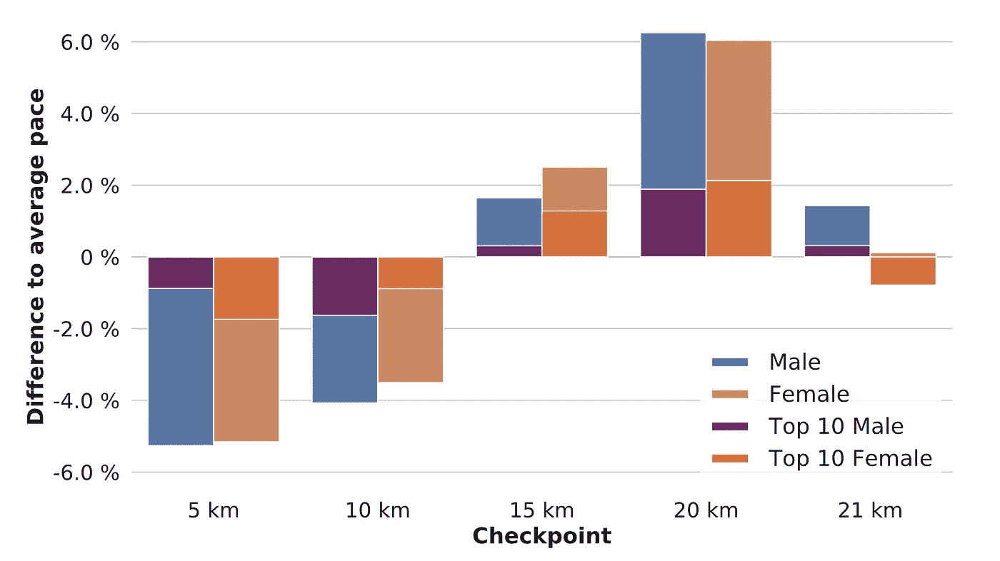
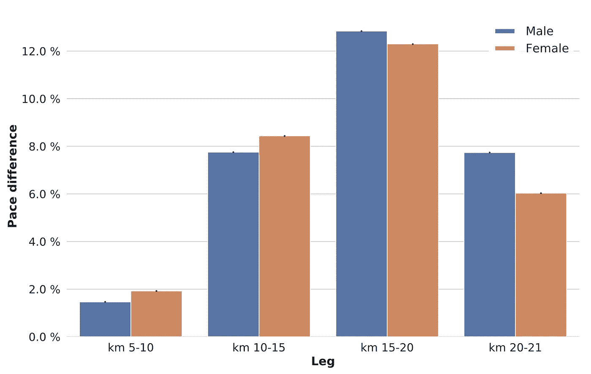
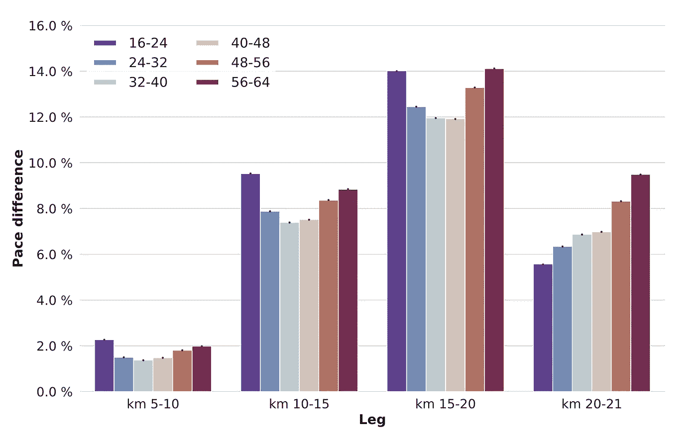
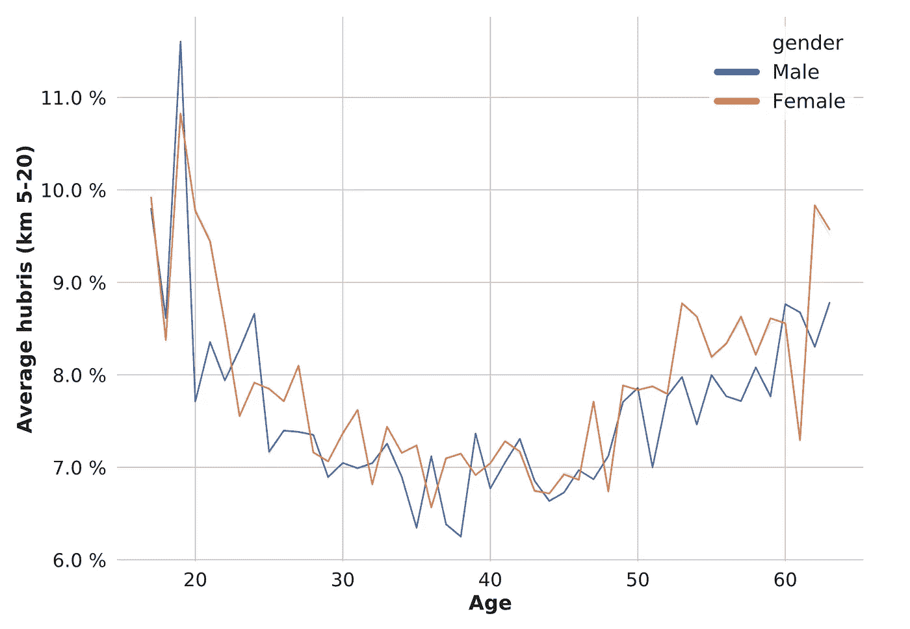
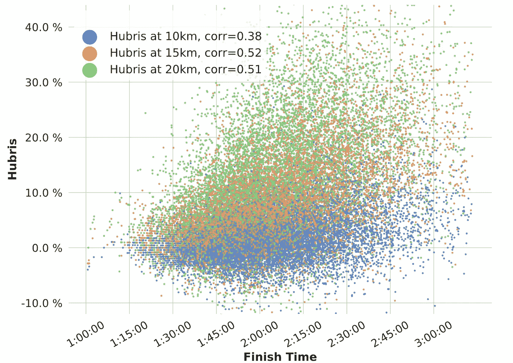
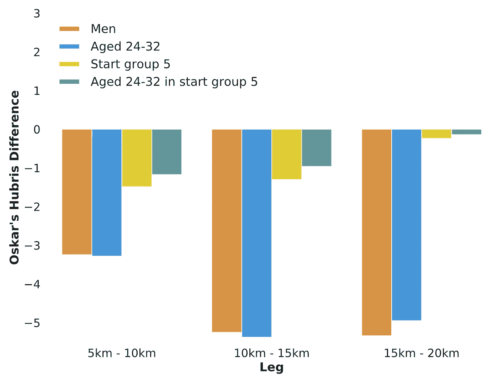
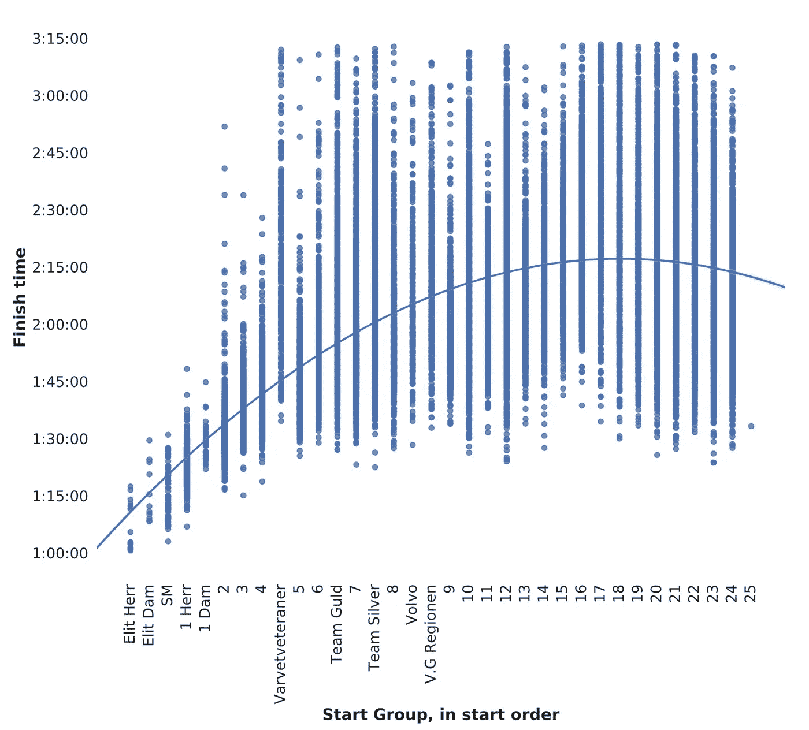

# 第 2/3 部分——预测我的半程马拉松完成时间，误差小于 45 秒。

> 原文：<https://towardsdatascience.com/predicting-my-half-marathon-finish-time-with-less-than-45-seconds-error-part-two-9cf6bb930e79?source=collection_archive---------38----------------------->

## 跑步的机器学习。特征工程和傲慢分析。

照片由[mārtiņš·泽姆利克斯](https://unsplash.com/@mzemlickis?utm_source=medium&utm_medium=referral)在 [Unsplash](https://unsplash.com?utm_source=medium&utm_medium=referral) 上拍摄

这是结束时间预测系列的第 2 部分:

*   [**第一部分—数据分析**](/half-marathon-finish-time-prediction-part-1-5807760033eb)
*   **第二部分——狂妄自大分析**(你在这里)
*   [**第三部分——跑步者完成时间预测**](https://medium.com/@ohandmark/part-3-3-predicting-my-half-marathon-finish-time-with-less-than-45-seconds-error-9d43d6fadf01)

在这篇文章中，我们将深入研究速度分析，看看我们是否能进一步了解跑步者。

让我们从停止的地方开始:

## 配速变化——完成时间与年龄

*为每位跑步者单独计算的五个不同检查点的跑步配速标准偏差。越暗意味着速度越不均衡。每个跑步者一圈。*

因为这个标准差是为每个跑步者单独计算的，所以它给出了你相对于自己的配速变化的合理值。很明显，保持匀速是有利的。

那个绿色十字架？这就是我，虽然我可以变得更年轻，但通过在图表上进一步向右移动，肯定还有改进的空间。当你能在数据中找到自己，并学习如何改进时，做这样的分析特别有趣。

让我们进一步看看*跑步者如何改变他们的速度，以及男性、女性和不同年龄组之间是否存在差异:*

## 按性别划分的平均配速概况

*每次分段的配速曲线，计算为每次分段的配速与跑步者全程配速之间的百分比差异。女性的步伐比男性稍微平稳一些。*

先前关于马拉松配速性别差异的研究显示，男性比女性更高估自己。然而，上图中显示的结果并不像 J.Hubble 和 J.Zhao 提出的那样显著。这与对[卢布尔雅那马拉松和半程马拉松完成时间](https://pdfs.semanticscholar.org/32e9/ae4926f920d00d84e8abafbcea32f3239aaa.pdf)的研究相一致——半程马拉松的性别差异不如普通马拉松显著。

# 狂妄分析

*高估*是什么意思？

今天的研究表明，将高估定义为整个比赛中的配速损失是正确的吗？很可能，但我会建议另一个度量标准，它可能会提供一些更深入的见解，并且更适用于我们的机器学习模型: **hubris** 。

让我们将自大定义为跑步者相对于初始配速(前 5 公里)的配速损失。

## 按性别分列的相对于开始配速的配速差异百分比

*某一段的配速与第一段配速之间的百分比差异。例如，在 10-15 公里之间，男性和女性的平均配速比前 5 公里慢了 8%。*

事实上，在比赛的后半段，男性似乎比女性更容易疲劳，但女性在 5-10 公里和 10-15 公里之间的配速比开始时下降更多。哪个性别最狂妄？

如果我们看一下个人的差异，很明显，女性在比赛的早期阶段最傲慢。然而，如果我们从整体上考虑这个情节，它可能暗示:

*   男子更努力地保持他们的起跑速度，但在比赛的后期速度会大大降低。
*   女性在意识到自己开得太快后，会比男性慢下来更多——从而导致更稳定的步伐。

让我们看看年龄组是否显示出同样的效果:

## 相对于起始配速的百分比配速差

*百分比差异(如上计算，但按年龄组计算)。年轻和年老的跑步者最狂妄自大。*

这里也可以看到类似的效果，但只是在比赛的最后一公里。

因为我们无法观察到在比赛前半段和后半段对不同年龄组的男女运动员产生的相同影响，所以速度调整的影响似乎是性别特异性的。

请记住，这些是独立的性别和年龄组的平均值，虽然男性通常比女性更高估自己，但对于特定的性别和年龄组组合来说并不一定如此。

作为一个简化的衡量自大的单一指标，我们计算了相对于前 5 公里，在 5 公里和 20 公里之间的平均配速损失。

## 与初始配速相比，5-20 公里的平均配速损失

*5-20 公里的平均狂妄自大。很明显，对于这个种族来说，在比较年龄和性别群体时，年龄更为重要。性别之间的差异几乎不明显。*

# 我们为什么要这么做？

我们试图理解指标之间相互作用的内容、原因和方式。这有助于我们创建数据的数学概念，以更好地预测特定跑步者的终点时间。

## 傲慢与完成时间

*狂妄与采样点的完成时间(30 000)。图例显示与完成时间的相关性。*

在现实世界中，我们不知道跑步者的速度，直到他/她通过一个检查站。假设一名跑步者的步速在 10 到 15 公里之间，相当于第一段路程的步速(5 公里)。虽然我们不知道该运动员在剩余比赛中的表现，但统计数据告诉我们，平均而言，该运动员将比其他运动员有更好的完成时间。

# 具有更深层含义的功能

根据他们的年龄和起跑组的平均完成时间来估计跑步者的完成时间是相对直接的。这样做的问题是，你要预测所有年龄相同的跑步者，并在相同的结束时间开始跑步。因此，这是**而不是**我们要做的。

相反，我们将创建一个专注于个人跑步者的机器学习模型。这种模式的特征可以概念化为两组:**一般** & **特定**特征。

一个**一般**特征例如是跑步者的性别、年龄、起跑组别或第一棒的速度。对我来说，这些价值是:

*   性别:**男**
*   年龄: **28**
*   开始组: **5**
*   配速(5 公里): **4 分 40 秒**

一个**特定的**特征例如是一个跑步者在 10 公里后的狂妄自大，相对于其他跑步者的狂妄自大。特定功能的强大之处在于，我们可以将它们折叠成任何桶型——我们可以根据年龄组或开始组，或者两者都有。作为一个例子，让我们看看我相对于我的**年龄组**、**开始组**、**性别**，以及**开始组和年龄组**的组合的狂妄程度:

## 作者的一些狂妄自大相关的功能示例。

*Oskar 与四个不同示例时段的百分比绝对差异。奥斯卡比其他和他相似的跑步者更少傲慢。这使得奥斯卡的完成时间比同类跑步者的平均时间更短。耶！*

在第 1 部分中，我们主要看了一般特性，而这一部分应该让您对具体特性有所了解。特定的功能用比以前更多的信息丰富了我们的数据。机器学习算法可以在训练期间利用这些额外的数据来建立更准确的模型。

# 这些功能是干什么用的？

想象一下，我们在多维空间中有几个点，其中除了一个维度之外的每个维度都代表一个特征。最后一个维度代表我们的目标预测—完成时间。每个点都对应于其在空间中的坐标，因此一个点是其所有可能特征的值的表示。这是我们的训练数据。我们可以根据这些点拟合一个模型(可以是一个多维函数)，并使用得到的模型对我们知道其特征值的新的、未知的数据进行预测。

这在三维以上是很难考虑的，所以这里有一个二维的例子——使用开始组作为我们的特征，完成时间作为我们的目标值:

# 简单示例模型—开始组

*针对目标变量完成时间，用单个特征* ***拟合简单模型(二阶多项式)*** *。*

这种模式不会做得很好。为了获得更好的预测，它需要更好的算法来拟合这些点，更多的例子来学习，或者额外的特征。改变我们使用的函数不会有很大帮助，因为每个起始组的方差都很高。我们可以做的是增加更多的功能——维度——并使用类似的算法(但在更高维度)。

幸运的是，我们现在碰巧有大量的特征，我们的**一般**和我们的**特定**特征，我们可以将它们放入多维空间并拟合一个模型。

当您考虑到您需要在真实的生活场景中执行预测时，一个有趣的挑战就显现出来了:在跑步者开始跑步之前，我们不能使用特定的功能。因此，赛前预测只能基于一般特征。当跑步者在比赛中前进时，可以使用特定的特征，这将极大地改进完成时间的预测。

接下来是第 3 部分，包括模型训练、性能分析和一些示例预测。该模型设法在比赛开始前 30 秒内预测我的完成时间(仅一般特征)，并随着比赛的进行而变得更好(当它可以包括具体特征时)。

继续阅读:

*   [**第一部分—数据分析**](/half-marathon-finish-time-prediction-part-1-5807760033eb)
*   **第二部分——狂妄自大分析**(你在这里)
*   [**第三部分——跑者完成时间预测**](https://medium.com/@ohandmark/part-3-3-predicting-my-half-marathon-finish-time-with-less-than-45-seconds-error-9d43d6fadf01)