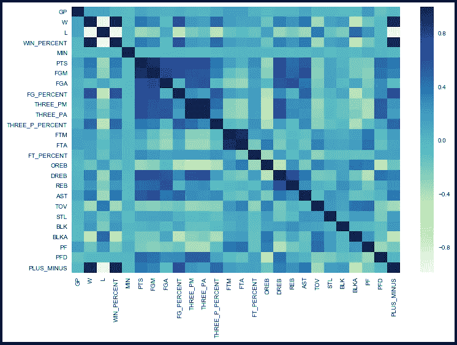

# 预测 NBA 胜率

> 原文：<https://towardsdatascience.com/predicting-nba-win-percentage-84148ae8d3e6?source=collection_archive---------27----------------------->

## 我如何建立一个多元回归模型，在给定当前每场比赛统计数据的情况下，预测一支球队的最终胜率

克里斯蒂安·门多萨在 [Unsplash](https://unsplash.com/?utm_source=unsplash&utm_medium=referral&utm_content=creditCopyText) 上拍摄的照片

作为一个篮球迷和体育迷，我想在我的数据科学训练营期间，我会选择处理大量的体育数据，因为每项运动都涉及大量的统计数据——我是对的。在了解了回归之后，我立刻感觉到使用体育数据对我的项目来说是完美的。由于我的合作伙伴[拉斐尔](https://medium.com/@raphael.krantz)也是一名 NBA 球迷，我们决定走这条分析路线，建立一个多元回归模型。我们的目标是能够根据球队每场比赛的平均数据来预测球队最终的常规赛胜率。

我们是这样做的:

# 数据

由于统计学在当今体育中的重要性，我们能够在 stats.nba.com 找到 NBA 官方统计数据。使用 [**Selenium**](https://selenium-python.readthedocs.io/) 我们从 1996 年到 2019 年的每个赛季为每个球队搜集了每场比赛的统计数据。在一些数据清理之后，我们创建了下面的数据框架:

创建的数据帧片段(未显示所有列和行)

最终，由于它们分布的形状或它们的 OLS p 值(我将在下面进一步解释)，我们结束了使用 [**NumPy**](https://numpy.org/devdocs/user/quickstart.html) 对一些变量运行对数(log)变换。所有的变量，包括那些经过对数变换的变量，都被归一化，这样，考虑到统计数据之间的差异，它们都在相同的范围内。

总而言之:

**1996-2019 年 NBA 基本统计数据**

**特点:胜率(Win_Percent)、得分(PTS)、投篮命中率(FGM)、投篮命中率(FGA)、投篮命中率(FG_Percent)、三分球命中率(Three_PM)、三分球命中率(Three_PA)、三分球命中率(Three_P_Percent)、罚球命中率(FTM)、罚球命中率(FTA)、进攻篮板(OREB)、防守篮板(DREB)、篮板总数(REB)、助攻(AST)、失误(TOV)、抢断(STL)、盖帽(BLK)**

*我们最终没有使用这些特征:胜(W)、负(L)、分(MIN)、个人犯规(PFD)和+/*–*(加号 _ 减号)

# 探索性数据分析

*1。我们抓取的所有特征的关联热图:*

*2。带有变量分布形状直方图的散点图—正态分布与非正态分布(图表的一小部分):*

正如我们从上图中看到的，一些特征具有偏斜分布。这可能是因为篮球领域最近的趋势，即自 2014 年以来三分球的大幅增加，因此对数转换可能是必要的。

# 使用普通最小二乘(OLS)表创建模型

1.首先，在进行任何转换之前，对所有变量创建一个 OLS 回归表

2.随后创建了一个 OLS 表，其中每个变量都经过了日志转换

3.最后，制作了一个 OLS 表，仅对数转换那些在对数转换时具有较低 p 值的变量

*参见下面的上述步骤:*

4.*初始细化:*

*   移除了具有高 p 值的变量
*   R = 0.844
*   检查变量之间的**(其中 [**方差膨胀因子**](https://www.statisticshowto.com/variance-inflation-factor/) 大于 5)**

****

**5.*第二次提炼:***

*   **从每个多共线性对中移除一个变量，并再次运行 OLS**
*   **R = 0.558**
*   **p 值都远低于α = 0.05**
*   **变量之间似乎不再存在多重共线性**
*   **p(f-统计量)= 6.88 e-⁰⁷；我们可以得出结论**这个模型比仅拦截模型**更适合**

# **评估优化模型**

1.  ***用 Q-Q 图检查正态分布:***

*   **数据点应该在对角线上**

****

***2。检查了* [***同方差***](https://en.wikipedia.org/wiki/Homoscedasticity#Homoscedastic_distributions) *与误差项的散点图:***

*   **数据点应该是随机的/没有模式**

****

## **测试模型**

**在对模型执行 Scikit-Learn 的 [**训练-测试分割**](https://scikit-learn.org/stable/modules/generated/sklearn.model_selection.train_test_split.html) 之后，我们确定不需要 [**正则化**](https://en.wikipedia.org/wiki/Regularization_(mathematics)) ，因为非正则化线性回归很好——训练模型的误差和测试模型的误差之间的差异非常小。**

# **最终模型**

****R = 0.558****

**[**均方误差**](https://en.wikipedia.org/wiki/Mean_squared_error) **(MSE) = 0.0108****

> ****WIN % = 0.5000–0.0330 ln(PTS)+0.0587(FTM)+0.0186 ln(OREB)+0.0543 ln(DREB)+0.0376 ln(AST)-0.0480(TOV)+0.0408(STL)+0.0186 ln(BLK)-0.0639 ln(BLKA)-0.0107(PF)****

**从上面的最终模型中，我们可以看到哪些篮球统计数据在最终决定一个球队将赢得多少场比赛中起着潜在的重要作用。毫无疑问，最终模型中没有包括的类别仍然非常重要。此外，当你认为你希望它们是正的时候，方程中的一些变量却是负的，这看起来很奇怪。这些情况可能会受到积极变量的影响。**

**虽然我们可能无法了解 NBA 篮球目前在世界各地发生的事件，但我希望这能为你提供一点你非常想念的运动。如果你认为自己是一个赌徒，也许现在就试一试，看看我们的模型在常规赛结束时有多准确。**

## **如果你有兴趣看我项目的完整代码，可以在我的 [GitHub](https://github.com/ralterman/nba_win_percentage_predictor) 上查看一下！**