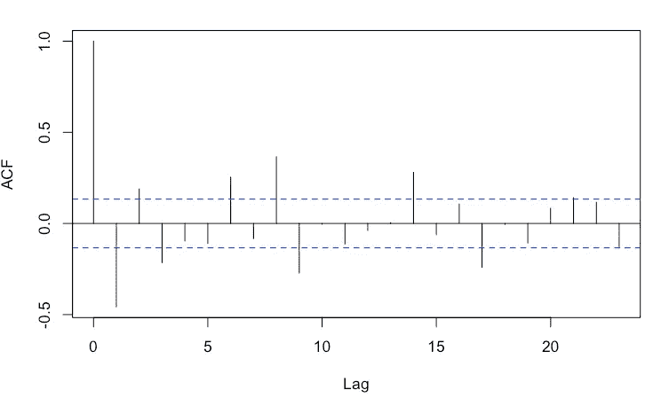
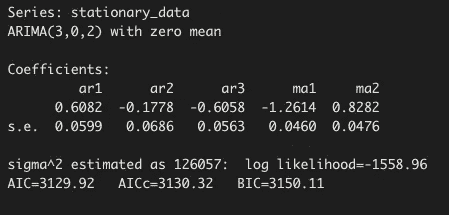

# 使用时间序列分析(ARIMA 模型)预测 Covid19 死亡人数

> 原文：<https://towardsdatascience.com/predicting-number-of-covid19-deaths-using-time-series-analysis-arima-model-4ad92c48b3ae?source=collection_archive---------8----------------------->

# 执行摘要:

2020 年 3 月 11 日，世界卫生组织(世卫组织)宣布新型冠状病毒(Covid19)爆发为全球疫情。本文对预测美国从 8 月 1 日—8 月 21 日和 8 月 1 日—11 月 1 日开始的死亡人数的时间序列分析进行了建模和研究。用于预测的时间序列模型称为自回归综合移动平均(ARIMA)模型。

本文分为以下几个部分:

1.  为什么&什么是时间序列分析
2.  当我们不能使用时间序列分析时
3.  时间序列分析的组成部分
4.  时间序列分析演示
5.  结论

[](https://ourworldindata.org/covid-deaths) [## 冠状病毒(新冠肺炎)死亡-统计和研究

### 关于已确认的死亡数字，有三点需要记住:这三点对所有目前可用的数据都是真实的…

ourworldindata.org](https://ourworldindata.org/covid-deaths) 

这些数据来自于数据中的[我们的世界，包括进行时间序列分析的必要信息。与回答我们的研究问题相关的变量是日期(2019/12/31–2020–08/01)、总死亡人数、新死亡人数和地点(美国)。数据已经过清理和调整，以满足使用 ARIMA 进行预测的所有必要假设。](https://ourworldindata.org/covid-deaths)

未来 21 天和 90 天的新增死亡人数预测分别达到 18，589 人(总死亡人数 171，903 人)和 82，653 人(总死亡人数 235，967 人)。与 CNN 的预测相比，我们的预测结果非常接近。美国有线电视新闻网(CNN 月 2 日预测，8 月 2 日至 8 月 21 日期间，美国可能有约 1.9 万人死亡。除了这一预测，他们还在 7 月 31 日的节目“CNN 冠状病毒市政厅”中预测了 11 月份的死亡总人数。美国有线电视新闻网预测，到 11 月，Covid19 将导致 231，000 人死亡。与 CNN 的预测相比，我们的 ARIMA 模型的结果非常接近。

结果:


作者图片

# 1.为什么&什么是时间序列分析:

时间序列分析(TSA)是一种统计技术，由按时间顺序排列的数据点组成。x 轴由等间距的时间点组成，y 轴包含根据之前的观察值从我们的模型中预测的结果值。这种技术适用于研究问题，如预测未来销售。时间序列分析之所以存在，是由于我们模型中的结果变量只依赖于一个解释变量: ***时间*** 。

假设你经营一家鞋店，并且有数据告诉你在过去的几年里你卖出了多少双鞋。给定可用的数据，如果您想预测您的商店未来将销售多少鞋子，时间序列分析将是适用的。在这种情况下，结果变量是售出的鞋子数量，唯一的解释变量是时间。

其他预测算法，如线性回归或逻辑回归，使用一个或多个解释变量。此外，当比较线性回归、逻辑回归和时间序列技术 ARIMA 时，在假设方面存在差异。

在**线性回归**中，必须满足以下假设:

*   观察的独立性。
*   误差的同方差性(等方差)。
*   线性关系。
*   误差呈正态分布。

在**逻辑回归**中，必须满足以下假设:

*   因变量必须为二进制。
*   观察的独立性。
*   连续变量 logit 中的线性。
*   缺乏有影响力的离群值
*   多重共线性缺失

在**时间序列分析 ARIMA** 中，必须满足以下假设:

*   数据必须是静态的。
*   数据应该是单变量的。如上所述，美国运输安全管理局 ARIMA 只对单一变量起作用。
*   数据应该是时间序列数据格式。

# 2.什么时候可以不用时间序列分析:

有时候时间序列分析并不是回答一个研究问题的最佳统计技术。有 3 点使这种技术不适合。

a.当数据点总是不变时。


作者图片

x 轴上等距分布的点代表唯一的变量时间，y 值代表结果变量。在一段时间内有恒定的数据点确实使得这种统计技术没有真正的用处。再次考虑鞋店的例子。如果我们在所有月份中销售相同数量的鞋，那么进行时间序列分析来预测未来的销售是没有意义的，因为预测的结果总是相同的。

b.当数据点代表一个已知函数时。


作者图片

在上图中，我们看到了 sin(x)函数。如果我们给这个函数加上一个值，就可以很容易地计算出预测的结果。没有必要使用时间序列分析技术，因为我们只需将预测值代入 sin(x)函数就可以计算出预测值。这适用于所有其他函数，如 cos(x)等。因此，如果我们的数据点图看起来像一个函数，那么时间序列分析就不适用。

c.当我们的数据不稳定时。

如上所述，时间序列分析(ARIMA)的一个假设是数据必须是平稳的。为了获得稳定的数据，必须满足以下条件:

*   平均值必须是随时间变化的常数。
*   方差必须在不同的时间间隔内与平均值相等。换句话说，这些点的距离应该与平均值相同。
*   协方差也必须相等。


作者图片

上图显示了 1 月至 8 月 1 日因 Covid19 导致的死亡人数。红线显示平均值，正如我们在上面看到的，平均值在不断增加。首先，我们可以看到平均值不是恒定的，因此数据违反了在整个时间内平均值恒定的假设。其次，我们也看到方差不相等。正如我们在上面看到的，点和中线之间的距离变化很大。考虑一下 4 月中旬和 5 月的点数峰值。我们可以清楚地看到，从数据点到平均值的距离并不相同。因此，数据不仅违反了等均值假设，也违反了等方差假设。

# 3.时间序列分析的组成部分:

说到时间序列分析，我们需要理解三个组成部分。

a.一般趋势


作者图片

b.季节性

在进行时间序列分析时，季节性起着很大的作用。季节性的一个例子是当你看到我们的数据点出现峰值时。假设你有一整年的航空旅客的数据。该图的数据点显示，由于圣诞节假期，12 月份的峰值较大。另一方面，我们可能会在 2020 年 3 月和 4 月看到大幅下降，Covid19 刚刚开始传播。这将导致航空旅客数量的大幅下降。

c.不规则波动

这个部分被称为时间序列分析的随机部分。不规则波动是不受控制的情况，其中 y 值会发生变化。在航空旅客的例子中，由于天气条件(如暴风雨)导致的航班取消会导致航空旅客数量的减少。由于风暴导致的航班取消就是 y 值受到影响的不可控情况的一个例子。这并不一定意味着明年同一时间会有一场风暴。这就是随机效应产生的原因。

# 4.时间序列分析演示

**研究问题:**8 月 1 日—8 月 21 日和 8 月 1 日—11 月 1 日，美国将有多少人因 Covid19 死亡。我们准备用时间序列分析来回答这个问题。特别是，我们将使用 ARIMA 模型。时间序列分析是回答这个问题的完美的统计技术，因为我们要预测有多少人会不幸地死于 Covid19 这种疾病。

**数据来源:**[数据中的我们的世界](https://ourworldindata.org/covid-deaths)

数据由 34，033 行和 34 列组成。下面是数据中的变量列表。


作者图片

**收集方法:**观察值

**数据定义:**为了解决研究问题，我们必须清理数据并提取相关变量，以帮助我们进行时间序列分析。我们创建了一个数据框，由日期(2019/12/31–2020–08/01)、总死亡人数、新死亡人数和地点(美国)组成。

***【日期】*** 变量:表示我们将用于分析的日期。幸运的是，日期列的类已经是 date。如果日期列不是日期，我们就必须将该类转换为日期。

***【total _ deaths】***变量:代表美国 Covid19 死亡总人数。这个变量的类是数字的。

***【new _ deaths】***变量:代表美国每天 Covid19 死亡人数。这个变量的类是数字的。

***【位置】*** 变量:代表国家的名称。这个变量的类别是因子。

**数据岗数据清理汇总:**

```
Index
Min. :2019-12-31 
1st Qu.:2020-02-22 
Median :2020-04-16 
Mean :2020-04-16 
3rd Qu.:2020-06-08 
Max. :2020-08-01

dat_demoMin. : 0.0 
1st Qu.: 0.0 
Median : 500.0 
Mean : 713.1 
3rd Qu.:1167.0 
Max. :4928.0
```

在查看我们的数据汇总时，可以看到我们的时间序列指数从 2019/12/08 开始，到 2020/08/01 结束。此外，我们可以看到，美国每天的平均死亡人数为 713 人。4 月 16 日死亡人数最多时达到 4928 人。

**时间序列分析:**

在对我们的数据进行时间序列分析时，我们首先使用 zoo 库创建了日期序列，这是一个众所周知的 R 包，涉及到这种特殊的统计技术。之后，我们检查我们的数据是否不违反任何时间序列分析的假设。我们必须确保数据是稳定的。换句话说，它需要在不同的时间间隔内具有相等的均值、方差和协方差。


作者图片

如上所述，上图显示我们没有稳定的数据。红线，也就是平均线，正在增加。方差也不是常数，因为数据点和中线之间的距离在 x 轴上是变化的。因此，我们必须将数据转换为静态数据。

根据数据的不同，有不同的技术使数据稳定。对数等数据转换有助于稳定时间序列分析的方差。另一方面，差分可以帮助稳定平均值。每个数据集都有自己的需求，在我们的数据上，我们只是使用差异。差分是指计算连续观测值之间的差异。一旦我们对我们的数据应用了差分，我们的数据的图形就变成了下面这样:


作者图片

发生了数据转换，我们可以在这里看到平均值是如何保持不变的。为了检查我们的数据现在是否是稳定的，我们进行了扩展的 Dickey-Fuller 测试，它告诉我们我们的数据是否是稳定的。

h0:零假设是有单位根。

H_A:另一个假设是时间序列是平稳的。

我们测试的 p 值在 0.05 的显著性水平上是 0.01。因此，我们拒绝了零假设。换句话说，我们的数据现在是静态的，我们可以继续进行分析。

下一步是进行建模。选择 ARIMA 模型进行时间序列分析。这种特定的模型根据其以前的值进行预测，它有 3 个参数。进行预测所需的参数是 p、d 和 q。在我们开始讨论如何选择正确的参数数字之前，我们首先需要了解参数的含义。

“p”:代表自动回归。自动回归指的是用过去的值来预测未来的值。“d”:代表整合。集成会考虑将用于时间序列的差异量。“q”:代表移动平均线。移动平均线是你计算不同区间的平均值。

我们选择 p、d 和 q 值的方式取决于 ACF 和 PACF 函数，它们分别代表自协方差或自相关函数和偏自相关函数。

当我们的数据不稳定时查看 ACF 图，我们得到以下结果:


作者图片

这里我们看到我们的值都超过了蓝线。目标是将值放在蓝线之下，并且它们也应该反转。现在，当我们查看稳态数据的 ACF 和 PACF 时，我们得到以下结果。



作者图片


作者图片

在 ACF 和 PCF 图中，我们现在可以看到大多数线没有超过蓝线，也有反转线。使用 acf 图时可以选择 q 值，p 值可以从 pacf 图中找到。在这两种情况下，我们都选择第一条反向线之前的数字。根据数据，您可以使用该规则并查看模型的拟合程度，也可以使用 auto.arima 函数，该函数根据 AIC 或 BIC 返回最佳模型。我们小组决定继续使用 auto.arima 函数，它返回给我们以下模型。



作者图片

auto.arima 函数选择 p=3，d=0，q=2。当应用这个模型预测未来 21 天和 90 天的死亡人数时，结果与 CNN 所做的预测非常接近。如执行摘要中所述，我们的模型预测接下来的 21 天和 90 天分别有 18，589 人(总死亡人数为 171，903 人)和 82，653 人(总死亡人数为 235，967 人)死亡。美国有线电视新闻网(CNN 月 2 日预测，在未来两周内，美国约有 19，000 人可能死亡，到 11 月份，将有 231，000 名美国人死于 Covid19。在下面的表格中，我们可以看到预测和结果的图表。请注意，图中的紫色线代表预测值。

**预测图 2020/08/01–2020/08/21:**


作者图片

**投影图 2020/08/01–2020/10/31:**


作者图片


作者图片

这个项目背后的动机是想看看我们的模型与 CNN 的模型相比会如何。下面我们看到了 CNN 发布的公告。

**7 月 31 日环球市政厅秀的电视截图**


作者图片


作者图片

# 5.结论:

基于我们的 ARIMA 模型和我们的预测，当与 CNN 的预测进行比较时，我们可以看到稍微不同但足够接近的结果。21 天预测的差异可以由 CNN 四舍五入他们的数字来解释，因为这是一个新闻标题，使读者更容易阅读。只差 19000–18589 = 411 人，非常接近。当谈到未来 90 天的预测时，我们可以看到更大的差异 235，967- 231，000 = 4，967。4967 的差额，是合理的。归根结底，没有完美的模式。正如英国著名统计学家乔治·博克斯曾经说过的那样，

> “所有的模型都是错的，但有些是有用的。”

这些模型很有用，学习时间序列分析是一次很棒的经历。我确信还有更多关于这种统计技术的知识需要学习，以便更深入地了解我们如何改进我们的模型，但是没有完美的模型。看到由于疫情在不久的将来将要失去的生命数量的结果是非常令人难过的。

*   关联 GitHub:[https://GitHub . com/navido 89/Time-Series-Analysis-ARIMA-模型-covid 19-预测](https://github.com/navido89/Time-Series-Analysis-ARIMA-Model-Covid19-Predictions)

[](https://www.navidma.com/) [## 纳维德·马辛奇作品集

### 我是 Navid Mashinchi，是加利福尼亚州萨克拉门托的一名数据科学家。我一直在分析领域工作…

www.navidma.com](https://www.navidma.com/) 

***编者按:*** [*走向数据科学*](http://towardsdatascience.com/) *是一份以数据科学和机器学习研究为主的中型刊物。我们不是健康专家或流行病学家，本文的观点不应被解释为专业建议。想了解更多关于疫情冠状病毒的信息，可以点击* [*这里*](https://www.who.int/emergencies/diseases/novel-coronavirus-2019/situation-reports) *。*