# 预测诗歌运动

> 原文：<https://towardsdatascience.com/predicting-poetic-movements-51006847cc6f?source=collection_archive---------67----------------------->

## 对诗歌进行分析和分类，为基于内容的推荐做准备

图片由[阿比伊斯](https://unsplash.com/@abiismail)**上的 [Unsplash](https://unsplash.com)**

在书面媒体中，诗歌通常被认为是神秘的、轻浮的或过于小众的。因此，诗歌(甚至是知名诗人的作品)经常被大型出版商和文学网站所忽视。(诗歌的反资本主义性质在这里可能也起了作用)。GoodReads、Amazon 或 Bookish 等网站提供整本书(公平地说，包括诗集)的评级和推荐服务，但据我所知，没有任何网站或服务在个人层面上推荐诗歌。

考虑到这一点，我想知道诗歌推荐是如何工作的。一个人经常会找到一两种他们喜欢的体裁，然后搜索出来，但是诗歌中肯定有超越体裁的元素。如果有，机器学习似乎是找到它们的完美工具。在这篇文章中，我将探索诗歌的一些特征，使其成为一种独特的写作风格，并调查我将称为“运动”的四种总括体裁之间的差异。建立模型后，我可以创建一个[推荐系统](https://evening-cove-11137.herokuapp.com/)，它基于一个单词、多个单词或另一首诗来推荐诗歌。

# 数据

历史可以追溯到 1912 年，[诗歌基金会](https://www.poetryfoundation.org/)是世界上最大的诗歌供应商之一，也是诗人和读者的重要资源。我从他们的网站上搜集了 4307 首诗，每首都标有流派。总共有 13 个流派，我把它们分成四个乐章:

*   **1900 年前**(维多利亚和浪漫)
*   **现代**(独立类别)
*   **大都会**(纽约学派【第一代和第二代】，忏悔派，垮掉派，哈莱姆文艺复兴，黑人艺术运动)
*   **先锋派**(意象派，布拉克山，语言诗派，客观主义者)

通过使用四个大致平衡的类别而不是最初的十三个，我能够更容易地分析和分类每一类诗歌。现代诗歌(包括流派和运动)约占数据的 29%。先锋派是诗歌数量最少的运动，约占数据的 22%。

## **关于刮削过程的说明**

搜集过程面临着两种形式的诗歌的挑战:HTML 文本和 T2 扫描图片。我能够使用 BeautifulSoup 轻松捕捉基于文本的诗歌，但不得不依靠 [PyTesseract](https://medium.com/python-in-plain-english/image-to-text-in-python-152ce4a02e8a) 从扫描图像中获取诗歌。虽然我确信大部分都被适当地删除了，但毫无疑问，还是有一些诗歌被删节了，包含错别字，或者有多余的行，这仅仅是图像到文本库不准确的结果。尽管如此，在拥有更多数据的名义下，使用扫描图像诗是必要的。

# 概述

在一个漫长的抓取(再抓取)过程之后，我通过删除部分标题(罗马数字和类似第 1 部分、第 2 部分等内容)来清理数据。)，空行，任何多余的行都包含诗人的名字和发表年份。这让我能够更准确地设计几个特征，包括诗中的行数、每行的平均字数、每个单词的平均音节数和词汇丰富度。我也研究了诗歌的极性和主观性。

在特征工程之后，我研究了这些新特征旁边的数据，并处理了文本以调查最常用的词。我创造了各种各样的形象来支持我的发现。最后，我运行了几个预测模型，以进一步了解我在数据探索过程中所看到的情况。

# 特征工程和 EDA

我对诗歌文本中可以设计的一系列特征感到非常兴奋，其中大多数在分析和分类中都非常有用。诗歌是一种独特的写作媒介，其结构和形式是诗歌风格(有时甚至是意义)的组成部分。

正如我将要展示的，先锋派诗歌，通常被视为一种更具实验性的风格和对过去的一种卑鄙的拒绝，几乎总是与 1900 年以前的诗歌处于光谱的另一端，这从文学批评的角度来看并不奇怪。简而言之，我在这个项目中量化的形式和结构元素为成熟的文学理论和分析提供了统计确认。

## 行数

这是衡量一首诗长度的标准，而不是字数。这就是为什么我之前描述的数据清理是如此重要，在删除任何不属于实际诗歌本身的行。

我惊讶地发现，所有运动的中值都相当相似，只有现代诗歌例外，它的中值最小。

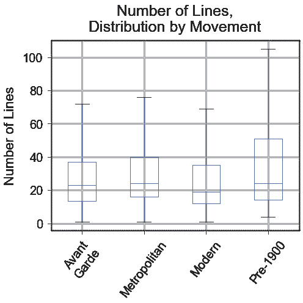

(*图片作者*)

尽管有这些相似之处，1900 年以前的诗歌平均来说确实要长得多。平均长度是 55 行，而第二高的大都会只有 38 行。上图中上四分位数的分布进一步描绘了一首长诗中并不陌生的乐章。下方的 1900 年前的胡须也显示出这些诗歌往往至少有几行长(最少是 4 行)，而其他运动对一行诗没有问题。

现代诗歌往往是最短的，平均值最低(33 行)，中位数比第二低的少 4 行。先锋诗歌和都市诗歌在统计上是相似的，先锋诗歌和现代诗歌也是如此。

## 平均行长度(每行字数)

另一个对一首诗如何出现在页面上以及如何阅读有很大影响的关键指标是每行的平均字数。一首平均每行两个词的诗，看起来和感觉上会和一首平均每行八个词的十四行诗非常不同。

一个重要的发现是[散文诗](https://en.wikipedia.org/wiki/Prose_poetry)的出现如何扭曲了我的数据。散文诗是一种看起来更像小说的诗歌，使用段落或大段文字，而不是人们通常与诗歌联系在一起的分行符。所以上一节讨论的一些单行诗可能只是一段散文诗。

这些类型的诗歌在 20 世纪变得更加流行，在我的数据中没有出现在 1900 年以前的类别中。因此，1900 年以前的诗歌中平均线长的最大值是 23，而其他三个乐章的线长都在几百以上，甚至远远超过一千。

虽然这明显扭曲了先锋派、都市派和现代派诗歌的平均值，但它们的中值却讲述了一个不同的故事。

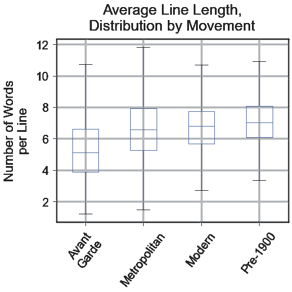

(*图片作者*)

到目前为止，前卫倾向于每行最少的单词，中位数约为 5.1 个单词，相比之下，第二低的大都市，约为 6.6 个单词。前卫派恰好同时拥有最高的平均水平，每行 9.3 个单词，这表明散文诗在运动中很流行。

1900 年以前的诗歌往往具有最长的线条，中值为 7.0 个词，也往往最有规律，值的范围最小。这是有意义的，因为它坚持已建立的结构，如十四行诗和村庄。还值得注意的是，1900 年以前的诗歌平均值最小(7.2，其次是 8.3)，这也很可能是因为没有散文诗的例子。

## 极性

1900 年以前的诗歌是绝对正面的，中值为 0.90！在下面的方框图中，注意红线相对于其他运动的位置。其他三种运动彼此都很相似，它们的极性之间没有统计上的显著差异。

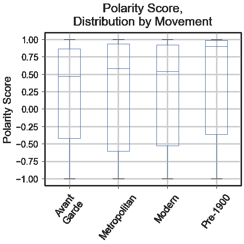

(*图片作者*)

诗歌很少是中性的，倾向于正面；如下图所示，每个乐章中至少有 61%的诗歌有正极性得分。71%的 1900 年前的诗歌有正极性得分。

先锋诗歌包含了几乎不到 5%的最中性的诗歌，但这仍然是一个相对较小的份额。

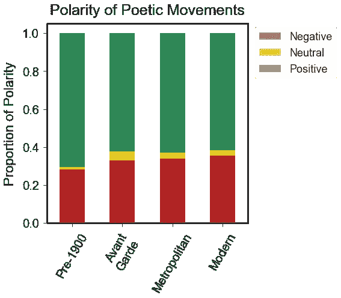

(*图片作者*)

## 结尾押韵

我能够使用艾利森·帕里什的[发音](https://github.com/aparrish/pronouncingpy)包来确定一首诗包含多少个结尾韵脚。当一行末尾的单词与另一行末尾的另一个单词押韵时，就出现了尾韵。我将这个数字除以总行数，得到一个比率，这个比率成为我的分类模型最重要的特征之一。(注:我只数了独特的押韵。)

不出所料，1900 年以前的诗歌和其他运动之间有很大的区别。

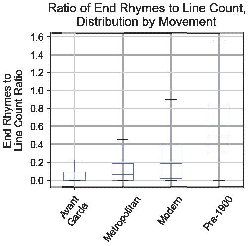

(*图片作者*)

先锋诗歌倾向于不用尾韵，在都市诗歌中相对不多见。结尾押韵在现代诗歌中并不少见，但在 1900 年以前的诗歌中却很常见(而且似乎是必须的！)，如下图。

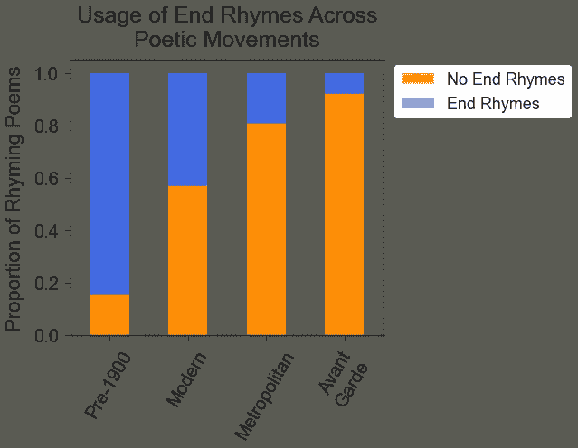

(*图片作者*)

只有 8%的先锋诗歌的尾韵比超过 0.25，相比之下，1900 年以前的诗歌有 85%的尾韵比超过 0.25。

## 语言的复杂性(每个单词的音节数)

再次使用发音包，我计算了每首诗中每个单词的平均音节数。我用这个来衡量一首诗中所用语言的复杂程度；音节多的单词往往比只有一个音节的单词更复杂。

我原以为 1900 年以前的诗歌，用的是华丽的维多利亚时代的英语，每个单词的平均音节数要高得多。相反，它的用词最简单(音节最少)，而 Metropolitan 的中值最高，勉强超过了 Avant-Garde。

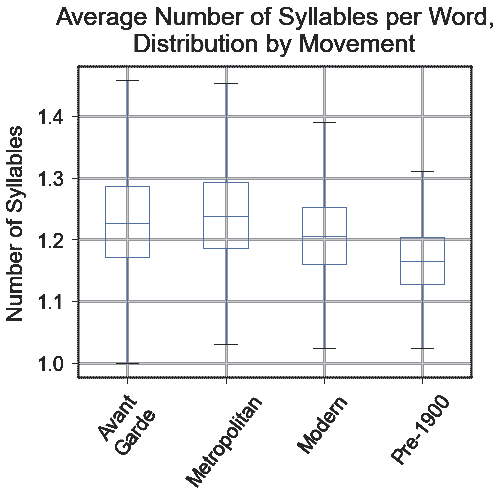

(*图片作者*)

值得注意的是，到目前为止，前卫的音域最大，如上图所示。这表明了使用简单和复杂语言的各种诗歌运动。

## 词汇丰富度

语言复杂性的另一个衡量标准是词汇丰富度，它是通过将一首诗的词汇量(独特单词的数量)除以文本中的总单词数来计算的。一首重复的诗价值很低，而一首价值很高的诗(几乎或完全是独一无二的词)会被描述为“词汇丰富”。每个单词只出现一次的诗歌得分为 1.0。

1900 年以前的诗歌似乎是最重复的运动，而先锋诗歌是词汇最丰富的。在下面的图表中，前卫是唯一一个胡须值达到 1.0 的运动，它的所有四分位数都远远高于其他运动。

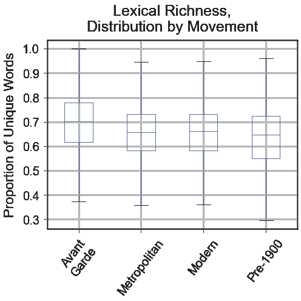

(*图片作者*)

重要的是要结合这些观察来认识到，1900 年以前是罗嗦的*和*重复，而前卫往往是简洁和充满独特的语言。

# 文本处理

我处理了这些诗，以便更好地了解每个乐章中最常用的词。为了处理文本，我:

*   把诗歌变成小写
*   将缩写转换为词根
*   删除标点符号
*   词条化
*   删除了停用词

我的停止词包括:

*   NLTK 停止字
*   那些停用词的旧英语对等词(即 *thy* 、*does*、 *ere* 等)。)
*   诗人的名字(因为一些可能已经在抓取过程中通过了)，减去任何也可能被用作单词的名字
*   HTML 标签可能已经通过了刮擦过程(这是我最初刮擦时的一个问题，但我相信在清理过程中已得到纠正；不过，安全总比后悔好)
*   在第一轮 EDA 中发现的有价值问题的单词(如*将*、*将*、*可能*)

在语料库中有 119，285 个独特的单词，总共有 1，165，726 个单词。经过处理后，这减少到 36，443 个唯一单词和 585，256 个总单词。

25 个最常用的单词是(同样，在处理和词条化之后):

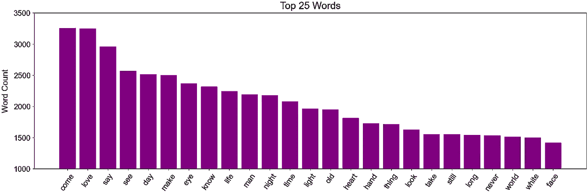

(*作者图片*)

还有一大堆**视觉** ( *见*，*眼*，*光*，*看*，*白*，*脸*，**颞** ( *昼*，*夜*，*时*，*老*，

我觉得有趣的是*来了*才勉强挤掉*爱*坐上头把交椅。同样，这是在词汇化之后，所以这是 come，comes，coming，come 等的组合。这也许同时指向一个行动的号召(一个招手，一个“过来！”)，一个被动的观察(“他来自一个遥远的城市……”，出自黛安·迪·普里马的*一个恋爱中的练习*)，以及性动词，后者无疑在 19 世纪后的运动中更为常见。

通过移动来分解词频，可以更清晰地描绘出语言使用中的一些差异:

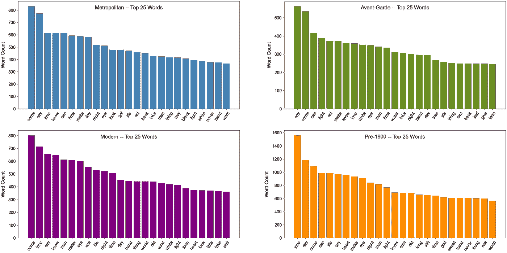

(*图片作者* ) |(点击放大)

都市、现代和先锋派诗歌往往更注重视觉和时间，先锋派也包括一些更具体的自然词汇，如*水*、*树*、*海*和*叶*。同样值得注意的是, *love* 仅仅是先锋派的第八大流行术语，然而它却位列其他运动的前三名。

1900 年以前的诗歌更倾向于概念性和空灵性，像*灵魂*和*上帝*这样的词是这个运动前 25 名所独有的。我还对相对缺乏自然术语感到惊讶(除了*海*)，考虑到这一运动包括以赞美自然而闻名的浪漫主义流派。

黑色对于大都会的名单来说是独一无二的，这大概可以用哈莱姆文艺复兴和黑人艺术运动流派来解释，也可以用垮掉派和纽约派诗人以城市为基础的更黑暗、更坚韧的美学来解释。

最后，值得注意的是这些图表的规模，它们反映了 1900 年前诗歌的冗长和重复以及先锋诗歌中相反的品质。在我的分析中，大都市诗歌和现代诗歌通常处于中间位置。

# 建模

我使用 TF-IDF 矢量器运行了朴素贝叶斯、KNN、决策树、随机森林和 SVM 模型。然而，我的最终实现是一个使用 Doc2Vec 文档向量的 SVM 模型，它为我提供了一个不错的 F1 分数，也是迄今为止最合适的。虽然为了简洁起见，我没有在我的最终 Jupyter 笔记本中使用它们，但我也运行了 XGBoost 和 LSTM 模型，它们显示了一些前景，但还没有达到我最终模型的水平。

## 数字数据的重要性

当同时使用单词(或文档)向量和我的工程特征时，我的所有模型都表现得更好。一般来说，当包含这些功能时，模型会有大约 10%的提升。

我在 TF-IDF 向量和我的工程特征上使用了伯努利朴素贝叶斯的基线模型取得了 42.7%的 F1 分数。这比仅仅预测占数据 29%的主导阶层要好得多。尽管如此，正如你在下面的困惑矩阵中所看到的，它确实高估了占主导地位的现代阶级，尽管并没有太多的不平衡。

我在 K-最近邻方面取得了一些成功，这表明数据中存在一定数量的聚类，以及随机森林。然而，后者是极其过分的。

同样，overfit 是我最好的模型，一个 SVM，有 TF-IDF 向量和数值数据。考虑到 SVM 在文本分类和数据方面的普遍成功，这相对来说并不令人惊讶，因为这些数据的特征多于数据点。这取得了最好的 F1 成绩，但在看不见的数据上不能很好地推广。

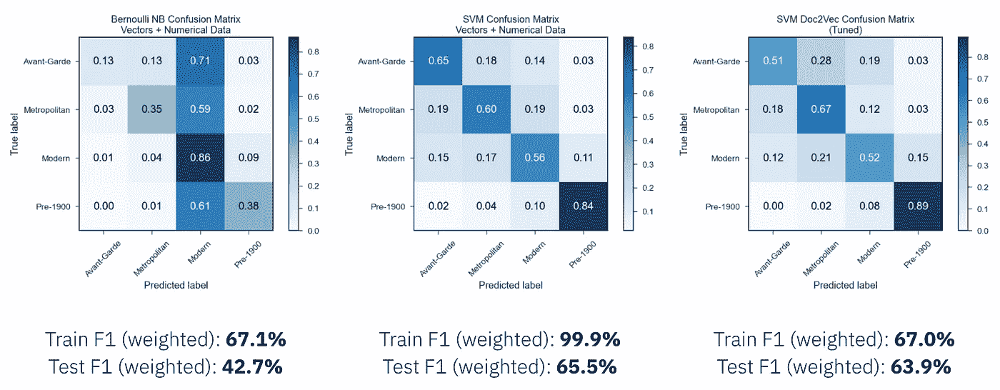

基线——SVM(TF-IDF)——SVM(doc 2 vec)混淆矩阵| ( *图片由作者*提供)

将我的数字特征与 Doc2Vec 嵌入相结合，被证明是对看不见的数据进行最佳概括的模型，而不会对 F1 分数造成太大影响。

除了基线，我的模型在挑选 1900 年前的诗歌方面一直表现得更好，在那场运动和其他三场运动之间没有太多混淆。事实证明，前卫、都市和现代更难区分，通常会相互混淆。最终的模型似乎表明现代是最接近 1900 年以前的运动，15%的现代诗被错误地归类为 1900 年以前的诗。先锋派和大都市派看起来非常相似，这从诗歌的角度来看是有道理的。

对我的大多数模型来说，运行时间不是问题，这部分是因为数据集相对较小。我的 Doc2Vec 模型几乎可以即时运行，只有 100 个维度和 7 个工程特性。

## 最终模型

我使用所有的数据训练了一个最终模型，F1 分数增加到了 66.8%。1900 年以前确实是最容易识别的，其他三个运动彼此相当相似，现代是最难正确识别的(F1 得分为 60%)。

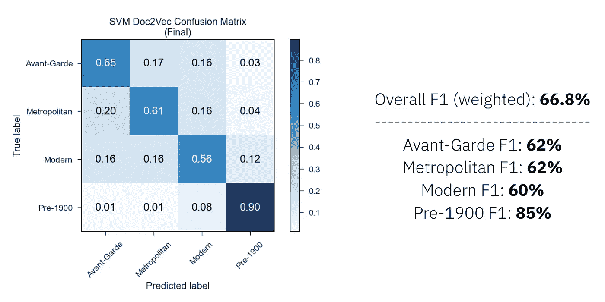

(*图片作者*)

在对整个数据集进行训练后，每个单独动作的 F1 得分都有所增加。现代的增幅最大，从 46%升至 60%。在对整个数据集进行训练后，Avant-Garde 的准确率有了惊人的大幅度提高，准确率从 51%提高到 65%。作为最小的阶层(大约 22%)可能解释这一点；更多的数据几乎总是一件好事。它的 F1 得分从 53%跃升至 62%。

# 顶级功能

除了我的基线和 TF-IDF SVM 模型之外，我的许多(如果不是全部)工程特性都在十大最重要特性之列。

在我的最终模型中，我的七个特性中有五个位于前十名:

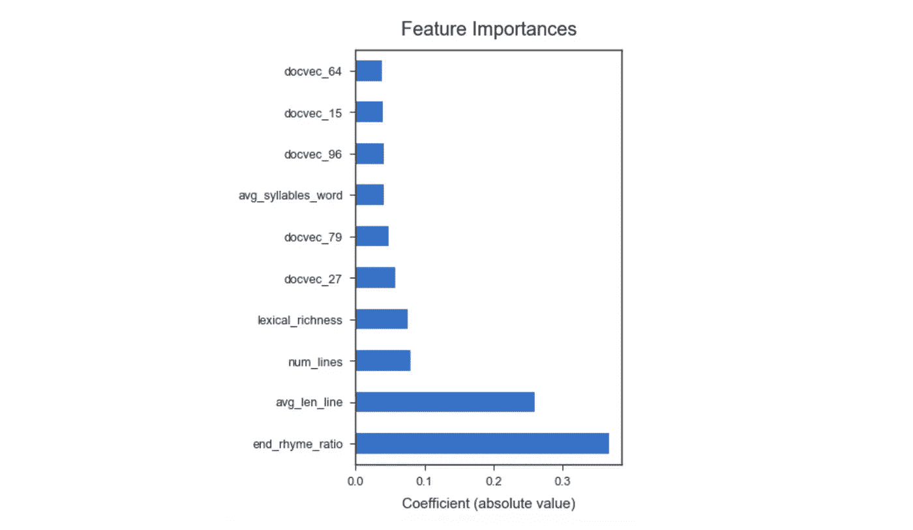

(*图片作者*)

结尾押韵占总行数的比例遥遥领先，其次是每行平均字数、总行数和词汇丰富度。每个单词的平均音节数是另一个进入前十的工程特征。极性和情绪得分是唯一两个对模型不太重要的指标。

通过使用文档向量而不是 TF-IDF 向量，我最终失去了一些可解释性，因为上图中的其他特性只是 100 个神秘维度中的 5 个。尽管如此，通过使用一组总共 107 个而不是 43，053 个特征，我产生了一个更简单的模型，具有相似的功效和更好的概括能力。

这将帮助我更容易产生一个推荐系统！

# 推荐系统

本周晚些时候，请收听我如何构建 [PO-REC](https://evening-cove-11137.herokuapp.com/) 的分解，这是一种算法，可以基于一个词、任意格式的多个词以及我的数据集中的另一首诗来推荐诗歌。

# 结论

形式和结构的力量！基于一首诗的形式和结构的数字数据被证明是一首诗的运动的一贯有效的预测。

1900 年以前的诗歌倾向于冗长、积极、充满韵律，并使用简单、重复的语言。

先锋派诗歌往往短小精悍，词不达意，使用复杂的词汇丰富的语言。

都市诗和现代诗介于两者之间。都市诗歌与先锋派诗歌最为相似，而现代诗歌与所有流派都有相似之处，是唯一一种与 1900 年以前的诗歌有些相似的其他流派。

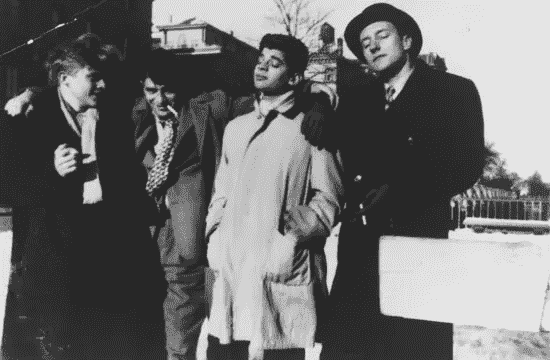

沉浸在完整预测模型的荣耀中|(图片由[维基共享资源](https://commons.wikimedia.org/wiki/File:Beat_Ceneration_1.jpg)提供)

# 未来的考虑

在未来，设计更多的功能会很有趣，比如其他类型的押韵(使用内部押韵或倾斜押韵)，动词时态(一首诗主要使用现在时还是过去时)，以及空白的使用(即一首诗是否总是从行的左边开始)。主题建模也可能产生一些有趣的结果。

此外，我计划尝试使用实际的流派(共有 13 种)来建立这一点，而不是这里讨论的四种伞状运动。这将带来一些显著的挑战，尤其是巨大的阶层失衡。现代诗歌，这是它自己的流派*和*运动，占所有诗歌的四分之一以上。虽然这肯定会导致更不准确的模型，但它也将揭示诗歌运动中的错综复杂。

# 项目回购

你可以在 GitHub 上查看我的项目回购:
[https://github.com/p-szymo/poetry_genre_classifier](https://github.com/p-szymo/poetry_genre_classifier)

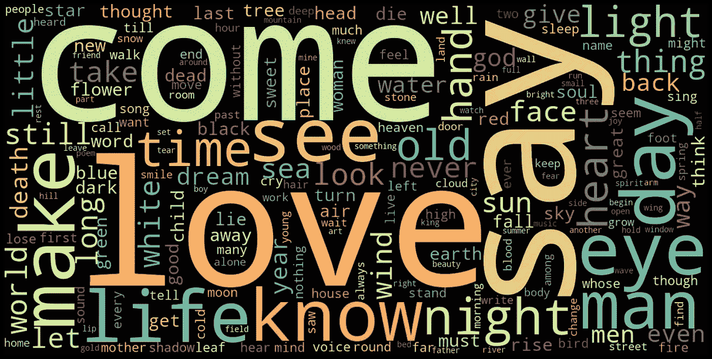

词云—整体| ( *图片作者*)