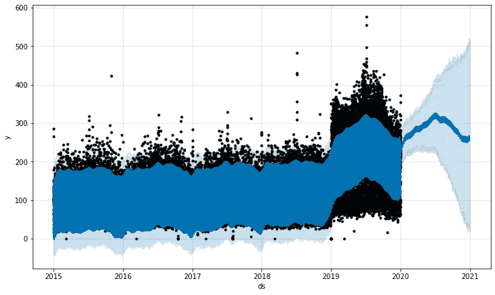
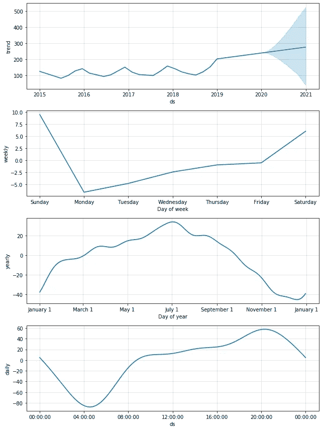
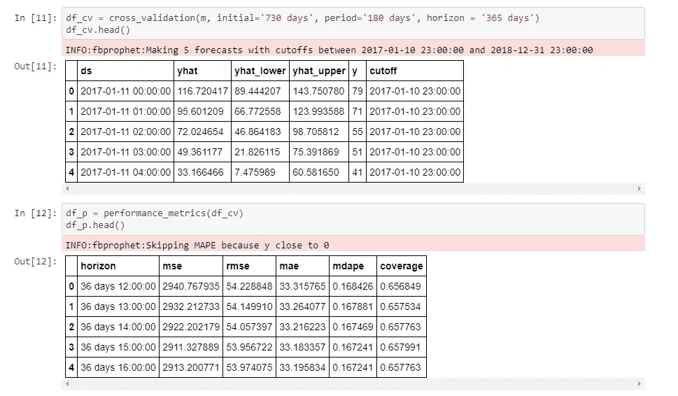

# 预测警察电话需求的乐趣(和先知)

> 原文：<https://towardsdatascience.com/predicting-police-call-demand-for-fun-and-prophet-2e278828a1a1?source=collection_archive---------57----------------------->

## 用 LAPD 呼叫数据进行快速和肮脏的预测

在这个容易获取数据科学的时代，预测警务需求有多难？我一直在探索时间序列回归技术，虽然在更高级的方面，它们可能会变得非常复杂，但你也可以使用开源工具来快速创建运营洞察，就像这里，我使用公开可用的 [LAPD](http://www.lapdonline.org/) 呼叫数据来预测需求。

虽然一些时间序列技术需要相当多的额外技术知识——我花了比任何正常人都多的时间来试图理解 ARIMA 模型是如何工作的——但我们很幸运，因为[脸书已经开源了他们的预测模型 Prophet，](https://facebook.github.io/prophet/)，而且非常容易使用。在 R 和 Python(我在这里使用的)中，这个库很容易安装，并且遵循您可能熟悉的技术。最基本的，你所做的就是给它一系列的时间点和你试图预测的值，它会考虑每天，每周和每年的季节性，并产生一些令人惊讶的准确预测。

感谢[警方数据倡议](https://www.policedatainitiative.org/datasets/calls-for-service/)，我得以获得 LAPD 从 2015 年到 2019 年底的详细通话数据。数据大部分都是干净的，所以聚合数据非常简单— [代码可以在 Github 上找到。](https://github.com/crimsoneer/LAPD_Prediction_with_Prophet/blob/master/ReadingAndCleaning.ipynb)

在可能的情况下，确保您的数据有一个可靠的频率(例如每天、每周、每小时等)——一些时间序列模型将与丢失的数据作斗争，尽管 Prophet 在我的测试中没有问题。在我的数据集中，我每小时观察 43825 次，总计刚刚超过 600 万次调用。

然后，我使用[脸书预言家快速入门文档](https://facebook.github.io/prophet/docs/quick_start.html#python-api)来引导我将我们的数据拟合到模型中，并进行一些初步预测。

一旦你将你的模型与你现有的数据相匹配，Prophet 就可以根据你的需要对未来进行预测。出于我的目的，我已经要求 Prophet 绘制 2020 年以后的预测需求数据-显然它无法解释 COVID，但请注意算法的置信度是在最初几个月(基于历史趋势数据)以及这如何随着时间的推移而偏离。

每小时通话需求(历史和预测)

这可能看起来很混乱，但请记住，这是预测*小时需求，*而不是每日需求，这允许更细粒度的预测，但确实增加了相当多的噪声。

每日通话量(历史和预测)

Prophet 的模型结合了各种较小的季节性趋势(每周、每天和每年)，也让您可以单独观察这些趋势，尽管这些趋势不会让任何有经验的警察感到震惊，但它们有助于进行有力的观察——需求在一周和一年中的波动非常惊人。它还清晰地展现了自 2010 年以来需求的持续增长。

季节性趋势细分，每小时通话需求

在试图做出任何预测之前，这确实提出了一些严重的实际问题——2019 年发生了什么，基本上使*的需求翻了一番？我最初假设我已经导入了两次年度文件，但它看起来确实像是“真正的”增长，尽管它可能是由计算机系统、分类规则或类似规则的变化所驱动的。这就是让操作专家与您的研究人员合作的重要性！*

然而，关键问题是，我们的模型在预测实际需求方面表现如何？有益的是，Prophet 包括交叉验证功能:它会自动将你的数据分成块，为每个块创建一个模型，并根据它知道的数据测试它创建的模型的准确性，以检查准确性。

性能指标，每小时需求模型

这里，Prophet 创建了 5 个不同的交叉验证集，您可以看到中值绝对百分比误差(MDAPE)徘徊在 15%左右。我不是专业统计学家，但这听起来并不坏，尤其是当你考虑到 2019 年的巨大意外跳跃时。即使在更远的未来，均方根误差(RMSE)仍然保持在 50-70 左右。

值得指出的是，这是你能得到的最直接的预言家或时间序列预测应用——我真的把算法扔给了我的数据，没有试图提高拟合度或解释我的数据的特定特征。Prophet 包含了考虑异常值、假日和更多因素的功能，如果您正在考虑部署这样一个工具，进行更多的探索和调整是绝对必要的。也就是说，在几个小时内，我们已经创建了一个模型，用于预测每小时的警察需求，如果我们给它提供更多的数据，这只会有所改善——这是对隔离的一个不错的使用！

那么，对于试图预测犯罪需求的警察部门来说，有什么教训呢？

*   你不需要一个昂贵的数据科学家来使用复杂的工具来预测你的需求(尽管你可能应该有一个)。虽然拥有博士学位的人可能会比普通分析师做得更好，但让任何人用你的数据做实验本身就有价值。也就是说，数据科学家将帮助调整模型，提高其性能，并阐明其内部工作原理。
*   **你确实需要一个可以部署这些技术的数据环境——这在 Excel 中是行不通的。我在这里使用 Python，尽管 R 或等效语言也一样好。**同样，这并不意味着您需要花费大量资金购买尖端的云解决方案，而是要认识到将所有数据锁在一个完全安全的生态系统中是有成本的。
*   **你的数据越容易获取，就有越多的人可以利用它，向你展示“可能性的艺术”。**并非所有的分析都需要来自内部:我已经在几个小时内将这种技术应用于 LAPD 数据。在[警方重新布线事件](https://www.policerewired.org/)中，我看到人们在几天内对血液飞溅运行机器学习技术，并制作真正的、专注于操作的工具。数据安全是不容商量的，但是每多一层不透明都是有代价的。

我期待着在几个月后重温这些预测，并将它们与“真实”数据进行比较，尽管我不认为任何数量的机器学习可以解释 COVID。

所有分析的代码和数据都在我的 GitHub 上[可用。这次分析的数据是由](https://github.com/crimsoneer/LAPD_Prediction_with_Prophet/blob/master/Analysis.ipynb)[警方数据倡议](https://www.policedatainitiative.org/)收集的，非常有帮助，如果你喜欢这类事情，你应该考虑加入[警方重组](https://www.policecoders.org/) [数据社区](https://www.policecoders.org/home/data-community)！