# 利用客户评论预测产品质量

> 原文：<https://towardsdatascience.com/predicting-product-quality-using-customer-reviews-ac1a215226d1?source=collection_archive---------31----------------------->

## 深入探究误导性客户评级以及贝叶斯思维如何欺骗我们的信念。

在竞争激烈的市场中，一家公司的成功建立在满足品味高雅、有鉴赏力的消费者群的严格标准之上。特别是，客户产品评论都很重要。但是我们应该如何根据顾客的评论来判断一个产品的质量呢？

Stux 在 [Pixabay](https://pixabay.com/photos/banner-easter-egg-colored-colorful-1255730/) 上的图片

在本文中，我们构建统计模型，使用客户评论中观察到的评分来比较两个虚拟产品(Lotus World 和 Toysmith)。特别是，我们正在查看产品被评为给定等级(1 到 5 星)的次数。

使用贝叶斯概念分析客户评级，如最大似然、最大后验、后验均值估计、后验预测估计和可信区间。

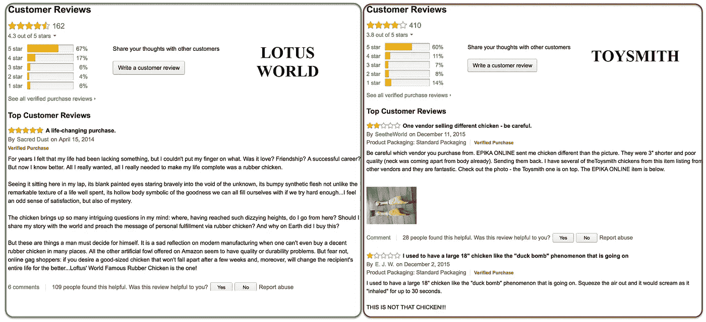

Lotus World vs Toysmith 的两个竞争产品的客户评论(图片由 Amazon.com 的[制作，出于本文目的，这些评论并不反映真实的评级，作者的观点是真实的)](https://www.amazon.com/Toysmith-1322-Squawkin-Chicken/dp/B0009Z3MQU)

如果你需要复习概率和分布，下面这篇文章可能是合适的。

 [## 理解概率。终于！

### 数据科学家概率概念实用指南

towardsdatascience.com](/understanding-probability-finally-576d54dccdb5) 

# 最大似然模型

我们感兴趣的是估计 ***θi* 顾客用 *i* 颗星**评价的概率。由于每个新评级都有一个介于 1 和 5 之间的值，因此它遵循分类分布 *Cat* ( *θ* )。

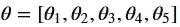

对于给定的产品，我们得到一个评级向量 *R* =[ *r* 1， *r* 2， *r* 3， *r* 4， *r* 5】。每个评分 *r* _ *i* 是 *i* 星评论的总数。每个 *i* 星的评审都是以概率 *θi* 进行的。我们看到每个评论 *r* 都独立于其他评论，并由**分类分布**建模:

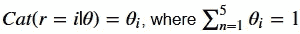

从 *N* 独立评论中观察到出现向量 *R* 的可能性由**多项式分布给出，该分布由 *θ*** 参数化:

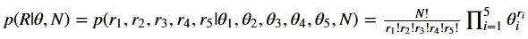

**对数似然**将由下式给出:

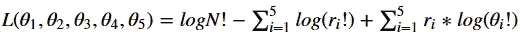

现在我们可以计算两种产品的 *θ* 的**最大似然估计量(MLE)** 。我们需要找到使可能性最大化的*θ**L*。我们需要对关于 *θ* 的似然函数进行微分。但是，我们不能就这么一意孤行，去做。我们必须考虑约束，我们必须使用拉格朗日乘数。

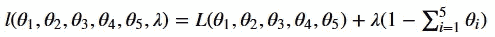

假设所有的导数都为 0，我们得到最自然的估计:

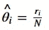

因此，最大似然估计值如下所示:

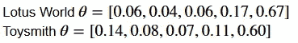

基于这两种型号的 *θ* 最大似然估计，你有信心决定一种产品是否优于另一种吗？这并不简单。但是，我们可以通过计算**最大似然(ML)** 和**阿凯克信息准则(AIC)** 来回答这个问题。首选模型是具有最小 AIC 值和最大 ML 的模型，如下所示。

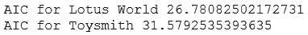

> 莲花世界的产品似乎优于 Toysmith。我们对此有多不确定？

# 贝叶斯模型

最大似然法找出参数值 *θ* ，使其最大化模型描述的审查过程产生实际观察到的数据的可能性。

## 先验信念

正如我们在下面的前一篇文章中解释的，MLE 的一个缺点是不可能包含我们对正在估计的参数的先验信念。

 [## 贝叶斯噩梦。解决了！

### 通过 Python PyMC3 中的示例和代码对贝叶斯数据分析进行了温和的介绍。

towardsdatascience.com](/bayesian-nightmare-how-to-start-loving-bayes-1622741fa960) 

> 假设我们被告知，市场上客户的意见非常两极分化。

大多数评论将是 5 星或 1 星，很少处于中间水平。一个关于 *θ* 的**狄利克雷先验将极大地抓住这个事实。狄利克雷分布是在一个概率单形上采样，这个概率单形是一串相加等于 1 的数。**

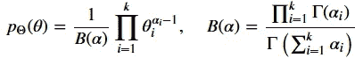

Dirichlet 对多个互斥选择的概率进行建模，由 *α* 参数化，α被称为集中参数，代表每个选择的权重。

如果我们想要产生一致的公平评论，那么 *α* →∞就可以了。对于具有*α*1 的对称狄利克雷分布，我们将平均产生一个公正的评价。如果目标是产生有偏见的评论，具有 1 星和 5 星的较高概率，我们会想要一个不对称的狄利克雷分布，具有更高的值为 *α* 1 和α5。下面我们建议一个不对称阿尔法的例子。

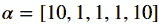

## 后验分布

贝叶斯方法可以被视为最大似然估计的扩展。当我们有数据、先验和生成模型时，我们可以应用贝叶斯定理根据数据计算模型参数的**后验概率分布**，如下所示。

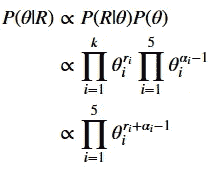

## **最大后验概率(MAP)**

通常汇总后验分布以发现一些集中趋势。**最大后验概率(MAP)** 或后验模式是具有最高后验概率的点，由下式给出:

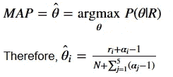

下面我们实现这个公式来计算 Lotus World 对 Toysmith 的地图。这给了我们一个更现实的未来评级概率的概念。例如，在考虑不对称评论的先验信念后，客户给 Lotus World 提供 5 星评级的可能性相当于 65%。MLE 模型为这种可能性提供了一个更乐观的值(67%)。通过包含领域专家的先验信念，贝叶斯方法只允许更接近业务现实的估计。

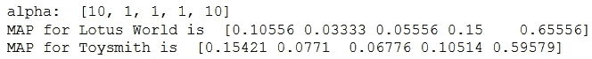

如果我们将 *α* 设为 1，那么我们获得了 *θi* 的最大似然估计。

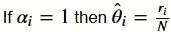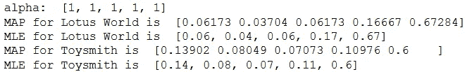

## 后验均值估计(PME)

后验均值估计或期望值是后验分布的均值或众数。对于我们的问题，它由下面的公式给出。

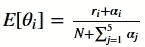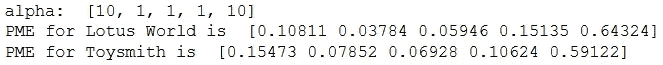

# PyMC3 下的贝叶斯推理

到目前为止，我们已经手动分析计算了后验分布。尽管这种方法在概念上很简单，但是对于大型数据集来说，这种方法可能会非常慢，而且伸缩性也很差。

还有更快的方法，主要是所谓的*马尔可夫链蒙特卡罗* ( *MCMC* )算法家族。下面，我们使用 Python 库 [PyMC3](https://docs.pymc.io) 实现 MCMC 来寻找模型参数的后验分布。这允许我们从每种产品的后验预测中抽取 1000 个评级向量样本，并总结 theta 的**后验预测估计值**。

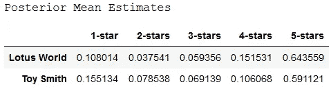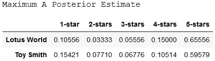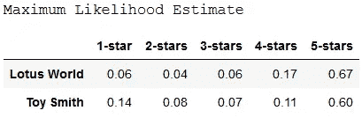

虽然后验均值估计和最大后验估计非常相似，但两者都与最大似然估计有很大不同。

## 可信区间

*可信区间*告诉我们在特定概率下未观察到的参数值的可能范围。**这不要与置信区间**相混淆，置信区间不能捕捉我们当前参数值位置的不确定性。

下面我们使用后验分布(从中抽取样本)来计算每种产品的 *θ* 的 95%可信区间。

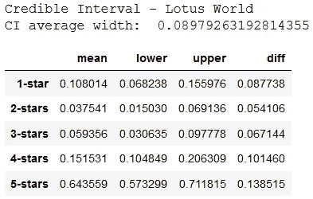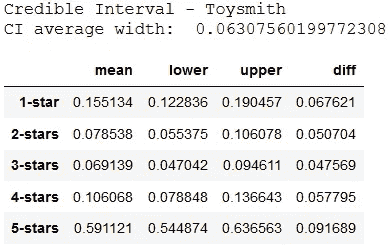

对于 Toysmith，上述后验均值估计的可信区间平均更窄。我们可能倾向于增加对 Toysmith 产品的评价的信任度。

> 你会选择 *θ* 的哪个点估计(MAP、MLE、后验平均 PME 或后验预测估计)来对这两个产品进行排序？

平均评级不考虑之前的信念，例如偏向 1 星和 5 星的倾斜评级。正如我们上面所展示的，当包含先验知识时，客户给出具体评论的可能性更可信。

在我们的例子中，我们将选择后验均值估计(PME)。MLE 和 MAP 是相似的，因为它们计算的是单一的估计值，而不是完整的分布。MLE 是映射的特例，其中先验是一致的！PME 或后验预测估计是从后验预测分布得出的，后验预测分布是可能参数的分布。因此，PME 将提供更可信的预测，随着数据量的增加，预测将变得更加准确。

# 结论

我们已经应用贝叶斯方法来检测基于客户评级的两个产品的感知质量。提供 Python 代码用于实际演示。

在我下面的下一篇文章中，你可以自由地学习更多关于贝叶斯方法的知识。

 [## 贝叶斯逻辑回归简介

### 使用 Python 和 PyJAGS 进行贝叶斯分类方法的实践演示。

towardsdatascience.com](/introduction-to-bayesian-logistic-regression-7e39a0bae691) 

我进一步推荐以下资源:

*   [拉里·乏色曼教授的贝叶斯推断](http://www.stat.cmu.edu/~larry/=sml/Bayes.pdf)，
*   [马克·约翰逊教授的狄利克雷多项式的贝叶斯推断](http://users.cecs.anu.edu.au/~ssanner/MLSS2010/Johnson1.pdf)，
*   克劳斯·赫瑟的《骰子、民意测验》&狄利克雷多项式。

感谢阅读。注意安全！