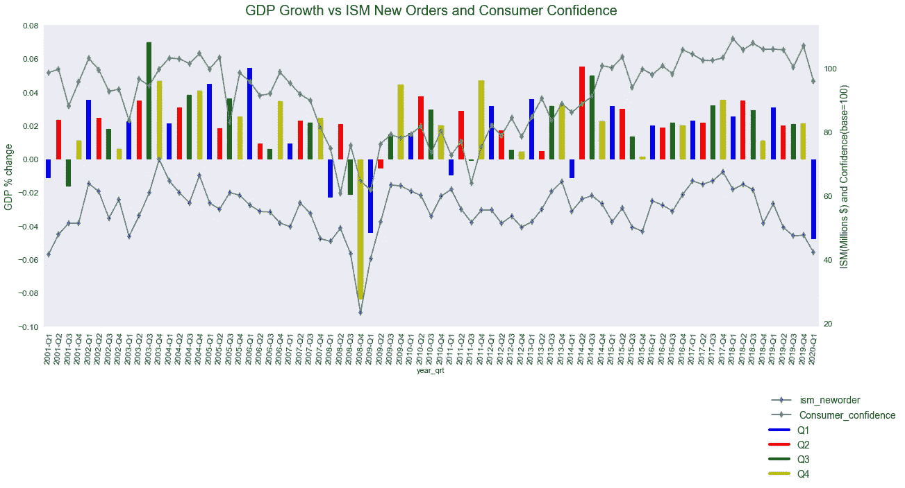
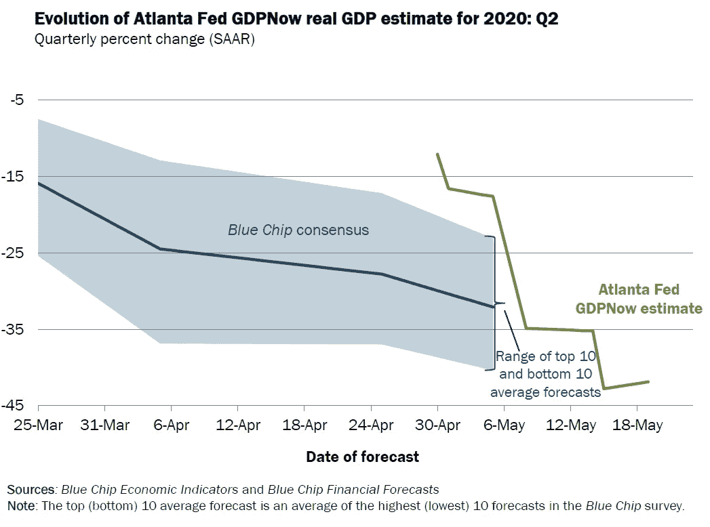

# 预测实际 GDP 增长

> 原文：<https://towardsdatascience.com/predicting-real-gdp-growth-85f34fdca97a?source=collection_archive---------20----------------------->

## 经济领先指标能在多大程度上预测实际 GDP 增长的方向？

如果你关注财经新闻，你可能会听到“消费者情绪”或“ISM 新订单”这样的词汇。这些是经济学家用来衡量经济未来走向的数据点或经济指标。但是他们对经济增长的预测有多准确呢？为了找到答案，我用 Python 开发了一个预测模型，来看看这些经济指标的预测能力。


米歇尔·汉德森在 [Unsplash](https://unsplash.com?utm_source=medium&utm_medium=referral) 上的照片

# 行话的澄清

## 商业周期

在我们进入模型之前，让我们首先对商业周期建立一个牢固的理解。周期的四个阶段是高峰期、收缩期、低谷期和扩张期。高峰和低谷是周期的转折点。在收缩期间，经济活动或 GDP 下降，这可能导致衰退或萧条。在扩张期间，经济活动正在加速。峰值是指经济过热，通胀高企，GDP 增速放缓。


资料来源:CFA 学院计划课程一级第二卷:经济学，2019

## 国内生产总值

美国的 GDP 或国内生产总值是在一定时间范围内在美国生产的最终商品和服务的价值。它是消费者支出、国内投资、政府支出以及进出口差额的总和。

GDP = C + I+G+(X-M)

# 前导指数

经济学家和金融分析师使用领先指标来帮助理解经济的未来状态。它有助于确定我们在商业周期曲线上的位置。以下是我在模型中使用的领先指标:

*   **平均每周首次申请失业保险:**衡量首次裁员和重新招聘的好指标
*   **制造业平均工作时间(季度百分比变化):**企业更有可能在裁员前削减加班时间，在返聘前增加加班时间；因此，在商业周期转变之前，这个指标首先移动
*   **ISM 制造商的新订单:不包括飞机在内的非国防资本货物:**月度新订单提供了工业部门活动的第一个信号，也是商业预期的良好代表
*   **私人住房单元建筑许可证:**预示新的建筑活动
*   标准普尔 500 指数:提供经济商业周期运动的早期迹象
*   **10 年期国债收益率和联邦基金利率之间的息差:**息差越宽，预示着经济上行，息差越窄，预示着经济下行
*   平均消费者预期/信心:如果消费者有信心，支出就会增加。消费占美国经济的 66%

# 数据

所有数据点都是从圣路易斯弗雷德网站检索的季度总量。这些数据是从 1947 年到 2020 年 Q1 的 293 项记录。

## 特征工程

*新变量创建:*

1.  季度:创建起始日期
2.  标准普尔 500 百分比:用标准普尔 500 的百分比变化替换实际值，因为随着时间的推移，标准普尔 500 值会增加

# 目标

目标变量是年化实际 GDP 增长率。我用季度实际 GDP 的变化计算了这个变量，如下:([Q2/Q1 * 4 ]-1)。使用实际国内生产总值是因为它根据通货膨胀进行了调整。

# 处理空值

很少有变量有空值，因为我找不到可以追溯到 1947 年的数据，而我找到了 GDP 数据。为了填补缺失的数据，我使用了 k-最近邻算法。

```
from sklearn.impute import KNNImputer
imputer = KNNImputer(n_neighbors=2)
df_filled = imputer.fit_transform(df2)
dataframe=pd.DataFrame(df_filled, columns = cols)
```

# 模型

我决定使用弹性网络回归模型，因为它在处理高度相关的独立变量方面做得更好。我把数据分成 30/70(测试/训练)。然后，我使用 ElasticNetCV 找到了模型的最佳 alpha，这是一个交叉验证类。

```
#Separate Features and target
X_Target = dataframe3[‘GDP_Change’] # the 
feature_df= dataframe3.loc[:, dataframe3.columns != ‘GDP_Change’]
#Split the data
X_train, X_test, y_train, y_test = train_test_split(feature_df, X_Target, test_size=0.3, random_state=0)alphas = [0.0001, 0.001, 0.01, 0.1, 0.3, 0.5, 0.7, 1]elastic_cv=ElasticNetCV(alphas=alphas, cv=5)
model = elastic_cv.fit(X_train, y_train)ypred = model.predict(X_test)
score = model.score(X_test, y_test)
mse = mean_squared_error(y_test, ypred)
print("R2:{0:.4f}, MSE:{1:.4f}, RMSE:{2:.4f}"
      .format(score, mse, np.sqrt(mse)))
```

输出:

```
R2:0.4323, MSE:0.0008, RMSE:0.0275
```

然后，我将模型的预测值与实际值可视化

```
x_ax = range(len(X_test))
plt.scatter(x_ax, y_test, s=5, color=”blue”, label=”original”)
plt.plot(x_ax, ypred, lw=0.8, color=”red”, label=”predicted”)
plt.legend()
plt.show()
```


均方误差非常低，但是均方根误差较大，因为它惩罚了较大的误差。这些大的误差可能是由于不可预见的事件导致的市场波动。0.4323 的 R 平方揭示先行指标只能解释 GDP 增长中 43%的差异。**因此，仅使用领先指标不足以预测 GDP 增长。为了更好地了解经济的发展方向，我们需要关注更多的指标，比如同步指标。**

# 向模型中添加重合指标

同步指标衡量当前的经济状况。因此，通过了解我们在商业周期中的位置，我们可以预测我们将走向何方。

我添加了以下指标:

*   月失业率的变化(季度平均值)
*   不包括食品和能源的个人消费支出(环比价格指数)，与一年前相比的价格变化
*   房屋月供应量:待售房屋与已售房屋的比率
*   抵押贷款还本付息额占个人可支配收入的百分比，价格与一年前相比有所变化

新的弹性网回归模型误差略低，R 平方增加。这个模型解释了 GDP 增长中约 65%的可变性。同时使用同步指标和领先指标可以更好地描绘出我们前进的方向。

```
R2:0.6477, MSE:0.0006, RMSE:0.0235
```


# 特征的预测能力

该模型强有力的预测指标是 ISM 新订单、消费者信心和失业率变化。

ISM 新订单指数与 GDP 增长密切相关，相关系数为 0 . 60。因此，随着新的制造业订单增加，它有助于 GDP 增长。第二个强有力的预测因素是消费者信心(0.34)。GDP 计算的很大一部分是支出。随着消费者对经济状况更有信心，他们可能会增加支出，从而提高 GDP。失业率的变化和 GDP 的增长也有很强的负相关(-0.65)。


从上面的相关矩阵中，您可以看到独立变量也是相关的(这就是我使用弹性网回归模型的原因)。例如，消费者信心和每周失业申请人数之间有很强的负相关性，这是有道理的，因为如果一个人没有工作来支付账单，消费者对经济的信心就会下降。

下图说明了前两个预测指标(ISM 新订单和消费者情绪)之间的趋势。例如，2008 年第四季度，由于新订单和消费者信心下降，经济收缩了约 8%。2020 年第一季度，我们又经历了一次经济收缩(-4.8%)。在此期间，由于对冠状病毒的担忧日益加剧，新订单指数和消费者信心指数均下降了约 10%。



# 预测 2020 年 Q2 国内生产总值增长

使用 4 月份的最新数据预测 2020 年第二季度的 GDP 增长，我的模型预测将大幅下降 24.2%。起初，这令人瞠目结舌。所以我将我的结果与其他领先组织的预测进行了比较。

美国国会预算办公室(CBO)估计，下一季度 GDP 将下降 12%，年化降幅为 40%。

亚特兰大联邦储备银行估计 GDP 将大幅下降 40%。蓝筹股的普遍预测从-6%到 40%不等。



世界大型企业联合会预测美国经济下个季度将收缩 45%。据世界上最大的投资公司之一太平洋投资管理公司(PIMCO)称，30%⁴.的国内生产总值将会收缩我对经济收缩 24%的惊人预测，实际上与许多其他人的预测是一致的。

连续两次 GDP 负增长就是衰退。不管实际的 GDP 增长数字如何，人们普遍认为，2020 年第二季度 GDP 将大幅下降。这表明我们将陷入衰退，因为 2020 年第一季度也将收缩。

[1]:菲尔·斯韦尔。(2020 年 4 月 24 日)。CBO 目前对产出的预测。https://www.cbo.gov/publication/56335T2

[2]:亚特兰大美联储银行。 *GDPNow* 。[www.frbatlanta.org](http://www.frbatlanta.org)

[3]:会议板。*美国经济的经济预测*。[https://www . conference-board . org/publications/Economic-Forecast-US](https://www.conference-board.org/publications/Economic-Forecast-US)

[4]:凯特·杜吉德(2020 年 4 月 8 日)。*太平洋投资管理公司称，美国第二季度 GDP 将收缩 30%，2020 年将收缩 5%。*[https://www . Reuters . com/article/us-USA-GDP-pimco/us-GDP-will-contract-30-in-second-quarter-5-in-2020-pimco-iduskcn 21 q2vl](https://www.reuters.com/article/us-usa-gdp-pimco/us-gdp-will-contract-30-in-second-quarter-5-in-2020-pimco-idUSKCN21Q2VL)