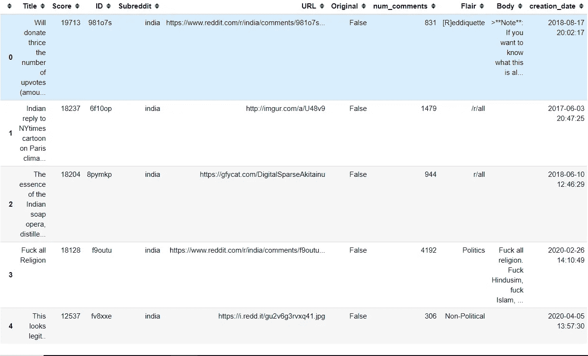

# 使用机器学习预测 Reddit Flairs 并使用 Heroku 部署模型—第 1 部分

> 原文：<https://towardsdatascience.com/predicting-reddit-flairs-using-machine-learning-and-deploying-the-model-on-heroku-part-1-574b69098d9a?source=collection_archive---------39----------------------->


Kon Karampelas 在 [Unsplash](https://unsplash.com?utm_source=medium&utm_medium=referral) 上拍摄的照片

## [Reddit 天赋预测系列](https://towardsdatascience.com/tagged/reddit-flair-prediction)

## 问题定义和数据收集

如果你被困在付费墙后面，点击[这里](/predicting-reddit-flairs-using-machine-learning-and-deploying-the-model-on-heroku-part-1-574b69098d9a?source=friends_link&sk=4777eb0bfa202bd98305739c04534ade)获取我的朋友链接并查看这篇文章。

Reddit 是一个非常受欢迎的社交媒体网站，大约有 3.3 亿活跃用户，它产生了大量的**用户生成内容**，像我这样的数据科学家喜欢挖掘和分析这些内容。我最近完成了一个使用 Reddit 数据的项目，我打算谈谈我的经历以及我解决问题的过程。这将帮助任何正在寻找一个**端到端机器学习项目**的人。我将向您介绍收集数据、分析数据、构建模型、部署模型并最终使用 Heroku 将其上传到服务器的过程。到本系列结束时，您将已经使用了许多 Python 模块、API 和方法，这将使您在自己的机器学习之旅中更加自信。

我已经把这个项目分成了几个部分，希望我能够用 3-4 个部分来介绍它。欢迎来到本系列的第 1 部分，我将向您介绍这个问题的背景，并执行这项任务的数据收集方面。

# **背景**

在着手解决实际问题之前，这项任务需要一些领域知识。对于那些从来没有去过 reddit 网站的人，我强烈建议你去看看，因为它真的会帮助你分析你将要收集的数据。在这项任务之前，我从未使用过 reddit，在我理解为什么某些东西对我的模型不起作用之前，我花了一些时间来适应这个网站。

## reddit 和 subreddit 到底是什么？

我经常发现自己试图回答这个问题，因此让我尽可能简单地为你解答。本质上，它是一个论坛的集合，人们可以在这里分享新闻和内容，或者对其他人的帖子发表评论。 [Reddit](https://www.digitaltrends.com /social-media/what-is-reddit/) 被分成超过 100 万个被称为“子 Reddit”的社区，每个社区涵盖不同的主题。subreddit 的名称以/r/开头，这是 reddit 使用的 URL 的一部分。比如 [/r/nba](https://www.reddit.com/r/nba/) 是人们谈论国家篮球协会的子编辑，而 [/r/boardgames](https://www.reddit.com/r/boardgames/) 是人们讨论桌游的子编辑。

出于我们分析的目的，我们将使用' [India](https://www.reddit.com/r/india/) '子编辑，因为我来自印度，这个帖子上有很多内容。你可以自由选择你喜欢的线。

## Reddit Flairs

reddit 上的另一个功能是 **flair** ，我们将在接下来的分析和预测中使用它。flair 是一个“标签”,可以添加到 reddit 网站的子 reddit 中的帖子中。它们帮助用户了解文章所属的类别，并帮助读者根据他们的偏好过滤特定类型的文章。

# 使用 PRAW 收集 Reddit 数据

所以，让我们言归正传。任何机器学习任务都需要你给它输入数据。我们将通过编写一个脚本来从印度收集数据。这些数据将在问题的未来部分用于构建分类器。为此，我们将使用一个名为 PRAW 的专用库，它是 Reddit API 的 Python 包装器，使您能够从子编辑中抓取数据。

## 安装 PRAW

我们可以在终端中使用 pip 或 conda 安装 PRAW:

```
pip install praw 
or 
conda install praw
or
pip3 install praw
```

一旦安装了库，您就可以通过

```
import pandas as pd # data manipulation 
import praw # python reddit API wrapper
```

然而，在我们开始使用 praw 收集数据之前，我们必须对自己进行身份验证。为此，我们需要创建一个 Reddit 实例，并输入`client_id`、`client_secret`和`user_agent`作为参数。

创建 Reddit 实例

认证部分已经从[这篇文章](/scraping-reddit-data-1c0af3040768)中引用，我想给作者[吉尔伯特·坦纳](https://medium.com/u/b986eefd54ba?source=post_page-----574b69098d9a--------------------------------)满分，因为这是我从那里学到这项技术的原始文章。

为了获得认证信息，我们需要通过导航到[该页面](https://www.reddit.com/prefs/apps)并点击**创建应用**或**创建另一个应用来创建 reddit 应用。**


图 1: Reddit 应用程序[1]

这将打开一个表单，您需要在其中填写名称、描述和重定向 uri。对于重定向 uri，你应该选择`http://localhost:8080`，正如优秀的 [PRAW 文档](https://praw.readthedocs.io/en/latest/getting_started/authentication.html#script-application)中所描述的。


图 2:创建新的 Reddit 应用程序[1]

按下**创建应用程序**后，会出现一个新的应用程序。在这里，您可以找到创建`praw.Reddit` 实例所需的认证信息。


图 3:认证信息[1]

一旦获得了这些信息，就可以将它添加到上面的代码段中，并创建一个`praw.Reddit`的实例。Reddit 类提供了对 Reddit API 的方便访问。该类的实例是通过 PRAW 与 Reddit 的 API 交互的门户。你可以在这里阅读更多关于这个类及其方法的内容。

## 获取子编辑数据

使用上面的实例，我们可以从我们想要的子编辑区(即印度)获得前 1000 个帖子或 1000 个热门帖子或最新帖子。

收集热门帖子并展示它们

结果将如下所示:

```
Will donate thrice the number of upvotes (amount in Rs.) i get for this thread in next 24 hours
Indian reply to NYtimes cartoon on Paris climate accord by Satish Acharya.
The essence of the Indian soap opera, distilled into one GIF.
This looks legit..
German exchange Student at IIT Madras is being sent back home by the Indian immigration department because he joined the protest.
Tragedy of India
Today's The Hindu
Irrfan Khan dies at 54
If you are not moved by this picture, I wish I had your heart. [NP]
.... 
```

以类似的方式，我们可以使用下面的代码获得“最热”或“最新”的帖子。

```
hot_posts = reddit.subreddit(‘India’).hot(limit=num_of_posts)new_posts = reddit.subreddit(‘India’).new(limit=num_of_posts)
```

物体`hot_posts`、`top_posts`和`new_posts`属于`ListingGenerator`类，更多可以在这里读到[。现在让我们将数据以结构化格式存储在一个`pandas.DataFrame`和一个`.csv`文件中，以便进一步分析。](https://praw.readthedocs.io/en/latest/code_overview/other/listinggenerator.html)

首先，我们需要为每个线程创建一个从 reddit 网站提取的特性列表。详细名单可以在[这里](https://praw.readthedocs.io/en/latest/code_overview/models/submission.html#submission)找到。每个特性都是`Submission`类的一个属性。我已经描述了我收集的一些，但是你可以自由增减你的列表。

这些是我们将从数据集中提取的数据列。

被擦除数据的功能描述

提取数据并转换为数据帧

下面是我们的数据框架:


包含抓取数据的数据帧

下一步是修复我们的`created_on`字段，因为它目前用 [UNIX 时间](https://en.wikipedia.org/wiki/Unix_time)表示。

将 UNIX 时间转换为人类可读的日期时间

输出:



虽然从数据搜集的角度来看这个结果是可以接受的，但是从 ML 的角度来看，它有一些问题。在分组和 value_counts 等基本数据分析之后，人们会发现这些数据非常不平衡，并且偏向某些类。此外，我们还可以通过收集评论数据来收集更多信息。有时仅仅是标题和正文可能还不够，添加评论可以增加很多关于文章及其所属风格的有价值的信息。那么，让我们来看看一种即兴的数据收集方法。

## 数据收集:即兴

我要做的第一件事是创建更少数量的分类目标，这样就不会有信息溢出，也不用花费几个小时来收集信息。这意味着我将有更多的数据为每个天赋，因此，我可以建立更强大的模型，并提高准确性。

```
posts[‘Flair’].value_counts().sort_values(ascending=False)
```

我按降序排列了这些文件，并挑选了最受欢迎的文件，以避免数据失真。我将收集热门帖子及其评论，以及一些与分析和模型相关的其他信息。

相关标志

值得注意的是，这些标记在我写这篇文章时是相关的，在你进行分析时可能会改变，所以相应地创建这个列表。我保留了或多或少相同的功能，增加了一个评论字段。

收集数据的第二种方法

在上面的代码段中，`replace_more()`方法有助于处理`[MoreComments](https://praw.readthedocs.io/en/latest/tutorials/comments.html)`对象，如果不检查的话会导致错误。该方法替换或删除了`MoreComments`。您可以设置`limit=None`获取所有评论，而设置`limit=0`删除所有评论。由于时间限制，我选择了`limit=0.`。最后，从 ML 的角度来看，还有一个非常重要的步骤。在这种方法中，数据被聚类成相似的 flair 类型，因为我们将它们一个接一个地追加到一个列表中。很有可能在分割训练和测试数据之后，在训练或测试数据中甚至没有一个特定天赋的例子。这可能会导致明显的性能问题。让我们通过对随机排列的数据进行采样来解决这个问题。通过设置`frac=1`，我们得到全部数据。

```
# Data Shuffling
data = posts.sample(frac=1).reset_index(drop=True)
data.head()
```


最终数据帧

最后，将数据帧保存为. csv 格式，以便进一步分析。

```
# Save Data in a CSV file
data.to_csv('data.csv')
```

这让我结束了本教程。这里有一个[链接](https://github.com/prakharrathi25/reddit-flair-predictor/blob/master/notebooks/Collecting%20'India'%20subreddit%20data.ipynb)到我原来的笔记本。在下一部分，我将分析这些数据并建立模型。我还将创建 NLP 管道，以加快数据分析。在 [**第二部分**](/predicting-reddit-flairs-using-machine-learning-and-deploying-the-model-using-heroku-part-2-d681e397f258) **中继续阅读该项目。**你可以在这里找到本系列[的所有文章。](https://towardsdatascience.com/tagged/reddit-flair-prediction)

# 参考

1.  [https://towards data science . com/scraping-Reddit-data-1c 0af 3040768](/scraping-reddit-data-1c0af3040768)
2.  [https://praw . readthedocs . io/en/latest/code _ overview/praw _ models . html](https://praw.readthedocs.io/en/latest/code_overview/praw_models.html)
3.  【https://www.digitaltrends.com/web/what-is-reddit/】