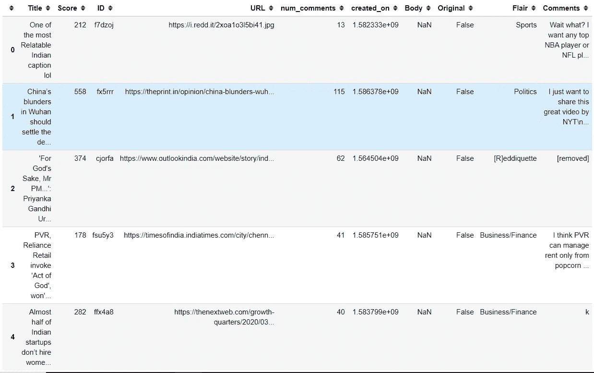
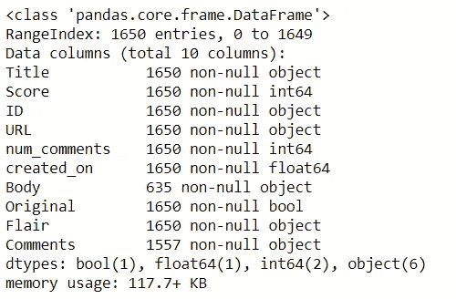
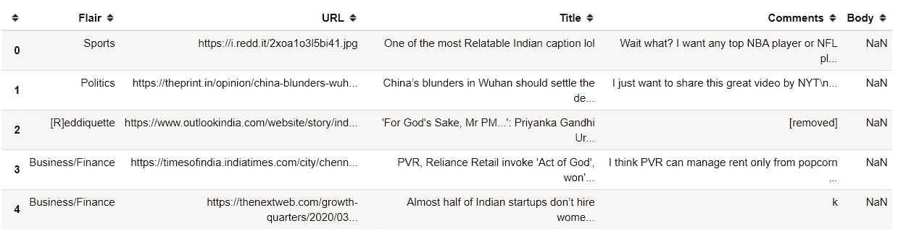
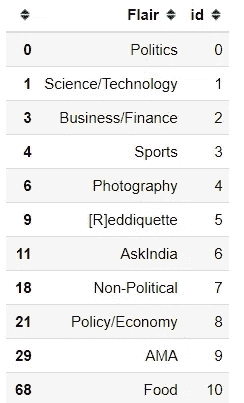
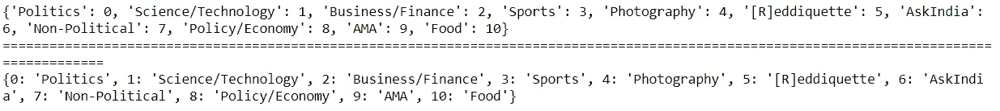
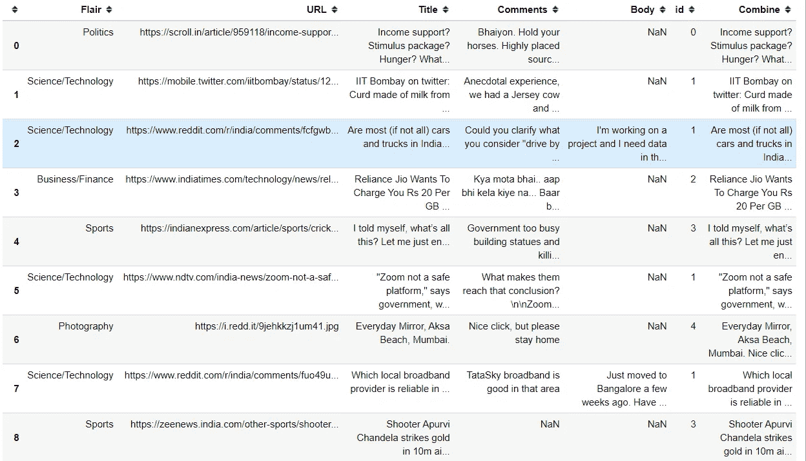
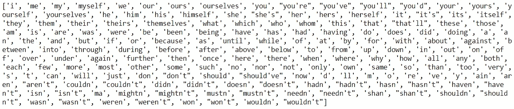
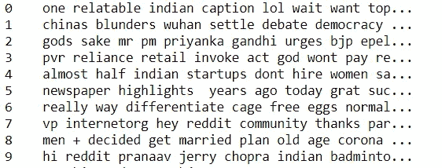
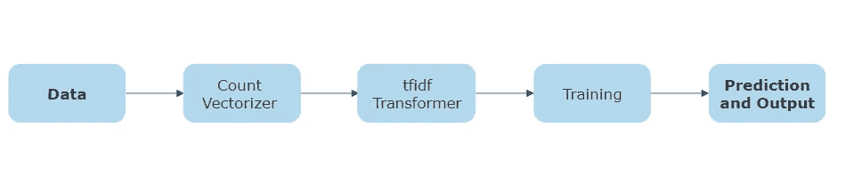

# 使用机器学习预测 Reddit Flairs 并使用 Heroku 部署模型—第 2 部分

> 原文：<https://towardsdatascience.com/predicting-reddit-flairs-using-machine-learning-and-deploying-the-model-using-heroku-part-2-d681e397f258?source=collection_archive---------59----------------------->


图片由[皮克斯拜](https://pixabay.com/?utm_source=link-attribution&utm_medium=referral&utm_campaign=image&utm_content=1989152)的 Gerd Altmann 提供

## [Reddit 天赋预测系列](https://towardsdatascience.com/tagged/reddit-flair-prediction)

## 文本分析和模型构建

本文音频

如果你被困在付费墙后面，点击[这里](/predicting-reddit-flairs-using-machine-learning-and-deploying-the-model-using-heroku-part-2-d681e397f258?source=friends_link&sk=e7086ecaf76d04f5cdc6b2077f4d346b)获取我的朋友链接并查看这篇文章。

欢迎来到本系列的第 2 部分，在这里我将继续解决 **Reddit Flair 检测问题**。在[第 1 部分](https://medium.com/@prakharrathi25/predicting-reddit-flairs-using-machine-learning-and-deploying-the-model-on-heroku-part-1-574b69098d9a)中，我讨论了问题的背景和数据收集方法。强烈建议您在开始之前阅读第 1 部分，因为我已经分享了数据收集过程背后的见解和推理。我还描述了我在项目和模型构建中使用的各种指标。如果您还没有完成第 1 部分，但想继续第 2 部分，您必须从[这里](https://github.com/prakharrathi25/reddit-flair-predictor/tree/master/data)获取 data.csv 文件。一旦你获得了数据，我们就开始吧。

# 介绍

在课程的这一部分，我将致力于数据分析、文本分析和文本分类。虽然本教程是针对我从事的项目的，但是这些技术可以应用于任何文本分类问题。值得注意的是，这是一个多类文本分类问题，有一些专门针对这类问题的警告。大多数在线教程都是关于二进制文本分类的，比如垃圾邮件过滤器。然而，您将主要处理现实世界中的多类问题。因此，本教程应该是一个很好的起点。

# 问题回顾

正如我已经讨论过的，这是一个有监督的多类文本分类问题。我们已经收集了特征和标签，我们的目标是建立一个模型，它可以根据我们收集的帖子的特征来预测帖子的风格。我们开始吧

## 重要的图书馆

这些是我们将在此过程中使用的库。

任务所需的库

如果您的系统中没有安装它们，您可以下载[这个文件](https://github.com/prakharrathi25/reddit-flair-predictor/blob/master/requirements.txt)，并在您的终端中运行以下命令。

```
pip install -r requirements.txt
```

注意:-这将在您的工作目录中安装所有的软件包。如果您想在虚拟环境中安装这些，请参考此[链接](https://packaging.python.org/guides/installing-using-pip-and-virtual-environments/)。

## 探索性数据分析

首先将数据从 csv 文件读入数据帧。

```
# Reading Data 
data = pd.read_csv('data.csv')
```

如果您已经从 GitHub 链接获得了数据，那么下一步对您来说很重要。其他人可以跳过这个。在这里可以找到[的解释。](https://medium.com/@prakharrathi25/predicting-reddit-flairs-using-machine-learning-and-deploying-the-model-on-heroku-part-1-574b69098d9a)

```
# Data Shuffling
data.drop(['Unnamed: 0'], inplace=True, axis=1)
data[:] = data.sample(frac=1).values
data.head()
```



先看数据

由于这是一个文本分类问题，我们将只对机器学习模型使用包含文本的特征。它们是标题、正文、评论和 URL(可选)。让我们看看列的数据类型和缺少的值。

```
# Display data types and null values
data.info()
```



data.info()之后的输出

在`Body`列中有许多空值，在`Comments`部分中有一些缺失值。我们不能估算它们，因为它们包含用户生成的内容。然而，每个条目都有一个`Title`和`Flair`，所以我们不必删除任何一行，我们可以使用它们进行分析。在`Flair.`的数据集中有许多要预测的类

```
print(len(data[‘Flair’].unique()))
data[‘Flair’].unique()**OUTPUT:**11
['Sports' 'Politics' '[R]eddiquette' 'Business/Finance' 'Food' 'AMA'
 'AskIndia' 'Photography' 'Non-Political' 'Science/Technology'
 'Policy/Economy']
```

因此，有 11 个独特的类。对于我们收到的每一个新帖子，我们都需要将其归入这 11 个类别中的一个。我已经提到了我们将用于分析的重要特性。让我们减小数据帧的大小，只保留相关的特征。

```
# List of relevant features
features = [‘Flair’, ‘URL’, ‘Title’, ‘Comments’, ‘Body’]
data = data[features]
data.head()
```



过滤数据

现在我们有了更多的相关数据，我们需要创建几个字典供将来使用[1]。第一步是为每个天赋生成一个唯一的 ID。然后，我们将根据它们创建字典。这些字典将让我们引用我们为它们生成的独特 id，反之亦然。



每种天赋类型的唯一 id



词典的输出

我们创建了两本词典:-

1.  `category_labels`:该字典将 flairs 作为关键字，将 ID 作为值分配给它们，这些值将在预测后用作分配标签的方式。
2.  `category_reverse`:这是前一个字典的反例，使用 id 作为键，flairs 作为值。

下一步是创建一个由`Title`、`Body`和`Comments`组合而成的组合特征。我现在不使用 URL，让你来分析它。有很多有创意的方法可以做到这一点，你可以在下面的评论中提到它们。我将创建一个新的功能`Combine`，它将纳入上述功能。

创建新功能`Combine`



添加组合特征后的数据帧

**文字清理**

这是文本分类项目最重要的方面之一，因为并非所有的单词都同样重要，一些单词如*和*和*是*是如此常见，以至于它们会出现在所有 flair 类别的数据中，并混淆分类器。强烈建议删除它们。在情感分析项目中，我们可能会保留标点符号，因为感叹号的数量可能会完全改变那里的含义。然而，我觉得没有必要把它们留在这里，因此，我将在下一步中删除它们。我刚才提到的*常用词*在 nltk 库中都有，所以你不必自己列一个清单。

```
# Collect all the english stopwords and display them
STOPWORDS = nltk.corpus.stopwords.words(‘english’)
print(STOPWORDS)
```



英语中的 nltk 停用词列表

让我们定义一个清洗函数。我们将通过这个函数来清理我们的特征。

函数来清理我们的数据



清洁后的组合功能

## 文本表示

分类器和学习算法不能直接处理原始形式的文本文档，因为它们中的大多数期望具有固定大小的数字特征向量，而不是具有可变长度的原始文本文档。因此，在预处理步骤中，文本被转换成更易于管理的表示[1]。矢量化是一种将单词转换成长串数字的方法，这些数字可能具有某种复杂的结构，只有使用某种机器学习或数据挖掘算法的计算机才能理解。[2]

对于文章的这一部分，我要感谢[苏珊李](https://medium.com/u/731d8566944a?source=post_page-----d681e397f258--------------------------------)。她在[她的文章](/multi-class-text-classification-with-scikit-learn-12f1e60e0a9f)中介绍的最相关单字和双字测试是一种非常有见地的技术，它让我们找到在特定类型的天赋中出现最多的单词，并让我们深入了解模型的预测方法。如果一个特殊的天赋有很多不相关的词，那么我们可能会考虑添加更多的数据或删除一些数据。

现在，对于我们数据集中出现的每个术语，我们将计算一个称为[术语频率的度量，逆文档频率](http://www.tfidf.com/)，缩写为 tf-idf。我们将使用`sklearn.feature_extraction.text.TfidfVectorizer` 来计算每个消费者投诉叙述的`tf-idf`向量:

*   `sublinear_df`设置为`True`以使用对数形式的频率。
*   `min_df`是一个单词必须存在的最小文档数。
*   `norm`被设置为`l2`，以确保我们所有的特征向量具有 1 的欧几里德范数。
*   `ngram_range`被设置为`(1, 2)`,表示我们既要考虑单元组，也要考虑二元组。
*   `stop_words`设置为`"english"`删除所有常用代词(`"a"`、`"the"`、...)以减少噪声特征的数量。[1]

组合数据的 tfidf 矢量化

```
**Output** (1650, 3299)
```

现在，1650 个消费者投诉叙述中的每一个都由 3299 个特征表示，代表不同单字和双字的 tf-idf 得分。

我们可以使用`sklearn.feature_selection.chi2`找到与每个产品最相关的术语:

打印每种天赋最相关的单字和双字列表

您会发现下面的输出对于每种天赋都非常直观。

```
Flair 'AMA':
Most correlated unigrams:
	. hi
	. anything
	. ask
	. questions
	. ama
Most correlated bigrams:
	. ask us
	. us anything
	. hi reddit
	. answer questions
	. ask anything

Flair 'AskIndia':
Most correlated unigrams:
	. advice
	. dad
	. situation
	. afraid
	. family
Most correlated bigrams:
	. ive seen
	. want know
	. feel like
	. work home
	. dont want

Flair 'Business/Finance':
Most correlated unigrams:
	. firms
	. emi
	. hdfc
	. mukesh
	. bank
Most correlated bigrams:
	. credit card
	. mukesh ambani
	. share market
	. reliance jio
	. yes bank

Flair 'Food':
Most correlated unigrams:
	. restaurant
	. chutney
	. recipe
	. chicken
	. food
Most correlated bigrams:
	. im trying
	. every day
	. couldnt find
	. dont eat
	. indian food

Flair 'Non-Political':
Most correlated unigrams:
	. rural
	. dads
	. found
	. bored
	. comics
Most correlated bigrams:
	. im gonna
	. palghar lynching
	. amazon prime
	. india live
	. amid lockdown

Flair 'Photography':
Most correlated unigrams:
	. mm
	. beach
	. nikon
	. shot
	. oc
Most correlated bigrams:
	. stay home
	. equipment nikon
	. one plus
	. da mm
	. nikon da

Flair 'Policy/Economy':
Most correlated unigrams:
	. gdp
	. govt
	. investments
	. nirmala
	. economy
Most correlated bigrams:
	. health workers
	. https internetfreedomin
	. petrol diesel
	. indian economy
	. raghuram rajan

Flair 'Politics':
Most correlated unigrams:
	. sonia
	. removed
	. modi
	. arnab
	. muslims
Most correlated bigrams:
	. home minister
	. arnab goswami
	. pm modi
	. rahul gandhi
	. john oliver

Flair 'Science/Technology':
Most correlated unigrams:
	. vpn
	. iit
	. develop
	. zoom
	. users
Most correlated bigrams:
	. anyone else
	. covid virus
	. home affairs
	. ministry home
	. cow urine

Flair 'Sports':
Most correlated unigrams:
	. ipl
	. football
	. sports
	. cricket
	. cup
Most correlated bigrams:
	. india pakistan
	. know people
	. one time
	. times india
	. world cup

Flair '[R]eddiquette':
Most correlated unigrams:
	. boop
	. askaway
	. beep
	. creator
	. bot
Most correlated bigrams:
	. bot problem
	. bot bot
	. askaway creator
	. beep boop
	. discussion thread
```

你会发现，对于大多数 flairs 来说，最相关的单词是很有解释力的。

## 对输入要素和标注建模

我们的下一个任务是以分类器可以理解的方式对输入数据进行建模。我们需要将输入转换成与数字标签相关的数字向量。获得文本的向量表示后，我们可以训练监督分类器来预测用户提交的每个 Reddit 帖子的“风格”。让我们从按数据划分成训练集和测试集开始。我没有先对数据进行矢量化是有原因的，因为如果你这样做，那么你的矢量化工具会将整个数据视为样本，并基于此进行拟合。这意味着您的`.fit()` 或 `.fit_transform()`将使用整个数据进行拟合。当我们稍后拆分数据时，测试数据将基于组合的训练和测试数据进行拆分。然而，这种模式将被部署，我们没有同样的奢侈品与看不见的数据，因此，我们不能转换它的基础上综合数据。这可能会降低测试的准确性，但在我看来，从长远来看，这是一个更好的模型，因为它消除了偏见。

向量化和转换数据

在所有上述数据转换之后，现在我们已经有了所有的特征和标签，是时候训练我们的分类器了。对于这个问题，我们可以使用许多不同的分类器。我将使用四种不同类型的模型，由于本文的长度，我将只讨论可能作为良好比较的基线结果。我将会写一篇关于 Google 当前模型的 BERT 和超参数调整的文章。我将使用的模型是:-

*   [多项式朴素贝叶斯](/multinomial-naive-bayes-classifier-for-text-analysis-python-8dd6825ece67)
*   [随机森林分类器](/understanding-random-forest-58381e0602d2)
*   [支持向量机分类](https://monkeylearn.com/blog/introduction-to-support-vector-machines-svm/#tutorial)
*   [逻辑回归](/logistic-regression-detailed-overview-46c4da4303bc)

这些分类器各有优缺点。由你来决定哪一个最适合你的需要。我将向您介绍实现和流水线化它们的过程。以下是训练数据的方法。

```
# Create an instance 
model = MultinomialNB()# Fit to training data
model.fit(X_train_tfidf, y_train)# Predictions on X_test_tfidf
# Obtain X_test_tfidf in the manner described above
model.predict(X_test_tfidf) 
```

这是很基本的，对吧？如果你曾经训练过一个简单的分类器，你一定已经这样做过很多次了。那我们学点新东西吧。

## 管道铺设

机器学习(ML)模型中有许多活动的部分，它们必须连接在一起，ML 模型才能成功地执行并产生结果。流水线的每一级都被馈送从其前一级处理的数据；也就是说，处理单元的输出作为输入提供给下一个步骤。在软件工程中，人们建立管道来开发从源代码到部署的软件。类似地，在 ML 中，创建管道以允许数据从其原始格式流向一些有用的信息。数据在管道中流动，就像水在管道中流动一样。掌握管道概念是创建无错误 ML 模型的一种强有力的方法，而管道是 AutoML 系统的一个至关重要的元素。它提供了一种构造多 ML 并行流水线系统的机制，以便比较几种 ML 方法的结果。[3]这是我们的管道的样子。



我们的管道流程图(用 [SmartDraw](https://www.smartdraw.com/) 制作)

让我们从多项式朴素贝叶斯分类器开始。

```
nb_fit = Pipeline([(‘vect’, CountVectorizer()),
                   (‘tfidf’, TfidfTransformer()),
                   (‘clf’, MultinomialNB())])
```

类似地，我们可以为每个分类器创建函数，以实现更简化的方法。

制作我们的预测函数

## 进行预测和评估结果

使上面创建的功能模块化你的代码，使你的任务更容易。现在你可以方便地进行预测和评估结果。

```
print(“Evaluate Naive Bayes Classifier”)
nb_classifier(X_train, X_test, y_train, y_test)print(“Evaluate Random Forest Classifier”)
random_forest(X_train, X_test, y_train, y_test)print(“Evaluate Logistic Regression Model”)
log_reg(X_train, X_test, y_train, y_test)print(“Evaluate SVC Model”)
svc(X_train, X_test, y_train, y_test)
```

以下命令打印结果。根据您所使用的数据和您所做的预处理，结果可能会有所不同。这些是基线结果，后来使用超参数调整进行了临时调整。然而，这篇文章足够长，所以我将在另一篇文章中介绍它。

```
Evaluate Naive Bayes Classifier
Model Accuracy: 0.53951612903225806
Evaluate Random Forest Classifier
Model Accuracy: 0.6074193548387097
Evaluate Logistic Regression Model
Model Accuracy: 0.6645161290322581
Evaluate SVC Model
Model Accuracy: 0.5248387096774194
```

我们可以看到，逻辑回归模型似乎是最好的。然而，在超参数调优之后，这种情况会很快改变，所以我现在把这个问题留给你。现在性能低的原因有很多，包括数据质量，它们可以在下面的评论中进行很好的讨论。在下一部分中，我将为部署对这个模型进行序列化。我们还将与 Flask 合作部署我们的机器学习模型。该网络应用程序将以这样一种方式工作，用户将发布一个链接，我们将得到预测的类回来。要学习如何创建网络应用，请继续阅读[第三部分](/predicting-reddit-flairs-using-machine-learning-and-deploying-the-model-using-heroku-part-3-c3cd19374596?source=friends_link&sk=388a869381f067253609f48647a17cd8)。你可以在这里找到这个系列[的所有文章](https://towardsdatascience.com/tagged/reddit-flair-prediction)。

# 参考

1.  [https://towards data science . com/multi-class-text-classification-with-scikit-learn-12 f1 e 60 E0 a9 f](/multi-class-text-classification-with-scikit-learn-12f1e60e0a9f)
2.  [https://towards data science . com/effectively-pre-processing-the-text-data-part-1-text-cleaning-9 ecae 119 cb3e](/effectively-pre-processing-the-text-data-part-1-text-cleaning-9ecae119cb3e)
3.  [https://dzone . com/articles/how-to-build-a-simple-machine-learning-pipeline](https://dzone.com/articles/how-to-build-a-simple-machine-learning-pipeline)
4.  [https://towards data science . com/text-mining-for-dummies-text-class ification-with-python-98e 47 C3 a9 deb](/text-mining-for-dummies-text-classification-with-python-98e47c3a9deb)