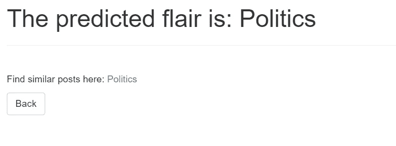

# 使用机器学习预测 Reddit Flairs 并使用 Heroku 部署模型—第 3 部分

> 原文：<https://towardsdatascience.com/predicting-reddit-flairs-using-machine-learning-and-deploying-the-model-using-heroku-part-3-c3cd19374596?source=collection_archive---------61----------------------->


SpaceX 在 [Unsplash](https://unsplash.com?utm_source=medium&utm_medium=referral) 上拍摄的

## [REDDIT 天赋预测系列](https://towardsdatascience.com/tagged/reddit-flair-prediction)

## 创建 web 应用程序并部署机器学习模型

如果你被困在付费墙后面，点击[这里](/predicting-reddit-flairs-using-machine-learning-and-deploying-the-model-using-heroku-part-3-c3cd19374596?source=friends_link&sk=388a869381f067253609f48647a17cd8)获取我的朋友链接并查看这篇文章。

欢迎来到本系列的第 3 部分，我将继续解决 **Reddit Flair 检测问题**。在[第 1 部分](https://medium.com/@prakharrathi25/predicting-reddit-flairs-using-machine-learning-and-deploying-the-model-on-heroku-part-1-574b69098d9a)中，我讨论了问题的背景和数据收集方法，在[第 2 部分](/predicting-reddit-flairs-using-machine-learning-and-deploying-the-model-using-heroku-part-2-d681e397f258)中，我建立了一个机器学习模型来预测相应的 Fla。强烈建议您在开始这一篇之前通读这两篇文章，因为我已经分享了数据收集和模型构建过程背后的见解和推理。如果你已经完成了第一部分和第二部分，是时候恭喜你自己了，我真的为你完成了两个非常乏味的任务感到骄傲。你已经收集、整理、分析和模拟了大量数据，并且还建立了一个 ML 模型。大多数 ML 从业者通常在这里停下来，但是这是我们在第 3 部分中继续学习的地方。

在这一部分中，我们将继续使用我们在上一篇文章中构建的模型，并使用该模型根据 Reddit 帖子在 India subreddit 中的 URL 对任何新条目进行预测。

# 概述

到目前为止，我们已经使用 PRAW 图书馆收集了来自 India Subreddit 的数据。在执行文本分析后，我们尝试了 4 种机器学习模型，并根据性能选择了其中一种。我还在一个管道中转换了模型和数据预处理，以提高执行效率。我将使用逻辑回归，因为它是一个简单的模型，易于部署。这也不会在 Heroku 内部引发任何问题。你可以为此选择你自己的模型。这就是我们如何制作管道和训练模型。

```
model = Pipeline([(‘vect’, CountVectorizer()),
                   (‘tfidf’, TfidfTransformer()),
                   (‘model’, LogisticRegression()),
         ])# Fit Model to the Data
model.fit(X_train, y_train)
```

# 部署

部署过程有几个步骤:-

*   保存模型
*   创建 web 应用程序界面
*   创建烧瓶应用程序
*   把所有的都集中在一起

## 保存模型

一旦您将您的模型保存为变量`model`中的管道，并使其适合训练数据，现在是时候将它保存到一个文件中，以便我们稍后可以加载它以部署到我们的 web 应用程序中。我们使用一种叫做**序列化**的技术来保存我们的模型。简而言之，序列化是一种在磁盘上编写 python 对象的方法，该对象可以传输到任何地方，稍后可以由 python 脚本反序列化(读取)回来。有两种方法可以实现这一点[1]。

1.  **利用** [**腌制**](https://docs.python.org/2/library/pickle.html)


图片由来自 [Pixabay](https://pixabay.com/?utm_source=link-attribution&utm_medium=referral&utm_campaign=image&utm_content=1520638) 的[照片合成](https://pixabay.com/users/PhotoMIX-Company-1546875/?utm_source=link-attribution&utm_medium=referral&utm_campaign=image&utm_content=1520638)

当然，图片是一个笑话，但泡菜图书馆其实真的很受欢迎，超级有用。(有趣的事实:泡菜只是蘸了醋的黄瓜)。总之，Pickle 是 Python 中序列化对象的标准方式。您可以使用 pickle 操作来序列化您的机器学习算法，并将序列化格式保存到文件中。稍后，您可以加载此文件来反序列化您的模型，并使用它来进行新的预测。

使用 pickle 库保存模型

**2。使用**[**Joblib**](https://pypi.python.org/pypi/joblib)**(推荐用于较大型号)**

**Joblib 是 SciPy 生态系统的一部分，它提供了管道化 Python 作业的工具。因此，这就是我在这个项目中使用的。它提供了[实用程序来有效地保存和加载利用 NumPy 数据结构的 Python 对象](https://pythonhosted.org/joblib/generated/joblib.dump.html)。**

**这对于保存大量参数或者有时甚至存储整个数据集的机器学习算法是有用的。对于深度学习模型，我们通常会切换到. h5 文件。**

**使用 joblib 库保存模型**

## **创建 flask 应用程序及其接口。**

**这一步对机器学习从业者来说有些新，这就是为什么我会给出我对大多数步骤的见解。我也会尽量不要用信息轰炸你。这里的可以参考整个代码[。为此，我们将使用 flask。](https://github.com/prakharrathi25/reddit-flair-predictor)**

****注意:-** 这是一条非常重要的注意事项，请务必注意！很多人更喜欢下一步用 python 创建一个虚拟环境。这是因为它有助于通过为不同的项目创建独立的 python 虚拟环境来保持不同项目所需的依赖关系。这是大多数 Python 开发人员使用的最重要的工具之一。然而，对于本教程，我不是创建一个虚拟环境。如果你想创建一个虚拟环境，你可以在这里找到教程。如果您继续进行虚拟环境，那么您将需要的依赖项列表可以在[这里](https://github.com/prakharrathi25/reddit-flair-predictor/blob/master/requirements.txt)找到。确保下载文件并在虚拟环境中运行命令。**

```
pip install -r requirements.txtor pip3 install -r requirements.txt
```

**这个文件对于虚拟 env 和非虚拟 env 用户都是必需的，但是，那些不使用虚拟环境的用户可能已经满足了大部分要求。**

****为什么是烧瓶？【2】****

*   **好用。**
*   **内置的开发服务器和调试器。**
*   **集成单元测试支持。**
*   **RESTful 请求调度。**
*   **大量记录。**

**我们开始吧！您可以在这里访问存储库[。](https://github.com/prakharrathi25/reddit-flair-predictor)**

## **前端**

**让我们从使用 HTML 为用户输入帖子的 URL 的前端开始。我将保持这个相当简单和实用，因为这不是一个前端开发课程。这个页面看起来非常简单。为此你需要三个文件，我已经把它们放在模板库[下面了](https://github.com/prakharrathi25/reddit-flair-predictor/blob/master/templates)。**

1.  ****base.html:** 基础文件**
2.  ****index.html:** 接受输入的启动页面**
3.  ****show.html:** 显示结果的页面**

**我已经使用 Django 模板扩展前端。如果你不知道那是什么，那么你不必担心。这是一个简单的概念，通过类可以更好地理解。我已经定义了一个**基础**文件，它在索引和显示文件中被扩展，这样我就不必一次又一次地编写引导程序和头文件代码。基本文件从存储在名为 [Flask_Bootstrap](https://pypi.org/project/Flask-Bootstrap/) 的 Python 库中的引导基本文件中获取内容。你可以在这里阅读更多关于扩展[的内容](https://tutorial.djangogirls.org/en/template_extending/)。**

**从引导基本文件继承的基本文件**

**默认起始页的索引文件**

**这是输出的样子。我说过，这只是为了我们的效用。你可以自由添加你自己的 CSS。事实上，我对来自任何想为这个页面贡献和添加样式的人的[拉请求](https://github.com/prakharrathi25/reddit-flair-predictor/pulls)持开放态度。**

****

**索引页**

**show.html 网页将按以下方式设计。当我显示弹出的结果时，我会在最后显示输出。你可以把这三个都放在**模板**文件夹中，而任何图像和样式都放在**静态**文件夹中(这是惯例)。**

****接收数据并显示结果的 API****

**下一步是创建一个 API 来接收 URL，然后在预测之后显示结果。所有这些都要通过 GUI 来完成。基本概念是，我们需要创建一个执行以下步骤的接口:-**

1.  **使用表单将 URL 作为索引页面的输入**
2.  **从 Reddit 网站上抓取数据**
3.  **取消模型的序列化**
4.  **使用反序列化的模型对数据进行预测**
5.  **显示输出**

**现在，在一个文件中完成所有这些是可能的，但是，我认为如果有两个不同的文件，这只会使过程更加直观和灵活。当您必须通过单个文件处理多个 POST 请求时，这也很有帮助。我将创建两个文件— `**app.py**`文件，在这里我将通过来自`index.html`文件的 POST 请求从表单中获取数据，在`**inference.py**` 文件中我将反序列化模型并获取预测。我将把预测的类返回到`app.py`文件，并通过`show.html`文件显示结果。有道理，对吧？**

**获取数据并发送输出的 app.py 文件**

**做出预测的推论**

**您可以看到 app.py 文件导入了推理模块并调用了方法`get_flair(text=url).`。我已经将推理文件中的模型反序列化，并将其作为参数与 URL 一起发送给了方法。其他一切都发生在推理文件中。您可能已经注意到，这些是我们在第 1 部分和第 2 部分中遵循的步骤。我们下载并清理数据，然后将其发送到我们的模型，该模型对数据进行矢量化和转换。然后，该模型进行预测并返回预测的类，该类存储在第 6 行的`show.html` 文件选取的`result`变量中。**

**让我们来看看这个应用程序的运行情况。这是到我测试过的帖子的[链接。](https://www.reddit.com/r/india/comments/gtwkls/indian_support_for_george_floyd_while_we_remain/)**

****

**上传链接。**

****

**输出**

**如果这种风格不像[这个](https://www.reddit.com/r/todayilearned/comments/gu54po/til_when_congress_imposed_a_gag_rule_in_1836_to/)那样来自印度 Subreddit，那么我们就用这个。**

****

**不正确的子编辑**

# **结论**

**本文展示了一种部署机器学习模型的非常简单的方法。你可以利用在本博客中获得的知识制作一些很酷的模型，并投入生产。到目前为止，这是一个漫长的旅程，我们已经做了很多事情，如废弃数据、建立模型并最终部署它们。一定很忙。所以，接下来的部分不再有机器学习了。在第 4 部分中，我将讨论如何使用 Heroku 使您的应用程序上线，Heroku 是一个平台即服务(PaaS ),它使开发人员能够完全在云中构建、运行和操作应用程序。您将能够像我在这里 **所做的那样 [**部署您的应用程序。**](https://flair-prediction-app.herokuapp.com/)****

**继续[第 4 部分](https://medium.com/@prakharrathi25/predicting-reddit-flairs-using-machine-learning-and-deploying-the-model-using-heroku-part-4-7d5cb923d3d3?sk=546da054ceb84146643e73e874123e81)！本系列的最后一部分。**

# **参考**

1.  **[https://machine learning mastery . com/save-load-machine-learning-models-python-sci kit-learn/](https://machinelearningmastery.com/save-load-machine-learning-models-python-scikit-learn/)**
2.  **[https://towards data science . com/how-to-easy-deploy-machine-learning-models-using-flask-b 95 af 8 Fe 34d 4](/how-to-easily-deploy-machine-learning-models-using-flask-b95af8fe34d4)**