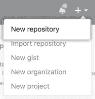
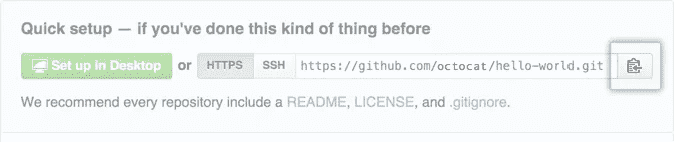

# 使用机器学习预测 Reddit Flairs 并使用 Heroku 部署模型—第 4 部分

> 原文：<https://towardsdatascience.com/predicting-reddit-flairs-using-machine-learning-and-deploying-the-model-using-heroku-part-4-7d5cb923d3d3?source=collection_archive---------86----------------------->


SpaceX 在 [Unsplash](https://unsplash.com?utm_source=medium&utm_medium=referral) 上拍摄的

## [Reddit 天赋预测系列](https://towardsdatascience.com/tagged/reddit-flair-prediction)

## 在 Heroku 上部署应用程序

如果你被困在付费墙后面，点击[这里](https://medium.com/@prakharrathi25/predicting-reddit-flairs-using-machine-learning-and-deploying-the-model-using-heroku-part-4-7d5cb923d3d3?sk=546da054ceb84146643e73e874123e81)获取我的朋友链接并查看这篇文章。

我真的为你骄傲！你已经完成了前面所有的部分，它们真的很重。恭喜你走到这一步。您已经收集了自己的数据，对其建模，对其进行预测，并且您还使用 web 应用程序在**部分** [**1**](/predicting-reddit-flairs-using-machine-learning-and-deploying-the-model-on-heroku-part-1-574b69098d9a) **、** [**2**](/predicting-reddit-flairs-using-machine-learning-and-deploying-the-model-using-heroku-part-2-d681e397f258) 和 [**3**](/predicting-reddit-flairs-using-machine-learning-and-deploying-the-model-using-heroku-part-3-c3cd19374596) **中部署了模型。经过这么多努力，我认为你的模型值得让全世界看到。Heroku 会帮你的。**

# 背景

Heroku 是一个平台即服务(PaaS ),支持开发者完全在云中构建、运行和操作应用。你可以很容易地从一个想法到获得应用程序自己的 URL，而不用担心基础设施的细节。基本上，你可以毫不费力地获得一个应用网站。让我们开始吧。

# 部署

这是一个循序渐进的教程，我会带你走过这一切。从设置帐户到部署应用程序。所以，跟着走。

## 1.设立一个账户

第一步是建立一个 Heroku 帐号，这样你就可以访问他们的基础设施和 GUI。在线使用 Heroku 客户端也是部署应用程序的一种简单和交互式的方式，但我们是程序员，所以我们将使用终端，因为它更灵活，老实说，更酷！

您可以通过此[链接](https://signup.heroku.com/)设置您的帐户。填写完所有个人信息后，将您的主要开发语言设置为 **Python。**不要担心，这不是本质上的限制，你以后也可以用其他语言和框架部署应用程序。一旦您填写了这些详细信息，您将收到一封电子邮件来设置您的密码。


Heroku 注册页面

## 2.下载 Heroku 命令行界面(CLI)

Heroku 命令行界面(CLI)使得直接从终端创建和管理 Heroku 应用程序变得简单。这是使用 Heroku 的重要部分。

注意:Heroku CLI 需要 **Git** ，流行的版本控制系统。所以，如果你没有安装 git，先做[那个](https://git-scm.com/book/en/v2/Getting-Started-Installing-Git)。我在我的 Linux 终端上使用了 Heroku。如果你使用的是 MacOS，那么命令几乎是相似的。对于 Windows，您必须下载并安装将与您的 PowerShell 无缝集成的应用程序。同样，它将与您的 Linux 或 Mac shells 集成。确保您的 PowerShell 以管理员权限运行。

一旦外壳被打开，我们需要鉴定 Heroku。

```
$ heroku login
```

这会将您重定向到一个新的浏览器窗口，您可以在其中登录并添加您的详细信息(如果需要)。


登录窗口

## 3.创建并初始化 git 存储库

这是一项非常关键的任务，因为 Heroku CLI 从 GitHub 或本地 git 存储库中获取变更。如果您已经创建了一个初始化的 git 存储库，那么您可以跳过这一部分，直接从

步骤 1:进入项目目录。我的目录名为 reddit-flair-predictor，保存在我的 Dekstop 上。

```
$ cd Desktop\reddit-flair-predictor
```

步骤 2: [在 GitHub 上创建一个新的存储库](https://help.github.com/en/articles/creating-a-new-repository)。为了避免错误，不要用*自述文件*、许可证或`gitignore`文件初始化新的存储库。您可以在您的项目被推送到 GitHub 后添加这些文件。



步骤 3:将本地目录初始化为 Git 存储库。

```
$ git init
```

步骤 4:将文件添加到新的本地存储库中，并第一次提交到存储库中。

```
$ git add . 
$ git commit -m "My First Commit"
```

步骤 5:在 GitHub 存储库的快速设置页面顶部，点击复制远程存储库 URL。一旦复制完毕，添加远程存储库的[URL](https://help.github.com/en/articles/adding-a-remote)，您的本地存储库将被推送至该存储库。



复制存储库 URL

```
$ git remote add origin *remote repository URL*# Verify the new remote URL 
$ git remote -v
```

步骤 6:将更改推送到 GitHub

```
$ git push origin master
```

## 4.创建和设置虚拟环境[可选]

在第 3 部分中，我已经讨论了使用虚拟环境的一些优点和缺点，现在我就不再赘述了。你可以在这里阅读虚拟环境设置。如果您决定使用虚拟环境，那么建议您也安装[这个文件](https://github.com/prakharrathi25/reddit-flair-predictor/blob/master/requirements.txt)，它包含项目的依赖列表。

## 5.安装依赖项


这个项目需要的一个新库是 [Gunicorn](https://gunicorn.org/) 。它是一个 Python Web 服务器网关接口 HTTP 服务器，广泛兼容各种 Web 框架，实现简单，占用服务器资源少，速度相当快。

```
$ pip install gunicorn
```

下一步是创建一个 [Procfile](https://github.com/prakharrathi25/reddit-flair-predictor/blob/master/Procfile) 。Heroku 应用程序包括一个 **Procfile** ，它指定了应用程序在启动时执行的命令。请注意，Procfile 始终是一个简单的文本文件，名为`Procfile` *，没有文件扩展名*。比如`Procfile.txt`是**不是**有效。Procfile 包含以下代码行。

```
web: gunicorn app:app — log-file=-
```

## 6.创建 Heroku 应用程序

第一步是设置您的[构建包](https://devcenter.heroku.com/articles/buildpacks)。Buildpacks 负责将部署的代码转换成 slug，然后可以在 dyno 上执行。构建包由一组脚本组成，根据编程语言的不同，脚本将检索依赖项、输出生成的资产或编译的代码，等等。

```
$ heroku buildpacks:set heroku/python 
```

这有可能导致错误。在这种情况下，您可以在应用程序创建期间设置 buildpack。

一旦构建包设置好了，我们就可以用应用名`reddit-flair-app.`来创建我们的应用了，这个名字有可能不可用，所以你必须调整它，无论你喜欢什么。

```
$ heroku create reddit-flair-app
```

如果以前不工作，您也可以在创建应用程序的过程中设置构建包。

```
$ heroku create reddit-flair-app --buildpack heroku/python
```

一旦创建命令运行，您将能够看到 2 个 URL。第一个 URL 显示应用程序可用的链接，而第二个 URL 是远程 git 存储库 URL；默认情况下，`heroku create`命令会自动添加一个名为“heroku”的 git 遥控器，指向这个 URL。这是一个 git 端点，我们也可以在这里推送我们的代码。

```
**https://****reddit-flair-app****.herokuapp.com/** | 
**https://git.heroku.com/****reddit-flair-app****.git**
```

当你点击链接时，你会看到这个窗口。这意味着应用程序已成功创建，占位符应用程序正在显示。


应用程序创建成功

我们需要将我们的代码从本地 git 存储库推到 heroku 存储库，以显示 web 应用程序。要确认您正在推送正确的 repo，请运行以下命令。

```
$ git remote -v 
```

如果它显示以下内容，则意味着您的遥控器设置正确，这意味着代码将被推送到 heroku repo。

```
heroku  https://git.heroku.com/reddit-flair-app.git (fetch)
heroku  https://git.heroku.com/reddit-flair-app.git (push)
```

如果没有显示，您可以使用此命令更换遥控器。

```
$ heroku git:remote -a reddit-flair-app
```

最后，将代码推送到 Heroku 存储库，让它在线显示，并等待一段时间。

```
$ git push heroku master 
```

最后一步是给你的应用分配一个 [dyno](https://www.heroku.com/dynos) 。Dynos 是为任何 Heroku 应用程序提供动力的构建模块，用外行人的话来说就是充当应用程序的服务器。

```
$ heroku ps:scale web=1
```

您可以单击您的 URL，也可以从 CLI 打开您的应用程序。

```
$ heroku open
```

由于免费的 dynos 是有限的，你也可以关闭你的应用程序。

```
$ heroku ps:scale web=0
```

这就把我带到了本系列教程的结尾。如果你坚持到最后真的很棒，如果这是一次很好的学习经历，因为这对我来说肯定是一次很好的经历。

# 参考

1.  [https://help . github . com/en/github/importing-your-projects-to-github/add-an-existing-a-project-to-github-using-the-command-line](https://help.github.com/en/github/importing-your-projects-to-github/adding-an-existing-project-to-github-using-the-command-line)