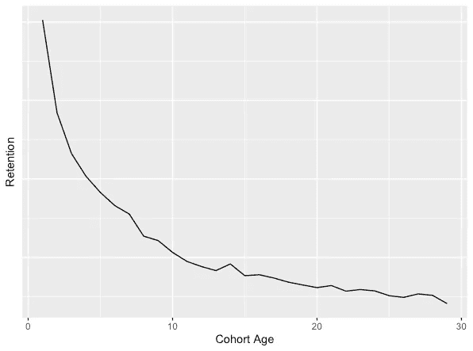
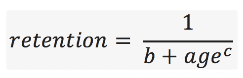
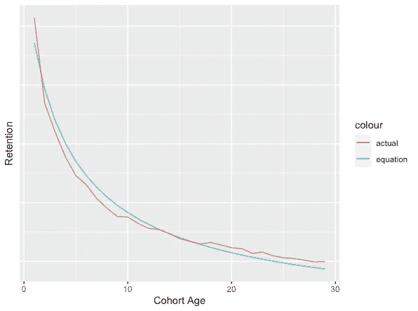
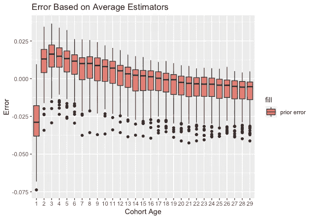
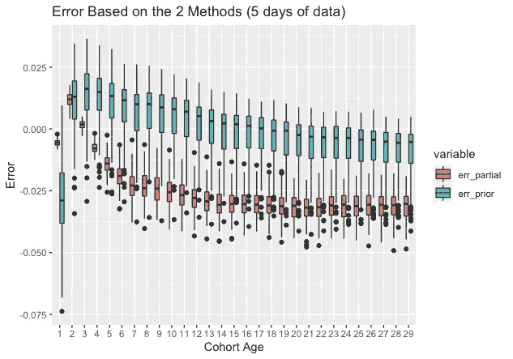
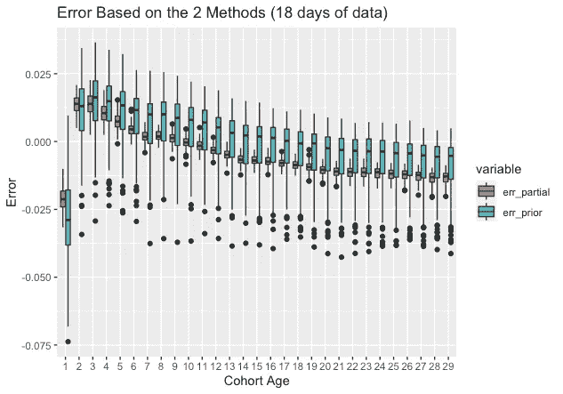
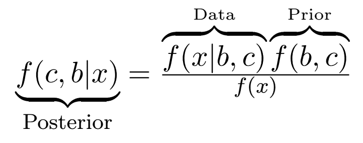
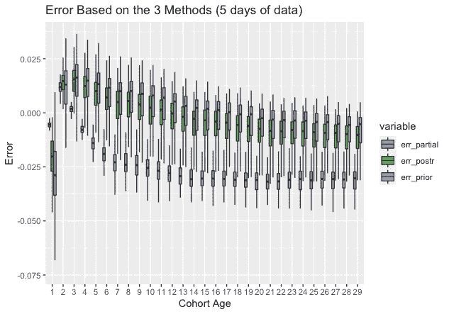
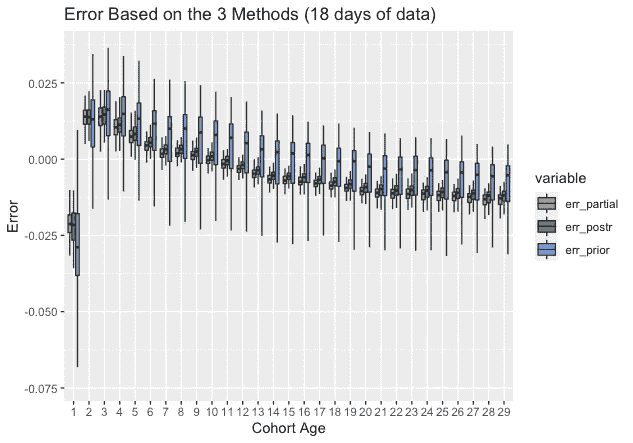

# 用 MCMC 方法预测保留曲线

> 原文：<https://towardsdatascience.com/predicting-retention-curve-with-mcmc-method-311b36a3cf5b?source=collection_archive---------19----------------------->

## 贝叶斯方法预测给定群组的保留曲线，以估计未来的回报率

[赫苏斯·罗查](https://unsplash.com/@jjrocha?utm_source=medium&utm_medium=referral)在 [Unsplash](https://unsplash.com?utm_source=medium&utm_medium=referral) 上拍摄的照片

嘿伙计们，

今天，我将介绍我最近开发的一个解决方案，用于预测给定群组的保留曲线。

# 定义

总的来说，留存是一个衡量你给应用带来的用户粘性的指标。例如，7 天后的高保留率表明你为应用程序带来的用户会停留很长一段时间，从而给你一个他们是优质用户的指示。

保留曲线看起来像这样:

保留曲线

因此，正如我们所料，它从一个非常高的位置开始，在一个群体的早期，用户倾向于坚持更多。我们看到保留曲线的指数衰减，这也高度表征了应用程序中用户的行为。

我们在这篇文章中的目的是**预测给定群组**的精确曲线，以估计这些用户对应用程序的忠诚度，我们预测这个给定群组会有多少活跃用户，等等。

# **预测保留率的 3 种方法**

因此，在理解了保持意味着什么之后，我们可以继续思考手头问题的可能解决方案。

1.  **平均保留曲线** 这个解决方案可能是最直观的。我们只是选取许多群组，观察他们的行为，然后对他们的行为进行平均，形成平均保留曲线。有了这条保持曲线，我们将通过假设新的群组接近平均行为来估计它们。
2.  **仅基于现有数据拟合曲线** 通过这种方法，我们将收集给定群组的相关信息，即我们已经拥有的其保留曲线的现有点(例如，对于 5 岁的群组，我们已经可以使用该群组保留曲线的前 4 天来估计其完整的 30 天保留曲线)，并尝试基于观察到的数据拟合曲线。
3.  **同时考虑 1 和 2 的 MCMC 方法** 当我们可以从两种方法中获益时，为什么只使用一种方法？在这种贝叶斯方法中，我们使用队列曲线上的先验知识，以及迄今为止我们获得的实际数据。

我们将在整篇文章中介绍这三种方法，并对它们进行比较，以获得估计保留曲线的最佳方法。

# 制定保留曲线

我们旅程的下一步是以参数的方式制定保留曲线。

正如我们已经讨论过的，保留曲线类似于指数衰减。由于这个原因，我们可以用公式表示这条曲线:

保留曲线公式

这个方程中我们有两个参数: **b(截距)和 c(斜率)。** 我们可以看到，当使用这种估计来描述我们之前看到的保留曲线的行为时，我们可以很好地描述保留曲线:

实际行为与公式化行为

因此，我们在上面建议的 3 种方法中的目的是估计参数 b 和 c，以便使曲线尽可能接近。

# 方法评价和比较

**方法 1:平均保留曲线** 在这一节中，我们将寻求找到我们的保留曲线的平均行为。
正如我们在上一节中看到的，由于曲线可以用参数方式定义，我们可以找到我们群组分布的平均值 b 和 c。这些平均值将作为平均保留曲线。

平均保留曲线性能

正如我们从上面的图中看到的，平均曲线显示了不错的结果，平均误差接近 0，误差条在实际保留曲线的+-2.5%左右徘徊。

**方法 2:平均保留曲线**

对于这一部分，我们将展示的性能实际上取决于我们实际拥有的数据量。从逻辑上讲，我们拥有的数据越多，我们就越准确。
例如，基于 5 天的数据，我们得到相当糟糕的结果:

我们看到，与方法 1 相比，我们不再处于 0%误差线上，因为我们看到向下移动。然而，标准偏差确实降低了。这是由于我们对每个群体的个人待遇。

另一方面，如果我们等待更多的数据，我们可以获得比方法 1 好得多的结果。例如，以下是基于 18 天而非 5 天数据的结果:

哇！这是一个很大的进步。与方法 1 相比，我们实现了非常低的误差和低得多的可变性。

最后两张图可以作为第三种方法的介绍。
我们已经看到，在不同的情况下，我们从两种方法中获得了优势。
当缺乏数据时，我们可能更喜欢坚持平均曲线，但当我们有足够多的数据时，我们将不再需要平均行为，因为我们已经可以依赖我们从特定群体中看到的。

这种思维方式完全符合方法 3 中的贝叶斯方法。
在贝叶斯方法中，我们将有一个**先验**(在这种情况下，将由平均保留曲线参数表示)、一个**似然函数**(将由我们到目前为止看到的实际数据表示)，从这两个部分，我们将形成一个**后验、**，它将包含从两个部分收集的信息并形成一个统一的度量。

由于我们没有归一化常数，我们将使用 **MCMC** 算法来克服这个障碍。

**方法 3:基于 MCMC 的保留曲线** 使用所解释的方法，我们将在 5 天的数据后获得这些结果:

我们可以看到，当证据不足时，新的(绿色)方法停留在先前的数据上。实际数据有一定的权重，但它并没有对基于后验的模型产生很大影响。

现在，基于 18 天的数据:

我们现在看到后验是如何向实际数据转移的，而把先验知识留在后面。

# 摘要

我们通过三种方法来估计保留曲线。
一种是基于平均行为，一种是基于实际数据，表现最好的是 MCMC 方法，它同时考虑了实际数据和先前数据。

我希望这些信息对你有用，也能帮助你形成公司的保留曲线！