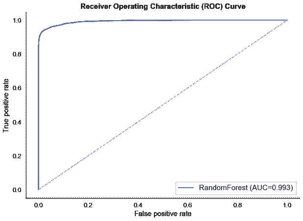

# 用分类预测航空旅客的满意度

> 原文：<https://towardsdatascience.com/predicting-satisfaction-of-airline-passengers-with-classification-76f1516e1d16?source=collection_archive---------6----------------------->

## 案例研究与 KNN，逻辑回归，高斯 NB，决策树和随机森林。

照片由[马塞尔](https://unsplash.com/@freetousesoundscom)在 [Unsplash](https://unsplash.com/) 上拍摄

这是一个分类监督的机器学习项目，作为 Metis 数据科学训练营(新加坡)项目 3 的一部分完成。在大约 3 周的时间里，我们的讲师带我们经历了一次关于 SQL、AWS、各种分类技术以及如何在 Flask 应用程序上部署我们的机器学习模型的旋风式旅行。在这篇博客中，让我带你浏览我根据飞行调查数据建立的模型，并展示它可能创造的商业价值。

# 1.背景

由于大多数国际航空旅行已经停飞，世界各地的航空公司业务受到新冠肺炎的重创。受打击最大的可能是新加坡航空公司，该公司在其岛国运营零国内航班。事实上，泰国航空公司等一些航空公司已经申请破产。尽管如此，一旦风暴结束，随着人们纷纷返回海外度假，预计航空旅行的需求将会激增。当人群最终到来时，航空公司可以准备什么来给自己带来竞争优势？为了回答这个业务问题，根据 Kaggle 的[航班满意度调查数据](https://www.kaggle.com/teejmahal20/airline-passenger-satisfaction)创建了一个分类模型，以确定导致客户满意度的关键因素。

# 2.数据准备

原始数据集包含来自一家美国航空公司的大约 130，000 个调查条目和乘客/航班详细信息。总共有 21 个特征列和 1 个二元目标列。在所有功能中，有 14 个是调查条目，乘客在 1 到 5 的范围内对飞行体验进行评分。但也有一些调查条目的分值为 0，我推断是未填写的调查问题。在移除这些调查条目和一些 NaN 值之后，用于模型构建的结果数据集具有大约 70，000 个条目。此外，为了更加清晰，一些列和其他条目已被重命名。最后，我得到了如下所示的清理后的数据集:

数据清理后用于建模的数据集。

# 3.EDA 和特征选择

目标等级相当均衡，56.4%的乘客表示中立/不满意(负面等级:0)，43.6%的乘客表示满意(正面等级:1)。负面类别中的大量条目并不令人惊讶，因为“中性/不满意”并不一定意味着不满意。还包括对飞行体验漠不关心的乘客。

当我根据客户类型进一步细分满意度类别时，我们看到首次客户的满意度较低。此外，当我按旅游类型划分满意度等级时，观察到个人(度假)旅游的顾客满意度明显较低。在这两种情况下，对体验的更高期望可能是满意度下降的原因之一。

目标类的探索性数据分析。

接下来是特征选择，我的目标是去除那些无助于建立预测模型的特征。这些要素包括对区分目标类没有贡献的要素以及高度相关的要素，这可能会导致多重共线性问题。我希望尽可能保留包含调查条目的功能，这样我就可以确定航班满意度的各个方面。为此，我应用核密度估计(KDE)图，相关热图和套索回归进行特征选择。

按目标类别划分的要素的核密度估计(KDE)图(满意:1，中性/不满意:0)

相关热图。最左边的列显示了特征和目标之间的相关性。

套索回归图。更快降至零的系数表示特征重要性较低。

*   **KDE 图**:特征‘登机口位置’似乎包含缺失的分数‘2’和‘4’，表明异常，因为乘客不可能没有输入这些分数。在特征“性别”上，两者的满意度分布大致相同，表明其与目标相关性差，因此被移除。
*   **相关性热图:**特征‘年龄’、‘出发/到达时间便利性’、‘登机口位置’和‘总延误’与目标具有 0.15 及以下的低相关性。
*   **套索回归图:**最不重要的特征具有线性系数，当阿尔法超参数增加时，线性系数最早减少到零。从图中，我发现这些特征是“食物和饮料”、“在线预订的便利性”、“年龄”、“飞行距离”、“总延迟”和“登机口位置”

经过仔细考虑，我决定去掉“性别”、“年龄”、“登机口位置”、“总延误”、“飞行距离”和“出发/到达时间便利性”这些特征。最后，我们只剩下包含大多数调查类别和客户/类别类型的 15 个功能。

# 4.型号选择

在我确定哪个分类模型对数据集最有预测性之前，我将数据分成 80%用于 5 重交叉验证，20%作为测试集用于所选模型的最终评估。然后，我对各种分类模型进行 5 重交叉验证，以确定它们的最佳超参数。

将数据集分为测试集(20%)和训练-验证集(80%)

因此，在 Scikit-Learn 上运行 GridSearchCV 算法，模型及其最佳超参数为:

*   k-最近邻(k=7)
*   逻辑回归(C=0.04)
*   决策树(最大深度=12)
*   随机森林(最大深度=17)

此外，我还在交叉验证过程中使用了高斯朴素贝叶斯和集成方法(通过投票选择所有模型)。在对所有考虑的模型进行 AUC、精度和召回率评分时，随机森林模型被确定为表现最佳，AUC 为 0.99，精度为 0.97，召回率为 0.94。

所有分类模型交叉验证的平均分数。

接下来，让我们了解一些评分标准的含义，这将使我们能够确定哪个评分标准与我们的业务问题最相关。

*   **召回:**模型正确预测的阳性类别数与实际阳性类别总数的比值。例如，这一指标对于预测患者癌症的模型非常重要，因为捕捉尽可能多的阳性病例至关重要。
*   **精度:**模型正确预测的阳性类别数与预测的阳性类别总数之比。例如，该指标与垃圾邮件过滤器模型相关，因为只捕获实际的垃圾邮件案例并减少误报数量至关重要。

在这种范式下，拥有高精度对于我们的业务问题将更加重要。为了正确识别导致客户满意的关键因素，正类“满意”的模型预测需要非常可靠。

由于概率阈值的调整带来了查准率和查全率的权衡，我进一步使用随机森林模型做了一个简单的验证来决定最佳的概率阈值。

简单验证:在训练集上重新训练随机森林(60%)，并对验证进行评分(20%)

不同阈值随机森林的精度和召回分数

随机森林的默认概率阈值是 0.5。在调优到 0.7 之后，精度从 0.97 提高到 0.99，而在召回率上没有巨大的牺牲。由于这符合我们的模型目标，我选择我们的最终模型为随机森林(最大深度=17 ),概率阈值为 0.7。

# 5.模型评估

最后，我在 80%的数据集(训练集+验证集)上重新训练选择的模型，然后在剩下的 20%的数据集(测试集)上评估预测。模型性能的最终评估给出的 AUC 为 0.993，召回率为 91.2%，准确率为 99.1%。

测试集上随机森林模型最终评价的 ROC 曲线。

对模型最终评价的混淆矩阵，显示召回率为 91.2%，准确率为 99.1%。

测试集上的模型预测示例。

99.1%的精度意味着当模型预测到乘客满意时，**模型确信预测是 99.1%准确和真实的**。让我们看看如何将这种高精度应用于商业问题。

# 6.商业问题

如前面的探索性数据分析所示，首次客户有更高的期望，因此不太可能满意。然而，获得首次客户的满意度是很重要的，因为这可以确保他们更有可能回到航空公司旅行。使用该模型，我们可以探索导致初次顾客满意的重要因素。

*   **乘坐经济舱的个人旅行** —首次顾客

经济舱个人旅行首次顾客满意度的样本模拟。

对于个人旅行的经济舱客户，当我开始将所有类别设置为平均评级(评级:3)时，模型不确定客户是否会满意。然而，如果我将机上 Wifi 服务评级提高到优秀(评级:5)，其余类别表现一般，**该模型确定客户将会满意**。有趣的是，如果我降低机上 Wi-Fi 服务等级，同时将其余类别设置为优秀等级，该模型仍然不确定客户是否会满意。

*   **乘坐商务舱进行商务旅行** —首次客户

商务舱商务旅行首次客户满意度模拟示例。

对于商务旅行的商务客户，该模型预测他们将更容易满足。由于机上 Wi-Fi 服务评级较低，而其余类别被设置为优秀评级，该模型肯定会让商务客户满意。但是，当我继续降低其余类别的评分时，只有当我至少将在线预订的易用性评分设置为优秀(评分:5)时，模型才能确定客户会满意

为了试验和预测对其他评级排列的满意度，我还在 Heroku 上创建了一个 [Flask 应用程序](https://flight-satisfaction-prediction.herokuapp.com/)，供潜在的航空公司高管探索这种模式。然而，在应用程序中，为了更简单的理解，我将模型概率阈值降低到了 0.5。

# 7.结论

我为航空公司创建了一个高度精确的分类模型，以确定提高乘客满意度的关键瓶颈。根据一些模拟，我建议航空公司应该专注于改善飞行中的无线网络服务体验。例如，航空公司可以开发更好的软件，以便更容易地访问机上 wi-fi，或者降低访问机上 wi-fi 的成本，以便更多的经济舱客户可以享受服务。此外，航空公司还应该关注**在线预订**的便捷性，因为**商务旅客优先考虑他们旅行中的便捷性。**

最后，希望该模型能为航空公司提供参考，并发挥商业价值。也就是说，我期待 Metis 数据科学训练营的项目 4，在该项目中，我们将致力于聚类、自然语言处理(NLP)和推荐系统。我将很快再次分享，敬请期待！

这里是到我的 GitHub 的链接，它包含了这个项目的所有代码和演示幻灯片。

你觉得我的模型怎么样？通过我的 LinkedIn[联系我或者在下面评论来讨论！](https://www.linkedin.com/in/tanpengshi/)

*附:如果你有兴趣了解* ***逻辑回归、决策树*** *或* ***随机森林*** *如何运作，我鼓励你看看我下面的一些文章:*

 [## 从零开始的决策树和随机森林

### 对决策树和随机森林算法的全面外行介绍

towardsdatascience.com](/decision-tree-and-random-forest-from-scratch-4c12b351fe5e)  [## 从零开始的神经网络:逻辑回归—第 1 部分

### 单层神经网络与裸基础的逻辑回归

medium.com](https://medium.com/mlearning-ai/neural-networks-from-scratch-logistic-regression-part-1-d8cfc4a2fb3b) 

> ***支持我！*** —如果你没有*订阅 Medium，并且喜欢我的内容，请考虑通过我的[推荐链接](https://tanpengshi.medium.com/membership)加入 Medium 来支持我。*

 [## 加入我的介绍链接媒体-谭师鹏阿尔文

### 阅读谭·师鹏·阿尔文(以及媒体上成千上万其他作家)的每一个故事。您的会员费直接…

tanpengshi.medium.com](https://tanpengshi.medium.com/membership)