# 预测员工评论的情绪

> 原文：<https://towardsdatascience.com/predicting-sentiment-of-employee-reviews-ec0c0c837328?source=collection_archive---------33----------------------->

## 对来自 Indeed.com 的员工评论的正面和负面情绪进行分类


奥利维尔·科莱在 [Unsplash](https://unsplash.com?utm_source=medium&utm_medium=referral) 上拍摄的照片

在我之前的文章中，我们学习了如何从 Indeed.com 的[收集](/scraping-the-web-using-beautifulsoup-and-python-5df8e63d9de3)、[流程](/preprocessing-text-data-using-python-576206753c28)、[分析](/nlp-part-3-exploratory-data-analysis-of-text-data-1caa8ab3f79d)员工评价。请随意查看并提供反馈。我很想听听你会如何改进代码。特别是，如何动态地克服网站的 HTML 的变化。

在这篇文章中，我想把我们的数据集进一步解决情感分类问题。具体来说，我们将为每个评论分配情感目标，然后使用二元分类算法来预测这些目标。

我们将导入从 Indeed.com 收集的原始员工评论。我建议你回顾一下我以前的文章[来了解我们是如何获得这个数据集的。](/scraping-the-web-using-beautifulsoup-and-python-5df8e63d9de3)

首先，让我们导入数据集并进行处理。对于此分析，我们只需要“评级”和“评级 _ 描述”列。关于文本预处理更详细的解释，请阅读我的 nlp 预处理文章[。](/preprocessing-text-data-using-python-576206753c28)

```
import pandas as pd
import numpy as np
import matplotlib.pyplot as plt 
import seaborn as sns
import contractions
import random
import fasttext
from autocorrect import spell
from nltk.probability import FreqDist
from nltk.tokenize import word_tokenize
import nltk
from nltk.corpus import stopwords, wordnet
from sklearn.feature_extraction.stop_words import ENGLISH_STOP_WORDS
from nltk.stem import WordNetLemmatizer
from imblearn.over_sampling import SMOTE
from sklearn.model_selection import train_test_split
from sklearn.model_selection import StratifiedKFold
from imblearn.pipeline import make_pipelinefrom sklearn.svm import SVC
from sklearn.linear_model import LogisticRegression
from sklearn.ensemble import GradientBoostingClassifier
from sklearn.ensemble import RandomForestClassifier
from sklearn.neighbors import KNeighborsClassifier
from sklearn.naive_bayes import GaussianNBfrom sklearn.metrics import confusion_matrix
from sklearn.metrics import classification_report
from sklearn.metrics import accuracy_score, precision_score, recall_score, f1_score
from sklearn.metrics import precision_recall_curve
from sklearn.metrics import roc_auc_score
from sklearn.metrics import auc
from sklearn.model_selection import cross_val_score
from sklearn.model_selection import GridSearchCVfrom warnings import simplefilter
simplefilter(action='ignore', category=FutureWarning)
pd.set_option('display.max_colwidth', 200)with open('apple_scrape.csv') as f:
    df = pd.read_csv(f)
f.close()print(df.head())df = df[['rating', 'rating_description']]
```

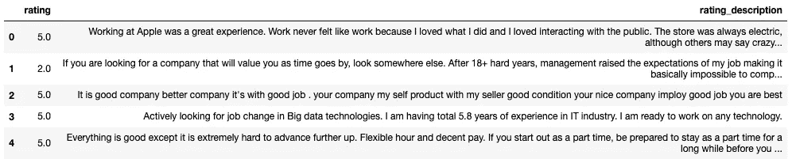

## 消除收缩

```
df['no_contract'] = df['rating_description'].apply(lambda x: [contractions.fix(word) for word in x.split()])
```

## 将单词列表转换为字符串

应用“fix”函数的结果是一个单词列表，我们需要将该列表转换回字符串。

```
df['rating_desc_str'] = [' '.join(map(str, l)) for l in df['no_contract']]
```

## 删除非英语评论

首先，我们将使用“快速文本”库来识别每个评论的语言。使用此[链接](https://fasttext.cc/docs/en/language-identification.html)下载预训练模型。一旦每个评论被标记，我们只需过滤数据框，只包括英文评论。

```
pretrained_model = "lid.176.bin" 
model = fasttext.load_model(pretrained_model)langs = []
for sent in df['rating_desc_str']:
    lang = model.predict(sent)[0]
    langs.append(str(lang)[11:13])df['langs'] = langsdf.head()df = df[df['langs'] == 'en']
```

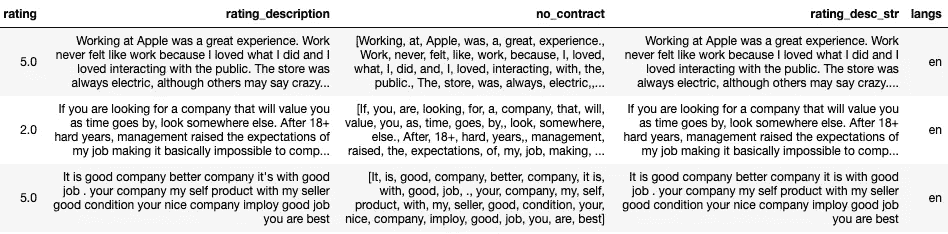

## 符号化

```
df['tokenized'] = df['rating_desc_str'].apply(word_tokenize)
```

## 删除标点符号和特殊字符

```
df['no_punc'] = df['tokenized'].apply(lambda x: [word for word in x if word.isalnum()])
```

## 转换成小写

```
df['lower'] = df['no_punc'].apply(lambda x: [word.lower() for word in x])
```

## 拼写

```
df['spell'] = df['lower'].apply(lambda x: [spell(word) for word in x])
```

## 移除任何数字字符(即整数、浮点数)

```
df['no_num'] = df['spell'].apply(lambda x: [word for word in x if word.isalpha()])
```

## 词汇化

为了将词汇化应用于我们的记号，我们首先需要识别每个单词的词性。接下来，我们需要将从 nltk 获得的标签转换为 wordnet 标签，因为这些是我们的 lemmatizer (WordNetLemmatizer())唯一接受的标签。

```
df['pos_tags'] = df['no_num'].apply(nltk.tag.pos_tag)def get_wordnet_pos(tag):
    if tag.startswith('J'):
        return wordnet.ADJ
    elif tag.startswith('V'):
        return wordnet.VERB
    elif tag.startswith('N'):
        return wordnet.NOUN
    elif tag.startswith('R'):
        return wordnet.ADV
    else:
        return wordnet.NOUNdf['wordnet_pos'] = df['pos_tags'].apply(lambda x: [(word, get_wordnet_pos(pos_tag)) for (word, pos_tag) in x])wnl = WordNetLemmatizer()
df['lemma'] = df['wordnet_pos'].apply(lambda x: [wnl.lemmatize(word, tag) for (word, tag) in x])
```

## 删除停用词

```
stop_words = set(stopwords.words('english'))
df['stop_removed'] = df['lemma'].apply(lambda x: [word for word in x if word not in stop_words])
```

## 删除长度少于 3 个字符的单词

```
def short_words(words):
    return [word for word in words if len(word) > 2]df['length'] = df['stop_removed'].apply(short_words)
```

我们剩下的是一个大的 dataframe，它包含我们执行的每个预处理步骤的一列。我更喜欢以这种方式工作，因为我们可以很容易地看到每一步前后的变化。如果你问我的话，会使数据验证更容易。

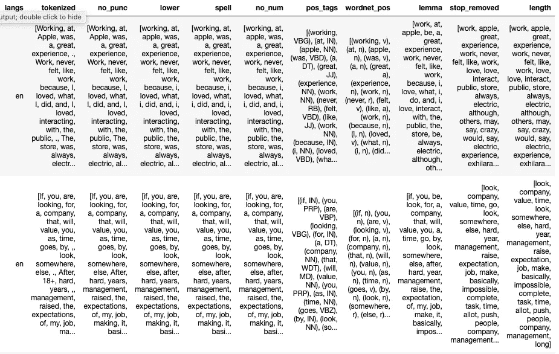

## 决定情绪

我们可以利用像“TextBlob”这样的库。情绪”来计算每个评论的情绪，但由于我们有实际的员工评级，我们可以使用此列来代替。

该员工用 5 分制的李克特量表给公司评分，超过 75%的评分是正面的(即 5 或 4)。此外，5 分制的评分为 3 分(中性)，可以是正面的，也可以是负面的。为简单起见，我们将删除中性评级。介于 1 和 2 之间的评分为负，介于 4 和 5 之间的评分为正。

最后，我们将筛选数据帧，使其只包含训练模型所需的列。

```
def sent(df):
    if df['rating'] <= 2:
        val = 1.0
    elif df['rating'] >= 4:
        val = 0.0
    else:
        val = -1.0
    return valdf['sentiment'] = df.apply(sent, axis=1)df = df.loc[(df['sentiment']==1) | (df['sentiment']==0)]df = df[['rating', 'length', 'sentiment']]
df.head()
```

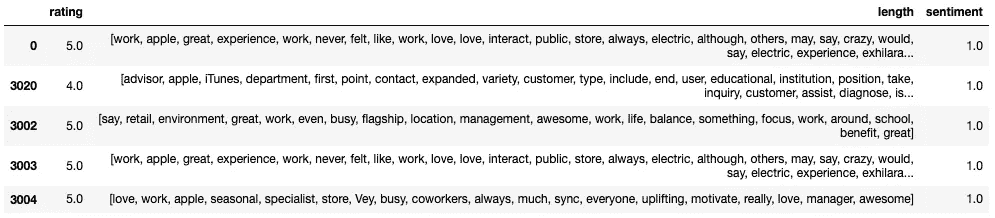

## 将数据可视化

让我们花一点时间，根据每个单词的积极或消极程度(即感悟)。为了完成这项任务，我们需要计算每个独特的单词在积极情感评论和消极情感评论中出现的频率。 最终结果将类似于下面的列表，其中“工作”一词在负面评价中出现了 425 次，在正面评价中出现了 4674 次。

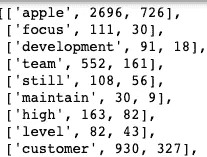

下面是代码将产生的结果

为了计算上面的列表，我们首先按照情绪降序排列评论，并重置索引。接下来，我们可以看到，我们有 3570 个正面和 1039 个负面的情感评论。现在，我们将数据集分为正面和负面评论，然后创建一个由 3570 个 1 和 1039 个 0 组成的数组。

```
df.sort_values(by='sentiment', ascending=False, inplace=True)
df.reset_index(inplace=True, drop=True)df_pos = df[df['sentiment'] == 0.0]
df_neg = df[df['sentiment'] == 1.0]targets = np.append(np.ones(len(df_neg)), np.zeros(len(df_pos)))df['sentiment'].value_counts()
```

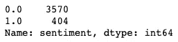

接下来，我们创建一个名为“frequencies”的空字典来存放输出。现在我们迭代 zipped(即。元组)评论和目标数组(3，570 个零和 404 个一)。当我们迭代每个评论中的每个单词时，我们以由单词及其情感组成的元组的形式创建一个对(即。1 或 0)。我们知道有 3，570 个正面评价，因此，只有前 3，570 个评价中的单词将被分配为正面的。剩余的 404 个评论中的所有单词将被指定为负面的。最终结果是单词和情感的元组键的字典，以及作为值的正面和负面词频。

例如，“工作”这个词在所有正面评价中出现了 425 次。

```
frequencies = {}
for y, words in zip(targets, df['length']):
    for word in words:
        pair = (word, y)
        if pair in frequencies:
            frequencies[pair] += 1
        else:
            frequencies[pair] = 1

print(frequencies)
```

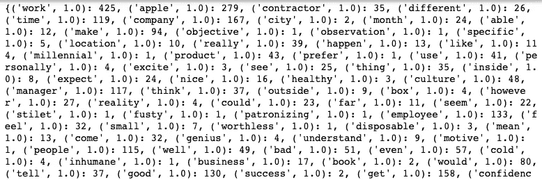

现在，我们需要做的最后一件事是对“频率”字典中的每个单词的正计数和负计数求和。

首先，我们在频率字典键中索引这个单词，创建一个所有单词的列表(存储在“words”中)。接下来，我们初始化 pos_count 和 neg_count 的计数变量。如果元组关键字“单词 1.0”出现在频率字典中(即 work '，1.0)然后我们索引该关键字的值，“neg_count”变量成为该词在负面评论中出现的次数。出现在正面评论中的单词也是如此。最后，我们将单词、pos_count 和 neg_count 添加到“数据”列表中。

```
words = [word[0] for word in frequencies]
data = []for word in words:
    pos_count = 0
    neg_count = 0

    if (word, 1) in frequencies:
        neg_count = frequencies[(word,1)]
    if (word, 0) in frequencies:
        pos_count = frequencies[(word, 0)]

    data.append([word, neg_count, pos_count])print(data)
```

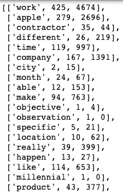

正如你所看到的，如果我们把所有的单词都画出来，情节会变得有点乱，因此，让我们随机选择几个单词。因为有更多积极的评论，所以情节偏向积极的一面。

```
fig, ax = plt.subplots(figsize=(20, 15))x = np.log([x[1] + 1 for x in data])
y = np.log([x[2] + 1 for x in data])ax.scatter(x, y)plt.xlabel('Negative Count')
plt.ylabel('Positive Count')for i in range(0, len(data)): 
    ax.annotate(data[i][0], (x[i], y[i]), fontsize=15)    
ax.plot([0,7], [0,7], color='red')
plt.show()
```

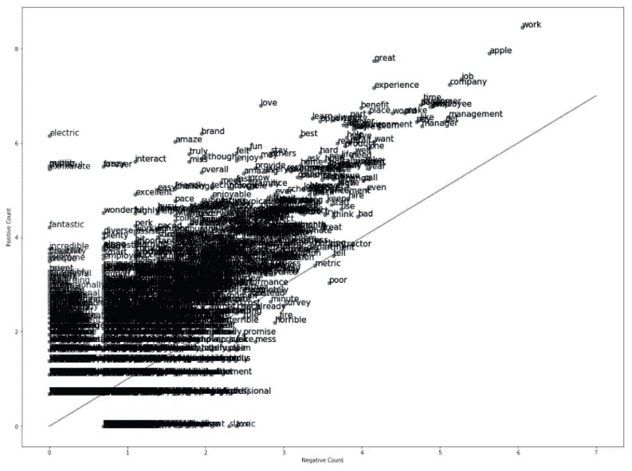

```
fig, ax = plt.subplots(figsize=(20, 15))data_rand = random.sample(data, 50)x = np.log([x[1] + 1 for x in data_rand])
y = np.log([x[2] + 1 for x in data_rand])ax.scatter(x, y)plt.xlabel('Negative Count')
plt.ylabel('Positive Count')for i in range(0, len(data_rand)): 
    ax.annotate(data_rand[i][0], (x[i], y[i]), fontsize=15)    
ax.plot([0,7], [0,7], color='red')
plt.show()
```

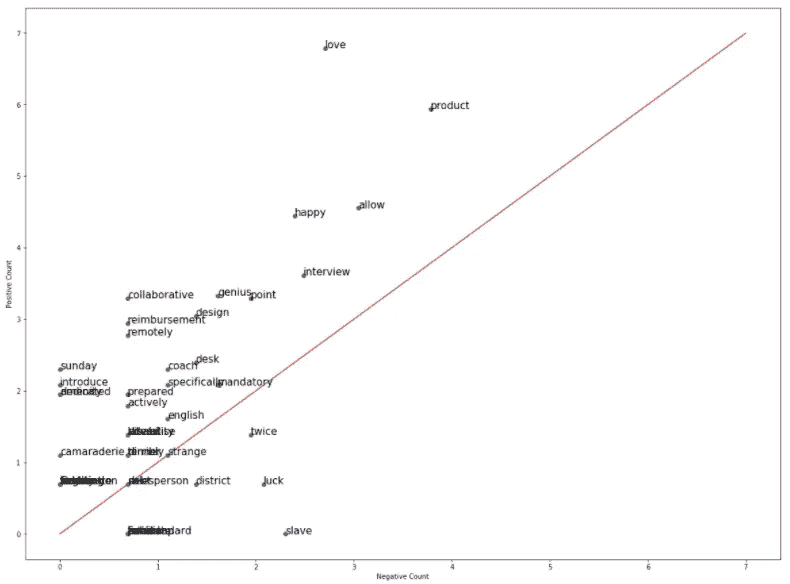

## 特征抽出

我们将创建一个只有两个特征的矢量化特征集，而不是走一步到位的编码或计数矢量化路线，这将创建一个巨大的稀疏矩阵，(想要可视化一个稀疏矩阵[看看这个](/visualizing-a-sparse-matrix-1c4c807ea6c9))。 ***第一个特征将是来自“频率”字典的所有负频率的总和，用于评论中的每个唯一单词。第二个特征将是来自“频率”字典的所有频率的总和，用于评论中的每个独特的正面词。***

比如看第一个特征(即。负数总计)，让我们假设我们有一个包含以下单词的评论['工作'，'苹果'，'承包商']。查看之前计算的“频率”字典，该评论的特征 1 值将是 739 或(425+279+35=739)。

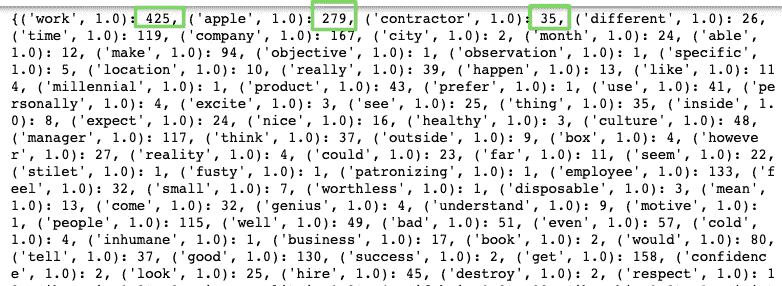

首先，我们创建一个备用的 1x2 numpy 阵列。在评论中循环每个单词，如果(word，1)(即。work '，1)作为一个关键字出现在频率字典中，我们将对其值进行索引。该值被赋给“x”数组中的第一列。如果这个单词不存在，那么“x”数组中的第一列将被赋一个零。然后 for 循环查看是否相同的单词但是具有积极的情绪(即 apple '，0)出现在频率字典中。如果是这样，索引值被分配给“x”数组中的第二列。当 for 循环完成其第一次迭代时，它将 x[0，0]和 x[0，1]值赋给“X”数组中相应列的第一行。

我们可以在下面的结果数据框中看到，第一篇评论中的负面词汇总数为 6790 个，正面词汇总数为 54693 个。

```
def features(review, frequencies):
    x = np.zeros((1,2))

    for word in review:
        if (word, 1) in frequencies:
            x[0,0] += frequencies.get((word, 1.0),0)
        if (word, 0) in frequencies:
            x[0,1] += frequencies.get((word, 0.0),0)
    assert(x.shape == (1, 2))
    return xX = np.zeros((len(df), 2))for i in range(len(df['length'])):
    X[i, :] = features(df['length'][i], frequencies)X_df = pd.DataFrame(X, columns=['neg_count', 'pos_count'])
reviews_df = pd.concat([X_df, df['sentiment']], axis=1)print(reviews_df.head())
```

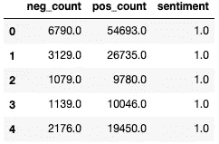

## 列车测试分离

```
X_train, X_test, y_train, y_test = train_test_split(
    reviews_df.drop('sentiment', axis=1),
    reviews_df['sentiment'], 
    test_size=0.25)
```

## 分类器评估

我们将评估六种分类器，逻辑回归、随机森林、KNN、朴素贝叶斯、支持向量分类器和梯度推进分类器。我们肯定希望我们的模型有利于对负面评论(真正的正面评论)的准确预测，因为这些评论给了我们对组织问题的洞察力。也就是说，我们不想要一个过于“挑剔”的模型，它只会预测一个负面评论是负面的，如果它是绝对确定的。我们最终想要一个更平衡的模型，它有利于准确的负面评论预测(真正的正面)，但也能很好地正确分类正面评论。因此，从度量的角度来看，我们需要高召回率来正确预测尽可能多的真实负面评论，但也需要良好的精确度来最小化错误的负面评论。此外，高 AUC 分数将指示该模型具有正确分类正面和负面评论的高概率。

为了获得更准确的模型评估并避免过度拟合，我们将使用分层 K-Fold 交叉验证。这样，每个模型将在来自我们原始训练数据的训练和测试数据的不同分割上被评估 k 次。将在每个折叠处计算指标，并对所有折叠进行总体平均。我们将比较每一层的平均训练和测试指标，以确定哪个分类器可能过拟合。此外，由于训练数据中存在少数类的类不平衡，我们将在每个折叠处使用 SMOTE 技术来过采样和平衡目标。让我们看看我们的分类器表现如何。

不幸的是，兰登森林和 KNN 严重过度拟合数据。朴素贝叶斯和 SVC 具有很高的测试召回率，但模型的精度很低，导致了很高的假阴性率。最后，逻辑回归和梯度推进分类器具有非常相似的分数，但是后者具有稍高的精度和 AUC。这似乎是一个稍微平衡的模型。

```
models = []
models.append(('log_reg', LogisticRegression(max_iter=10000, random_state=42)))
models.append(('rf_classifer', RandomForestClassifier(random_state=42)))
models.append(('knn', KNeighborsClassifier()))
models.append(('bayes', GaussianNB()))
models.append(('svc', SVC()))
models.append(('gbc', GradientBoostingClassifier()))scoring = {'accuracy': 'accuracy',
           'precision': 'precision',
           'recall': 'recall',
           'f1_score' : 'f1',
            'auc': 'roc_auc'}sm = SMOTE(sampling_strategy='auto', k_neighbors=5, random_state=42)
skf = StratifiedKFold(n_splits=10)for name, classifier in models:
    pipeline = make_pipeline(sm, classifier)
    scores = cross_validate(pipeline, X_train, y_train, cv=skf, scoring=scoring, return_train_score=True)    
    for score in list(scores)[2:]:
        print('{} Avg CV Recall {} is {} | std is (+/- {})'.format(name, score[:-6], 
            np.mean(scores[score]).round(3), 
            np.std(scores[score]).round(3)))
```

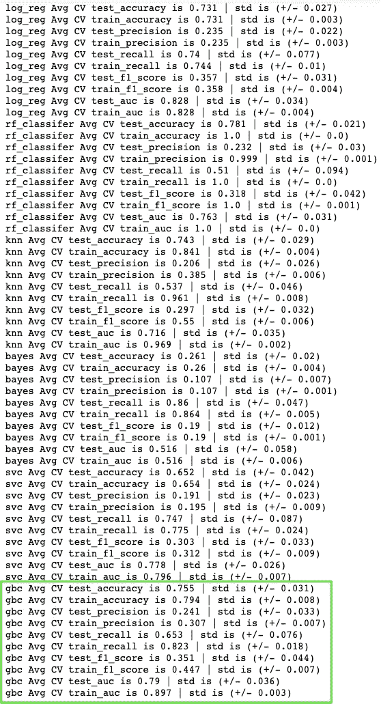

## 超参数调谐

梯度推进分类器有很大范围的超参数，我们可以调整。通常，n _ 估计量(即树的数量)、最大深度和学习速率被认为是最重要的参数。我们将检查学习率、n 估计量、最大深度、最小样本分裂和最小样本叶。

请记住，这些超参数范围是多次迭代的结果。我们将从大范围开始(即范围(10，1000，100)并缩小到更具体的范围(即。800，1000，1)基于获得的分数。它似乎是 0.01 的学习率和 n _ 估计量(即 959 的树数)是最好的。

```
learning_rate = [0.3,0.2,0.15,0.1,0.05,0.01]
n_estimators = range(20,1000,1)param_grid = dict(gradientboostingclassifier__learning_rate=learning_rate,
                 gradientboostingclassifier__n_estimators=n_estimators)gbc = GradientBoostingClassifier(random_state=42)
skf = StratifiedKFold(n_splits=10)
sm = SMOTE(sampling_strategy='auto', k_neighbors=5, random_state=42)
pipeline = make_pipeline(sm, gbc)grid = GridSearchCV(pipeline, 
                    param_grid=param_grid, 
                    scoring='roc_auc', 
                    verbose=1, 
                    n_jobs=-1, 
                    cv=skf,
                    return_train_score=True
                   )
grid_results = grid.fit(X_train, y_train)print('Best Score: ', grid_results.best_score_)
print('Best Params: ', grid_results.best_params_)
```

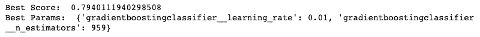

```
scores = grid_results.cv_results_['mean_test_score'].reshape(len(learning_rate),len(n_estimators))plt.figure(figsize=(30, 15))
plt.pcolor(scores, cmap='coolwarm', alpha=0.7)
plt.xlabel('n_estimators')
plt.ylabel('learning_rate')
plt.colorbar()
plt.xticks(np.arange(len(n_estimators)), n_estimators)
plt.yticks(np.arange(len(learning_rate)), learning_rate)
plt.title('GridSearchCV Test AUC Score')
plt.show()
```

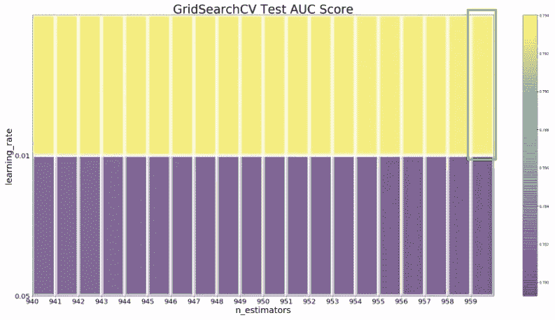

现在我们转向 max_depth，即每个决策树可以构建的深度。增加深度使模型能够捕捉更多的信息(增加复杂性)，但是有一个收益递减的水平，因为太多的级别模型将开始过度拟合。

似乎 max_depth 为 2 是最佳的，增加深度我们可以看到模型很快开始过度拟合。

```
max_depth = [2, 3, 4, 5, 6, 7, 8, 9, 10, 15, 20]param_grid = dict(gradientboostingclassifier__max_depth=max_depth)gbc = GradientBoostingClassifier(random_state=42,
                                 learning_rate = 0.01,
                                 n_estimators = 959)
skf = StratifiedKFold(n_splits=10)
sm = SMOTE(sampling_strategy='auto', k_neighbors=5, random_state=42)
pipeline = make_pipeline(sm, gbc)grid = GridSearchCV(pipeline, 
                    param_grid=param_grid,
                    scoring='roc_auc', 
                    verbose=1, 
                    n_jobs=-1, 
                    cv=skf,
                    return_train_score=True)
grid_results = grid.fit(X_train, y_train)print('Best Score: ', grid_results.best_score_)
print('Best Params: ', grid_results.best_params_)
```

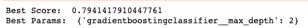

```
cv_results_df = pd.DataFrame(grid_results.cv_results_)
cv_results_df.rename(columns={'param_gradientboostingclassifier__max_depth': 'max_depth'}, inplace=True)
train_scores_mean = cv_results_df["mean_train_score"]
test_scores_mean = cv_results_df["mean_test_score"]
max_depths = cv_results_df['max_depth']plt.figure(figsize=(10,5))
plt.plot(max_depths, train_scores_mean, label='Avg Training AUC Scores')
plt.plot(max_depths, test_scores_mean, label='Avg Test AUC Scores')
plt.xlabel('max_depths')
plt.ylabel('Avg AUC Score')
plt.legend()
plt.show()
```

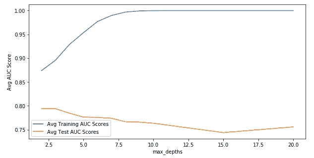

Min_samples_split 或拆分内部节点所需的最小样本数。换句话说，如果我们将该参数设置为 2，那么该节点将需要至少两个记录/审查，以便拆分成两个节点。较高的值有助于过度拟合，因为它迫使决策树在拆分之前需要更多的记录。更多的分割=更多的深度=增加的复杂性=过度拟合。

```
min_samples_split = [2,3,4,5]param_grid = dict(gradientboostingclassifier__min_samples_split = min_samples_split)gbc = GradientBoostingClassifier(random_state=42,
                                 learning_rate=0.01,
                                 n_estimators=959,
                                 max_depth=2)
skf = StratifiedKFold(n_splits=10)
sm = SMOTE(sampling_strategy='auto', k_neighbors=5, random_state=42)
pipeline = make_pipeline(sm, gbc)grid = GridSearchCV(pipeline, 
                    param_grid=param_grid,
                    scoring='roc_auc', 
                    verbose=1, 
                    n_jobs=-1, 
                    cv=skf,
                    return_train_score=True)
grid_results = grid.fit(X_train, y_train)print('Best Score: ', grid_results.best_score_)
print('Best Params: ', grid_results.best_params_)
```

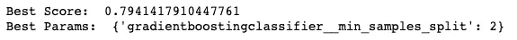

```
cv_results_df = pd.DataFrame(grid_results.cv_results_)
cv_results_df.rename(columns={'param_gradientboostingclassifier__min_samples_split': 'min_samples_split'}, inplace=True)
train_scores_mean = cv_results_df["mean_train_score"]
test_scores_mean = cv_results_df["mean_test_score"]
min_samples_splits = cv_results_df['min_samples_split']plt.figure(figsize=(10,5))
plt.plot(min_samples_splits, train_scores_mean, label='Avg Training AUC Scores')
plt.plot(min_samples_splits, test_scores_mean, label='Avg Test AUC Scores')
plt.xlabel('min_samples_splits')
plt.ylabel('Avg AUC Score')
plt.legend()
plt.show()
```

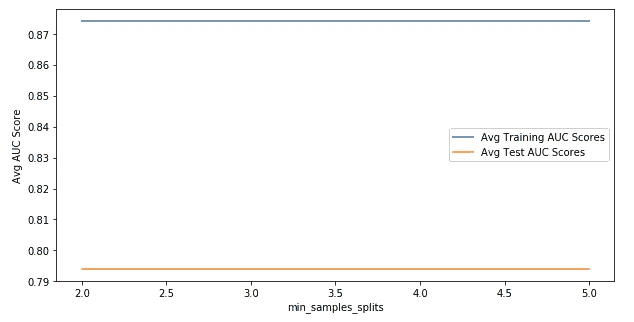

Min_samples_leaf 是形成叶节点所需的最小样本数。换句话说，每个叶子必须至少有 min_samples_leaf 评论，它将其分类为正面或负面。看来 26 条评论是最佳数字。

```
min_samples_leaf = range(10,30,1)param_grid = dict(gradientboostingclassifier__min_samples_leaf = min_samples_leaf)gbc = GradientBoostingClassifier(random_state=42,
                                 learning_rate=0.01,
                                 n_estimators=959,
                                 max_depth=2,
                                 min_samples_split=2
                                )
skf = StratifiedKFold(n_splits=10)
sm = SMOTE(sampling_strategy='auto', k_neighbors=5, random_state=42)
pipeline = make_pipeline(sm, gbc)grid = GridSearchCV(pipeline, 
                    param_grid=param_grid,
                    scoring='roc_auc', 
                    verbose=1, 
                    n_jobs=-1, 
                    cv=skf,
                    return_train_score=True)
grid_results = grid.fit(X_train, y_train)print('Best Score: ', grid_results.best_score_)
print('Best Params: ', grid_results.best_params_)
```

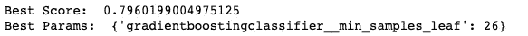

```
cv_results_df = pd.DataFrame(grid_results.cv_results_)
cv_results_df.rename(columns={'param_gradientboostingclassifier__min_samples_leaf': 'min_samples_leaf'}, inplace=True)
train_scores_mean = cv_results_df["mean_train_score"]
test_scores_mean = cv_results_df["mean_test_score"]
min_samples_leafs = cv_results_df['min_samples_leaf']plt.figure(figsize=(10,5))
plt.plot(min_samples_leafs, train_scores_mean, label='Avg Training AUC Scores')
plt.plot(min_samples_leafs, test_scores_mean, label='Avg Test AUC Scores')
plt.xlabel('min_samples_leafs')
plt.ylabel('Avg AUC Score')
plt.legend()
plt.show()
```

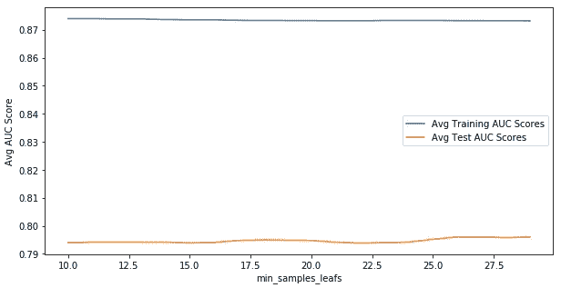

## 模型评估

将我们的优化模型应用到我们坚持的测试数据中，我们可以看到边际改进。总体而言，AUC 略有上升(0.728 至 0.734)，同时积极评价类别的召回率也有所上升(74%至 76%)。我们能够通过 11 个评论增加我们的真实正面计数。我们的模型仍然将大量正面评论错误分类为负面评论(217 个误报)。也就是说，总的来说，它在正确分类真实的正面评价(76%)和真实的负面评价(71%)方面做得相当不错。

```
model_one = GradientBoostingClassifier(random_state=42,
                                       learning_rate=0.01,
                                       n_estimators=959,
                                       max_depth=2,
                                       min_samples_split=2,
                                       min_samples_leaf=26)sm = SMOTE(sampling_strategy='auto', k_neighbors=5, random_state=42)
X_train_sm, y_train_sm = sm.fit_sample(X_train, y_train)model_one.fit(X_train_sm, y_train_sm)
train_auc = cross_val_score(model_one, X_train_smote, y_train_smote, cv=10, scoring='roc_auc')
y_pred = model_one.predict(X_test)
cnf_matrix = confusion_matrix(y_test, y_pred)
roc_auc = roc_auc_score(y_test, y_pred).round(3)print(classification_report(y_test, y_pred))
print(cnf_matrix)
print('Training CV AUC:', train_auc)
print('Training Avg AUC:', train_auc.mean().round(3))
print('Test Auc:', roc_auc)
```

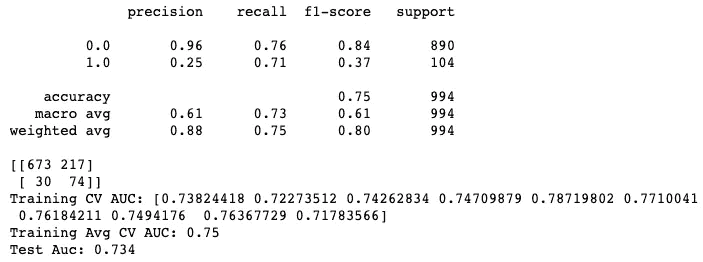

优化模型

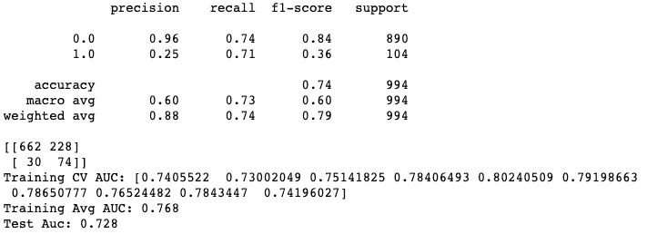

基础模型

我希望这篇文章对您的数据科学事业有所帮助和启发。一如既往，我欢迎任何和所有的反馈。