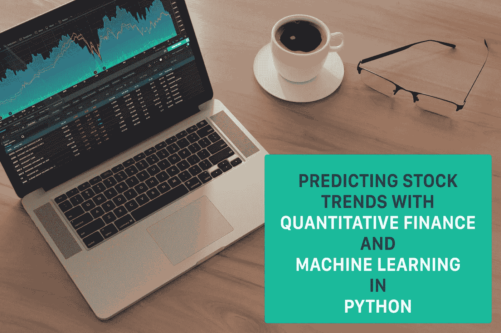
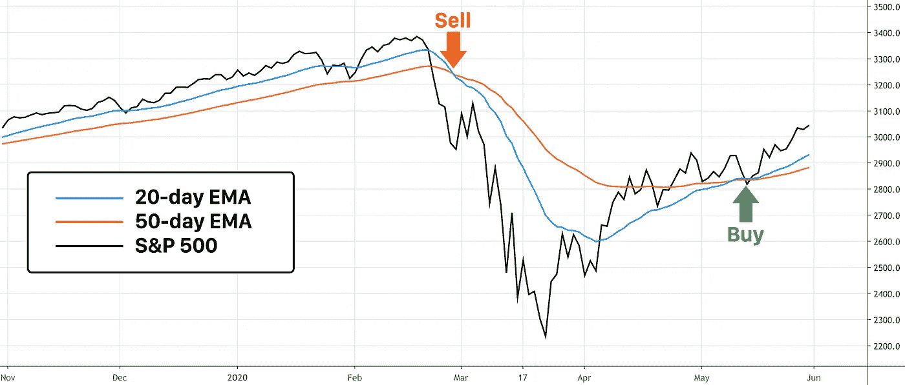
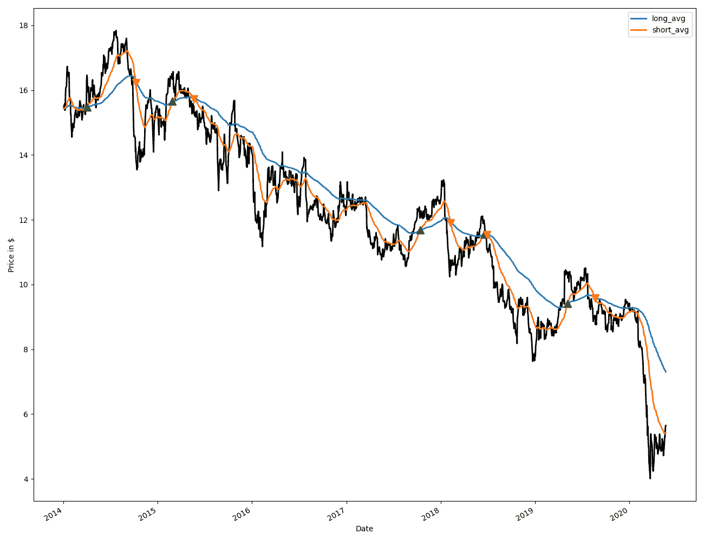
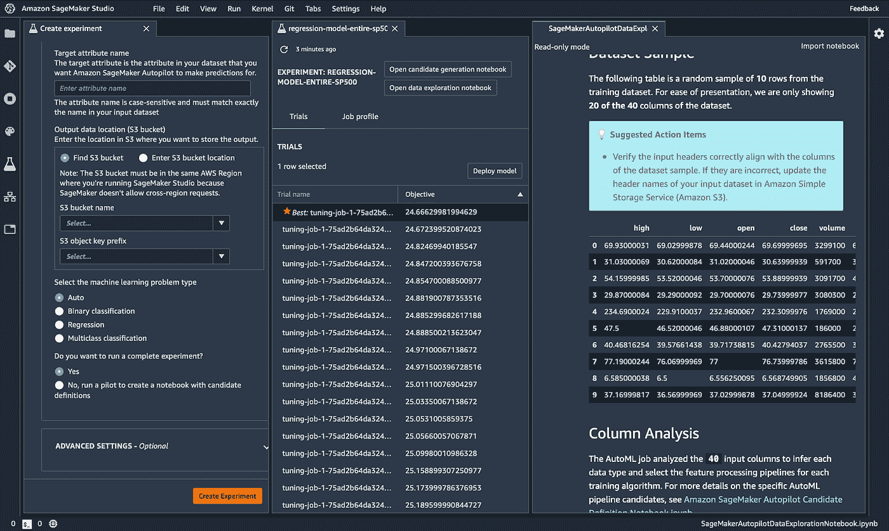
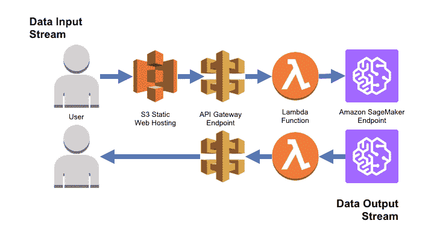
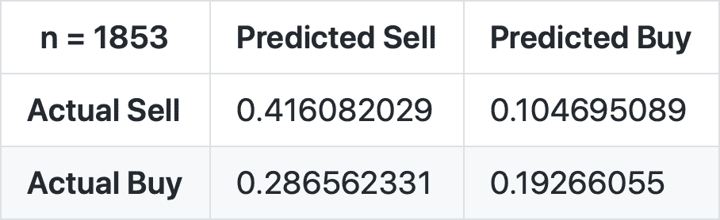
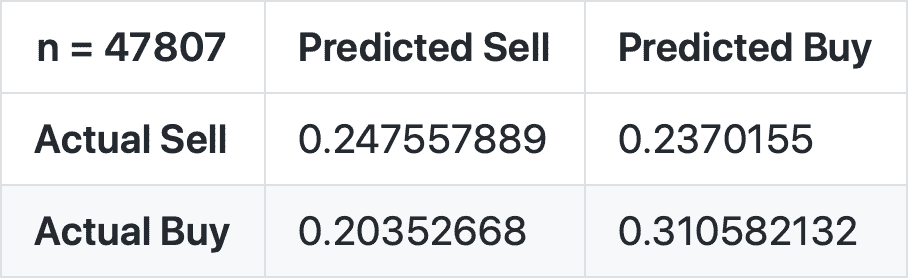

# 用 Python 中的量化金融和机器学习预测短期股票走势

> 原文：<https://towardsdatascience.com/predicting-short-term-stock-movements-with-quantitative-finance-and-machine-learning-in-python-e6e04e3e0337?source=collection_archive---------10----------------------->



[QuoteInspector](https://www.quoteinspector.com/images/investing/laptop-coffee-flare/) 拍摄的照片

## 探索机器学习和标准交叉，以 68%的准确率预测未来的短期股票趋势

你有没有听人说过，他们多么希望能回到过去，投资苹果或亚马逊？嗯，他们不能，而且无论他们在 r/WallStreetBets 上花多少时间，他们都不会预测下一个快速致富的投资。事实上，如果你真的听了 r/WallStreetBets，你很可能会在一周内破产，这是我在这篇文章中做出的唯一保证。

然而，让我们看看我们是否可以利用简单的**量化金融**和**机器学习**概念，看看我们是否能够**以一定的准确度预测股票走势**。在本教程中，我们将看看我们是否能够**准确预测特定股票的短期走势。**

# 什么是量化金融？

量化金融是利用**大型数据集和数学模型来分析金融市场**。所以，想象一下，我们有一堆公式，以某种方式让我们更好地理解特定的股票，我们用它来猜测预测的趋势，这就是量化金融。现在，如果我发现了任何突破性的指标、公式或模型，那我就是在撒谎，但是让我们看看我们是否能制造出自己的指标、公式或模型，并且有可能在未来从中赚钱。最终，我们也许能把乔丹·贝尔福特从华尔街之狼变成一种算法。

# 交易 101

我将使用一些投资和交易领域特有的术语，所以如果你有任何不确定性，请不要犹豫去查找术语。我不是金融专家，所以我会谨慎使用它们。
这里有一些你应该知道的术语:
指标——一种表示股票价格趋势的统计数据
S&P 500——500 家最大上市公司的加权指数
短期运动——股票的 30 天趋势
移动平均线——一段时间内收盘股票价格的平均值

# 收集数据

所有好的数据科学项目都依赖于输入数据的质量。谢天谢地，由于股票交易的性质，我们可以使用 [pandas-datareader](https://pandas-datareader.readthedocs.io/en/latest/) (一个内置网页抓取功能的 pandas 扩展)和令人惊讶的不朽工具 [Yahoo！金融](https://finance.yahoo.com/)。

```
import pandas_datareader as pdr
import datetime
# We can choose any date up to that stock’s IPO
start = datetime.datetime(2014, 1, 1)
# Up to most recent data
end = datetime.date.today()
# We’ll look at F which is Ford
stock = ‘F’
pdr.DataReader(stock, ‘yahoo’, start, end)
# This returns a data frame of scraped stock data from yahoo
```

完成了！任何数据科学应用程序中最简单也是最重要的部分，只用几行简单的代码就完成了。我们可以进一步扩展到这一点，只使用股票代码从任何股票中收集数据。例如，在我们的应用程序**中，我们收集了所有标准普尔股票**的数据。

# 简单分析

在定量金融中，最简单的趋势指标是一个**交叉点**。交叉是指短均线和长均线交叉。在此分析中，我们将利用**简单移动平均线**(所有收盘价的权重相等)和**指数移动平均线**(较新的价格权重较大)。然后，当我们的脚本检测到交叉时，我们将执行交易。

当短均线从长均线上方转到下方时，这是一个交叉，表示卖出(或做空)的机会，反之则表示买入(或做多)的机会。



移动平均线交叉的图形解释

当我们的脚本检测到有利于股票上涨的交叉时，就会触发买入，反之则触发卖出。然后，使用回溯测试分析，我们可以用历史数据测试我们的策略，甚至绘制出我们的算法所做的交易。

我们先算一下所有的均线。对于我们的例子，我们将使用 50 和 200 天窗口的指数移动平均线。

```
import pandas as pd
# List where we will keep track of long and short average points
indicators = pd.DataFrame(index=data.index)
# 50 day
short_window = 50
# 200 day
long_window = 200
# Exponential moving averages using the closing data
indicators[‘short_avg’] = data[‘Close’].ewm(span=50, adjust=False).mean()
indicators[‘long_avg’] = data[‘Close’].ewm(span=200, adjust=False).mean()
```



一个所有交叉和指示福特股票方向的图

正如你所看到的，通过这种简单而有效的分析，我们的算法通常可以准确地预测趋势。一种算法可以通过利用期权交易而不是典型的摇摆交易来进一步利用这些摇摆，在典型的摇摆交易中，唯一的机会是买入和卖出。**交叉是交易者最简单也是最常用的技术指标之一**，现在在算法交易的帮助下，你也可以。

要了解更多信息，请查看 [QuantStart](https://www.quantstart.com/articles/) ，他们有一些关于 Python 的好的免费文章。

# 机器学习

如果我们想利用我们的数据做出更好的预测呢？好吧，通过机器学习的魅力，我们可以创建一个**模型，给我们一个短期价格预测**，希望它有点准确。

我们将像以前一样开始收集数据，但是，这一次我们将需要更多的数据。对于我们的模型，我们使用与之前相同的 API 从所有标准普尔 500 股票中收集了超过 30 年的股票数据，但是我们需要做更多的数据处理。

首先，我们需要一个**目标变量**，它可以是分类的，也可以是数字的。该项目利用了与总体标准普尔 500 相比的**相对百分比变化。这很重要，因为如果标准普尔 500 指数也上涨了 10%，一只股票在 30 天内上涨 10%并不重要。例如，如果苹果股价上涨 8%，S & P 500 下跌 2%，则`short_result`(我们的目标变量)将为 10%，稍后归类为*强烈买入*。**

```
# Getting the S&P 500 relative price difference.
SP = pdr.DataReader(‘SPY’, ‘yahoo’, start_time, end_time)
SP[‘sp_percent_change’] = SP[‘Adj Close’].pct_change(periods=1).astype(float)
data = data.merge(SP[‘sp_percent_change’], left_index=True, right_index=True)
data[‘percent_change’] = data[‘Adj Close’].pct_change(periods=1).astype(float)
# Daily percent change as compared to the S&P 500
data[‘relative_change’] = data[‘percent_change’] — data[‘sp_percent_change’]
```

现在我们有了一个包含所有训练数据的基本数据框架，我们可能需要添加更多的指标。这是因为我们的 API，以及我们的目标变量，为我们的模型提供了每个实体只有有限数量的特征，因此对于预测趋势是无效的。像这样的机器学习模型**需要一段时间的数据**。因此，我们将不得不利用这些趋势和一些其他定量财务指标来添加更多的功能。

谢天谢地，像往常一样，有一个库为我们做这些。我们利用了 [FinTA(金融技术分析)](https://github.com/peerchemist/finta)，它能够利用我们已经拥有的所有数据计算出 **76 个交易指标。理解每个模型的细节并不是完全必要的，但是可以帮助最大化模型的准确性。在我们的模型中，我们使用了几种不同的**移动平均线和力量指数**，因为这些指标是专家们最常用来衡量**市场的短期波动**。**

为了实现，我们简单地使用 python 的 eval 函数，因为它最容易快速实现所有选择的指示器方法，并将它们作为特性添加到我们的数据集。

```
from finta import TA
# Here are all indicators we are using
indicators = [‘SMA’, ‘SMM’, ‘SSMA’, ‘EMA’, ‘DEMA’, ‘TEMA’, ‘TRIMA’, ‘TRIX’, ‘VAMA’, ‘ER’, ‘KAMA’, ‘ZLEMA’, ‘WMA’, ‘HMA’, ‘EVWMA’, ‘VWAP’, ‘SMMA’, ‘MACD’, ‘PPO’, ‘VW_MACD’, ‘EV_MACD’, ‘MOM’, ‘ROC’, ‘RSI’, ‘IFT_RSI’]
df = None
# Using python’s eval function to create a method from a string instead of having every method defined
df = eval(‘TA.’ + indicator + ‘(data)’)
# Some method return series, so we can check to convert here
if not isinstance(df, pd.DataFrame):
df = df.to_frame()
# Appropriate labels on each column
df = df.add_prefix(indicator + ‘_’)
# Mege data frames based on the date
data = data.merge(df, left_index=True, right_index=True)
```

你可能会问自己“这些特性不会产生不必要的噪音吗”，你可能是对的；然而，我们可以用几种方法来解决这个问题。我们可以收集更多的数据，我们已经这样做了，和/或我们可以利用**交叉验证**，它利用我们数据的重采样来更好地概括我们模型的预测。

# 制作模型

现在这里是我们想要如何完成预测的岔路口。我们可以手工制作模型的其余部分；**优化我们自己的超参数**(这只是控制学习过程的参数)**标准化特征**，并利用不同的 ML 技术，或者我们可以为我们处理这些。然而，如果你是 ML 的新手，我**强烈建议遵循我们的** [**代码**](https://github.com/mhsmathew/Stock-Market-Analysis) 并学习不同的技术，但是如果你对**更大的自动化优化**感兴趣，你绝对应该查看一下 [**亚马逊 Web 服务 SageMaker**](https://aws.amazon.com/sagemaker/) ，尤其是如果你有一些 AWS 学分的话。



创建 SageMaker 实验、模型和笔记本的过程

SageMaker 为您完成了构建、培训和部署 ML 模型的所有繁重工作，并且非常易于使用。他们有一些很棒的[教程](https://www.youtube.com/watch?v=qMEtqJPhqpA&list=PLJgojBtbsuc0MjdtpJPo4g4PL8mMsd2nK)，设置自动驾驶实验只需简单的点击几下。一旦完成，您就可以选择最佳模型并部署它。



借助 [AWS](https://aws.amazon.com/blogs/machine-learning/build-a-serverless-frontend-for-an-amazon-sagemaker-endpoint/) 部署 SageMaker 模型流程

不管你是使用基于回归的模型还是分类模型，**买卖股票的核心问题是分类问题**。然而，从回归模型开始并为是否买入或卖出设置上限/下限是有效的。在我们的模型中，我们使用标签*强烈买入*和*强烈卖出*与我们的目标变量≥10 和≤-10 的预测评级相关联。*买入*和*卖出*分类分别与一个评级[5，10]和[-5，-10]相关联，*持有*被赋值为(-5，5)。值得注意的是，所有股票的表现要么比标准普尔 500 指数好，要么比标准普尔 500 指数差。预测评级的幅度越大，我们对股票走向的信心就越大。例如，两只股票可能被列为*强烈买入*，但我们可以对评级更高的那只更有信心。

# 分析

为了分析我们模型的有效性，我们可以**用未经测试的数据**来验证我们的模型。我们可以创建的一个指标是**预测区间**(类似于置信区间)，它将告诉我们预测的真实范围，并具有一定的可信度。我们可以使用**均方根误差**，它对我们来说是 8.91，因此 80%的预测区间将是等于`predicted rating ± 11.40`的`predicted rating ± 8.91*1.28`。这意味着我们有 80%的信心认为股票的实际相对表现将在我们预测的 11.40 以内。

需要注意的是，我们的区间利用了均方差，该均方差**没有考虑超出上限或下限区间**的预期。例如，预测值为 10，实际值为 30 的`short_result`与-10 的`short_result`相同，即使第二个结果没有那么幸运，误差的平方也是相同的。然而，如果我们独立地分析每个标签，我们可以创建更具体的预测区间。


显示由我们的模型预测的每个标签的预测间隔的图表

我们还可以创建**混淆矩阵**，使我们能够可视化每个结果的预测模型的统计成功。通过分解预测买入或卖出的可能结果(我们忽略了持有预测，因为它的高度不确定性)，**我们可以明确地可视化我们的正确率**。例如，在“预测卖出”和“实际卖出”单元格中具有最高值的混淆矩阵意味着模型预测建议的卖出结果比买入结果更准确。

以下是用每只标准普尔 500 股票代表的未经测试的数据验证我们的模型的结果:

*   使用*强烈买入/卖出*分类预测正确趋势的准确率为 67.6%
*   使用任何*买入/卖出*分类预测正确趋势的准确率为 55.8%



强买/强卖混淆矩阵



购买/销售混淆矩阵

# 最后的想法

**机器学习是一种非常强大的技术，可以利用历史数据进行预测**，股票市场就是这种技术的一个很好的应用。然而，需要注意的是，股票市场通常是非常不可预测的，技术分析应该总是在基本面分析之后，我有义务说，这些都不应该作为财务建议。

恭喜你。如果你跟着做，你的模型现在可以和其他先前[发表的模型](https://www.researchgate.net/publication/337800379_Deep_Long_Short_Term_Memory_Model_for_Stock_Price_Prediction_using_Technical_Indicators)相媲美，它们也预测短期股票方向。我们取得了类似的成功，因为我们利用了大量的可用数据和几种类型的指标。这正好说明，在数据科学领域，**数量绝对驱动质量**。

点击这里查看完整的项目回购[和我个人网站上该模型预测的每日反馈:](https://github.com/mhsmathew/Stock-Market-Analysis)

[](https://mathewsteininger.com) [## 马修·斯坦宁格

### 软件工程师-学生

mathewsteininger.com](https://mathewsteininger.com)