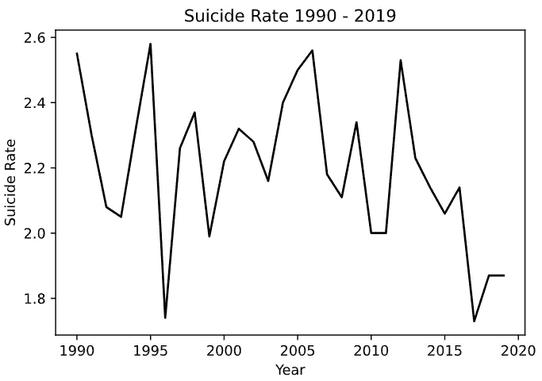
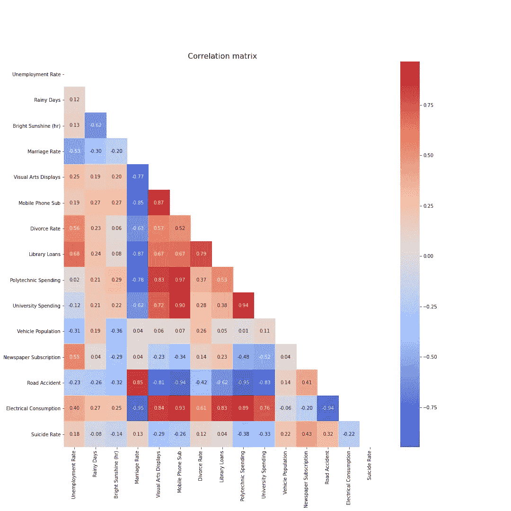
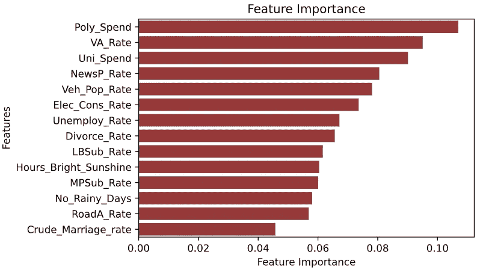

# 使用宏观社会文化变量预测新加坡自杀率

> 原文：<https://towardsdatascience.com/predicting-singapore-suicide-rates-using-macro-sociocultural-variables-13f9e63ece86?source=collection_archive---------54----------------------->

Movember 已经到来，带来了…嗯，只是你典型的潮湿和湿润的新加坡天气(不是人们在北半球所期望的美丽的秋叶)。由于我是一名亚洲男性，因此没有机会留胡子，我决定以自己的方式做出贡献，调查自杀率(包括男性和女性)，并试图找出是否有任何方法可以通过观察宏观社会因素来预测自杀率。

*如图:* ***非我*** *在 Movemeber(图片来自 Unsplash)*

关于这一点已经有了很多预先存在的研究(例如，参见此处的和此处的)，得出的主要结论之一是宏观经济不稳定与“精神疾病和自杀的加剧”之间的关系。然而，我想超越经济指标，看看随机的、可能不相关的变量，看看是否有任何“盒子外”的因素，我们可以用来预测自杀率(并据此采取行动)。

# TL；博士；医生

1.  **糟糕的模型:**我尝试对数据应用随机森林，然后应用线性回归模型。然而，两者都被证明具有极低的 R 值，表明预测能力差(当在验证集上测试时)。
2.  **经验教训:
    答:数据为王**:无论您使用哪种模型，您使用的数据都是关键。俗话说，垃圾进，垃圾出。尽管我不愿意承认，但我确实没有足够的数据。我从 SingStat 下载的大部分数据集只能追溯到 1990 年。数据太少，无法对其进行任何有意义的工作。b .因变量的性质:自杀作为心理健康的一个功能，传统上很难管理，更不用说预测了。认为我可以使用宏观变量以某种方式预测自杀率是一个好主意，但可能是天真的想法。
3.  提高意识是关键:归根结底，也许我们对付这种致命的社会趋势的最好工具就是意识和同情。消除自杀意念的污名，给人们提供接受帮助的空间，是解决这一问题的关键。作为个人，我们可以用正确的知识和技能来武装自己，为可能遭受精神痛苦的朋友和家人提供帮助。这是一个很好的网站，上面有关于我们如何发挥作用的关键信息。

# 收集数据

想要做一个新加坡特有的探索，我求助于两个新加坡统计资料库: [SingStat](https://gist.github.com/zachlim98/singstat.gov.sg/) 和【Data.gov】T2。这些网站上的数据集真的非常广泛，涵盖了各种各样的统计数据。我从这些网站下载了一大堆随机统计数据，把它们编译成一个主 csv 文件。

虽然自杀率的统计一直追溯到 1968 年，但大多数其他关键统计数据只追溯到 1990 年。我很失望地发现这一点，因为我一直认为新加坡，在所有国家中，将有良好的，可靠的历史统计数据(考虑到我们作为一个国家相对年轻)。尽管如此，我还是利用我所拥有的资料，将我的数据集限制在 1990 年至 2019 年。这后来证明对我不利。

从网上大量可用的数据集中，我选择了一些随机的、不相关的数据集。我想包括更多的变量(随机的东西，比如公共游泳池的游客数量)，但是大多数只有 2005 年的数据(有些只有 2010 年的数据！).我还想包括一些重要的消费者消费变量。在其他研究中，酒精使用(通过消费和与酒精相关的犯罪来衡量)是重要因素。然而，犯罪统计从 2011 年才开始，消费统计每 5 年才进行一次。不是特别有用。

然而，我研究了我能找到的数据，最终得到了 14 个不同的变量:失业率、雨天、日照时间、结婚率、视觉艺术展览数量、手机订阅数量、离婚率、图书馆图书借阅数量、理工学生支出、大学生支出、车辆总数、报纸订阅数量、交通事故数量和电力消耗率。

要是我有更多的变量就好了…唉(图片来自 Unsplash)

我认为这是一个相当广泛的列表，并很兴奋地在模型中运行它，看看我们能找到什么。谢天谢地，下载的数据非常干净，在 Excel 中做了一点“预处理”，我们就可以开始了。

# 数据窥视

清理完数据后，我将它导入 Python，绘制出这些年的自杀率以及相关图，只是为了快速了解数据。

看看自杀率的图表，老实说，看起来并不乐观。这些年似乎没有真正的趋势(上升或下降),虽然在关键时刻(如 2007 年至 2008 年金融危机)似乎有峰值，但也不是特别突出。

看着热图，老实说，它看起来并不乐观。从最后一行来看，没有一个变量与自杀率有特别强的相关性(正或负)。即使对于失业率(在其他论文中显示有显著的正相关性)，似乎也没有特别强的相关性。

# 随机森林回归量

数据的概述并没有吓住我(或者我本应该被吓住)，我继续实现了一个随机森林模型，试图理解这些数据。使用`sklearn`，我将数据分成训练集和测试集，然后实例化 RFG。

*(注:我知道关于为 RFs 分割数据集有不同的思想流派。有些人认为，由于装袋，没有必要为射频验证设置。然而，也有其他人认为，这可以与 OOB 分数进行比较，以获得更好的评估。后来，我还需要为我的多元线性回归模型建立一个测试和训练集，因此需要拆分)*

拟合训练数据集，然后我比较了模型的 R 分数。R 的重要性已经在前面[讨论过了](https://zachlim98.github.io/me/2020-10/sgcarmart1)，但本质上它代表了自变量解释的因变量方差的比例。或者用外行人的话来说，它代表了多少结果可以用自变量来解释。

最终产品是一场灾难。虽然训练 R 是相当可观的 0.80 (80%的自杀率可以通过输入来解释)，但公开得分是**负**，测试集得分 0.36 与 OOB 得分相差甚远。

射频模型通常有很高的 R 值，所以 0.80 的分数不值得一提。虽然我最初打算使用`sklearn RandomizedSearchCV`对模型执行超参数调整，但模型的初始评估已经**很差**，我认为任何调整都没有意义。 ***N*** (数据点数)简直太低了。正如 Will Koehrsen 在他关于改进 RF 模型的文章[中所写的，第一步是收集更多的数据(在这种情况下，我很遗憾不能)。](/hyperparameter-tuning-the-random-forest-in-python-using-scikit-learn-28d2aa77dd74)

出于好奇，我想看看特征的重要性(例如，哪些特征对预测目标最有用)。我使用了 [Eryk Lewinson](https://medium.com/@eryk.lewinson) 的代码来创建特性重要性图，并对其进行了调整以适应数据。

为了证明这个模型有多不准确，政府在理工学院的支出是最重要的特征。其次是每年视觉艺术展览的数量。虽然第二个因素排在第二位，但很难看出理工学院的支出是预测自杀率的最重要变量。失业率(通常是一个很强的预测指标)是第七个最重要的因素。这种模式显然是相当破碎的。

# 多元线性回归

此时，我已经意识到我缺乏数据是一个巨大的问题。然而，由于我已经在使用 Python 了，所以我决定还是结束探索并加入 LR 模型吧。

从结果中可以看出，调整后的 R 平方是负的(也就是说，这个模型不能预测自杀率的任何变化)。因此，这是一个基本上无用的模型。

我感觉像这个气球(图片来自 Unsplash)

# 结论

1.  **数据为王**:无论你使用什么模型，你使用的数据都是关键。俗话说，垃圾进，垃圾出。尽管我不愿意承认，但我确实没有足够的数据。我从 SingStat 下载的大部分数据集只能追溯到 1990 年。数据集太小，无法对其执行任何有意义的工作。[这篇文章](/hyperparameter-tuning-the-random-forest-in-python-using-scikit-learn-28d2aa77dd74)是一个关于改进 ML 模型的资源。它建议的第一件事是获取更多的数据来训练你的模型。在这种情况下，由于我在寻找新加坡相关统计数据方面的限制，不可能获得更多的数据。
2.  **因变量的性质:**自杀作为心理健康的一个功能，传统上很难管理，更不用说预测了。认为我可以使用宏观变量以某种方式预测自杀率是一个好主意，但可能是天真的想法。也有其他研究试图使用微观变量(例如观察 [twits](https://www.nature.com/articles/s41746-020-0287-6) 来检测自杀意念)。虽然他们确实发现了“算法 SI 分数与全县自杀死亡率的显著关联”，但这是否有助于预测自杀倾向还有待观察。
3.  提高意识是关键:归根结底，也许我们对付这种致命的社会趋势的最好工具就是意识和同情。消除自杀意念的污名，给人们提供接受帮助的空间，是解决这一问题的关键。作为个人，我们可以用正确的知识和技能来武装自己，为可能遭受精神痛苦的朋友和家人提供帮助。[这个](https://www.sos.org.sg/learn-about-suicide/quick-facts)是一个很好的网站，上面有关于我们如何发挥作用的关键信息。

*原载于*[https://Zach lim 98 . github . io/me/2020-11/自杀率预测](https://zachlim98.github.io/me/2020-11/Suicide-Rate-Prediction) *。*