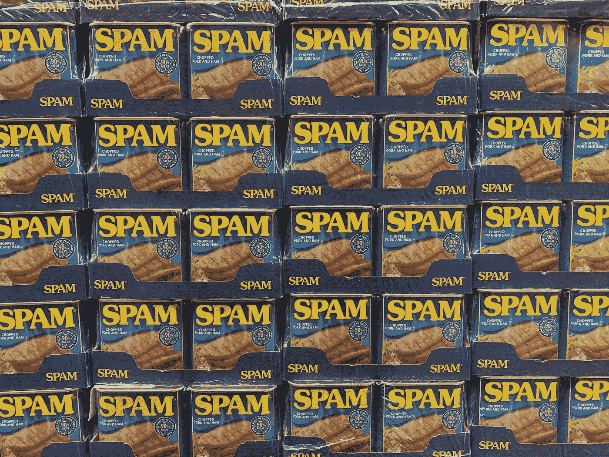
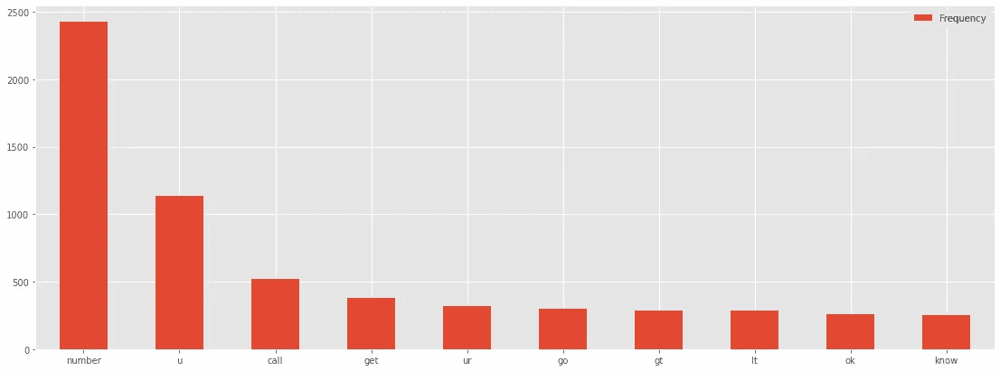
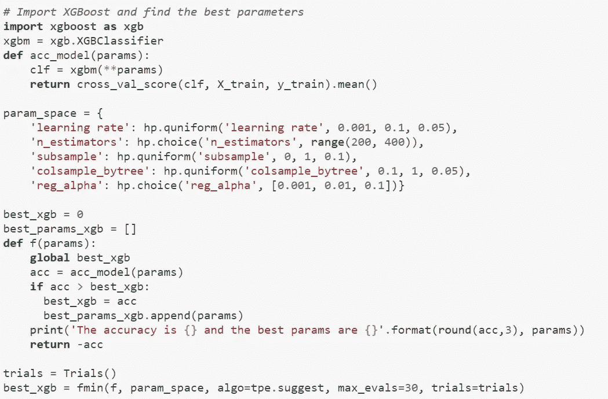
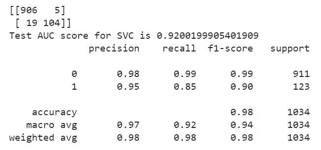

# 预测垃圾邮件

> 原文：<https://towardsdatascience.com/predicting-spam-messages-17b3ca6699f0?source=collection_archive---------42----------------------->

## 使用机器学习算法预测垃圾邮件

Jason Leung 在 Unsplash 上拍摄的照片

在本文中，我尝试预测垃圾邮件。你可以在文末提供的我的 Github 账号上找到所有的 python 代码。

如今，当我们听到“垃圾邮件”这个词时，首先想到的是垃圾邮件。然而，八十年前并非如此。spam 一词是由一个叫 Ken Daigneau 的人在 1937 年创造的，用来命名 Hormel Foods 的新肉制品。肯为新项目命名赢得了 100 美元的奖金。有些人认为 spam 代表五香火腿，还有许多人认为它代表“特别加工的美国肉类”

垃圾品牌。汉尼斯·约翰逊在 Unsplash 上拍摄的照片

“垃圾邮件”这个词在 20 世纪 70 年代开始被认为是“令人讨厌”的东西，在巨蟒剧团的飞行马戏表演之后，当在一个“*”场景中，维京人开始唱“垃圾邮件之歌”，并一直重复“垃圾邮件”这个词。后来，在 20 世纪 80 年代和 90 年代，人们使用“垃圾邮件”这个词的重复，有时甚至是《维京人之歌》的整首歌来发送垃圾邮件聊天。因此，人们开始将“垃圾邮件”这个词与令人讨厌的垃圾信息联系起来。*

*本文的目标是使用不同的机器学习技术来预测邮件是否是垃圾邮件。我使用了加州大学欧文分校提供的 [*数据集*](https://archive.ics.uci.edu/ml/datasets/sms+spam+collection) ，其中包含大约 5500 条短信。下面是文章的结构:*

1.  *探索性数据分析*
2.  *文本预处理和特征工程*
3.  *建模*
4.  *结论*

***探索性数据分析***

*首先，我们来做一些探索性的数据分析。通过检查数据集的形状，我们可以看到它有 5572 个观察值和两列。然而，在 5，572 个观察值中，只有 5，169 个唯一值，这意味着大约有 450 个重复行。我还检查了缺失值，但是发现没有一列有任何缺失值。下面是前五行和数据集的形状:*

**

*初始数据集*

*删除重复项后，数据集有 5，169 个观察值，其中 4，516 个是垃圾邮件，653 个是垃圾邮件。相对大量的 ham 消息意味着如果我把所有的消息都当作 ham，我会得到 87%左右的准确率。有些人以朴素贝叶斯(一个非常简单的模型)的精度为基准，但我会以整体精度为基准，并会尝试以更高的精度做出能更好预测的模型。如果你想了解更多关于朴素贝叶斯的知识，可以看看这个 [*视频*](https://www.youtube.com/watch?v=O2L2Uv9pdDA) 。*

***文本预处理和特征工程***

*在开始建模部分之前，我需要处理数据，并使其适合建模。在这一部分，我需要将电子邮件、网址、货币符号、电话号码和数字转换成特定的单词，并删除所有的标点符号。更准确地说，想象一条垃圾消息，它具有下面的消息“使用 www.wearespam.com 的[链接获得 100 万美元”，以及另一条包含“使用 www.wearealsosmap.com](http://www.wearespam.com/)的[链接获得 50 万美元”表述的垃圾消息。在这种情况下，我们不希望算法考虑两个不同的链接或奖金数额，而是用特定的词来定义它们。转换文本后，这两个句子看起来像“使用 webaddr 链接获取货币号码”除了改变文本中的一些单词，我还对词典进行了规范化，并从文本中删除了所有的停用词。为了更加精确，我现在将提供每个部分的更多细节。](http://www.wearealsosmap.com/)*

*删除“不必要的”单词——正如我已经解释过的，我们不需要在文本中有不同的唯一数字。尽管如此，我们需要知道特定的消息是否包含电子邮件地址、电话号码等。您可以使用 Python 的正则表达式包来识别文本中的电子邮件和电话号码。在下面的 [*网站*](http://regexlib.com/Search.aspx) 找到更多关于正则表达式的信息。*

*规范词汇——我执行了词汇规范化的词汇化技术。在这个过程中，我们把这个词带到它的“基础”层面。例如，单词“go”、“goes”和“going”有相同的基础，但用法不同。词汇规范化的另一种方法是词干化，但是词汇化比词干化有一些优势。例如，词汇化通过使用词汇将单词转换为其基础，而词干化对单词起作用，而不考虑其内容。因此，词汇化可以导致单词的更好的转换，而不改变意思。要了解更多关于词汇化和词干化的信息，请点击这里的*。**

**清洗完文字，我需要看到最常见的字。下图显示了文本中最常见的单词是“数字”那是因为我把所有的数字都转换成了一个单词，我们的文本包含了太多不同的数字。**

****

**词的出现**

**最后，在删除了停用词、不必要的词和规范化了词典之后，是时候对文本进行标记了。标记化是将每个单词或一系列单词视为特定单位的过程。例如，在对“我喜欢苹果”句子进行单字标记化之后，我们得到三个单独的标记:[我]、[喜欢]和[苹果]。我使用了 unigram 和 bigram 标记化，因为包含两个单词的表达式也是分析所必需的。例如，在短语“早上好”中，这两个词放在一起，而不是分开，对于捕捉表达的确切含义是必不可少的。我没有用三个或更多的单词来标记，不是为了增加变量的数量和最小化计算能力的使用。在对文本进行标记后，我制作了一个单词包来开始处理数据。通过制作单词包，我们为单词提供了数值。单词包计算每个单词在句子中的出现次数。这是一个简单的技术，易于使用。然而，只用弓也有它的缺点。例如，BoW 衡量文本中每个词的出现次数，出现频率越高的词可以获得更高的重要性。例如，让我们来看下面两个句子:“轰炸、弹幕、幕火、地雷、毒气、坦克、机枪、手榴弹——单词、单词、单词，但它们包含了世界的恐怖”(埃里希·玛利亚·雷马克“*西线一切平静*”)和“这是一张桌子。”在制作了单词包之后，我们看到单词“words”比“table”更常见，这意味着“words”将变得更加重要。为了解决这个问题，我使用了 TF-IDF(术语频率-逆文档频率)权重。权重提供了每个标记的重要性，但是它也考虑了标记在语料库中的频率。想了解更多关于 BoW 和 TF-IDF 的信息，可以查看 [*这里*](https://www.analyticsvidhya.com/blog/2020/02/quick-introduction-bag-of-words-bow-tf-idf/) 。**

**在对数据进行标记化并计算 TF-IDF 权重之后，我得到了最终的数据集，它由 5169 行和 37891 列组成。太多了！！！**

****造型****

**因为我已经准备好了数据，现在是制作模型的时候了。在我的分析中，我使用了四种不同的模型:SVM、随机森林、逻辑回归和 XGBoost。我将数据集分成两部分，用一部分训练模型，另一部分测试它们的性能。为了提高每个模型的性能，我尝试了不同的参数，并使用贝叶斯优化进行超参数调整。我采用了不同范围的参数，并对训练数据集进行交叉验证，以找到参数的最佳组合。后来，我在测试数据集上测试了这些模型，并使用准确性和 AUC 分数来比较它们的性能。尽管我使用贝叶斯优化进行超参数调优，但我想快速浏览一下广泛使用的替代方法。贝叶斯优化的可能替代品是网格搜索和随机搜索，但我使用贝叶斯优化，因为其他两个有一些缺点。我将简要解释每种方法的工作原理以及它们可能的缺点。**

*   **网格搜索方法-测量所有可能的参数组合的结果。例如，如果我们想在 0.01 或 0.1 的学习率和 4 或 5 的最大深度之间做出决定，那么网格搜索将建立四个不同的模型(尝试所有可能的组合)，并采用模型表现最佳的参数。网格搜索方法的缺点是，在许多参数的情况下，比较所有可能的组合将花费太多的计算能力。**
*   **随机搜索方法-在提供的参数中，该方法采用参数的随机组合，并用它们来建立模型。对于这种方法，我们需要指定要进行多少种组合。随机搜索方法的主要缺点是它随机选择参数，并且人们永远不能确定该方法将采用参数的最佳组合。**
*   **贝叶斯优化方法—使用贝叶斯定理指导参数搜索。因此，它走向目标函数增加/减少的方向(取决于目标)。**

**下面是 XGBoost 的超参数调整代码:**

****

**XGBoost 的超参数调整**

**通过了解所有模型的最佳参数并制作模型，我发现支持向量机(SVM)的预测效果最好。它具有 98%的准确性和 0.92 的 AUC 分数。XGBoost 和 Random Forest 的性能没有显著差异，但这些模型的准确性和 AUC 较低。一个相对简单的模型，逻辑回归，并不能很好地进行预测，并且准确性和 AUC 评分最低。另外，通过查看混淆矩阵，我们可以看到，当算法预测该消息是垃圾邮件时，大多数错误都与误报有关，但实际上，它是 ham。以下是 SVM 的结果汇总:**

****

**SVM 绩效总结**

**最后我对所有模型做了 ROC 曲线，直观的看哪一个表现最好。下面你可以找到 ROC 图:**

****

**受试者工作特征曲线**

**您可以再次看到 SVM(红线)的表现最好，因为它的 ROC 得分最高。**

**总的来说，在本文中，我试图了解哪种模型有助于更好地预测垃圾邮件。首先，我清理了数据，对文本进行了必要的转换，并将 word 转换为数值，以便能够制作模型。我使用了四个模型，并为 SVM 获得了最高的准确性和 AUC 分数。该模型的使用可以帮助许多企业更好地了解哪些消息是垃圾邮件。然而，我相信可以通过使用更复杂的模型如神经网络来进一步改进预测。**

**你可以在我的 [*github*](https://github.com/Lazr-Galstyan/Predicting-Spam-Messages/blob/master/Predicting_Spam_Messages.ipynb) 账号上找到本文使用的 Python 代码。**