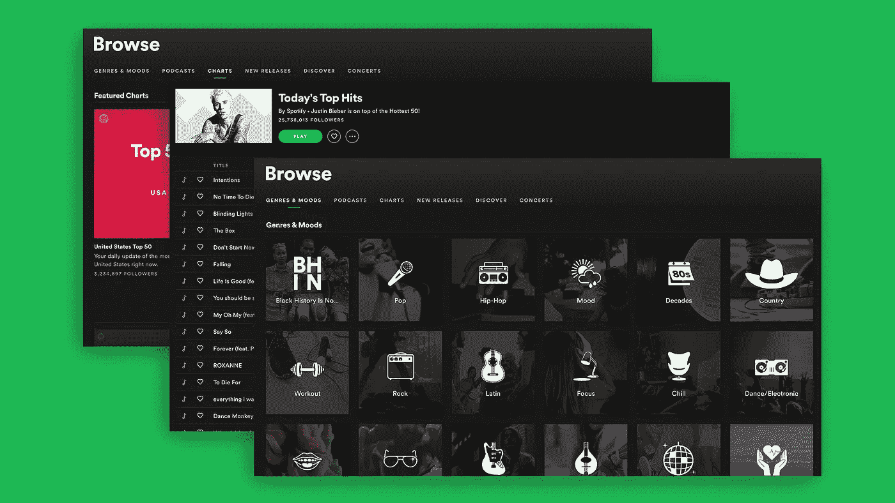
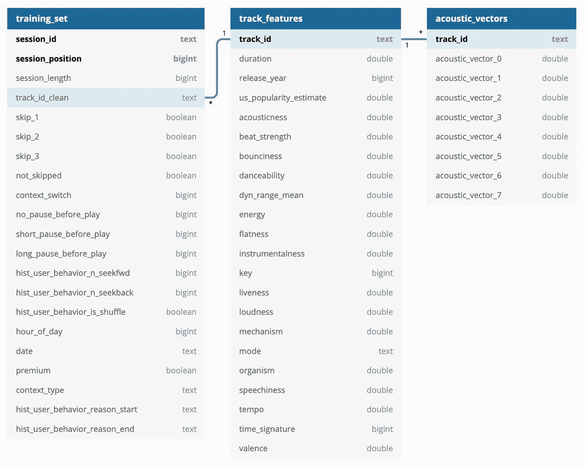
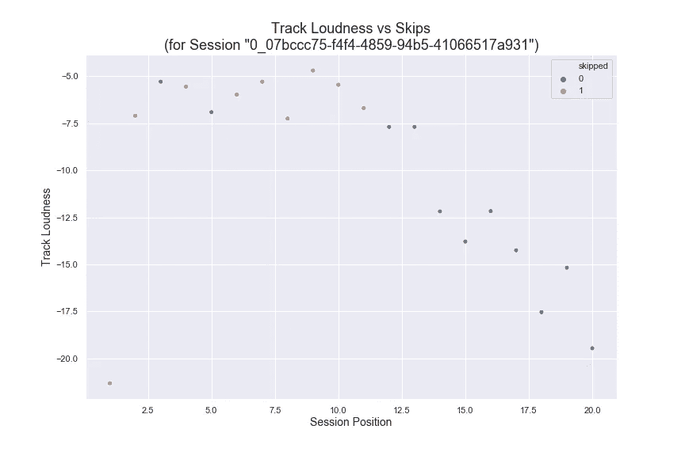
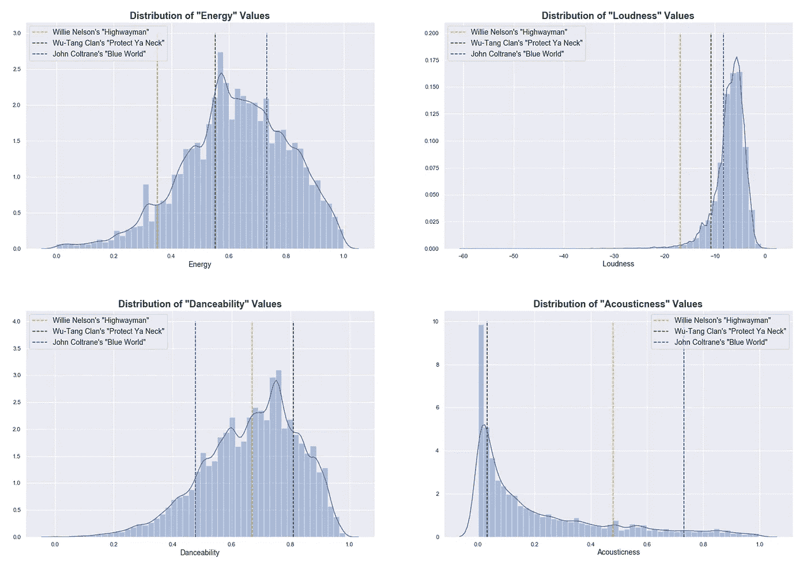
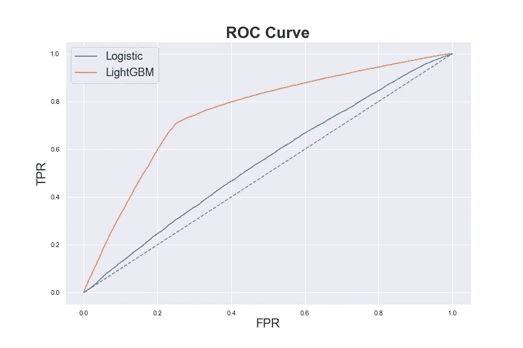
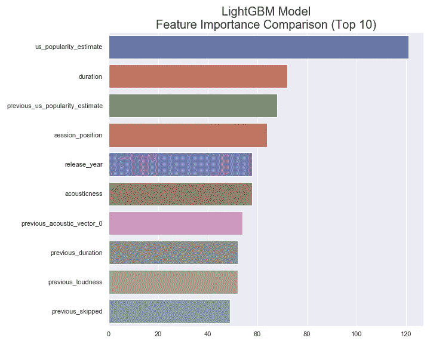
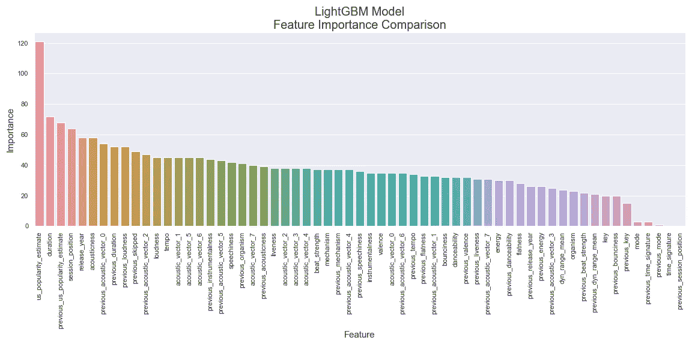
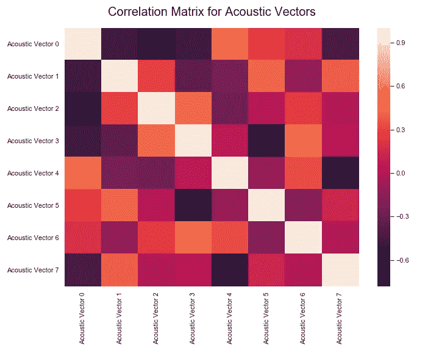

# 预测 Spotify 曲目跳过

> 原文：<https://towardsdatascience.com/predicting-spotify-track-skips-49cf4a48b2a5?source=collection_archive---------23----------------------->

## 致力于 Spotify 顺序跳过预测挑战

(截图由 Spotify 提供)

# 介绍

作为 Metis 数据科学训练营的第三个项目，我做了一个稍微简化的版本的 *Spotify 顺序跳过预测挑战*【1】。

我相信你知道，Spotify 是一家流媒体服务公司，其商业模式的核心是向用户提供歌曲推荐，以保持他们使用他们的应用程序。

> Spotify 拥有超过*1.9 亿*活跃用户，与超过*4000 万*首歌曲互动。

挑战的目标是*预测用户在收听过程中跳过任何一首歌曲的可能性*。

# 方法学

## 数据

Spotify 为比赛提供了两套主要信息。一个表有关于用户收听会话的信息。例如:

*   会话 ID
*   在会话中的位置
*   轨道 ID
*   如果轨道被跳过或没有被跳过
*   其他会话元数据

请注意，用户会话的长度都在 10 到 20 首曲目之间，并且不包括任何关于用户的可识别信息。

第二个表包含关于磁道的元数据(对应于会话表中的`track_id`功能)，例如:

*   轨道持续时间
*   追踪在美国的受欢迎程度
*   发布年份

以及一些额外的功能，由 Spotify 生成，用于描述歌曲，例如:

*   *声音度*
*   *跳动*力量*力量*
*   *弹性*
*   *可跳舞性*

该数据集还包括每首曲目的一组 8 个“声音矢量”，它们是 Spotify 为每首曲目生成的潜在编码。

出于许可的原因，Spotify 将曲目信息匿名化，因此没有任何关于曲目名称、艺术家、专辑或流派的数据。

所提供的数据集中的目标(无论是否跳过了音轨)与大约 51.7%被跳过的音轨保持平衡。所以没有必要为了训练而调整班级平衡。

有多余的数据，所以我使用了会话表中大约 100k 行的子集和跟踪表中相应的行，我将它们加载到托管在 AWS EC2 实例上的 Postgres 数据库中。数据库模式如下所示:

Spotify 跳过数据的模式

为了了解单个会话可能是什么样子，下图显示了单个用户会话的曲线图，因为它与其中一个功能相关，即“音轨响度”，Spotify 对歌曲特征的描述，而不是传统意义上的“音量”，其中颜色指示跳过和未跳过的音轨。

单个会话的音轨跳过与音轨响度

虽然它本身没有意义，但它说明了如何根据歌曲属性绘制每个会话。在这个例子中，随着响度值降低，用户只听了前 11 个音轨中的两个，然后听了所有剩余的 9 个音轨。

此外，为了更好地了解整体发行曲目属性，我绘制了一小部分功能的分布，并突出显示了三首不同歌曲在分布中的位置(使用来自 Spotify API 的数据)。这三首来自三个不同流派的歌曲是:

*   威利·尼尔森的[拦路强盗](https://open.spotify.com/track/7jWbXvrgdbkajU8L28ahn5?si=SjrUPcJ8T_OZE9SY6qhF7w)(国家)
*   武堂帮的[护丫脖子](https://open.spotify.com/track/1Sgj10byiGzPpI2IrXSFEn?si=idphDdbRTduLWbG1G84KjQ)(嘻哈/R & B)
*   约翰·科尔特兰的《蓝色世界》(爵士乐)

以下是属性“能量”、“响度”、“跳舞度”和“声音度”的属性分布图:

标绘 3 首歌曲作为参考的音轨特征子集的分布

## 特征工程

这些数据本质上是有序的。该模型对任何给定歌曲的跳过预测将基于在用户收听会话中较早跳过的歌曲。因此，为了让我的模型考虑到这一点，我添加了一组特征来表示以前音轨的音频特征以及这些音轨是否被跳过。

*旁注:我还尝试了一种替代方法，在这种方法中，我添加了两组特征，分别对应于被跳过的先前轨道和未被跳过的轨道的平均轨道特征信息，但是发现计算时间更长，添加了两倍的特征，并且没有提高模型性能。*

## 型号选择

根据竞赛指南，目标衡量标准是准确性。

我开始用逻辑回归模型作为基线，但是发现它的准确性很差。因此，从那以后，我转向了基于树的模型，这种模型不太容易解释，但能够自动处理复杂的功能交互。

# 结果

比较逻辑回归和 LightGBM 模型性能的 ROC 曲线

我最好的模型的最终测试精度是 **0.73** ，使用的是 LightGBM 的`LGBMClassifier`模型，考虑到问题，这已经相当不错了，但还有改进的空间。

在训练模型之后，我分析了误差，寻找改进模型的地方，但是在残差中没有发现任何明确的趋势。

# 结论

最终 LightGBM 模型的相对特征重要性排序

该图显示了最终模型的前 10 个功能的相对重要性排名。该模型将*曲目流行度*列为最重要的特征，其次是*曲目持续时间*，然后是*上一首曲目的流行度*。这个排名似乎总的来说是有意义的，并没有发现什么太令人惊讶的事情，除了可能的事实是*曲目流行度*的排名远远高于下一个最重要的功能。然而，有趣的是，这个图(以及在下面的附录中可以看到的完整排名的图)显示，在少数情况下，该模型似乎正在比较当前曲目和先前曲目的特征。一些例子包括*流行度*、*持续时间*和*响度*。

同样，该模型的性能是合理的，与精确度为 0.51 的完全天真的模型(总是预测音轨将被跳过)相比，精确度为 0.73，但仍有很大的改进空间。

# 未来的工作

展望未来，需要继续努力的几个领域包括:

*   添加无监督学习，根据曲目特征对歌曲进行聚类，并可能生成“伪流派”
*   使用递归神经网络进行预测，这可以更自然地处理*序列*轨迹信息
*   用来自 Spotify API 的更多数据补充数据集(如流派信息)
*   创建一个 Flask 应用程序，它使用 D3 来可视化模型预测，并允许用户交互式地探索数据集

感谢阅读，我很想听听你的想法！

# 附录

## 特征子集描述

*   *声音度*:音轨有声音的可能性
*   *可跳舞性*:描述一个曲目适合跳舞的程度
*   *能量*:轨迹强度的量度
*   *价*:音轨所传达的“积极”程度
*   *语音识别*:检测口语单词的存在

## 全模型特征重要性等级

## 轨迹"*声矢量"*相关矩阵

# 引文

这里有一个挑战网站的链接(这里有更多关于数据集和挑战规则的信息)。

[1] B. Brost，R. Mehrotra 和 T. Jehan，[音乐流会话数据集](https://arxiv.org/abs/1901.09851) (2019)，2019 年网络会议论文集