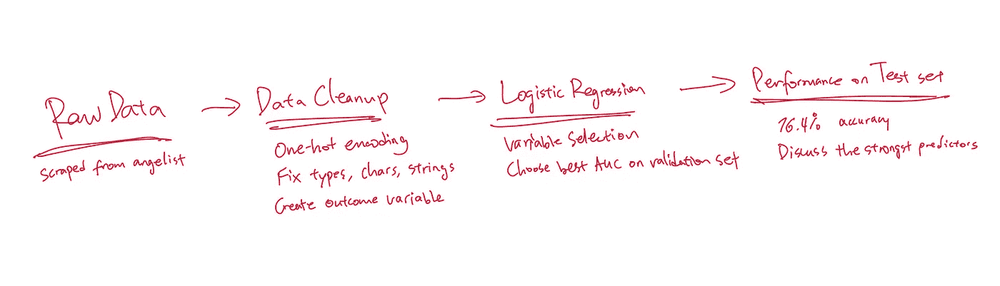
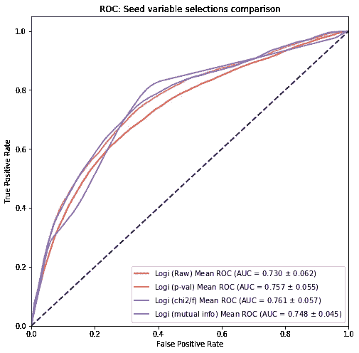

# 使用逻辑回归预测启动性能

> 原文：<https://towardsdatascience.com/predicting-startup-performance-using-logistic-regression-582a1e80b2eb?source=collection_archive---------23----------------------->

## 通过简单的数据科学分析创业公司的寿命

我第一次接触创业领域是在大学一年级的夏天，直到现在，我也是其中的一员。不幸的是，我遇到的大多数都因为各种原因而关闭了。所以我对创业公司的生存方式产生了兴趣。我能判断一家初创公司是会生存还是会失败吗？尽管创业公司的本质在某种程度上意味着不可预测，但我想看看我能从一些数据中挖掘出什么见解。

## 摘要

这篇文章的特色是从初创企业数据库[angelist.co](http://angel.co/companies)收集的数据，将 ML 框架化为一个分类问题，即初创企业是否可以提高某个阈值来预测业绩。比较 P 值，卡方，F 值，互信息作为变量选择方法提出和评估。最后，选择的模型找到了最重要的预测因素:规模、成立年份、旧金山、奥斯汀、西雅图和手机游戏。大多数这些都是直观的，因为它们都证实了地理优势和市场竞争力对创业公司的影响。



流程图

以下是我的 [jupyter 笔记本](https://github.com/xiaoxiang-ma/predicting-angelist-startup-performances)从刮痧到建模如果你感兴趣的话:)

# 1.数据采集

在研究了几个不同的创业数据库后，我选择了 angelist.co 的 T4，因为它的数据相当详细，而且可以免费访问。下面是网站的外观，让你对我们正在处理的数据有一个大致的了解。


天使公司页面

上面的页面显示了大量的初创公司，对于每个初创公司，都会显示以下数据:

*   加入时间(启动加入天使数据库的月份和年份)
*   启动位置
*   创业公司所处的市场(电子商务、医疗保健、B2B、SaaS 等)
*   员工规模(1-10 人、11-50 人、51-200 人等等)
*   当前启动阶段(种子期、首轮融资、…、首次公开募股、已收购)
*   筹集的资金总额

我编写了一个 web scraper 来获取上述数据，从 Angelist 中随机抽取了 4260 个独特的初创公司。下面是我搜集的数据片段。


表 1:抓取的数据

## 评估指标

我不知道该把这个问题框定为一个回归问题来预测一些美元价值，还是作为“好”和“不好”创业公司之间的分类。如果这是一个分类问题，那么我们需要一些好与不好的衡量标准。TechCrunch 的一项关于一轮融资对下一轮融资影响的研究给了我灵感。

我们在下图中看到，当公司在首轮融资前融资 200 万至 250 万美元时，融资 A 轮的概率最高。因此，融资 2M 美元的种子期公司应该比融资 2M 美元以下的公司有更高的生存机会。因此，我们的种子阶段模型将使用 2M 美元作为阈值来评估哪些公司好。


来源:[杰森·罗利](https://techcrunch.com/author/jason-rowley/)，经由 [crunchbase](https://techcrunch.com/2017/08/23/does-it-really-matter-how-much-your-startup-raises/)

> 在 0 美元到 200 万到 250 万美元之间，每筹集 50 万美元的首轮融资前融资都会略微增加 A 轮融资的可能性，至少对那些在 2003 年至 2012 年期间筹集了首轮融资前资金的公司来说是如此。在 250 万美元之后，从种子、天使和其他首轮前投资者那里筹集更多资金没有边际效益，至少就公司筹集 B 轮资金的机会而言。

在不同的 A 轮融资中，B 轮融资的概率要低得多。筹资金额对进入下一阶段的影响较小。然而，我们仍然看到接近 1200 万美元的峰值，因此我们将遵循之前相同的逻辑，使用 1200 万美元作为评估初创公司好坏的门槛。


来源:[杰森·罗利](https://techcrunch.com/author/jason-rowley/)，via [crunchbase](https://techcrunch.com/2017/08/23/does-it-really-matter-how-much-your-startup-raises/)

> 我们发现 B 轮融资的成功率保持相对平稳，与平均水平只有微小的差异。这表明，出于这样或那样的原因，在 B 轮融资之前筹集的资金数量在大多数情况下不会对公司筹集 B 轮融资的能力产生重大影响。

## 数据后处理

在更正数据类型并清除重复的行/特殊字符后，应用以下处理逻辑来创建一个准备用于训练的表。

*   原始数据列“位置”和“市场”是用于机器学习的一次性编码。
*   创建“年”来表示自时间加入 angelist 以来的年数。
*   创建“size_numeric”是为了将序数数据转换为数字数据(通过选择大小范围的中点)。
*   “raised_2mil”和“raised_12mil”是我们试图分别为种子和 A 轮创业公司预测的二元结果变量。
*   通过“种子”和“系列 A”筛选阶段，并为建模准备好两个数据集。

下面是种子期公司数据框架的截图。除了 size_numeric 和 years 之外的所有变量都是二进制 1/0，以表示该创业公司是否符合位置/市场标准。


表 2:生成的数据帧:种子 x

# 2.初步数据可视化

我们的数据集包含了来自所有不同阶段的总共 4260 家公司。这里有两个有趣的图表，显示了融资最多(最著名)的初创公司以及阶段的分布。


现在，具体来说种子期和首轮融资。让我们看看种子期公司和首轮融资公司在员工规模、地点和市场分布方面有何不同。


公司规模分布

种子期公司的员工往往集中在 1-10 岁和 11-50 岁。A 系列公司的员工往往在 11-50 到 51-200 之间。这是非常直观的，因为当从一个阶段进入另一个阶段时，初创公司的规模通常会变得更大。


创业市场分布

种子和 a 轮之间最热门的市场似乎是一致的。移动商务，b2b 和 Saas 是排行榜的榜首。


启动位置的分布

seed 和 a 系列的地点也有重叠。旧金山、纽约、伦敦、洛杉矶和奥斯汀是这两个阶段的热门地点。

关于影响创业公司生存的因素，这些分布并没有产生太多的洞察力。在下一节中，机器学习被应用于分析上述市场、位置及其对创业公司的影响。

# 3.建模

如果我们考察输入特征的性质，我们会发现大多数输入特征都是由一键编码生成的二进制特征。我们的输入数据具有很高的维数(大多数是二进制的)，因此不太适合基于树的模型。鉴于数据的稀疏分布和低复杂度，我选择使用 ***logistic 回归*** 进行建模。

**要建模的两个数据集: *seed* 和 s*series A，*具有不同的“y”(“raised _ 2 mil”和“raised_12mil”)。这将为我们提供比较的洞察力。

## 特征选择

二进制特征可能非常偏向 0。(例如，一家公司的位置为“伊萨卡”，那么一个名为“伊萨卡”的列中正好有一行的值为 1，而其余的都是 0。)所以某些变量会比其他变量重要得多。在此步骤中，特征选择将用于仅选择重要的特征。

我决定尝试一些不同的特征选择方法，看看它们如何影响结果。也就是说，我将使用 ***卡方、互信息、ANOVA f 值和 p 值*** 。

对于 p 值选择，我使用 0.05 的 alpha 执行了一个**向后消除**，其余的使用来自`[sklearn.feature_selection](https://scikit-learn.org/stable/modules/classes.html#module-sklearn.feature_selection)`的内置函数。

简写如下。对训练数据运行逻辑拟合，如果具有最大 p 值的特征超过我期望的显著性水平(意味着 coef 不显著)，则我移除该特征并重复该过程，直到剩下的所有特征都具有低于阈值的 p 值。

```
import statsmodels.api as smdef logiVarSelect(x, y, sig_lvl, columns):
    while True:
        logi = sm.Logit(y, x).fit(method='bfgs',maxiter=400)
        maxP = max(logi.pvalues)
        if maxP > sig_lvl:
            loc = list(logi.pvalues).index(maxP)
            x = np.delete(x, loc, 1)
            columns = np.delete(columns, loc)
        else: 
            return columns
```

p 值向后消除返回不固定数量的变量，在本例中，Seed 为 9，SeriesA 为 6。sci-kit 学习选择使用 SelectKBest 实现，其中 K 设置为 10。通过找到最佳验证集 AUC 性能来挑选该数字。(*在下一部分*解释)。卡方检验和 F 值检验对种子和系列产生了完全相同的变量，因此它们被合并为一个变量。以下是使用不同流程选择的变量。


一个有趣的观察是，对于 p 值选择方法，种子变量由大小、年份、位置和市场组成。而 A 系列变量不包括市场。对此的一种解释可能是，早期创业公司更依赖市场，随着它们的成长/进入，它们受市场表现/竞争力的影响较小。

## 模特表演

对于每种特征选择方法，在该组特征上训练逻辑回归，并使用验证组绘制 ROC 曲线。每条 ROC 曲线都有一个指标 AUC(曲线下面积)。该值越倾向于 1，模型对结果的预测就越准确..

在这个步骤中使用交叉验证来产生平滑和圆形的“平均”ROC 曲线。4x 网格中的每条模糊曲线是来自训练/验证集的单个 ROC，粗体曲线代表平均 ROC，灰色阴影区域代表一个标准差。左手边的大图是简单地绘制在一起的平均 ROC。



验证集上种子公司的平均 ROC 曲线

对于种子公司，**卡方/F 值**选择方法在验证集上表现最佳，AUC 为 0.761。


验证集上系列公司的平均 ROC 曲线

对于 SeriesA 公司，**卡方/F 值**选择方法在验证集上表现最佳，AUC 为 0.717。

从变量选择的比较来看，卡方/F 值在两个阶段都具有最高的 AUC，现在让我们看看在测试集上的表现。

# 4.模型评估和讨论


种子阶段模型在测试集上的性能

**种子期**

对于种子阶段，Chi2/F 选择确实给了我们最好的测试精度 **0.764。这意味着我们可以在 76.4%的时间里正确预测提高 2M 的能力。TPR 和 TNR 也是合理的。虽然提高 2M 并不意味着一定成功，但它最有可能提高下一轮。所以它绝对可以帮助我们识别“强大”的创业公司。**

让我们再次访问 Chi2/F 选择确定的变量及其相应的系数和 p 值。这将为我们提供关于哪些因素是创业公司生存的强大影响因素的见解。


我们将讨论 p 值小于 0.05 的变量，因为它们在区分好的和坏的创业公司方面具有统计学意义。size_numeric，years，Austin，San Francisco，Seattle，以及 Mobile Games 将在下面详细讨论。


显著预测值及其系数

**种子阶段的发现**

*   “ *size_numeric* ”有一个 0.0048 的小正系数(正意味着更有可能筹集到 200 万)。简单来说，大公司往往生存得更好。这是有道理的，因为较大的创业公司有更多的脑力，因此具有优势。
*   “*年*”的系数为负，为-0.297，这意味着创业公司成立的时间越长，筹集 200 万美元的可能性就越小。非常直观，如果一个 3 岁的初创公司仍然处于种子阶段，那么这可能意味着它不是一个好公司，很快就会死去。
*   “*奥斯汀*”、“*旧金山*”、“*西雅图*”都有 1 左右的正 coeds，西雅图略微领先。这反映了创业公司的“热门”地点，这也是非常直观的。旧金山的硅谷，西雅图的许多科技巨头总部，以及奥斯汀快速发展的科技产业，都使这些地方成为科技创业公司的发源地。
*   “*手游*”是个有意思的，系数-1.298。对于创业公司来说，这似乎是一个糟糕的市场。我和一个风投的朋友讨论过手机游戏市场，我们的解释是 ***手机游戏市场很难创新，竞争激烈，具体到*** 。手机游戏本身并不是技术创新。所谓的手机游戏创新是指游戏风格/媒介/角色的知识产权。与解决现实问题的简单粗暴的 Saas 方法相比，这种精品概念对天使投资者来说更难理解。同时，手机游戏是一个竞争非常激烈的市场。很多手机游戏公司被像网易游戏这样的大型国际公司收购。手机游戏的“商业策略”或“卖点”在不同的游戏中是重复的。这种创新的缺乏助长了强大的竞争力。此外，手机游戏是一个非常“特殊”的市场。像“Saas”、“电子商务”或“移动医疗保健”(仅举几个种子阶段的热门市场)这样的市场非常广阔，可以包括非常不同的子市场，但移动游戏真正专注于为 Android 或 IOS 开发游戏。它的特殊性使得它很容易与其他移动游戏创业公司进行隔离和比较，因此使它成为一个具有统计意义的属性。总的来说，这个模型确定的“移动游戏”市场实际上是一个应该避免的投资选择，在 Saas、医疗保健和 b2b 等技术自由的市场中，创新有更多的可能性和理由。

**系列 A 阶段**


系列舞台模型在测试台上的表演

与种子阶段的模型不同，SeriesA 阶段的模型表现糟糕。TPR 非常低，这意味着它们在预测“好”创业公司方面非常糟糕。造成这种情况的原因可能是样本数据集太小。当种子公司有 1882 个观察值时，我们有 529 个观察值。潜在的下一步是对更多的数据重新运行模型。

# 最后的话

总的来说，数据的质量肯定是有限的，但我们的种子阶段模型表现良好，精确度为 0.764。成功创业的预测因素不仅仅是市场、位置、规模和成立时间。公司文化和创始人背景等因素在现实生活中可能更具决定性。

然而，我们从种子阶段模型中得到了非常适用于现实生活知识的重要见解。所以，作为一个建议，尽量不要投资手机游戏，把你的钱投在旧金山、西雅图或奥斯汀的创业公司吧！(可能吧！)

退一步说，这个项目基于 Crunchbase 文章的百分比来看一个非常简单的问题。从中得出的见解只是为了我们的单纯解读。在风险投资领域，有太多的神秘、科学和技术是无法通过逻辑回归学习的。

感谢您的阅读！

如果您有任何问题或意见，请随时发起讨论/联系我们！

[*LinkedIn*](https://www.linkedin.com/in/xiaoxiang-ma/)*|*[*xm53@cornell.edu*](http://xm53@cornell.edu/)*|*[*Github*](https://github.com/xiaoxiang-ma)